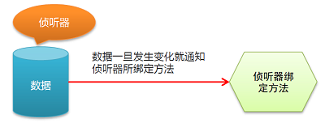
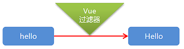

# 目标：

* 能够说出 Vue 的基本用法
* 能够说出 Vue 的模板语法
* 能够说出 Vue 的常见特性
* 能够基于 Vue 实现案例效果

# 1. Vue 概述

**尤雨溪：Vue.js 的创建者**

* 2014年2月，Vue.js 正式发布
* 2015年10月27日，正式发布1.0.0
* 2016年4月27日，发布2.0预览版本

**Vue：渐进式 JavaScript 框架**

* 声明式渲染
* 组件系统
* 客户端路由
* 集中式状态管理
* 项目构建

官网：https://cn.vuejs.org/

# 2. Vue 基本使用

### 2.1 传统开发模式对比

```html
<!-- 原生JS -->
<div id='msg'></div>
<script>
    var msg = 'hello world!';
    document.getElementById('msg').innerHTML = msg;
</script>
```

```html
<script src="./lib/jquery-3.6.0.min.js"></script>
<div id="jquery"></div>
<script>
    var msg = 'hello world!';
    $("#jquery").html(msg);
</script>
```

### 2.2 Vue 开发

```html
<script src="./lib/vue.min.js"></script>
<div id="vue-app">{{ msg }}</div>
<script>
	new Vue({
        el: "#vue-app",
        data: {
            msg: "hello Vue!",
        },
    });
</script>
```

### 2.3 Vue 开发细节分析

#### 1. 实例参数分析

* `el`：元素的挂载位置（值可以是 CSS 选择器或者 DOM 元素）
* `data`：模型数据（值可以是一个对象）

#### 2. 插值表达式用法

* 将数据填充到 HTML 标签中
* 插值表达式支持基本的数据操作

#### 3. Vue 代码运行原理分析

* 从`Vue语法`-->`原生语法`（编译过程）

# 3. Vue 模板语法

### 3.1 模板语法概述

#### 1. 如何理解前端渲染？

把数据填充到 HTML 标签中

#### 2. 前端渲染的方式

* 原生 JS 拼接字符串
* 使用前端模板引擎（类似于之前的`art-template`）
* 使用 Vue 特有的模板语法

#### 3. 原生 JS 拼接字符串

基本上就是将数据以字符串的形式拼接到 HTML 标签中，代码风格大致类似于：

```js
const html = '<h1>你好，我的名字叫做' + name + ', 我今年' + age + '岁了</h1>'
```

可以看出来，这种方式有以下特点：

* 不易维护
* 极容易混乱

#### 4. 使用模板引擎

与拼接字符串相比，模板引擎的代码规范了很多，他拥有自己独有的一套语法规范。

```html
<!-- 以下为 art-template 模板引擎示例 -->
<script id='tpl' type='text/html'>
	你好，我叫{{ name }},我今年{{ age }}岁了
</script>
```

优点：代码可读性大大提高，方便后期维护

缺点：没有专门的事件处理机制

#### 5. Vue 模板语法概览

* 插值表达式
* 指令
* 事件绑定
* 属性绑定
* 样式绑定
* 分支循环结构

### 3.2 指令

#### 1. 什么是指令

* 指令的本质就是**自定义属性**
* 指令的格式：以`v-`开始，例如`v-cloak`（隐藏所有未编译的插值表达式`{{}}`）

官网：https://cn.vuejs.org/v2/api/

在官网中查看所有 Vue V2 的 指令

#### 2. 数据绑定指令

* `v-text`填充纯文本（相比插值表达式更加简洁）
* `v-html`填充HTML片段
  * 存在安全问题
  * 本网站内部数据可以使用，来自于第三方数据不可用
* `v-pre`填充原始信息
  * 显示原始信息，跳过编译过程，例如原样输出`{{ data }}`，不渲染数据

#### 3. 数据响应式

* 如何理解响应式
  * H5中的响应式（屏幕尺寸导致样式变化）
  * 数据的响应式（数据的变化导致页面的变化）
* 什么是数据绑定
  * 数据绑定：将数据填充到标签中
* `v-once`：只编译一次
  * 显示内容后将不再具有编译功能
  * 应用场景：如何显示的信息后续不需要再修改，那么可以使用这个指令
  * 优势：可以提高性能

### 3.3 双向数据绑定

#### 1. 什么是双向数据绑定

页面**元素的值**影响 Vue 中 **data 的值**，请看[例子](code/1-Vue基础/05-双向数据绑定.html)

#### 2. 双向数据绑定分析

`v-model`指令用法：

```html
<div id="vue-app">
    <!-- 一旦文本框的值改变，下面 data 中的msg的值也会改变 -->
    <input type="text" placeholder="请输入文字" v-model="msg" />
    <div v-text="msg"></div>
</div>
<script>
    const vueApp = new Vue({
        el: "#vue-app",
        data: {
            msg: "Hello",
         },
    });
</script>
```

#### 3. MVVM 设计思想

MVC 是后端的分层开发概念，MVVM 是前端视图层的概念

* M(model)
  * 数据层，Vue 中数据层都放在 data 里
* V(view)
  * Vue 中的 view ，即我们的 HTML 页面
* VM(view-model)
  * 将数据和视图层建立联系
  * 每一个 Vue 的实例都是 vm


### 3.4 事件绑定

#### 1. 给元素绑定事件

通过`v-on`来给某个元素绑定事件，可以直接简写为`@`

```html
<div id="app">
    <!-- 两种写法均可 -->
    <button v-on:click="num++">按钮1</button>
    <button @click="num--">按钮2</button>
    <div>{{num}}</div>
</div>
<script>
    const vm = new Vue({
        el: "#app",
        data: {
            num: 0,
        },
    });
</script>
```

#### 2. 事件函数

在元素绑定时只能操作一些简单的语法，想要复杂的功能，就需要触发函数。在`methods`中声明函数

```html
<div id="app">
    <button @click="handle">按钮</button>
    <div>{{num}}</div>
</div>
<script>
    const vm = new Vue({
        el: "#app",
        data: {
            num: 0,
        },
        methods: {
            handle: function() {
                // 不可以直接写成num，会被看作为参数
                // num++;
                this.num++;
                // 这里的this实际上就是 Vue 的实例 vm
                console.log(this === vm); // true
            },
        },
    });
</script>
```

* 直接绑定函数名称：`@click="handle"`
* 调用函数：`@click="handle()"`
* 以上两种方式均可
* 至于有什么区别，下面的传参可以解答

#### 3. 事件函数参数传递方式

如果绑定函数本身，那么事件对象就是函数的第一个参数

```html
<button @click="func">SayHi Btn</button>
<script>
	// code ...
    methods: {
        func: function(event){
            // 如果直接绑定函数本身
            // 那么事件对象就是函数的第一个参数
            console.log(event.target.innerHTML);
        }
    }
</script>
```

如果是事件绑定调用，那么事件对象`$event`必须是函数的最后一个参数

```html
<button @click="func('hi', $event)">SayHi Btn</button>
<script>
	// code ...
    methods: {
        func: function(p1, event){
            // 如果直接绑定函数本身
            // 那么事件对象就是函数的最后一个参数
            console.log(event.target.innerHTML);
        }
    }
</script>
```

`$event`是事件对象，固定写法

#### 4. 事件修饰符

`.stop`：阻止冒泡

```html
<a @click.stop = "handle">跳转</a>
```

`.prevent`：阻止默认行为

```html
<a @click.prevent = "handle">跳转</a>
```

更多的修饰符参考官方文档

- `.stop` - 调用 `event.stopPropagation()`。
- `.prevent` - 调用 `event.preventDefault()`。
- `.capture` - 添加事件侦听器时使用 capture 模式。（事件捕获）
- `.self` - 只当事件是从侦听器绑定的元素本身触发时才触发回调。

#### 5. 按键修饰符

`.enter`：回车键

```html
<input type="text" @keyup.enter = "submit" />
```

`.delete`：删除键

```html
<input type="text" @keyup.delete = "deleteHandle" />
```

**自定义按键修饰符**


全局 `config.keyCodes` 对象添加
```js
Vue.config.keyCodes.f1 = 112
```

下面就可以直接使用


```html
<input type="text" @keyup.f1 = 'handle' />
<!-- 也可以直接使用键码 -->
<input type="text" @keyup.112 = 'handle' />
```

更多的修饰符参考官方文档

- `.enter`
- `.tab`
- `.delete` (捕获“删除”和“退格”键)
- `.esc`
- `.space`
- `.up`
- `.down`
- `.left`
- `.right`

### 3.5 属性绑定

#### 1. Vue 如何动态处理属性？

使用`v-bind`修饰属性，动态处理属性值，可缩写为`:`

```html
<a v-bind:href="url">跳转</a>
<!-- 可缩写为 -->
<a :href="url">跳转</a>
```

#### 2. 指令`v-model`底层原理分析

```html
<input type="text" v-model='num' />
<!-- 等于下面 -->
<input type="text" v-bind:value="num" v-on:input="num=$event.target.value"
```

核心原理就是监控`input`输入事件，一旦文本框内容发生变化，那么将触发input事件，就将文本框的值赋给下面的num的值

* 使用`v-on`实现页面元素影响数据
* 使用`v-bind`实现数据影响页面元素

### 3.6 样式绑定

#### 1. `class`样式处理

对象语法

```html
<div id="vue-app">
    <!-- 左边为类名，右边是操作的属性，如果为true，则显示active -->
    <div :class="{active: isActive}">123456</div>
    <button @click="handle">切换</button>
</div>
<script>
    const vm = new Vue({
        el: "#vue-app",
        data: {
            isActive: true,
        },
        methods: {
            handle: function() {
                // 控制 isActive 在 true/false 之间切换
                this.isActive = !this.isActive;
            },
        },
    });
</script>
```

数组语法

```html
<div id="vue-app">
    <!-- 数组语法 -->
    <div :class="[activeClass, errorClass]">123456</div>
    <button @click="handle">切换</button>
</div>
<script>
    const vm = new Vue({
        el: "#vue-app",
        data: {
            activeClass: 'active',
            errorClass: 'error',
        },
        methods: {
            handle: function() {
                // 控制 activeClass 在 '' 和 active 之间切换
                this.activeClass = this.activeClass ? '' : 'active';
            },
        },
    });
</script>
```

相关的语法细节：

* 对象绑定和数组绑定可以结合使用

  ```html
  <div :class="[activeClass, errorClass, {test: isTest}]">123456</div>
  ```

* class绑定的值可以简化操作

  ```html
  <div :class="arrayClasses"></div>
  <div :class="objClasses"></div>
  <script>
  	// code...
      data: {
          arrayClasses: ['active', 'error'],
          objClasses: {
              active: true,
              error: true,
          },
      }
  </script>
  ```

* 默认的class如何处理

  ```html
  <!-- 默认的 class 会保留，新绑定的和原来默认的会结合在一起 -->
  <div class="base" v-bind:class="objClasses">123456789</div>
  ```

#### 2. `style`样式处理

对象语法，也可以简化来写

```html
<div id="vue-app">
    <div :style="{color: colorStyle, fontSize: fontSizeStyle}">123456</div>
    <!-- 也可以简化 -->
    <div :style="objStyle">123456</div>
</div>
<script>
    const vm = new Vue({
        el: "#vue-app",
        data: {
            colorStyle: "red",
            fontSizeStyle: "24px",
            objStyle: {
                color: "red",
                fontSize: "24px",
            },
        },
    });
</script>
```

数组语法

```html
<div id="vue-app">
    <div :style="[baseStyles, overrideStyles]">123456</div>
</div>
<script>
    const vm = new Vue({
        el: "#vue-app",
        data: {
            baseStyles: {
                color: "orange",
                fontSize: "26px",
            },
            overrideStyles: {
                color: "blue",
                fontSize: "28px",
            },
        },
    });
</script>
```

### 3.7 分支循环结构

#### 1. 分支结构

* `v-if`
* `v-else`
* `v-else-if`
* `v-show`

```html
<div v-if="score >= 90">优秀</div>
<div v-else-if="score < 90 && score >= 80">中</div>
<div v-else-if="score < 80 && score > 60">一般</div>
<div v-else>差</div>
<div v-show="flag">测试 v-show</div>
```

`v-show`和`if...else`最大的区别就是：

* `v-if`：**控制元素是否渲染到页面**。条件满足才会显示在DOM中
* `v-show`：**控制元素是否显示（已经渲染到了页面）**。条件不满足也会显示在DOM中，只不过添加了`display:none`让页面看不到

#### 2. 循环结构

* `v-for`遍历数组

  ```html
  <li v-for='item in list'>{{item}}</li>
  <li v-for="(item, index) in list">{{item}} --- {{index}}</li>
  ```

* `key`的作用：帮助 Vue 区分不同的元素，从而提高性能（通过给每个元素添加唯一标识`id`，让 Vue 区分元素），***只要我们做遍历，最好就加上 key***

  ```html
  <li :key='index' v-for="(item,index) in list">{{item}}</li>
  ```

* `v-for`遍历对象，`value`是属性值，`key`是属性名，`index`是索引

  ```html
  <div v-for="(value, key ,index) in obj">
      {{value}} -- {{key}} -- {{index}}
  </div>
  ```

* `v-if`和`v-for`结合使用

  ```html
  <div v-for="(value, key ,index) in obj" v-if="value == 18">
      {{value}} -- {{key}} -- {{index}}
  </div>
  ```

# 4. Vue 常用特性

### 4.1 常用特性概览

* 表单操作
* 自定义指令
* 计算属性
* 过滤器
* 侦听器
* 生命周期

### 4.2 表单操作

#### 1. 基于 Vue 的表单操作

* `input`单行文本
* `textarea`多行文本
* `select`下拉多选
* `radio`单选框
* `checkbox`多选框

#### 2. 表单域修饰符

* `.number`：转化为数值
* `.trim`：去掉首尾空格
* `.lazy`：将`input`事件改为`change`事件
  * `change`事件只会在鼠标失去焦点才会触发（通常用于检测用户名是否被占用）

```html
<input type="text" v-model.number = 'age' />
```

### 4.3 自定义指令

#### 1. 为何需要自定义指令？

内置指令不满足需求

#### 2. 自定义指令语法规则

* 使用`Vue.directive()`函数来自定义指令
* 官方文档：https://cn.vuejs.org/v2/guide/custom-directive.html
* 举个**获取元素焦点**的例子

```js
// 注册一个全局自定义指令 `v-focus`
Vue.directive('focus', {
    // 当被绑定的元素插入到 DOM 中时……
    inserted: function (el) {
      // 聚焦元素
      el.focus()
    }
})
```

* 使用自定义指令

```html
<input type='text' v-focus />
```

#### 3. 带参数的自定义指令

改变元素的背景色

```js
Vue.directive("bgcolor", {
    // binding是一个对象，binding.value是指令的绑定值
    inserted: function(el, binding) {
        el.style.backgroundColor = binding.value.color;
    },
});
```

使用带参数的自定义指令

```html
<div v-bgcolor="{color: 'blue'}">123456</div>
```

#### 4. 自定义局部指令

```js
const vm = new Vue({
    directives: {
        focus: {
            // 定义指令
            inserted: function(el){
                el.focus();
            }
        }
	}
});
```

局部指令只能在**本组件**中使用

### 4.4 计算属性

#### 1. 为什么需要计算属性？

表达式的计算逻辑可能会比较复杂，使用计算属性可以使模板内容更加简洁。

计算属性其实就是***将一些复杂逻辑抽取出来，作为函数使用***

在 Vue 实例中`computed`定义函数

#### 2. 计算属性的用法

```html
<div>{{msg}}</div>
<!-- 使用 JS API 让一个字符串反转 -->
<div>{{ msg.split('').reverse().join('') }}</div>
<!-- 使用 Vue 计算属性，直接写函数名，不用加() -->
<div>{{reverseString}}</div>
<script>
	const vm = new Vue({
        computed: {
            reverseString: function() {
                return this.msg.split("").reverse().join("");
            },
        },
    });
</script>
```

#### 3. 计算属性与方法的区别

* 计算属性是基于它们的依赖进行缓存的
* 方法不存在缓存

### 4.5 侦听器



#### 1. 侦听器的应用场景

数据变化时执行异步或开销较大的操作

#### 2. 侦听器的用法

在`watch`中定义对属性的侦听操作

```js
const vm = new Vue({
    watch: {
        firstName: function(val) {
            // val 表示变化后的值
            this.fullName = val + this.lastName;
        },
        lastName: function(val) {
            this.fullName = this.firstName + val;
        }
	}
});
```

### 4.6 过滤器



#### 1. 过滤器的作用是什么？

格式化数据，比如将字符串格式转为首字母大写，将日期格式转换为指定的格式

#### 2. 自定义过滤器

```js
Vue.filter('过滤器名称', function(value){
    // 过滤器逻辑
});
```

#### 3. 过滤器的使用

```html
<div>{{msg | upper}}</div>
<!-- 将上一个过滤器处理的结果作为下一个过滤器处理的值 -->
<div>{{msg | upper | lower}}</div>
<div v-bind:id="id | idFilter"></div>
```

#### 4. 局部过滤器

```js
const vm = new Vue({
    filters: {
        '过滤器名称': function(){}
    }
});
```

局部过滤器仅在本组件能使用

#### 5. 带参数的过滤器

```js
Vue.filter('format', function(value, arg1){
    // arg1 就是传递的参数
});
```

#### 6. 带参数过滤器的使用

```html
<span>{{ msg | format(10) }}</span>
```

### 4.7 实例的生命周期

#### 1. 主要阶段

* 挂载（初始化相关属性）
  * `beforeCreate`
  * `created`
  * `beforeMount`
  * `mounted`（组件已加载完毕）
* 更新（元素或组件的变更操作）
  * `beforeUpdate`
  * `updated`
* 销毁（销毁相关属性）
  * `beforeDestroy`
  * `destroyed`

[Vue实例生命周期图](resource/4-Vue实例生命周期.png)

### 4.8 综合案例

[图书管理+5种常见特性](code/1-Vue基础/30-综合案例-图书管理.html)

