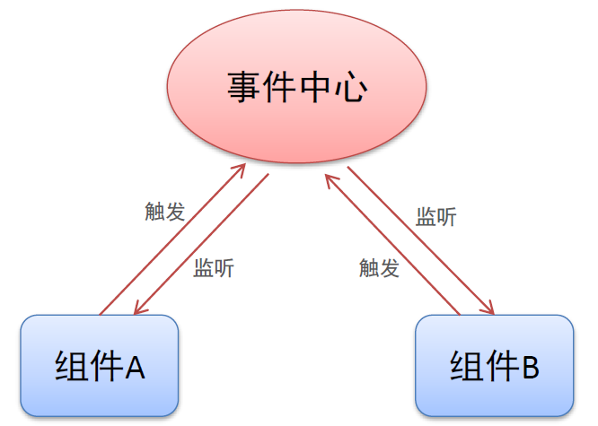
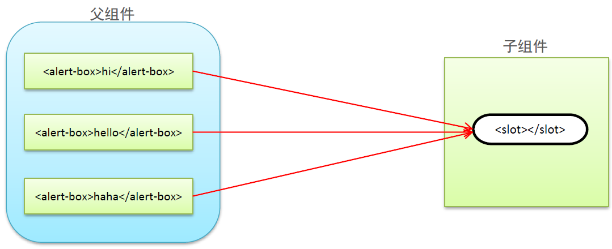

# 目标：

* 能够知道组件化开发思想
* 能够知道组件的注册方式
* 能够说出组件间的数据交互方式
* 能够说出组件插槽的用法
* 能够说出 Vue 调试工具的用法
* 能够基于组件的方式实现业务功能

# 1. 组件化开发概述

### 1.1 现实中的组件化思想体现


Google曾试图推出一款组件化手机，通过不同的组件为手机添加不同的功能。

一般来说，组件化思想都有以下特点：

* 标准（有一套标准的规范）
* 分治（每个组件负责不同功能）
* 重用（组件可以多次被调用）
* 组合（多个简单的组件可以组合为复杂组件）

### 1.2 编程中的组件化思想体现


不同组件之间有父子、兄弟、爷孙等关系

### 1.3 组件化规范 Web Components

* 我们希望尽可能多的重用代码
* 自定义组件的方式不太容易（html、css和js）
* 多次使用组件可能导致冲突
* `Web Components`通过创建**封装好功能的**定制元素解决上述问题

* 官网：https://developer.mozilla.org/zh-CN/docs/Web/Web_Components

* Vue 部分实现了上述规范

# 2. 组件注册

### 2.1 全局组件注册语法

```js
Vue.component('组件名称', {
    // data的值是一个函数
    data: 组件数据,
    template: 组件模板内容
})
```

举一个例子：

```js
// 定义一个叫做 button-counter 的组件
Vue.component('button-counter', {
    data: function(){
        return {
            count: 0
        }
    },
    template: '<button @click="handle">点击了{{count}}次</button>',
    methods: {
        // 可以在methods中定义组件方法，供组件使用
        handle: function(){
            // 这里是this.count
            this.count++;
        }
    }
});
```

全局注册的组件不能使用局部注册的组件

### 2.2 组件用法

```html
<div id="app">
    <!-- 直接以组件名作为标签名 -->
    <button-counter></button-counter>
    <!-- 组件可以重用，组件之间的数据独立 -->
    <button-counter></button-counter>
</div>
```

### 2.3 组件注册注意事项

* `data`必须是个函数（使用函数可以实现闭包环境，一定程度上保证了每个组件实例之间的数据是独立的）
* 组件模板`template`必须是确切的包含一个根元素（必须要有一个父元素，并且父元素没有兄弟元素）
* 组件模板内容可以是**模板字符串**（模板字符串需要浏览器支持ES6语法）

* 组件命名可以有2种方式
  * `-`命名法：`Vue.component('vue-component', /*  code... */)`
  * 驼峰命名法（第一个字母大写）：`Vue.component('VueComponent', /*  code... */)`
    * 驼峰命名法只能写在组件中的`template`直接写在页面中会报错
    * 详细请看[驼峰命名法的问题](./code/2-Vue组件/2-组件命名的两种方式.html)

### 2.4 局部组件注册

```js
const ComponentA = {};
const ComponentB = {};
const vm = new Vue({
    el: '#app',
    components: {
        'component-a': ComponentA,
        'component-b': ComponentB
    }
});
```

局部组件只能在`#app`中使用，详细请看[代码示例](./code/2-Vue组件/3-局部组件的注册方式.html)

# 3. Vue调试工具用法

### 3.1 调试工具安装

* 克隆仓库：https://github.com/vuejs/vue-devtools
* 安装依赖包：`npm install`
* 构建：`npm run build`
* 打开Chrome扩展页面（打开开发者模式）
* 加载已解压的扩展
* 或者直接通过Vue提供的构建好的包直接载入Chrome中（需翻墙）
  * https://chrome.google.com/webstore/detail/vuejs-devtools/nhdogjmejiglipccpnnnanhbledajbpd/related

### 3.2 调试工具的使用


打开 Vue 文件 --> F12开发者面板 --> Vue面板

# 4. 组件间数据交互

### 4.1 父组件向子组件传值

#### 1. 组件内部通过`props`接收传递的值

```js
Vue.component('menu-item', {
    props: ['title'],
    template: '<div>{{title}}</div>'
});
```

#### 2. 父组件通过属性将值传递给子组件

```html
<menu-item title="来自父组件的数据"></menu-item>
<menu-item :title="title"></menu-item>
```

详细请看[代码示例](./code/2-Vue组件/5-父组件向子组件传值.html)

如果是固定的值，加和不加`:`有什么区别呢？

* 加上`:`，就会把一些特殊值解析为不同的类型，例如会把`true`解析为`boolean类型`
* 不加`:`，所有的值都会被解析为字符串类型，就算是`true`还是字符串

#### 3. props属性名规则

* 在`props`中使用驼峰形式，模板中需要使用短横线的形式
* 字符串形式的模板没有这个限制

```js
Vue.component('menu-item', {
    // 在 JS 中是驼峰形式
    props: ['itemTitle'],
    // 字符串形式的模板不受影响
    template: '<div>{{itemTitle}}</div>'
});
```

```html
<!-- 在HTML中需要加上短横线- -->
<menu-item item-title="hello"></menu-item>
```

#### 4. props属性值类型

* 字符串`String`
* 数值`Number`
* 布尔值`Boolean`
* 数组`Array`
* 对象`Object`

详细请看[代码示例](./code/2-Vue组件/6-props属性值的类型.html)

### 4.2 子组件向父组件传值

#### 1. 子组件通过自定义事件向父组件传值

`$emit`是固定写法

```html
<button @click="$emit('自定义函数名称')">点击可操作父组件</button>
```

#### 2. 父组件监听子组件

```html
<list-item @上文自定义函数名称="操作"></list-item>
```

详细请看：[代码示例](./code/2-Vue组件/7-子组件向父组件传值.html)

#### 3. 子组件向父组件传值携带参数

```html
<button @click="$emit('自定义参数名', 参数)"></button>
```

#### 4. 父组件接收参数

`$event`是固定写法

```html
<menu-item @自定义函数名="$event接收参数"></menu-item>
```

### 4.3 兄弟组件之间传值



#### 1. 单独的事件中心管理组件间的通信

```js
// 重新创建一个 Vue 实例，这个实例就担任事件中心的工作
var eventHub = new Vue();
```

#### 2. 监听事件与销毁事件

```js
eventHub.$on('add-todo', addTodo);
eventHub.$off('add-todo');
```

#### 3. 触发事件

```js
// 可以携带参数
eventHub.$emit('add-todo', id);
```

详细请看[代码示例](./code/2-Vue组件/8-兄弟组件间数据通信.html)

# 5. 组件插槽

### 5.1 组件插槽的作用

父组件向子组件传递内容



### 5.2 组件插槽基本用法

#### 1. 插槽位置

```js
Vue.component('alert-box', {
    template: `
	<div>
		<strong>Error!</strong>
		<slot></slot>
    </div>
	`;
});
```

`<slot>`是Vue的API，`<slot>`中可以写默认的内容，如果有新的内容就会覆盖默认内容

#### 2. 插槽内容

```html
<alert-box>Something bad happened.</alert-box>
```

组件中的内容就被放在了`slot`标签中

详细请看[代码示例](./code/2-Vue组件/9-组件插槽的基本用法.html)

### 5.3 具名插槽

#### 1. 插槽定义

在组件`template`中定义

```html
<header>
    <slot name="header"></slot>
</header>
<main>
	<slot></slot>
</main>
<footer>
	<slot name="footer"></slot>
</footer>
```

#### 2. 插槽内容

```html
<组件名>
    <h1 slot="header">标题内容</h1>
    <!-- 也可以使用<template>这个标签不会渲染到页面上 -->
    <template slot="header">
        <p>标题内容1</p>
        <p>标题内容2</p>
        <p>标题内容3</p>
        <p>标题内容4</p>
    </template>
    <p>主要内容1</p>
    <p>主要内容2</p>
    <p slot="footer">底部内容</p>
</组件名>
```

没有名称的会匹配没有名称的`slot`

详细请看[代码示例](./code/2-Vue组件/10-具名插槽的使用.html)

### 5.4 作用域插槽

应用场景：父组件对子组件的内容进行加工处理

#### 1. 插槽定义

在`template`中定义

```html
<ul>
    <li :key="item.id" v-for="item in fruitlist">
        <slot :info="item">
            {{item.name}}
        </slot>
    </li>
</ul>
```

#### 2. 插槽使用

```html
<fruit-list :fruitlist="fruitlist">
    <template slot-scope="slotProps">
        <span class="current" v-if="slotProps.info.id === 3">
            {{slotProps.info.name}}
        </span>
        <span v-else>{{slotProps.info.name}}</span>
    </template>
</fruit-list>
```

使用`slot-scope`来定义插槽的作用域

详细请看[代码示例](./code/2-Vue组件/11-作用域插槽的用法.html)

# 6. 基于组件的案例

### 6.1 需求分析

#### 1. 按照组件化方式实现业务需求

根据业务功能进行组件化划分

* 标题组件（展示文本）
* 列表组件（列表展示、商品数量变更、商品删除）
* 结算组件（计算商品总额）

### 6.2 实现步骤

#### 1. 功能实现步骤

* 实现整体布局和样式效果
* 划分独立的功能组件
* 组合所有的子组件形成整体结构
* 逐个实现各个组件功能
  * 标题组件
  * 列表组件
  * 结算组件

