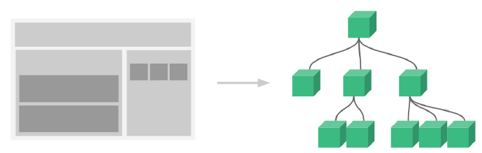
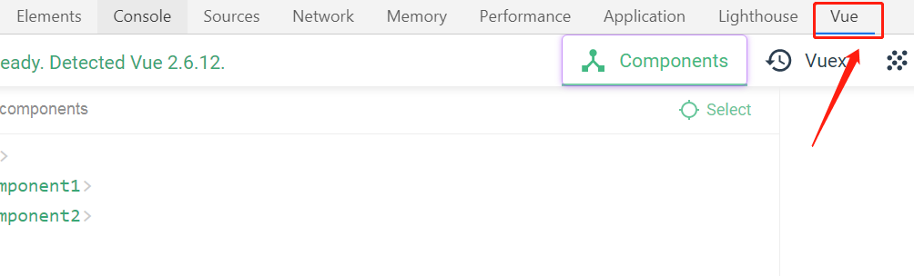

# 目标：

* 能够知道组件化开发思想
* 能够知道组件的注册方式
* 能够说出组件间的数据交互方式
* 能够说出组件插槽的用法
* 能够说出 Vue 调试工具的用法
* 能够基于组件的方式实现业务功能

# 1. 组件化开发概述

### 1.1 现实中的组件化思想体现


Google曾试图推出一款组件化手机，通过不同的组件为手机添加不同的功能。

一般来说，组件化思想都有以下特点：

* 标准（有一套标准的规范）
* 分治（每个组件负责不同功能）
* 重用（组件可以多次被调用）
* 组合（多个简单的组件可以组合为复杂组件）

### 1.2 编程中的组件化思想体现



不同组件之间有父子、兄弟、爷孙等关系

### 1.3 组件化规范 Web Components

* 我们希望尽可能多的重用代码
* 自定义组件的方式不太容易（html、css和js）
* 多次使用组件可能导致冲突
* `Web Components`通过创建**封装好功能的**定制元素解决上述问题

* 官网：https://developer.mozilla.org/zh-CN/docs/Web/Web_Components

* Vue 部分实现了上述规范

# 2. 组件注册

### 2.1 全局组件注册语法

```js
Vue.component('组件名称', {
    // data的值是一个函数
    data: 组件数据,
    template: 组件模板内容
})
```

举一个例子：

```js
// 定义一个叫做 button-counter 的组件
Vue.component('button-counter', {
    data: function(){
        return {
            count: 0
        }
    },
    template: '<button @click="handle">点击了{{count}}次</button>',
    methods: {
        // 可以在methods中定义组件方法，供组件使用
        handle: function(){
            // 这里是this.count
            this.count++;
        }
    }
});
```

全局注册的组件不能使用局部注册的组件

### 2.2 组件用法

```html
<div id="app">
    <!-- 直接以组件名作为标签名 -->
    <button-counter></button-counter>
    <!-- 组件可以重用，组件之间的数据独立 -->
    <button-counter></button-counter>
</div>
```

### 2.3 组件注册注意事项

* `data`必须是个函数（使用函数可以实现闭包环境，一定程度上保证了每个组件实例之间的数据是独立的）
* 组件模板`template`必须是确切的包含一个根元素（必须要有一个父元素，并且父元素没有兄弟元素）
* 组件模板内容可以是**模板字符串**（模板字符串需要浏览器支持ES6语法）

* 组件命名可以有2种方式
  * `-`命名法：`Vue.component('vue-component', /*  code... */)`
  * 驼峰命名法（第一个字母大写）：`Vue.component('VueComponent', /*  code... */)`
    * 驼峰命名法只能写在组件中的`template`直接写在页面中会报错
    * 详细请看[驼峰命名法的问题](./code/2-Vue组件/2-组件命名的两种方式.html)

### 2.4 局部组件注册

```js
const ComponentA = {};
const ComponentB = {};
const vm = new Vue({
    el: '#app',
    components: {
        'component-a': ComponentA,
        'component-b': ComponentB
    }
});
```

局部组件只能在`#app`中使用，详细请看[代码示例](./code/2-Vue组件/3-局部组件的注册方式.html)

# 3. Vue调试工具用法

### 3.1 调试工具安装

* 克隆仓库：https://github.com/vuejs/vue-devtools
* 安装依赖包：`npm install`
* 构建：`npm run build`
* 打开Chrome扩展页面（打开开发者模式）
* 加载已解压的扩展
* 或者直接通过Vue提供的构建好的包直接载入Chrome中（需翻墙）
  * https://chrome.google.com/webstore/detail/vuejs-devtools/nhdogjmejiglipccpnnnanhbledajbpd/related

### 3.2 调试工具的使用



打开 Vue 文件 --> F12开发者面板 --> Vue面板

# 4. 组件间数据交互

### 4.1 父组件向子组件传值

#### 1. 组件内部通过`props`接收传递的值

```js
Vue.component('menu-item', {
    props: ['title'],
    template: '<div>{{title}}</div>'
});
```

#### 2. 父组件通过属性将值传递给子组件

```html
<menu-item title="来自父组件的数据"></menu-item>
<menu-item :title="title"></menu-item>
```

详细请看[代码示例](./code/2-Vue组件/5-父组件向子组件传值.html)

如果是固定的值，加和不加`:`有什么区别呢？

* 加上`:`，就会把一些特殊值解析为不同的类型，例如会把`true`解析为`boolean类型`
* 不加`:`，所有的值都会被解析为字符串类型，就算是`true`还是字符串

#### 3. props属性名规则

* 在`props`中使用驼峰形式，模板中需要使用短横线的形式
* 字符串形式的模板没有这个限制

```js
Vue.component('menu-item', {
    // 在 JS 中是驼峰形式
    props: ['itemTitle'],
    // 字符串形式的模板不受影响
    template: '<div>{{itemTitle}}</div>'
});
```

```html
<!-- 在HTML中需要加上短横线- -->
<menu-item item-title="hello"></menu-item>
```

#### 4. props属性值类型

* 字符串`String`
* 数值`Number`
* 布尔值`Boolean`
* 数组`Array`
* 对象`Object`

详细请看[代码示例](./code/2-Vue组件/6-props属性值的类型.html)

