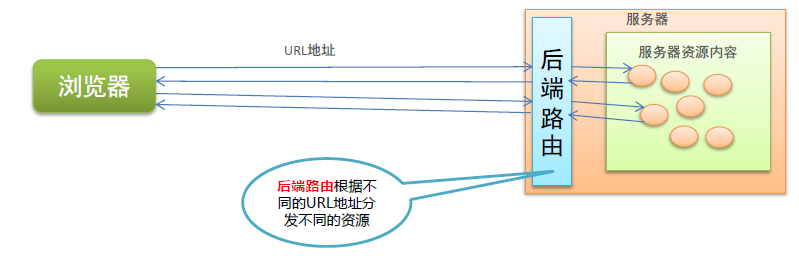
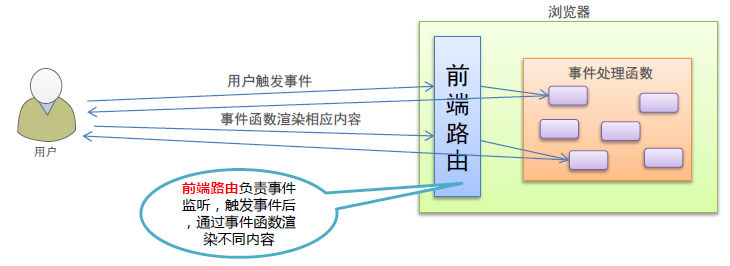

# 目标：

* 能够说出路由的概念
* 能够说出 Vue-router 的基本使用步骤
* 能够说出 Vue-router 的嵌套路由用法
* 能够说出 Vue-router 动态路由匹配用法
* 能够说出 Vue-router 命名路由用法
* 能够说出 Vue-router 编程式导航用法
* 能够基于路由的方式实现业务功能

# 1. 路由的基本概念与原理

### 1.1 路由

路由是一个比较广义和抽象的概念，路由的本质就是**对应关系**。

在开发中，路由分为：

* 后端路由
* 前端路由

#### 1. 后端路由

* 概念：根据不同的`URL`请求，返回不同的内容
* 本质：**URL请求地址**与**服务器资源**之间的对应关系



#### 2. SPA(Single Page Application)

* 后端渲染（**存在性能问题**）

* Ajax前端渲染（前端渲染提高性能，但**不支持浏览器的前进后退功能**）

* SPA（Single Page Application, 单页面应用程序）
  * 整个网站只有一个页面，内容的变化通过Ajax局部刷新实现，同时支持浏览器的前进后退
  * 实现原理之一：基于URL的`hash`（hash的变化导致浏览器记录访问历史的变化，但是hash的变化**不会触发新的URL请求**）
  * 在实现SPA过程中，最核心的技术就是**前端路由**

#### 3. 前端路由

* 概念：根据不同的`用户事件`，显示不同的页面内容
* 本质：**用户事件**与**事件处理函数**之间的对应关系



#### 4. 实现简易前端路由

前端路由基于URL中的`hash`实现（改变URL的hash，根据hash的变化控制组件切换功能）

```js
// 监听 window 的 onhashchange 事件，获取到最新的hash值
window.onhashchange = function(){
    // 通过 location.hash 获取最新的hash值
}
```

详细请看[代码示例](./code/4-Vue前端路由/1-实现一个简单的前端路由.html#/xinwen)

### 1.2 Vue Router

官网：https://router.vuejs.org/zh/

Vue Router 是 Vue 官方提供的**路由管理器**，它和 Vue.js 的核心深度集成，可以非常方便的用于 SPA 应用程序的开发

Vue Router 包含的功能有：

* 支持**HTML5历史**和**hash**两种模式
* 支持嵌套路由
* 支持路由参数
* 支持编程式路由
* 支持命名路由
* 支持......

# 2. vue-router的基本使用

### 2.1 基本使用步骤

* 引入相关的库文件
* 添加路由链接
* 添加路由填充位
* 定义路由组件
* 配置路由规则并创建路由实例
* 把路由挂载到 Vue 根实例中

#### 1. 引入相关的库文件

```html
<!-- 导入 vue 文件，为全局 window 对象挂载 Vue 构造函数 -->
<script src="./lib/vue.js"></script>
<!-- 导入 vue-router 文件，为全局 window 对象挂载 VueRouter 构造函数 -->
<script src="./lib/vue-router.js"></script>
```

#### 2. 添加路由链接

```html
<!-- router-link 是 vue 中提供的标签，默认会被渲染为 a 标签 -->
<!-- to 属性默认渲染为 href 属性 -->
<!-- to 属性的值默认会被渲染为 # 开头的 hash 地址 -->
<router-link to="/user"></router-link>
<router-link to="/register"></router-link>
```

#### 3. 添加路由填充位

```html
<!-- 路由填充位【又叫路由占位符】 -->
<!-- 通过路由规则匹配的组件，将会被渲染到 router-view 的位置 -->
<router-view></router-view>
```

#### 4. 定义路由组件

```js
const User = {
    template: `<div>User</div>`
}
const Register = {
    template: `<div>Register</div>`
}
```

#### 5. 配置路由规则并创建路由实例

```js
// 创建路由实例对象
const router = new VueRouter({
    // routes 是路由匹配规则组
    routes: [
        // 每一个路由规则都是一个配置对象，其中至少都包含 path 和 component 两个属性
        // path 表示当前路由匹配的hash值
        // component 表示当前路由对应的组件
        {
            path: "/user",
            component: User,
        }, {
            path: "/register",
            componet: Register,
        },
    ],
});
```

#### 6. 把路由挂载到 Vue 根实例中

```js
const vm = new Vue({
    el: "#app",
    // 为了让路由规则生效，必须将路由对象挂载到 vue 根实例上
    router,
});
```

详细请看[代码示例](./code/4-Vue前端路由/2-vue-router的基本使用.html)

### 2.2 路由重定向

路由重定向指的是：用户在访问地址 A 的时候，强制用户跳转到地址 C，从而展示特定的组件页面。

通过路由规则的`redirect`属性，指定一个新的路由地址，可以很方便的设置路由的重定向

```js
const router = new VueRouter({
    routes: [
        // 路由重定向
        {
            // 其中 path 表示被重定向的原地址
            // redirect 表示将要重定向的新地址
            path: "/",
            redirect: "/user",
        },
        {
            path: "/user",
            component: User,
        }, {
            path: "/register",
            component: Register,
        },
    ],
});
```

# 3. vue-router嵌套路由

### 3.1 嵌套路由用法

#### 1. 嵌套路由功能分析

* 点击父级路由链接显示模板内容
* 模板内容中又有子级路由链接
* 点击子级路由显示子级模板内容

#### 2. 父级路由组件模板

* 父级路由链接
* 父级路由填充位

```html
<p>
    <router-link to="/user"></router-link>
    <router-link to="/register"></router-link>
</p>
<!-- 控制组件的显示位置 -->
<router-view></router-view>
```

#### 3. 子级路由组件模板

* 子级路由链接
* 子级路由填充位

```js
const Register = {
    template: `
        <div>
            <h1>Register组件</h1>
            <hr />
            <router-link to="/register/tab1">tab1</router-link>
            <router-link to="/register/tab2">tab2</router-link>
            <!-- 子路由填充位置 -->
            <router-view />
        </div>
    `,
    };
```

详细请看[代码示例](./code/4-Vue前端路由/3-vue-router嵌套路由.html)

# 4. vue-router动态路由匹配

### 4.1 动态匹配路由的基本用法

#### 思考

```html
<!-- 有如下 3 个路由链接 -->
<router-link to="/user/1"></router-link>
<router-link to="/user/2"></router-link>
<router-link to="/user/3"></router-link>
```

```js
// 定义如下三个对应的路由规则，是否可行？？
{ path: '/user/1', component: User },
{ path: '/user/2', component: User },
{ path: '/user/3', component: User },
```

比较麻烦，假设有1000个用户，难道要定义1000个路由规则吗

我们可以将动态变化的部分形成**路由参数**

#### 应用场景：通过动态路由参数的模式进行路由匹配

```js
const router = new VueRouter({
    routes: [
        {
            // 动态路由参数，以:冒号开头
            path: '/user/:id',
            component: User,
        }
    ],
});
```

```js
const User = {
    // 路由组件中通过 $route.params 获取路由参数
    template: `<div>User {{ $route.params.id }}</div>`
};
```

详细请看[代码示例](./code/4-Vue前端路由/4-vue动态路由匹配1.html)

### 4.2 路由组件传递参数

`$route`与对应路由形成高度耦合，不够灵活，所以可以使用`props`将组件和路由解耦

#### 1. props的值为布尔类型

```js
const route = new VueRouter({
    routes: [
        // 如果 props 被设置为 true，route.params将会被设置为组件属性
        { path: '/user/:id', component: User, props: true }
    ],
});

const User = {
    props: ['id'], // 使用 props 接收路由参数
    template: `<div>用户ID：{{id}}</div>`
}
```

详细请看[代码示例](./code/4-Vue前端路由/5-vue动态路由匹配2.html)

#### 2. props的值为对象类型

```js
const route = new VueRouter({
    routes: [
        // 如果 props 是一个对象，它会原样设置为组件属性
        { path: '/user/:id', component: User, props: { uname: 'lisi', age: 18 } }
    ],
});

const User = {
    props: ['uname', 'age'], // 使用 props 接收路由参数
    template: `<div>用户信息：{{ uname + '---' + age}}</div>`
}
```

详细请看[代码示例](./code/4-Vue前端路由/6-vue动态路由匹配3.html)

#### 3. props的值为函数类型

```js
const route = new VueRouter({
    routes: [
        // 如果 props 是一个函数，那么就能接收 route 作为自己的形参
        {
            path: '/user/:id',
            component: User,
            props: route => {
                return { uname: 'zs', age:18, id: route.params.id }
            } 
        }
    ],
});

const User = {
    props: ['uname', 'age', 'id'], // 使用 props 接收路由参数
    template: `<div>用户信息：{{ uname + '---' + age + '---' + id}}</div>`
}
```

详细请看[代码示例](./code/4-Vue前端路由/7-vue动态路由匹配4.html)

# 5. vue-router命名路由

### 5.1 命名路由的配置规则

为了更方便的表示路由的路径，可以给路由规则起一个别名，即为**命名路由**

举个例子：

```js
// 使用 name 给路由命名
const router = new VueRouter({
    routes: [
        {
            path: '/user/:id',
            name: 'user',
            component: User
        }
    ],
});
```

```html
<router-link :to="{name:'user', params: { id: 123 }}">User</router-link>
```

```js
// 编程式导航，也可以传一个配置对象
router.push({
    name: 'user',
    params: {
        id: 123
    }
});
```

# 6. vue-router编程式导航

### 6.1 页面导航的两种方式

* 声明式导航：通过点击链接实现导航的方式，叫做声明式导航

  ```html
  <!-- 例如 a 链接和 router-link 都是声明式导航 -->
  <a></a>
  <router-link></router-link>
  ```

* 编程式导航：通过调用 JavaScript API 来实现导航
  * 普通网页中的`location.href`

### 6.2 编程式导航基本用法

常用的编程式导航API：

* `this.$router.push('hash地址')`
* `this.$router.go(n)`：n是一个数值，比如传1就代表从历史记录中向前走一位

```js
const User = {
    template: `<button @click="goToRegister">注册页面</button>`;
    methods: {
    	goToRegister: function(){
            // 使用编程式导航跳转
            this.$router.push('/register');
        }
	}
}
```

### 6.3 编程式导航参数规则

#### `router.push()`参数规则

```js
// 字符串【路径名称】
router.push('/home');
// 对象
router.push({ path: '/home' });
// 命名的路由【传递参数】
router.push({ name: 'home', params: { id: 1 } });
// 带查询参数，变成 /user?uname=zs
router.push({ path: '/user', query: { uname: 'zs' } });
```

# 7. 基于vue-router的案例

### 7.1 案例分析

**用到的路由技术要点**：

* 路由的基础用法
* 嵌套路由
* 路由重定向
* 路由传参
* 编程式导航

### 7.2 案例步骤

* 抽离页面为组件
* 将左侧菜单改造为路由链接
* 创建左侧菜单对应的路由组件
* 在右侧主体区域添加路由占位符
* 添加子路由规则
* 通过路由重定向默认渲染用户组件
* 渲染用户列表数据
* 编程式导航跳转到用户详情页
* 实现后退功能

### 7.3 案例代码

* [基础页面布局](./code/4-Vue前端路由/10-基于vue-router的案例之页面的基本结构.html)
* [抽离页面为组件](./code/4-Vue前端路由/11-基于vue-router的案例之抽离页面为组件.html)
* [创建并链接路由](./code/4-Vue前端路由/12-基于vue-router的案例之将改造为路由.html)
* [详情与后退功能](./code/4-Vue前端路由/13-基于vue-router的案例之添加详情操作和后退操作.html)

