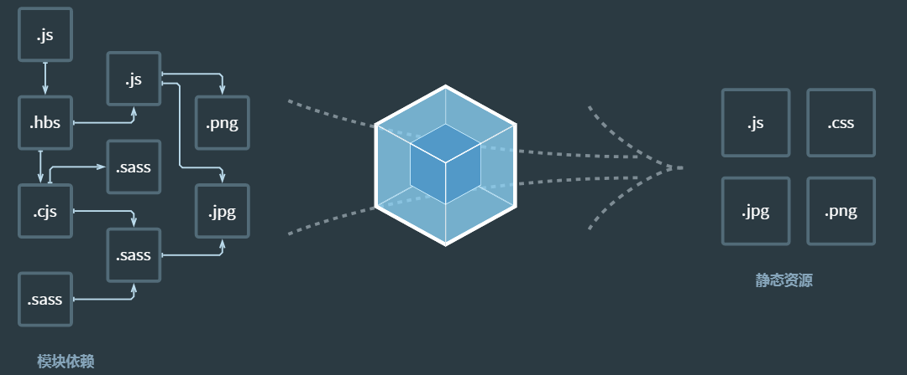
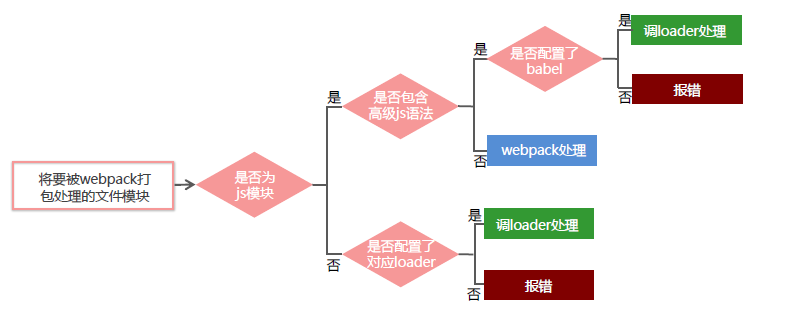

# 目标

* 能够知道有哪些模块化的相关规范
* 能够使用 webpack
* 能够使用 Vue 单文件组件
* 能够使用 Vue 脚手架
* 能够使用 Element-UI

# 1. 模块化相关规范

### 1.1 模块化概述

#### 传统开发模式的主要问题

* 命名冲突（多个JS文件之间如果出现重名变量则会覆盖变量）
* 文件依赖（多个JS文件之间无法相互引用）

#### 通过模块化解决上述问题

模块化：就是把单独的一个功能封装到一个模块（文件）中，模块之间相互隔离，但是可以通过特定的接口公开内部成员，也可以依赖别的模块

好处：方便代码的复用，从而提高开发效率，方便后期维护

### 1.2 浏览器端模块化规范

#### 1. AMD

* Require.js http://www.requirejs.org/

#### 2. CMD

* Sea.js http://seajs.github.io/seajs/docs/

### 1.3 服务器端模块化规范

#### 1. CommonJS

* Node.js 采用的模块化规范

* 模块分为**单文件模块**与**包**
* 模块成员导出：`module.exports`与`exports`
* 模块成员导入：`require('模块标识符')`

### 1.4 ES6模块化规范

在ES6模块化规范推出之前，JavaScript社区已经尝试并提出了`AMD`、`CMD`、`CommonJS`等模块化规范。

但是，这些社区推出的模块化标准，还是存在一定的**差异性**与**局限性**，并不是浏览器与服务器**通用的模块化标准**，例如：

* `AMD`和`CMD`适用于浏览器端的 JavaScript 模块化
* `CommonJS`适用于服务器端的 JavaScript 模块化

因此，ES6语法规范中，在语言层面上定义了ES6模块化规范，是浏览器端与服务器端通用的模块化开发规范。

ES6模块化规范中定义：

* 每个 js 文件都是一个独立的模块
* **导入模块成员**使用`import`关键字
* **暴露模块成员**使用`export`关键字

#### 1. Node.js 通过`babel`体验 ES6 模块化

* `npm i --save-dev '@babel/core' '@babel/cli' '@babel/preset-env' '@babel/node'`
  * 安装开发环境包
  * `@babel/core`
  * `@babel/cli`
  * `@babel/preset-env`
  * `@bale/node`
* `npm i --save '@babel/polyfill'`
  * 安装生产环境包
  * `@babel/polyfill`

* 项目根目录创建文件`babel.config.js`，代码如下

  ```js
  const presets = [
      ["@babel/env", {
          targets: {
              edge: '17',
              firefox: '60',
              chrome: '67',
              safari: '11.1'
          }
      }]
  ]
  module.exports = { presets };
  ```

* 运行`npx babel-node index.js`执行代码

### 1.5 ES6模块化基本语法

#### 1. 默认导出 与 默认导入

默认导出语法`export default 默认导出的成员`

```js
// 【此文件为m1.js】
// 定义私有成员 a 和 b 和 show
let a = 1;
let b = 2;
// 外界访问不到成员c，是因为c没有暴露出去
let c = 3;
function show() {}
// 默认导出语法
export default {
    a,
    b,
    show,
}
```

默认导入语法`import 接收名称 from '模块标识符'`

```js
import m1 from './m1.js'
console.log(m1);

// 打印输出结果为
// { a:1, b:2, show: [Function: show] }
```

**注意**：

* 在每个模块中，只允许使用一次`export default`，否则将报错！
* 如果没有写`export default`，默认导出为空

#### 2. 按需导出 与 按需导入

按需导出语法 `export let s1 = 10`

```js
// 【此文件为m1.js】
// 向外按需导出变量s1
export let s1 = 10;
// 向外按需导出变量s2
export let s2 = 'ccc';
// 向外按需导出方法 say
export function say(){};
```

按需导入语法 `import { s1 } from '模块标识符'`

```js
// 按需导入m1模块中的变量
import { s1, s2 as ss2, say } from './m1.js';
// 使用as可以给某个变量起别名
```

**注意**：

* 每个模块，可以使用多次按需导出

#### 3. 直接导入执行模块代码

有时候，我们**只想单独执行某个模块中的代码，并不需要得到模块向外暴露的成员**，可以直接导入执行模块代码

```js
// 当前模块为【m2.js】
// 在模块中执行循环操作
for(let i = 0; i < 3; i++){
    console.log(i);
}
```

```js
// 直接导入并执行【m2】模块的代码
import './m2.js'
```

# 2. webpack

### 2.1 当前 Web 开发面临的困境

* 文件依赖关系错综复杂
* 静态资源请求效率低
* 模块化支持不友好
* 浏览器对高级 JavaScript 特性兼容程序较低
* etc...

### 2.2 webpack 概述

`webpack`是一个**流行的前端项目构建工具（打包工具）**，可以解决当前 web 开发中所面临的的困境

webpack提供了**友好的模块化支持**，以及**代码压缩混淆**、**处理JS兼容问题**、**性能优化**等强大的功能，从而让程序员的工作重心放到具体的功能实现上，提高了开发效率和项目的可维护性。

目前绝大多数企业的前端项目，都是基于 webpack 进行打包构建的。



从上图中不难看出，webpack的主要作用就是将各种依赖合并为几个基础的文件

### 2.3 webpack 的基本使用

#### 1. 创建列表隔行变色项目

* 新建空白目录，并运行`npm init -y`命令，初始化包管理配置文件`package.json`
* 新建`src`源代码目录
* 新建`src`->`index.html`首页
* 初始化首页基本结构
* 运行`npm install jquery -S`命令，安装生产环境依赖`jQuery`
* 通过模块化的形式，实现列表隔行变色效果

#### 2. 在项目中安装和配置 webpack

* 运行`npm i webpack webpack-cli -D`命令，安装开发环境依赖`webpack`与`webpack-cli`

* 在项目根目录创建 webpack 配置文件`webpack.config.js`

* 在 webpack 配置文件，初始化以下配置：

  ```js
  module.exports = {
      mode: 'development', // mode 用来指定构建模式
  }
  ```

  * `mode`有2个值`development`与`production`
    * `development`：模式为开发环境，不会对转换的代码进行压缩混淆，速度较快
    * `production`：模式为生产环境，会对转换代码进行压缩混淆，速度较慢

*  在`package.json`中添加一条`dev`脚本

  ```json
  "scripts": {
      "dev": "webpack" // script 节点下的脚本，可以通过 npm run xxx指令执行
  }
  ```

* 运行`npm run dev`命令，就可以在`dist/main.js`看到已打包好的JS，直接引用即可

#### 3. 配置打包的入口与出口

`webpack`的 4.x 版本中默认约定：

* 打包的**入口文件**为`src/index.js`
* 打包的**输出文件**为`dist/main.js`

如果要修改打包的入口与出口，可以在`webpack.config.js`中新增如下配置信息：

```js
const path = require('path'); // 导入 node.js 内置 path 模块
module.exports = {
    // 打包的入口路径
    entry: path.join(__dirname, './src/index.js'),
    // 打包的出口路径
    output: {
        // 输出文件的存放路径
        path: path.join(__dirname, './dist'),
        // 输出文件的文件名
        filename: 'bundle.js'
    }
};
```

#### 4. 配置 webpack 自动打包功能

* 运行`npm i webpack-dev -server -D`，安装开发环境依赖`webpack-dev-server`，该模块可以让webpack支持自动打包

* 修改`package.json`中的`dev`脚本

  ```json
  "scripts": {
      "dev": "webpack-dev-server"
  }
  ```

* 将`index.html`中引用的JS文件修改为打包生成出口文件`/bundle.js`

* 运行`npm run dev`，重新打包

* 在浏览器中访问 http://127.0.0.1:8080 地址，查看自动打包效果

**注意**：

* webpack-dev-server 会启动一个实时打包的 http 服务器
* webpack-dev-server 打包生成的输出文件默认在根目录，而且是虚拟的，看不到

#### 5. 配置 html-webpack-plugin 生成预览页面

* 运行`npm install html-webpack-plugin -D`安装开发环境依赖`html-webpack-plugin`

* 修改`webpack.config.js`配置文件，在头部位置配置以下信息：

  ```js
  // 导入页面预览插件，得到一个构造函数
  const HtmlWebpackPlugin = require('html-webpack-plugin');
  const HtmlPlugin = new HtmlWebpackPlugin({
      // 指定要使用的模板文件
      tempalte: './src/index.html',
      // 指定生成的文件名称，该文件存在于内存中
      filename: 'index.html'
  });
  ```

* 修改`webpack.config.js`暴露的成员，新增以下内容

  ```js
  module.exports = {
      // plugins数组是webpack在打包时用到的插件
      plugins: [htmlPlugin]
  }
  ```

#### 6. 配置自动打包相关参数

```json
// package.json中的配置
// --open 打包完成后自动打开浏览器
// --host 配置IP地址
// --port 配置端口
"scripts": {
    "dev": "webpack-dev-server --open --host 127.0.0.1 --port 8888"
}
```

### 2.4 webpack 中的加载器

#### 1. 通过 loader 打包非 js 模块

在实际开发中，webpack默认只能打包处理`.js`文件，其他后缀的文件需要调用`loader`加载器才可以打包

loader加载器可以协助webpack打包处理特定文件

* `less-loader`可以打包处理`.less`文件
* `sacc-loader`可以打包处理`.sass`文件
* `url-loader`可以打包处理css中与`url`有关的文件
* ect...

#### 2. loader调用过程



### 2.5 webpack 加载器的基本使用

下面会介绍如何处理以下常见的文件类型

* CSS
* LESS
* SCSS
* PostCSS
* JavaScript
* Image/Font
* Vue

#### 1. 打包处理 css 文件

* 运行`npm i style-loader css-loader -D`安装开发环境依赖

* 在`webpack.config.js`中创建`modules -> rules`中添加loader规则

  ```js
  // 所有第三方文件模块的匹配规则
  module: {
      rules: [
          // test表示匹配的类型，use表示对应的loader
          { test: /\.css$/, use: ['style-loader', 'css-loader'] }
      ];
  }
  ```

* 注意：`use`数组中指定的`loader`顺序是固定的

#### 2. 打包处理 less 文件

* 运行`npm i less-loader less -D`命令安装开发环境依赖

* 在`webpack.config.js`中`module -> rules`添加以下配置：

  ```js
  // 所有第三方文件模块的匹配规则
  module: {
      rules: [
          // test表示匹配的类型，use表示对应的loader
          { test: /\.less$/, use: ['style-loader', 'css-loader', 'less-loader'] }
      ];
  }
  ```

#### 3. 打包处理 scss 文件

* 运行`npm i sass-loader node-sass -D`命令安装开发环境依赖

* 在`webpack.config.js`中`module -> rules`添加以下配置：

  ```js
  // 所有第三方文件模块的匹配规则
  module: {
      rules: [
          // test表示匹配的类型，use表示对应的loader
          { test: /\.scss$/, use: ['style-loader', 'css-loader', 'sass-loader'] }
      ];
  }
  ```

#### 4. 配置 PostCSS 自动添加 css 的兼容前缀

* 运行`npm i postcss-loader autoprefixer -D`命令安装开发环境依赖

* 在项目根目录中创建`postcss.config.js`，初始化以下配置

  ```js
  // 加载自动添加前缀的插件
  const autoprefixer = require('autoprefixer');
  module.exports = {
      plugins: [autoprefixer]
  }
  ```

* 在`webpack.config.js`中`module -> rules`修改 CSS 的 loader配置：

  ```js
  // 所有第三方文件模块的匹配规则
  module: {
      rules: [
          // test表示匹配的类型，use表示对应的loader
          { test: /\.css$/, use: ['style-loader', 'css-loader', 'postcss-loader'] }
      ];
  }
  ```

#### 5. 打包样式表中的图片和字体文件

* 运行`npm i url-loader file-loader -D`命令安装开发环境依赖

* 在`webpack.config.js`中`module -> rules`修改 CSS 的 loader配置：

  ```js
  // 所有第三方文件模块的匹配规则
  module: {
      rules: [
          // test表示匹配的类型，use表示对应的loader
          { test: /\.jpg|png|gif|bmp|ttf|eot|svg|woff|woff2$/, use: 'url-loader?limit=16940' }
      ];
  }
  ```

* 其中`?`之后的是 loader 的参数项

* `limit`用来指定图片的大小，单位是字节(byte)，只有小于limit大小的图片，才会被转为base64图片

#### 6. 打包处理 JS 文件中的高级语法

* 安装 babel 转换器相关包`npm i babel-loader @babel/core @babel/runtime -D`

* 安装 babel 语法插件相关包`npm i @babel/preset-env @babel/plugin-transform-runtime @babel/plugin-proposal-class-properties -D`

* 在项目根目录中创建`babel.config.js`，初始化以下配置

  ```js
  module.exports = {
      presets: ['@babel/preset-env'],
      plugins: ['@babel/plugin-transform-runtime', '@babel/plugin-proposal-class-properties']
  }
  ```

* 在`webpack.config.js`中`module -> rules`修改 CSS 的 loader配置：

  ```js
  // exclude 为排除项
  // 所有第三方文件模块的匹配规则
  module: {
      rules: [
          // test表示匹配的类型，use表示对应的loader
          { test: /\.js$/, use: 'babel-loader', exclude: /node_modules/ }
      ];
  }
  ```


# 3. Vue 单文件组件

### 3.1 传统组件的问题和解决方案

#### 1. 问题

* 全局定义的组件必须保证组件的名称不重复
* 字符串模板缺乏语法高亮，在HTML有多行时，需要用到`\`来转义
* 不支持 CSS 意味着当 HTML 和 JavaScript 组件化时，CSS明显被遗漏
* 没有构建步骤的限制，只能使用 HTML 和 ES5 JavaScript，而不能使用预处理器（例如babel）

#### 2. 解决方案

* 使用`.vue`的单文件组件可以解决上述问题

### 3.2 单文件组件的组成结构

* `template`：组件的模板区域
* `script`：业务逻辑区域
* `style`：样式区域

```vue
<template>
	<!-- 这里定义 Vue 组件中的模板内容 -->
</template>

<script>
	// 这里定义 Vue 组件中的业务逻辑
    export default = {
        data: (){
        	return {
        		// 数据
    		}
    	},
        methods: {
            // 方法
        }
    }
</script>

<style scoped>
	/* 这里定义组件的样式 scoped表示样式只能在本组件内生效 */
</style>
```

### 3.3 配置vue-loader