# 目标

* 基于 Vue 初始化项目
* 基于 Vue 技术栈进行项目开发
* 基于 Vue 的第三方组件进行项目开发
* 前后端分离的开发模式

# 1. 项目概述

### 1.1 电商项目基本业务概述

根据不同的业务场景，电商系统一般提供了PC端、移动APP、移动Web、微信小程序等多种终端访问方式。多种终端访问同一份数据库。本实战项目将通过开发一套电商系统的PC后端管理项目来对于Vue实战有一个简略的了解。

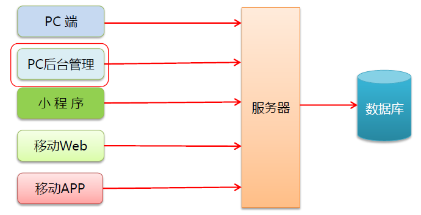

### 1.2 电商后台管理系统的功能

电商后台管理系统用于管理用户账户、商品分类、商品信息、订单、数据统计等业务功能。

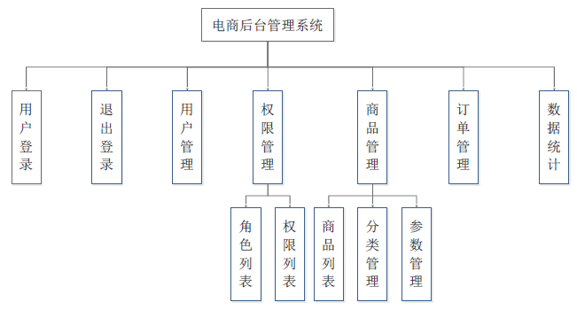

### 1.3 电商后台管理系统开发模式（前后端分离）

电商后台管理系统开发整体采用前后端分离的开发模式，其中前端项目采用基于 Vue 技术栈的 SPA 项目。

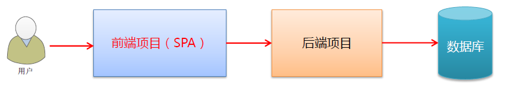

### 1.4 电商后台管理系统的技术选型

#### 1. 前端技术栈

* Vue
* Vue-Router
* Element-UI
* Axios
* Echarts

#### 2. 后端技术栈

* Node.js
* Express
* Jwt
* MySQL
* Sequelize

# 2. 项目初始化

### 2.1 前端项目初始化步骤

* 安装 Vue 脚手架
* 通过 Vue-CLI 初始化项目
* 配置 Vue 路由
* 配置 Element-UI 组件库
* 配置 axios 库
* 使用 Git 进行管理项目
* 将本地代码托管到 Github/Gitee

### 2.2 后台项目的环境配置

* 安装 MySQL 数据库
* 安装 Node.js 环境
* 配置项目相关信息
* 启动项目
* 测试接口是否正常工作

### 2.3 eslint格式化

#### 1. 不加分号与字符串单引号

如果使用的`prettier`插件，在项目根目录创建`.prettierrc`文件，里面写入

```json
{
  // 一次tab == 2个空格
  "tabWidth": 2,
  // 是否单引号
  "singleQuote": true,
  // 是否加;分号结尾
  "semi": false,
  // [] 和 {} 前后是否加空格
  "bracketSpacing": true
}
```

#### 2. 禁用函数名后面必须加空格

在项目根目录下`.eslintrc.js`中配置

```js
rules: {
    // 禁用函数名后面必须加空格
    'space-before-function-paren': 0
  }
```

在 VS Code 编辑器下的`settings.json`中添加

```json
"eslint.options": {
    "space-before-function-paren": 0
}
```

#### 3. Vue模块最后一行必须是空行

在 VS Code 编辑器中设置搜索`prettier`中的`End of Line`选择`crlf`

# 3. 登录/登出功能

### 3.1 登陆概述

#### 1. 登录业务流程

* 在登陆页面输入用户名和密码
* 调用后台接口进行验证
* 通过验证之后，根据后台的响应状态跳转到主页

#### 2. 登录业务的相关技术点

* http 是无状态的
* 通过 cookie 在客户端记录状态（如前端与服务器之间不存在跨域问题即可使用）
* 通过 session 在服务端记录状态（如前端与服务器之间不存在跨域问题即可使用）
* 通过 token 方式维持状态（如存在跨域问题推荐使用）

### 3.2 登录 - token 原理分析

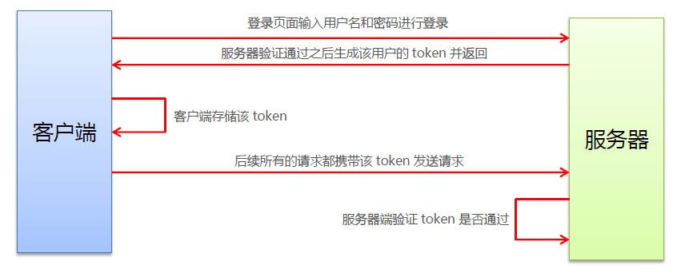

### 3.3 登录功能实现

#### 1. 登录页面的布局

通过 Element-UI 组件实现布局

* el-form
* el-form-item
* el-input
* el-button
* 字体图标

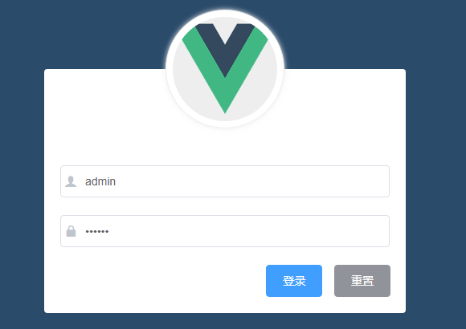

#### 2. 创建 login 分支

`git checkout -b login`创建并切换至登录分支

`git branch`查看所有分支

#### 3. 具体功能

Element-UI表单项：https://element.eleme.cn/#/zh-CN/component/form

##### 1. 输入框加入icon：

Element-UI输入框：https://element.eleme.cn/#/zh-CN/component/input

Element-UI内置图标：https://element.eleme.cn/#/zh-CN/component/icon

```html
<!-- 1. 通过属性：prefix-icon 前添加，suffiex-icon后添加 -->
<el-input prefix-icon="el-input-icon"></el-input>
<!-- 2. 通过slot：slot="prefix"前添加 slot="suffix"后添加 -->
<el-input>
    <i slot="suffix" class="el-input-icon"></i>
</el-input>
```

##### 2. 表单验证：

在`data`中添加`rules`

```js
data () {
    return {
      rules: {
        username: [
          { required: true, message: '请输入用户名', trigger: 'blur' },
          { min: 3, max: 11, message: '长度在3-11位之间', trigger: 'blur' }
        ],
      }
    }
  },
```

在具体的表单项中添加`prop`

```html
<el-form-item prop="username">
    <el-input></el-input>
</el-form-item>
```

##### 3. 重置表单：

给Form添加一个`ref`，在重置按钮点击处理函数中使用

```js
// this：本组件
// $refs：组件的属性
// loginFormRef：自定义名称
// resetFields：Element-UI提供的重置表单验证和数据的函数
this.$refs.loginFormRef.resetFields()
```

##### 4. 表单预验证：

点击提交按钮，只有数据通过后才能发起Ajax请求

给Form添加一个`ref`，在提交按钮点击处理函数中使用

```js
// this：本组件
// $refs：组件的属性
// loginFormRef：自定义名称
// validate()：Element-UI提供的验证整体表单的函数
// 此函数接收一个回调函数，如果验证成功，那么回调函数的参数即为true，反之为false
this.$refs.loginFormRef.validate(valid => {
    console.log(valid)  // true/false
})
```

##### 5. axios的配置：

在`main.js`打包的入口文件中

```js
// 导入 axios
import axios from 'axios'

// 配置请求的根路径
axios.defaults.baseURL = 'http://127.0.0.1:10007/api/private/v1/'

// 配置响应拦截器
axios.interceptors.response.use(response => {
  return response.data
}, error => {
  return Promise.reject(error)
})

// 挂载在原型上，那么每一个 Vue 的实例都可以使用$http也就是axios
Vue.prototype.$http = axios
```

就可以在`login.vue`登录组件使用到配置好的axios了，直接使用`this.$http`即可调用axios

##### 6. 配置弹框提示：

Element-UI弹框：https://element.eleme.cn/#/zh-CN/component/message

在`plugins/element.js`中注册组件

```js
import { Message } from 'element-ui'

// 需要将此组件挂载到全局
Vue.prototype.$message = Message
```

在组件中使用`this.$message()`即可，具体用法参考文档

```js
// 正确提示框
this.$message.success('正确信息')
// 错误提示
this.$message.error('错误信息')
```

##### 7. 登录成功后保存token：

项目除了登录之外的所有接口，都需要用到`token`验证，token应在当前网站打开时生效，所以保存在`sessionStorage`中，完成后通过编程时导航跳转到`/home`主页

```js
// 登录成功后将token保存在sessionStorage中
sessionStorage.setItem('token', res.data.token)
// 通过编程式导航跳转到主页
this.$router.push('/home')
```

##### 8. 路由守卫控制页面访问权限：

如果用户没有登录，直接通过URL访问主页链接，那么需要重新导航到登录页面。

在`router/index.js`配置路由守卫

```js
// 为路由对象添加 beforeEach 导航守卫
router.beforeEach((to, from, next) => {
    // 如果用户访问的是登录页，直接放行
    if (to.path === '/login') return next()
    // 从 sessionStorage 获取token
    const token = sessionStorage.getItem('token')
    // 没有 token 强制跳转到登录页
    if (!token) return next('/login')
    next()
})
```

### 3.4 登出功能实现

#### 1. 实现原理

基于 token 的方式实现登出比较简单，只需要销毁本地的 token 即可。这样，后续的请求就不会携带 token，必须重新登录生成 token 后才能访问页面

```js
// 清空 token 
window.sessionStorage.clear()
// 配置退出提示框
this.$message.success('退出成功')
// 跳转到登录页
this.$router.push('/login')
```

#### 2. 弹框

点击注销之后点击确定才会真正执行注销，需要注册`MessageBox`

```js
import { MessageBox } from 'element-ui'

// 全局挂在 confirm确认框
Vue.prototype.$confirm = MessageBox
```

在处理函数中

```js
this.$confirm('确定注销?注销后将重新登录', '提示框', {
    confirmButtonText: '确定',
    cancelButtonText: '取消',
    type: 'warning'
})
    .then(() => {
        // 点击确定的处理逻辑
    })
    .catch(action => {
		// 点击取消和关闭的操作
    })
```

# 4. 主页布局

### 4.1 整体布局

#### 1. 创建结构

Element-UI提供的布局：https://element.eleme.cn/#/zh-CN/component/container

在`component/home.vue`中

```html
<el-container>
    <!-- 侧边栏 -->
    <el-aside width="200px">Aside</el-aside>
    <!-- 右侧主体 -->
    <el-container>
        <!-- 头部 -->
        <el-header>Header</el-header>
        <!-- 主体 -->
        <el-main>Main</el-main>
    </el-container>
</el-container>
```

#### 2. 注册插件

创建完结构后需要将结构需要的部分注册到 Vue 中，在`plugins/element.js`中

```js
import { Container, Aside, Header, Main } from 'element-ui'

// 首页布局需要
Vue.use(Container)
Vue.use(Aside)
Vue.use(Header)
Vue.use(Main)
```

### 4.2 头部区域

#### 1. 整体布局

使用`flex`布局，`justify-content: flex-end`让元素居右，`align-item: center`让元素垂直居中

#### 2. 头像模块

因为鼠标移动到头像模块有一个下拉效果，所以需要到

Element-UI下拉菜单：https://element.eleme.cn/#/zh-CN/component/dropdown

此为具体代码

```html
<el-dropdown>
    <span class="el-dropdown-link">
        下拉菜单<i class="el-icon-arrow-down el-icon--right"></i>
    </span>
    <el-dropdown-menu slot="dropdown">
        <el-dropdown-item>每一项</el-dropdown-item>
        <el-dropdown-item disabled>不可用</el-dropdown-item>
        <el-dropdown-item divided>独立</el-dropdown-item>
    </el-dropdown-menu>
</el-dropdown>
```

并到`plugins/element.js`注册相关组件

`Dropdown`、`DropdownItem`、`DropdownMenu`

头像：`size`可以控制大小

https://element.eleme.cn/#/zh-CN/component/avatar

注册`Avatar`组件

#### 3. 处理每一个下拉菜单的点击

在`el-dropdown`下拉菜单的根元素中挂载` @command="handleDropdownItem"`command触发器，在每一个菜单子项加入`command="???"`，这里的???可以填随意值，这里填的值会被传递到父组件的`handleDropdownItem`的参数中

````js
handleDropdownItem: function(command) {
    if (command === 'logout') {
        this.logout()
    }
}
````

#### 4. 处理 dropdown 的箭头

因为 element-ui 默认的下拉菜单的箭头是不会变化的，因此我们需要监听下拉菜单子项展开/关闭的状态，来修改箭头的图标

在`el-dropdown`中监听事件，该事件会向回调传入一个参数，status表示为子项是否展开/关闭

```html
<el-dropdown @visible-change="handleDropdownChange">
```

我们在`methods`中定义一个处理该事件的回调，通过官方提供的回调参数，用于更改图标

```js
handleDropdownChange(status) {
    // 展开或收起
    if (status) {
        this.headerAvatarArrow = 'el-icon-arrow-up'
    } else {
        this.headerAvatarArrow = 'el-icon-arrow-down'
    }
}
```

#### 5. 面包屑导航

https://element.eleme.cn/#/zh-CN/component/breadcrumb

注册`Breadcrumb`和`BreadcrumbItem`

#### 6. 面包屑导航数据

我们可以在每个组件中向头部组件传递值，这里提供一种笨思路

采用事件管理中心的方法来做，在`App.vue`根组件中`provide`事件管理中心

```js
import Vue from 'vue'
export default {
  // 向所有子组件提供事件管理中心
  provide() {
    return {
      eventHub: new Vue()
    }
  }
}
```

在需要传递数据的所在组件中，使用`inject`注入事件管理中心

```js
// 注入事件管理中心
inject: ['eventHub'],
```

在需要传递数据的地方定义方法，例如`Home.vue`的`created`钩子函数中定义一个事件

```js
this.eventHub.$on('getBreadCrumb', val => {
    this.breadCrumbList = val
})
```

在每一个单独页面组件中，`created`钩子函数中触发事件并传递值

```js
this.eventHub.$emit('getBreadCrumb', ['用户管理', '用户列表'])
```

传递的值将会挂载到面包屑所在组件`breadCrumbList`，页面将循环输出

```html
 <el-breadcrumb-item v-for="item in breadCrumbList" :key="item">
     {{item}}
</el-breadcrumb-item>
```

### 4.3 左侧菜单

#### 1. 整体布局

菜单分为二级，并且可以折叠

Element-UI导航菜单：https://element.eleme.cn/#/zh-CN/component/menu

```html
<!-- 在 el-menu 中可以指定颜色 -->
<el-menu
     background-color="#001529"
     text-color="#ccc"
     active-text-color="#fff"
    >
    <!-- el-submenu可以嵌套二级菜单 -->
    <el-submenu>
        <template slot="title">选项4</template>
        <el-menu-item>选项1</el-menu-item>
    </el-submenu>
    <!-- el-menu-item 为顶级菜单 -->
    <el-menu-item>
        <i class="el-icon-menu"></i>
        <span slot="title">导航二</span>
    </el-menu-item>
    <!-- disabled 为不可用 -->
    <el-menu-item disabled>
        <i class="el-icon-document"></i>
        <span slot="title">导航三</span>
    </el-menu-item>
</el-menu>
```

在`plugins/element.js`中注册组件

```js
// import并使用这三个组件
// 菜单
Vue.use(Menu)
Vue.use(MenuItem)
Vue.use(Submenu)
```

#### 2. 通过接口获取菜单的数据

通过 axios 请求拦截器添加token，保证我们有获取数据的权限

在`main.js`入口文件中添加配置项

```js
axios.interceptors.request.use(
  config => {
    // 为请求头添加 Authorization 字段
    config.headers.Authorization = window.sessionStorage.getItem('token')
    return config
  }
)
```

获取接口数据

```js
created() {
    // 挂在在生命周期钩子函数中，表明此组件一旦加载就开始触发函数
    // 获取请求数据
    this.getMenuList()
},
methods: {
    getMenuList: async function() {
      const res = await this.$http.get('menus')
      if (res.meta.status === 200) {
        this.menuList = res.data
      }
    }
}
```

#### 3. 渲染菜单视图

因为都有二级菜单，所以可以直接使用双层for循环来渲染

```html
<el-submenu
     :index="item.id + ''"
     :key="item.id"
     v-for="item in menuList"
    >
    <template slot="title">{{ item.authName }}</template>
    <el-menu-item
        :index="subItem.id + ''"
        :key="subItem.id"
        v-for="subItem in item.children"
    >{{ subItem.authName }}</el-menu-item>
</el-submenu>
```

#### 4. 侧边栏的折叠与展开

`el-menu`中的属性`collapse`可以控制是否折叠，通过一个按钮控制这个值是`true/false`即可控制侧边栏的折叠与展开

### 4.4 子路由

主页的右侧主体部分其实是多个子组件所组成的，因此我们需要定义一个子组件

假设我们定义了一个子组件`HomeWelcome`

```vue
<template>
  <h3>Welcome, {{ username }}</h3>
</template>
<script>
export default {
  data() {
    return {
      username: ''
    }
  },
  created() {
    this.username = sessionStorage.getItem('username')
  }
}
</script>
```

我们需要在`Home.vue`中定义路由占位

```html
<!-- 主体 -->
<el-main>
    <!-- 加入路由占位 -->
    <router-view></router-view>
</el-main>
```

在`router/index.js`中为`home`注册子路由规则

```js
{
    path: '/home',
    component: Home,
    redirect: '/welcome',
        children: [
            {
                path: '/welcome',
                component: HomeWelcome
            }
        ]
}
```

### 4.4 改造左侧菜单的路由链接

https://element.eleme.cn/#/zh-CN/component/menu

Element-UI的导航组件中提供了一个属性`router`

* 默认为false

* 是否使用 vue-router 的模式，启用该模式会在激活导航时以 index 作为 path 进行路由跳转
* 开启后，每一个菜单项的`index`的属性值，将作为路由的`path`

# 5. 用户管理

### 5.1 作为主页的子路由

创建一个`User.vue`子组件，在`router/index.js`中将user注册为`home`的子路由

```js
{
    path: '/home',
    component: Home,
    redirect: '/welcome',
        children: [
            {
                path: '/welcome',
                component: HomeWelcome
            },
            {
                path: '/user',
                component: User
            },
        ]
}
```

### 5.2 保存左侧菜单的激活状态

在`Element-UI`的menus中有一项属性`default-active`，用于判断当前激活的菜单，值为当前菜单的`index`属性的值

思路大概是：

* 点击左侧菜单，将index的值储存在sessionStorage中
* home组件一旦发生更改，就去取sessionStorage中的index，来改变菜单的激活状态

#### 首页默认取消所有菜单的激活状态

我们还是用老方法，使用事件管理中心，首先在`Home.vue`中`created`钩子函数设定

```js
this.eventHub.$on('toHomeClearActivePath', () => {
    window.sessionStorage.removeItem('activeNavPath')
    this.defaultOpeneds = []
    this.activeNavPath = ''
})
```

其中`defaultOpeneds`用于控制菜单的收起，`activeNavPath`用于控制当前高亮的菜单项

我们要在`welcome`中设定，触发我们刚刚设定的事件

```js
// 在首页清空导航的activePath
this.eventHub.$emit('toHomeClearActivePath')
```

需要在`el-menu`中设定一个属性，这个属性就是用来控制展开与关闭的

```css
:default-openeds="defaultOpeneds"
```

### 5.3 内容区域的卡片视图

https://element.eleme.cn/#/zh-CN/component/card

在`components/user/Users.vue`中，设定

```html
<el-card>
    <div slot="header" class="clearfix">
        <span>卡片名称</span>
    </div>
</el-card>
```

在`plugins/element.js`中注册`Card`

#### 1. 卡片头部的搜索和新增

##### 搜索

https://element.eleme.cn/#/zh-CN/component/input

搜索我们选择使用 Element-UI 中输入框 -> 复合型输入框 -> 带搜索的输入框

```html
<!-- 将多余部分去掉 -->
<el-input placeholder="请输入用户名用于搜索">
    <el-button slot="append" icon="el-icon-search"></el-button>
</el-input>
```

由于我们在开发登录时已经注册了input，此时就不需要再注册了

下一步我们就需要将搜索框的长度限制，此时可以使用Element-UI的栅格系统来控制，栅格规定每一行有24个区块

https://element.eleme.cn/#/zh-CN/component/layout

```html
 <el-row :gutter="20">
     <el-col :span="6">
         <el-input placeholder="请输入用户名用于搜索">
             <el-button slot="append" icon="el-icon-search"></el-button>
         </el-input>
     </el-col>
</el-row>
```

其中`el-row`中的`:gutter`表示每个`cl-col`之间的间距，每一个`el-col`中的`:span`就表示自己占多个个区块，在`plugins/element.js`中注册`Row`和`Col`

##### 新增

添加按钮重新写一个`el-col`

```html
<el-col :span="2">
    <el-button type="primary">添加用户</el-button>
</el-col>
```

#### 2. 获取用户列表数据

在`created`钩子函数中调用方法`this.getUserList()`

在`methods`中定义方法

```js
async getUserList() {
    const res = await this.$http.get('users', {
        params: this.queryInfo
    })
    // 进行判断，如果res!=200，那么就弹出error提示框
    if (res.meta.status !== 200) {
        this.$message.error('获取用户列表失败')
    }
    console.log(res.data)
    // 成功就将值储存
    this.userlist = res.data.userlist
    this.total = res.data.total
}
```

#### 3. 渲染用户数据

https://element.eleme.cn/#/zh-CN/component/table

使用 Element-UI 表格来渲染数据

```html
<el-table :data="userlist" stripe style="width: 100%" border>
    <el-table-column prop="id" label="ID" width="180"> </el-table-column>
</el-table>
```

其中`:data`是表格用到的数据，`stripe`是隔行变色，默认为false，`border`为添加边框线

`prop`是每一列用到的数据名，`label`是每一列的表头

#### 4. 为表格添加索引列

在所有的列前加上，`type="index"`表示为索引项

```html
<el-table-column type="index" />
```

#### 5. 为状态列添加开关效果

在状态列中放置作用域插槽，`slot-scope`就可以获取到每一列的数据了

```html
<el-table-column label="状态">
    <template slot-scope="scope">
        {{ scope.row }}
    </template>
</el-table-column>
```

在插槽中添加按钮，数据来源于后台返的数据

```html
<template slot-scope="scope">
    <el-switch v-model="scope.row.mg_state"></el-switch>
</template>
```

在`plugins/element.js`注册`Switch`

#### 6. 在操作列添加操作按钮

这里我们可以选择为文字按钮，我个人认为美观一些

```html
<el-table-column label="操作">
    <template slot-scope="scope">
        <el-button 
           type="text" 
           @click="editUser(scope.row.id)" 
           size="small"
           >编辑</el-button>
        <el-button
           type="text"
           @click="deleteUser(scope.row.id)"
           size="small"
           >删除</el-button>
    </template>
</el-table-column>
```

#### 7. 实现分页效果

Element-UI已经提供了分页组件：https://element.eleme.cn/#/zh-CN/component/pagination

我们直接选择完整功能

```html
<el-pagination
     :page-sizes="[5, 8, 10, 50]"
     :page-size="5"
     :current-page="queryInfo.pagenum"
      layout="total, sizes, prev, pager, next, jumper"
      :total="total"
      background
      @size-change="handleSizeChange"
      @current-change="handleCurrentChange"
>
</el-pagination>
```

* `page-sizes`表示为可以选择**xx条/页**的列表
* `page-size`表示当前的**xx条/页**
* `current-page`表示当前处于的页码值
* `layout`表示功能
* `total`表示显示的总条数
* `background`表示分页带有背景色
* `size-change`监听**xx条/页**改变即可触发，该事件会向回调传一个参数，参数就是当前每一页显示的条数
* `current-change`监听当前页码值，该事件会向回调传入一个参数，参数就是页码值

#### 8. 修改用户状态

将用户状态的更改同步更新到数据库上，我们需要对mg_state此值进行监听

switch组件上提供了一个方法`change`，该方法用于switch的值改变时触发

```html
<el-switch
   v-model="scope.row.mg_state"
   change="handleStateChange(scope.row)"
></el-switch>
```

把该行的数据传递过去，用于修改数据库的状态

```js
async handleStateChange(userInfo) {
    // 发起请求，修改用户状态
    const res = await this.$http.put(
        `users/${userInfo.id}/state/${userInfo.mg_state}`
    )
    // 判断并回应结果
    if (res.meta.status !== 200) {
        // 失败就打印失败信息，并且当前已经在页面修改的的状态取反
        userInfo.mg_state = !userInfo.mg_state
        return this.$message.error(`修改 ${userInfo.username} 的状态失败`)
    }
    this.$message.success(`修改 ${userInfo.username} 的状态成功`)
}
```

#### 9. 实现搜索功能

首先，我们将搜索文本框与查询数据中的查询参数双向绑定，在搜索按钮中绑定事件

```html
<el-input
    placeholder="请输入用户名用于搜索"
    v-model="queryInfo.query"
    clearable
    @clear="getUserList"
    >
    <el-button
        lot="append"
        icon="el-icon-search"
        @click="search"
        ></el-button>
</el-input>
```

在下面的处理函数中，先把页码恢复为1，之后再调用`this.getUserList()`就可以了

新需求：在搜索框中提供一个清空按钮，点击清空就可以重新获取所有内容

* `clearable`：提供一个清空按钮
* `@click`监听清空函数，调用getUserList()方法获取到所有的数据

### 5.4 用户添加功能

#### 1. 点击添加按钮弹出对话框

https://element.eleme.cn/#/zh-CN/component/dialog

我们选择嵌套表格的Diaglog

```html
<el-dialog title="添加用户" :visible.sync="addDialogVisible" width="35%">
    <el-form>
        <el-form-item label="用户名">
            <el-input autocomplete="off"></el-input>
        </el-form-item>
    </el-form>
    <div slot="footer" class="dialog-footer">
        <el-button @click="addDialogVisible = false">取 消</el-button>
        <el-button type="primary">确 定</el-button>
    </div>
</el-dialog>
```

* `title`：Dialog头部区域的内容
* `:visible`：为Dialog绑定了显示和隐藏的值，true为显示
* `width`：控制整个对话框的宽度
* 所以我们给取消按钮添加`@click="addDialogVisible = flase"`表示为隐藏

因此，我们需要给添加按钮加上`@click="addDialogVisible = true"`，让添加界面显示

#### 2. 渲染添加用户的表单

```html
<el-form
   label-width="80px"
   :model="addForm"
   :rules="addFormRules"
   ref="addFormRef"
   >
    <el-form-item label="用户名" required prop="username">
        <el-input autocomplete="off" v-model="addForm.username"></el-input>
    </el-form-item>
    <el-form-item label="密码" required prop="password">
        <el-input autocomplete="off" v-model="addForm.password"></el-input>
    </el-form-item>
    <el-form-item label="邮箱" required prop="email">
        <el-input autocomplete="off" v-model="addForm.email"></el-input>
    </el-form-item>
    <el-form-item label="手机" required prop="mobile">
        <el-input autocomplete="off" v-model="addForm.mobile"></el-input>
    </el-form-item>
</el-form>
```

* `:model`表单绑定的对象
* `:rules`表单的校验规则
* `prop`每一项对应的校验规则

因此，我们需要创建一个`addForm`和`addFormRules`校验规则

```js
// 添加用户的表单数据
addForm: {
    username: '',
    password: '',
    email: '',
    mobile: '',
    // rid用于角色
    rid
},
// 添加用户表单的验证规则对象
addFormRules: {
    username: [
        {
            required: true,
            message: '请输入用户名',
            trigger: 'blur'
        },
        {
            min: 3,
            max: 10,
            message: '用户名长度在 3 到 10 个字符',
            trigger: 'blur'
        }
    ],
    password: [
        {
            required: true,
            message: '请输入密码',
            trigger: 'blur'
        },
        {
            min: 6,
            max: 15,
            message: '密码长度在 6 到 15 个字符',
            trigger: 'blur'
        }
    ],
    email: [
        {
            required: true,
            message: '请输入邮箱',
            trigger: 'blur'
        }
    ],
    mobile: [
        {
            required: true,
            message: '请输入手机',
            trigger: 'blur'
        }
    ]
}
```

邮箱和手机号的校验规则还是比较简单的，所以我们需要自定义校验规则

```js
data() {
    // 验证邮箱的校验规则
    const regEmail = (rule, value, callback) => {
      const regEmail = /^[a-zA-Z0-9]+([-_.][a-zA-Z0-9]+)*@[a-zA-Z0-9]+([-_.][a-zA-Z0-9]+)*\.[a-z]{2,}$/
      if (!regEmail.test(value)) {
        // 验证失败使用callback(new Error('error info'))
        return callback(new Error('请输入正确格式的邮箱'))
      }
      // 成功直接调 callback() 就OK
      callback()
    }
    // 验证手机号的校验规则
    const regMobile = (rule, value, callback) => {
      const regEmail = /^[1][3,4,5,7,8][0-9]{9}$/
      if (!regEmail.test(value)) {
        return callback(new Error('请输入正确格式的手机号'))
      }
      callback()
    }
    return {
        // 添加用户表单的验证规则对象
        addFormRules: {
            // other code ...
            email: [
                {
                    required: true,
                    message: '请输入邮箱',
                    trigger: 'blur'
                },
                {
                    // validator：使用自定义的验证规则对象
                    validator: regEmail,
                    trigger: 'blur'
                }
            ],
            mobile: [
                {
                    required: true,
                    message: '请输入手机',
                    trigger: 'blur'
                },
                {
                    validator: regMobile,
                    trigger: 'blur'
                }
            ]
        }
    }
}
```

#### 3. 选择用户组

我们选择在加载这个页面的时候，从远程访问获取到所有的角色

```js
methods: {
    // 获取所有的角色[给添加时用]
    async getAllRoles() {
      // 先清空所有
      this.roles = []
      // 获取所有的roles，并遍历挂载
      const res = await this.$http('roles')
      if (res.meta.status !== 200) {
        return this.$message.error('获取用户组失败')
      }
      // 默认选择普通用户
      const normalRoleObj = {
        id: -1,
        roleName: '普通用户'
      }
      this.roles.push(normalRoleObj)
      res.data.forEach(role => {
        const roleObj = {}
        roleObj.id = role.id
        roleObj.roleName = role.roleName
        this.roles.push(roleObj)
      })
    }
}
created() {
    // other code ...
    this.getAllRoles()
}
```

将这个数据渲染到添加页面上

```html
<el-form-item label="角色组" required>
    <el-select v-model="addForm.rid">
        <el-option
            :label="role.roleName"
            :value="role.id"
            v-for="role in roles"
            :key="role.id"
            ></el-option>
    </el-select>
</el-form-item>
```

记得注册`Select`和`Option`

#### 4. 添加表单的重置操作

我们在对话框Dialog关闭后重置表单就可以了

在`el-dialog`中有一个事件`close`，监听此事件，触发函数

```html
<el-dialog @close="addFormDialogClosed"></el-dialog>
```

```js
// 关闭添加页面重置表单
addFormDialogClosed() {
    this.$refs.addFormRef.resetFields()
}
```

#### 5. 添加用户前的表单预验证

在添加页面的确定按钮上，绑定一个点击事件

```html
<el-button type="primary" @click="addUser">确 定</el-button>
```

处理函数如下：

```js
// 添加用户
async addUser() {
    let flag = false
    // 表单预验证
    this.$refs.addFormRef.validate(valid => {
        if (!valid) {
            return null
        }
        flag = true
    })
    if (flag) {
        // 校验成功，将数据提交后台接口
        const res = await this.$http.post('users', this.addForm)
        if (res.meta.status !== 201) {
            return this.$message.error(`添加用户失败：${res.meta.msg}`)
        }
        this.$message.success('添加用户成功')
        this.addDialogVisible = false
        // 添加完成重新获取用户列表
        this.getUserList()
    }
},
```

### 5.5 用户修改功能

#### 1. 修改界面布局

很简单，我们依然使用 Dialog 来作为弹出层，`disabled`给`el-input`可以让这个输入框禁用，通过对`editDialogVisible`的控制来达到对修改界面的显示和隐藏

```html
<el-dialog
     title="修改用户信息"
     :visible.sync="editDialogVisible"
     width="35%"
     @close="editFormDialogClosed"
     >
    <el-form
       label-width="80px"
       :model="editUser"
       :rules="addFormRules"
        ref="editFormRef"
        >
        <el-form-item label="用户名">
            <el-input
               disabled
               v-model="editUser.username"
               autocomplete="off"
               ></el-input>
        </el-form-item>
        <el-form-item label="邮箱" required prop="email">
            <el-input autocomplete="off" v-model="editUser.email"></el-input>
        </el-form-item>
        <el-form-item label="手机号" required prop="mobile">
            <el-input autocomplete="off" v-model="editUser.mobile"></el-input>
        </el-form-item>
    </el-form>
    <div slot="footer" class="dialog-footer">
        <el-button @click="editDialogVisible = false">取 消</el-button>
        <el-button type="primary" @click="editUser">确 定</el-button>
    </div>
</el-dialog>
```

#### 2. 修改界面的数据

我们在修改按钮的点击事件中，不仅要对`editDialogVisible`进行修改，还需要通过ID来获取相应信息同时挂载在页面中

```js
async showEditDialog(id) {
    this.editDialogVisible = true
    // 通过 ID 获取信息
    const res = await this.$http.get(`users/${id}`)
    // 对响应状态做一个简单的判断
    if (res.meta.status !== 200) {
        return this.$message.error(`获取用户信息失败：${res.meta.msg}`)
    }
    this.editUser = res.data
},
```

#### 3. 关闭修改界面重置表单验证结果

在Dialog中监听`@close`

```js
// 关闭修改界面重置表单验证结果
editDialogClosed() {
    this.$refs.editFormRef.resetFields()
},
```

#### 4. 修改用户信息

```js
// 修改用户信息
async editUserMethod() {
    let flag = false
    // 先进行表单预验证
    this.$refs.editFormRef.validate(valid => {
        if (valid) {
            flag = true
        }
    })
    if (flag) {
        // 表单已经预验证完成，需要向后端发送数据了
        const res = await this.$http.put(
            `users/${this.editUser.id}`,
            this.editUser
        )
        if (res.meta.status !== 200) {
            return this.$message.error(`用户信息更新失败：${res.meta.msg}`)
        }
        // 更新成功，关闭页面，再次调用getUserList更新页面数据
        this.$message.success('用户信息更新成功')
        this.editDialogVisible = false
        this.getUserList()
    }
}
```

### 5.6 用户修改功能

#### 1. 点击删除弹出警示框

和注销一样，这里采用确认框

```js
deleteUser(id) {
    this.$confirm('确定删除该用户？该操作无法撤销', '提示框', {
        confirmButtonText: '确定',
        cancelButtonText: '取消',
        type: 'warning'
    })
        .then(async () => {
        // 确定之后调用后台接口删除用户
        const res = await this.$http.delete(`users/${id}`)
        if (res.meta.status !== 200) {
            return this.$message.error(`删除用户失败：${res.meta.msg}`)
        }
        this.$message.success('删除用户成功')
        // 删除用户成功之后，跳转到第一页，防止出现问题
        this.queryInfo.pagenum = 1
        this.getUserList()
    })
        .catch(action => {
        // 点击取消和关闭的操作
    })
},
```

# 6. 权限管理

### 6.1 通过路由展示权限组件

创建一个`Rights.vue`，在`router/index.js`将其注册为`Home`的子路由

```js
{
    path: '/home',
    component: Home,
    redirect: '/welcome',
    children: [
      {
        path: '/rights',
        component: Rights
      }
    ]
  }
```

### 6.2 发送面包屑

在`created`钩子函数中，触发父组件所定义的事件管理中心的方法

```js
export default {
  // 注入事件管理中心
  inject: ['eventHub'],
  created() {
    // 向面包屑导航发送数据
    this.eventHub.$emit('getBreadCrumb', ['权限管理', '权限列表'])
  }
}
```

### 6.3 布局权限列表视图

我们使用表格来做

#### 1. 获取数据

在`created`钩子函数中获取数据

```js
async created() {
    // other code ...
    // 请求后端接口获取数据挂载页面
    const res = await this.$http.get('rights/list')
    if (res.meta.status !== 200) {
      return this.$message.error(`获取权限列表失败：${res.meta.msg}`)
    }
    this.rightsList = res.data
  }
```

#### 2. 完善页面视图

```html
<el-table :data="rightsList" style="width: 100%" border stripe>
    <el-table-column label="#" type="index" width="100"></el-table-column>
    <el-table-column
        prop="id"
        label="权限ID"
        sortable
        width="100"
        ></el-table-column>
    <el-table-column prop="authName" label="权限名称" sortable>
    </el-table-column>
    <el-table-column prop="path" label="路径" sortable> </el-table-column>
    <el-table-column prop="level" label="权限等级" sortable> </el-table-column>
</el-table>
```

#### 3. 增加索引列

```html
<el-table-column label="#" type="index" width="100"></el-table-column>
```

#### 4. 为每一列增加排序功能

在每一列增加`sortable`属性即可实现排序，但是`type="index"`的索引列无法实现这种功能

#### 5. 美化权限的等级

由于获取的原始数据权限等级`0`、`1`不太美观，我们可以将其美化为`权限一`、`权限二`等

使用Element-UI的组件tag：https://element.eleme.cn/#/zh-CN/component/tag

记得注册`Tag`

```html
<el-table-column prop="level" label="权限等级" sortable>
    <template slot-scope="scope">
        <el-tag v-if="scope.row.level == 0">一级权限</el-tag>
        <el-tag v-else-if="scope.row.level == 1" type="success">
            二级权限
        </el-tag>
        <el-tag v-else type="warning">三级权限</el-tag>
    </template>
</el-table-column>
```

### 6.4 权限管理业务分析

通过权限管理模块控制不同的角色可以进行哪些操作，具体可以通过角色的方式进行控制，即每个用户分配一个特定的角色，角色包括不同的功能权限

* 一个用户对应一个角色

* 一个角色对应不同的多个权限

  * 有的角色有增删改查的权限
  * 有的角色只有查的权限
  * 有的角色只有增的权限

  * ......


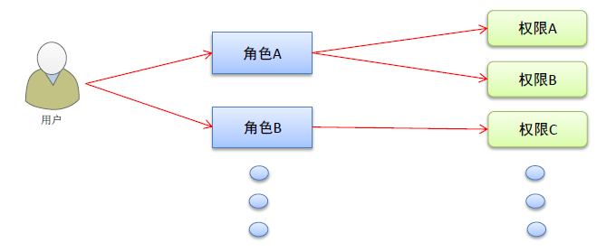

# 7. 角色列表

### 7.1 通过路由将角色组件展示

创建一个`Roles.vue`，在`router/index.js`将其注册为`Home`的子路由

```js
{
    path: '/home',
    component: Home,
    redirect: '/welcome',
    children: [
        {
            path: '/roles',
            component: Roles
        }
    ]
}
```

### 7.2 发送面包屑数据

在`created`钩子函数中，触发父组件所定义的事件管理中心的方法

```js
export default {
  // 注入事件管理中心
  inject: ['eventHub'],
  created() {
    // 向面包屑导航发送数据
    this.eventHub.$emit('getBreadCrumb', ['权限管理', '角色列表'])
  }
}
```

### 7.3 渲染角色列表的数据

和用户列表基本相同，我们仍然采用`el-card`作为底，使用表格来展示数据

```html
<el-card>
    <el-button type="primary">添加角色</el-button>
    <el-table :data="roleList" stripe style="width: 100%" border>
        <el-table-column type="index" label="#" width="100" />
        <el-table-column prop="roleName" label="角色名称" />
        <el-table-column prop="roleDesc" label="角色描述" />
        <el-table-column label="操作">
        <el-button type="primary" size="small" icon="el-icon-edit" />
        <el-button type="danger" icon="el-icon-delete" size="small" />
        <el-tooltip
          effect="dark"
          content="修改用户组"
          enterable
          placement="top"
        >
          <el-button type="warning" icon="el-icon-s-custom" size="small" />
        </el-tooltip>
      </el-table-column>
    </el-table>
</el-card>
```

在`created`钩子函数中请求后台数据，并挂载到`roleList`上

我们给操作这一栏增加了三个按钮

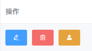

### 7.4 操作按钮增加Tip提示

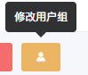

ToolTip：https://element.eleme.cn/#/zh-CN/component/tooltip

注册`Tooltip`

```html
<el-tooltip
       effect="dark"
       content="修改用户组"
       :enterable="false"
       placement="top"
       >
    <el-button type="warning" icon="el-icon-s-custom" size="small" />
</el-tooltip>
```

* `effect`：模式 dark/light
* `content`：提示的文字
* `enterable`：鼠标是否可以进入tooltip，默认为true可以进入
* `placement`：提示出现的地方，top表示为正上方

### 7.5 角色展开视图

#### 1. 增加展开列

在索引列的前面，增加一列，`type='expand'`

```html
<!-- 展开列-->
<el-table-column type="expand" width="50" />
```

### 7.6 添加编辑删除角色

这三项操作与用户操作基本相同，加入弹出层即可，这里不放置代码了

### 7.7 角色权限下渲染

#### 1. 分析实现思路

```html
 <!-- 展开列-->
<el-table-column type="expand" width="50">
    <template slot-scope="scope">
        {{ scope.row }}
    </template>
</el-table-column>
```

展开列中通过循环来将所有的数据一级、二级、三级渲染上去

#### 2. 渲染一级权限

通过v-for对权限进行循环，而`item1`就是一级权限

如果没有权限，就默认加一个占位

```html
<template slot-scope="scope">
    <div>
        <div v-if="!scope.row.children.length">
            该角色下暂无任何权限
        </div>
        <el-row v-else v-for="item1 in scope.row.children" :key="item1.id">
            <!-- 一级权限 -->
            <el-col :span="5">
                <el-tag>{{ item1.authName }}</el-tag>
            </el-col>
            <!-- 二级和三级权限 -->
            <el-col :span="19"></el-col>
        </el-row>
    </div>
</template>
```

#### 3. 渲染二级三级权限

有以及权限可以得到，二级三级权限也都是通过嵌套循环来做的，这里就不放置代码了

#### 4. 给每个权限添加删除按钮

给el-tag设置`closable`属性可以定义一个标签是否可移除。

el-tag有一个`close`事件，用于将事件移除

```js
// 根据 ID 删除对应权限
removeRightById(roleId, rightId) {
    this.$confirm('确定删除该权限？该操作无法撤销', '提示框', {
        confirmButtonText: '确定',
        cancelButtonText: '取消',
        type: 'warning'
    })
        .then(async () => {
        // 确定之后调用后台接口删除用户
        const res = await this.$http.delete(
            `roles/${roleId}/rights/${rightId}`
        )
        if (res.meta.status !== 200) {
            return this.$message.error(`删除权限失败：${res.meta.msg}`)
        }
        this.$message.success('删除权限成功')
        const roleIndex = this.roleList.findIndex(item => {
            return item.id === roleId
        })
        // 删除用户成功之后重新挂载数据
        this.roleList[roleIndex].children = res.data
    })
        .catch(action => {
        // 点击取消和关闭的操作
    })
}
```

### 7.8 角色分配权限

#### 1. 点击按钮弹出Dialog

和之前的思路一样，这里就不放代码了

#### 2. 点击页面处理事件中获取所有权限的数据

获取所有权限的数据并通过树形结构渲染出来

```js
// 分配权限按钮点击事件
async showSetRightDialog() {
    this.setRightDialogVisible = true
    // 获取权限数据，使用树形结构
    const res = await this.$http.get('rights/tree')
    if (res.meta.status !== 200) {
        return this.$message.error(`获取权限列表失败：${res.meta.msg}`)
    }
    // 把权限数据保存在data中
    this.rightList = res.data
},
```

在Dialog弹出层中对数据进行渲染

使用el-tree控件：https://element.eleme.cn/#/zh-CN/component/tree

使用默认展开和选中，记得注册`Tree`

#### 3. 渲染树形结构

```html
<el-tree
    :data="rightList"
    :props="treeProps"
    show-checkbox
    node-key="id"
    default-expand-all
    :default-checked-keys="checkedTreeKeys"
></el-tree>
```

* `data`：依赖的数据
* `props`：这个是树形结构的绑定对象，简单来说就是树形结构根据依赖数据的哪一项进行渲染
* `show-checkbox`：显示出复选框
* `node-key`：点击复选框，value的值是依赖数据的哪个数据
* `default-expand-all`：默认展开所有的列表
* `default-checked-keys`：默认选中的列表，根据`node-key`来判断，这是一个数组

#### 4. 实现默认选中的思路

点击按钮的同时，把这个角色所有的三级权限的ID获取到，将其替换为`default-checked-keys`就可以了

先定义一个递归函数，用于获取所有的三级节点的ID

```js
// 通过递归的形式获取角色下所有三级权限的ID，并保存在data中
getLeafKeys(node, arr) {
    // 如果当前节点不包含children属性，说明是三级节点
    if (!node.children) {
        return arr.push(node.id)
    }
    node.children.forEach(item => {
        this.getLeafKeys(item, arr)
    })
}
```

在点击按钮的时候，调用递归函数

```js
// 分配权限按钮点击事件
async showSetRightDialog(role) {
    // other code ...
    // 递归获取三级节点的ID
    this.getLeafKeys(role, this.checkedTreeKeys)
    // other code ...
},
```

要传入当前的role角色的信息

#### 5. 关闭分配权限界面重置默认选中

在分配权限的Dialog监听close事件，将选中的重置为空

```html
<el-dialog
      title="分配角色权限"
      :visible.sync="setRightDialogVisible"
      width="30%"
      @close="checkedTreeKeys = []"
>
```

#### 6. 分配权限

点击确定之后，向服务器发起请求，保存权限，因为一个Roleid，所以我们在点击分配按钮事件上，将用户保存在data中，也就是`currentRoleId`

```js
// 分配权限
async setRight() {
    // el-tree有内置方法getCheckedKeys可以获取被选中的node-key
    // 由于我们指定的tree的node-key是id，所以可以获取到所有的被选中的id
    const checkedRightIds = this.$refs.treeRef.getCheckedKeys()
    // 不仅获取已选中的ID，还要获取半选中的ID
    const halfCheckedRightIds = this.$refs.treeRef.getHalfCheckedKeys()
    const allCheckedRightsIds = [
        ...checkedRightIds,
        ...halfCheckedRightIds
    ].join(',')
    // 发起请求
    const res = await this.$http.post(`roles/${this.currentRoleId}/rights`, {
        rids: allCheckedRightsIds
    })
    if (res.meta.status !== 200) {
        return this.$message.error(`分配权限失败${res.meta.msg}`)
    }
    this.$message.success('分配权限成功！')
    // 成功关闭页面
    this.setRightDialogVisible = false
    // 重新获取数据
    this.getRoleList()
},
```

# 8. 分类管理

### 8.1 商品分类管理概述

商品分类用于购物时，快速找到所要购买的商品，可以通过电商平台主页直观的看到

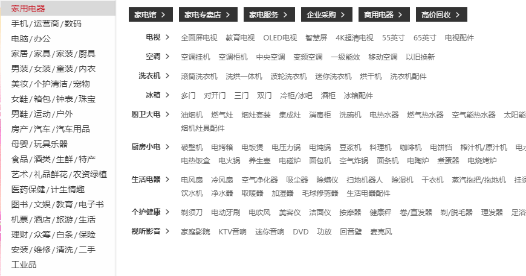

### 8.2 开发商品分类

#### 1. 通过路由加载商品分类组件

和所有的组件相同，在`router/index.js`中注册组件

之后发送面包屑数据

#### 2. 绘制商品分类基本结构

卡片视图中放置一个添加按钮和表格和分页

#### 3. 获取商品分类列表数据

在`created`钩子函数中获取接口数据

#### 4. 使用 vue-table-with-tree-grid 组件

由于我们想要实现的表格的效果Element-UI并没有，所以需要使用第三方组件

https://github.com/MisterTaki/vue-table-with-tree-grid

首先使用 Vue UI 来下载依赖，在`main.js`中导入组件

```js
// Vue.component的方式来注册组件，第一个参数是给组件起的名字，第二个参数是组件
Vue.component('tree-table', TreeTable)
```

这样就可以在自己的项目中通过下方的方式来使用组件了

```html
<tree-table></tree-table>
```

#### 5. 添加分页功能

分页功能和 Users 是一致的

#### 6. 添加新增分类的Dialog

基本和其他新增功能一致，增加验证规则

#### 7. 添加分类时的级联选择框

https://element.eleme.cn/#/zh-CN/component/cascader

注册`Cascader`

```html
<el-cascader
   v-model="addCategoryForm.categoryPid"
   :options="categoryList"
   :props="cascaderProps"
   @change="parentCategoryChanged"
   :show-all-levels="false"
   change-on-select
   filterable
></el-cascader>
```

* `v-model`：双向绑定的值
* `:options`：源数据
* `:props`：绑定源数据配置
* `@change`：监听选择框的值改变事件
* `:show-all-levels`：输入框中是否显示选中值的完整路径
* `change-on-select`：是否可以选择一级
* `filterable`：是否可以搜索

```js
// 级联选择框的props
cascaderProps: {
    // 子级菜单展开的方式
    expandTrigger: 'hover',
    // value: 选中的值
    value: 'cat_id',
    // label：看到的值
    label: 'cat_name'
}
```

#### 8. 添加编辑和删除功能

与角色组件的基本一致，这里就不放代码了

# 9. 参数管理

### 9.1 参数管理概述

商品参数用于显示商品的固定特征信息，可以通过电商平台详情页面看到

* 动态参数（用户可以动态选择不同的属性）

  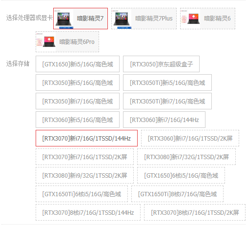

* 静态属性（商品固定的参数）

  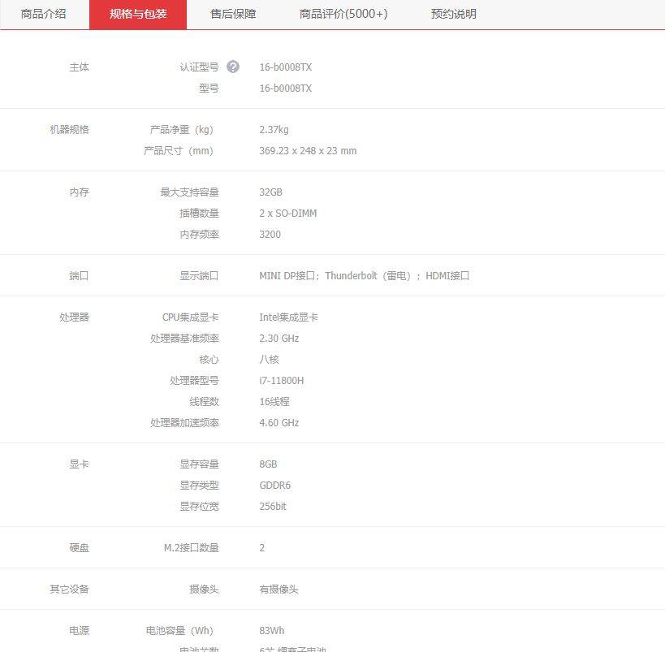

### 9.2 通过路由展示组件

这个和其他的都一样，只不过需要注册`Params`组件

### 9.3 开发参数管理页面

#### 1. 使用 el-alert 展示警告文本

https://element.eleme.cn/#/zh-CN/component/alert

注册`Alert`

```html
<el-alert
   title="注意：只能选择三级分类！"
   type="warning"
   show-icon
   :closable="false"
>
</el-alert>
```

* `title`：提示文本
* `type`：风格
* `show-icon`：展示出文字前的小图标
* `closeable`：是否可以删除

#### 2. 使用级联选择器

```html
<!-- 选择商品分类区域 -->
<el-row class="params_opt">
    <el-col>
        <span>选择商品分类：</span>
        <!-- 选择商品的级联选择框 -->
        <el-cascader
           v-model="selectedKeys"
           :options="categoryList"
           :props="paramsCascaderProps"
            @change="handleCascaderChanged"
           filterable
       ></el-cascader>
    </el-col>
</el-row>
```

#### 3. 渲染 Tabs 页签

https://element.eleme.cn/#/zh-CN/component/tabs

注册`Tabs`

```html
<el-tabs v-model="activeName" @tab-click="handleTabChange">
    <el-tab-pane label="动态参数" name="dynamic">动态参数</el-tab-pane>
    <el-tab-pane label="静态参数" name="static">静态参数</el-tab-pane>
</el-tabs>
```

* `label`：每个页签的名字
* `name`：对应`v-model`的值
* 内容写在每个页签中

#### 4. 如果没有选中分类，添加按钮为禁用

我们使用计算属性，添加一个方法

```js
computed: {
    // 如果按钮需要被禁用，则返回true，反之返回false
    isBtnDisabled: function() {
        if (this.selectedKeys.length !== 3) {
            return true
        }
        return false
    }
},
```

在按钮上添加一个属性，让计算属性来控制这个按钮是否应该被禁用

```html
<el-button type="primary" :disabled="isBtnDisabled">添加参数</el-button>
```

#### 5. 获取参数列表

在级联选择框的`@change`处理函数中，获取参数列表

在切换 Tab 面板的处理函数中，也重新再获取一次参数列表

将获取到的数据通过不同的模式渲染到不同的数据上

```js
// 将获取的数据挂载到不同的数据源上
sel === 'many'
    ? (this.manyParams = res.data)
    : (this.onlyParams = res.data)
```

#### 6. 对参数进行基本操作

添加、修改、删除参数和其他基本相同，这里就不妨代码了

#### 7. 渲染参数下的可选项

每个参数名称下都应该对应多个参数，由于我们在渲染结构的时候已经加入了`expand`展开列，可以在展开列中渲染参数

```js
// 在获取数据的时候将 attr_vals 通过字符串分割为数组
res.data.forEach((item, index) => {
    res.data[index].attr_vals = item.attr_vals.split(',')
})
```

在展开列中

```html
 <!-- 展开列 -->
<el-table-column type="expand">
    <template slot-scope="scope">
        <el-tag
          v-for="item in scope.row.attr_vals"
          class="eachParams"
          :key="item"
          closable
         >{{ item }}</el-tag>
    </template>
</el-table-column>
```

#### 8. 添加按钮点击变为输入框

```html
 <!-- 输入文本框 -->
<el-input
   class="addTagInput"
   v-if="scope.row.inputVisible"
   v-model="scope.row.inputValue"
   ref="addTagInputRef"
   size="small"
   @keyup.enter.native="handleInputConfirm(scope.row)"
   @blur="handleInputConfirm(scope.row)"
>
</el-input>
<!-- 添加的按钮 -->
<el-button v-else size="small" @click="showInput(scope.row)">
    + 新的参数
</el-button>
```

```js
res.data.forEach(item => {
    // 每一行添加一个inputVisible和inputValue
    item.inputVisible = false
    item.inputValue = ''
})
```

点击添加按钮，触发函数，按钮隐藏，输入框出现

```js
// 添加按钮展示文本框
showInput(currentParam) {
    currentParam.inputVisible = true
    // this.$nextTick()将回调延迟到下次 DOM 更新循环之后执行
    // 把inputVisibel重置为true之后，真实 DOM 还没有完成绘制，所以无法获取到addTagInputRef
    // 因此需要使用$nextTick
    this.$nextTick(_ => {
        // 让文本框自动获取焦点
        this.$refs.addTagInputRef.$refs.input.focus()
    })
}
```

输入内容后点击enter或者blur，文本框消失

```js
// 文本框失去焦点和摁下enter都会触发
handleInputConfirm(currentParam) {
    if (currentParam.inputValue.trim().length === 0) {
        return null
      }
    // 将 Tag 内容 push 到 attr_vals 的数组中
    currentParam.attr_vals.push(currentParam.inputValue)
    // 将内容持久化保存
    // 1. 将数组再转为字符串
    const vals = currentParam.attr_vals.join(',')
    // 2. 调用接口
    const res = await this.$http.put(
        `categories/${this.getCategoryId}/attributes/${currentParam.attr_id}`,
        {
            attr_name: currentParam.attr_name,
            attr_sel: currentParam.attr_sel,
            attr_vals: vals
        }
    )
    console.log(currentParam.attr_sel)
    if (res.meta.status !== 200) {
        return this.$message.error(`保存新可选参数失败：${res.meta.msg}`)
    }
    this.$message.success('保存新可选参数成功')
    // 文本框消失，重置内容
    currentParam.inputValue = ''
    currentParam.inputVisible = false
},
```

再`tag`上添加`closable`，可以监听`@close`

```js
// 标签删除
async handleTagClose(currentParam, currentTag) {
    // 通过传递当前的tag的名字来获取到对应的index
    const index = currentParam.attr_vals.findIndex(item => {
        return item === currentTag
    })
    // 获取到之后删除掉
    currentParam.attr_vals.splice(index, 1)
    // 调用接口
    // 2. 调用接口
    const vals = currentParam.attr_vals.join(',')
    const res = await this.$http.put(
        `categories/${this.getCategoryId}/attributes/${currentParam.attr_id}`,
        {
            attr_name: currentParam.attr_name,
            attr_sel: currentParam.attr_sel,
            attr_vals: vals
        }
    )
    console.log(currentParam.attr_sel)
    if (res.meta.status !== 200) {
        return this.$message.error(`删除可选参数失败：${res.meta.msg}`)
    }
    this.$message.success('删除可选参数成功')
}
```

#### 9. 选择三级后再选择二级或一级清空表格数据

再处理级联选择框的事件中，判断如果选择的不是三级菜单，就把数据清空

```js
handleCascaderChanged() {
    // 证明选中的不是三级分类
    if (this.selectedKeys.length !== 3) {
        this.selectedKeys = []
        // 如果选中的不是三级菜单，就清空表格数据
        this.manyParams = []
        this.onlyParams = []
        return null
    }
    // 如果选中了，那么就获取参数列表
    this.getParams(this.getCategoryId, this.activeName)
},
```

# 10. 商品列表

### 10.1 通过路由将商品列表组件加载出来

这个和其他的基本一致，就不放代码了

### 10.2 获取商品列表

再`created`钩子函数中，调用接口获取商品列表

```js
methods: {
    // 根据分页获取数据列表
    async getGoodsList() {
        // 获取商品列表数据
        const res = await this.$http.get('goods', { params: this.queryInfo })
        if (res.meta.status !== 200) {
            return this.$message.error(`获取商品列表失败：${res.meta.msg}`)
        }
        this.goodsList = res.data.goods
        this.queryInfo.pagenum = res.data.pagenum
        this.total = res.data.total
    }
},
created() {
    // 获取数据
    this.getGoodsList()
}
```

### 10.3 通过表格渲染数据

基本上和用户界面相同

其中值得一提的是，我们要全局挂载一个格式化时间的过滤器

```js
// 注册一个全局的过滤器
Vue.filter('dateFormat', function(originValue) {
  return format.dateFormat(originValue)
})
```

```html
 <el-table-column label="创建时间" width="180">
     <template slot-scope="scope">
         <!-- 使用过滤器 -->
         {{ scope.row.add_time | dateFormat }}
     </template>
</el-table-column>
```

### 10.4 使用编程时导航跳转到添加页面

由于我们想要通过组件的方式来添加商品，所以需要使用编程时导航来加载组件

```js
 // 通过编程式导航来跳转到添加商品组件
addGoods() {
    this.$router.push('/goods/add')
}
```

### 10.5 开发添加商品

#### 1. 绘制 alert 提示框

```html
<el-alert
   title="请填写商品信息"
   type="info"
   center
   show-icon
   :closable="false"
>
</el-alert>
```

#### 2. 绘制进度条

https://element.eleme.cn/#/zh-CN/component/steps

使用含状态的进度条，记得注册`Step`和`Steps`

```html
<el-steps :active="0" finish-status="success" align-center>
    <el-step title="基本信息"></el-step>
    <el-step title="商品参数"></el-step>
    <el-step title="商品属性"></el-step>
    <el-step title="商品图片"></el-step>
    <el-step title="商品内容"></el-step>
    <el-step title="完成"></el-step>
</el-steps>
```

* `:active`：当前处于步骤的index
* `finish-status`：完成状态的风格
* `align-center`：居中显示

#### 3. 绘制表单

将表单放在`el-tabs`的外面，不要放在`el-tabs-pane`和`el-tabs`中间

#### 4. 图片上传

https://element.eleme.cn/#/zh-CN/component/upload

使用 Upload 上传组件，使用图片列表缩略图

```html
<el-upload
    :action="uploadURL"
    :on-preview="handlePreview"
    :on-remove="handleRemove"
    :file-list="fileList"
    list-type="picture"
>
    <el-button size="small" type="primary">点击上传</el-button>
    <div slot="tip" class="el-upload__tip">
        只能上传jpg/png文件，且不超过500kb
    </div>
</el-upload>
```

* `action`：上传地址
* `on-preview`：预览的处理函数
* `on-remove`：删除的处理函数
* `list-type`：可以指定当前上传文件预览的呈现方式

手动给上传组件添加请求头

```html
<el-upload :headers="headerObj">
```

```js
// 上传图片时需要用到的 Headers
headerObj: {
    Authorization: window.sessionStorage.getItem('token')
}
```

#### 5. 图片上传成功

在`el-upload`上有一个钩子`on-success`，该属性用于接收一个回调函数，回想回调函数传入三个参数

* `response`：服务器的响应
* `file`：当前的图片
* `fileList`：所有的图片列表

由于添加商品需要用到图片信息，因此需要在钩子函数中将图片push到addForm对象上

#### 6. 图片删除

`el-upload`上有钩子`on-remove`删除上传的图片，需要将该图片从addForm中删除

```js
// 处理图片删除
handleUploadRemove(file) {
    const filePath = file.response.data.tmp_path
    const index = this.addGoodsForm.pics.findIndex(item => {
        return item.pic === filePath
    })
    this.addGoodsForm.pics.splice(index, 1)
}
```

#### 7. 图片预览

`el-upload`上有钩子`on-preview`图片预览，就弹出Dialog

```js
// 处理图片预览
handlePreview(file) {
    // 让预览Dialog弹出来
    this.previewDialogVisible = true
    this.previewImgURL = this.$baseURL + file.response.data.tmp_path
},
```

#### 8. 商品添加需要编辑器

用到的富文本编辑器是：`vue-quill-edtior`

```js
// 在 main.js 全局注册 vue-quill-editor
import VueQuillEditor from 'vue-quill-editor'

import 'quill/dist/quill.core.css' // import styles
import 'quill/dist/quill.snow.css' // for snow theme
import 'quill/dist/quill.bubble.css' // for bubble theme

Vue.use(VueQuillEditor)
```

在组件中使用

```html
<!-- 富文本编辑器 -->
<quill-editor v-model="addGoodsForm.goods_introduce" />
```

# 11. 订单管理

### 1. 通过路由加载订单列表

和其他的一样

# 12. 项目优化

### 12.1 添加进度条效果

通过`nprogress`实现

https://github.com/rstacruz/nprogress

我们在配置`axios`的时候配置了请求响应拦截器，可以在这之中对于进度条进行显示和隐藏效果

* `NProgress.start();`方法用于展示进度条
* `NProgress.done();`方法用于关闭进度条

```js
// 配置请求拦截器
axios.interceptors.request.use(config => {
  // 为请求头添加 Authorization 字段
  config.headers.Authorization = window.sessionStorage.getItem('token')
  // 添加进度条
  nprogress.start()
  return config
})

// 配置响应拦截器
axios.interceptors.response.use(
  response => {
    // 隐藏进度条
    nprogress.done()
    return response.data
  },
  error => {
    return Promise.reject(error)
  }
)
```

### 12.2 在执行build期间移除所有的console指令

在第一次build打包时，会出现`warning  Unexpected console statement  no-console`

这句话的意思时：在发布阶段中，不可以出现`console.xx`指令，删除掉就可以了

`babel-plugin-transform-remove-console`

这个插件可以在发布阶段可以移除所有的`console.xx`

```bash
npm install babel-plugin-transform-remove-console --save-dev
```

#### 1. 如何使用？

在项目根目录`.babelrc`文件中，加入以下配置

```js
// 没有配置
{
  "plugins": ["transform-remove-console"]
}
// 有配置
{
  "plugins": [ ["transform-remove-console", { "exclude": [ "error", "warn"] }] ]
}
```

或者在`babel.config.js`中，加入以下配置

```js
module.exports = {
  presets: ['@vue/cli-plugin-babel/preset'],
  plugins: [
    [
      'component',
      {
        libraryName: 'element-ui',
        styleLibraryName: 'theme-chalk'
      }
    ],
    // 加入配置
    'transform-remove-console'
  ]
}
```

