# 目标

* 知道如何创建小程序项目
* 清楚小程序项目的基本结构
* 知道小程序页面的组成部分
* 知道小程序常见的组件如何使用
* 知道小程序如何协同开发与发布

# 1. 小程序简介

### 1.1 小程序与普通网页开发的区别

* **运行环境不同**
  * 网页运行在浏览器环境
  * 小程序运行在微信环境
* **API 不同**
  * 由于运行环境不同，所以小程序无法调用 DOM 和 BOM 的 API
  * 但是可以调用微信自己的 API ，例如 定位、扫码、支付
* **开发模式不同**
  * 网页的开发模式：浏览器+IDE
  * 小程序开发模式：
    * 申请小程序开发账号
    * 安装小程序开发工具
    * 创建和配置小程序项目

# 2. 第一个小程序

### 2.1 注册小程序开发账号

打开 https://mp.weixin.qq.com/ 网址，点击【立即注册】即可进入小程序开发账号的注册流程

### 2.2 获取小程序的 AppID

创建好小程序之后，想要开发小程序需要用到 AppID

登录小程序开发账号，点击左侧`开发/开发管理`-->`开发设置`-->`开发者ID`-->`AppID`

### 2.3 安装微信开发者工具

#### 1. 了解微信开发者工具

微信开发者工具是官方推荐使用的小程序开发工具，它提供的主要功能如下：

* 快速创建小程序项目
* 代码的查看和编辑
* 对小程序功能进行调试
* 小程序的预览和发布

#### 2. 下载

推荐下载最新的稳定版（Stable Build）的微信开发者工具

https://developers.weixin.qq.com/miniprogram/dev/devtools/download.html

#### 3. 登录

扫码登陆

### 2.4 创建小程序项目

#### 1. 创建小程序

* 选择小程序，点击添加
* 输入 AppID 与配置

#### 2. 查看运行效果的两种方式

* 在模拟器上查看效果
* 点击预览按钮通过扫描二维码真机预览

#### 3. 主界面的 5 个组成部分

[查看大图](./resource/1-微信开发者工具的区域.png)

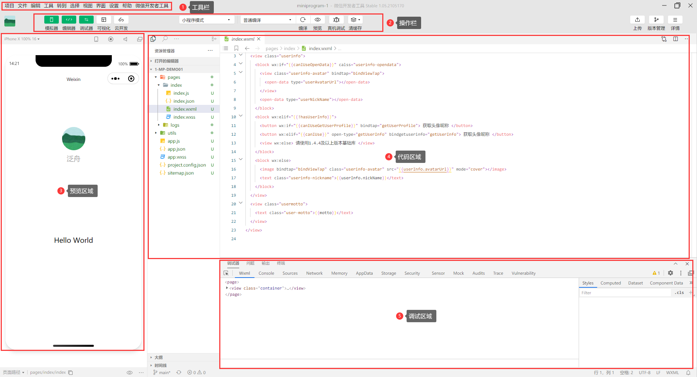

# 3. 小程序代码的构成

### 3.1 项目的基本构成

* `pages`：存放所有小程序的页面
* `utils`：存放工具性质的模块（例如放置一个格式化事件的自定义模块）
* `app.js`：小程序项目的入口文件
* `app.json`：小程序项目的全局配置文件
* `app.wxss`：小程序项目的全局样式文件
* `project.config.json`：项目配置文件
* `sitemap.json`：用来配置小程序及其页面是否允许被微信索引

### 3.2 小程序页面的组成部分

小程序官方建议把所有小程序的页面，都存放在`pages`目录中，以单独的文件夹存在。

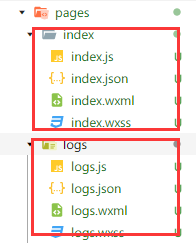

其中，每个页面由4个基本文件组成，分别是：

* `.js`文件：页面的脚本文件，存放页面的数据，事件处理函数等
* `.json`文件：当前页面的配置文件，配置窗口的外观，表现等
* `.wxml`文件：页面的模板结构文件
* `.wxss`文件：页面的样式表文件

### 3.3  JSON 配置文件

#### 1. JSON 配置文件的作用

JSON是一种数据格式，在实际开发中，JSON总是以配置文件的形式存在。小程序项目中的`.json`文件可以对项目进行不同级别的配置

小程序项目中有 4 种 JSON 配置文件，分别是：

* 项目根目录的`app.json`配置文件
* 项目根目录的`project.config.json`配置文件
* 项目根目录的`sitemap.json`配置文件
* `pages`中每个页面的`.json`配置文件

#### 2. app.json 文件

`app.json`是整个小程序项目的全局配置文件，包含了小程序的：

* 所有页面路径
* 窗口外观
* 界面表现
* 底部 tab 等

```json
{
  "pages":[
    "pages/index/index",
    "pages/logs/logs"
  ],
  "window":{
    "backgroundTextStyle":"light",
    "navigationBarBackgroundColor": "#fff",
    "navigationBarTitleText": "Weixin",
    "navigationBarTextStyle":"black"
  },
  "style": "v2",
  "sitemapLocation": "sitemap.json"
}
```

* `pages`：记录当前小程序所有页面的路径
* `window`：全局定义所有页面的背景色、文字颜色、窗口颜色
* `style`：全局定义小程序所有组件使用的样式版本
* `sitemapLocation`：说明`sitemap.json`文件的存放路径

#### 3. project.config.json 文件

`project.config.json`是项目的配置文件，用来记录我们对**小程序开发工具**所作的个性化配置

* `setting`：保存编译相关的配置
* `projectname`：项目的名称
* `appid`：小程序的ID

#### 4. sitemap.json 文件

微信现已开放小程序内搜索，效果类似于 PC 网页的 SEO。sitemap.json文件用来配置小程序也页面是否被微信索引。

当开发者允许微信索引时，微信会通过爬虫的形式，为小程序的页面内容建立索引。当用户的搜索关键字和页面的索引匹配成功时，小程序的页面将可能展示在搜索结果中

```js
{
  "rules": [{
  "action": "allow",
  "page": "*"
  }]
}
```

* `action`：是否允许被索引 `disallow`/`allow`
* `page`：允许索引的页面

注意：sitemap 的索引提示是默认开启的，如果需要关闭[sitemap 索引提示]，可以在小程序的`project.config.json`中的`setting`配置资源`checkSitemap: false`

#### 5. 页面的 .json 文件

小程序的每一个页面，可以使用`.json`文件来对本页面的窗口外观进行配置，页面中的配置会覆盖`app.json`中的`window`节点的相同配置项

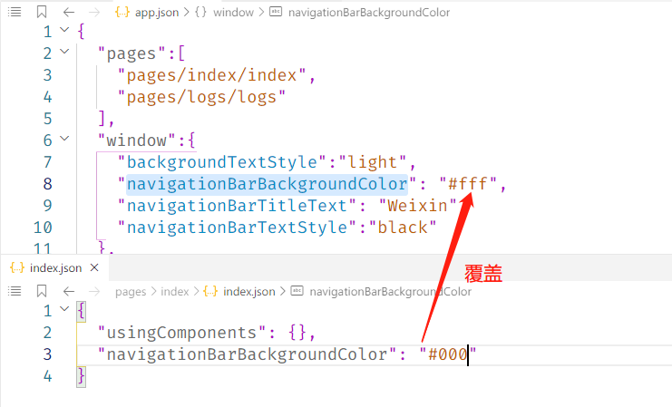

#### 6. 新建小程序页面

只需要在`app.json -> pages`中新增页面的存放路径，小程序开发工具就会自动帮助我们创建对应的页面文件：

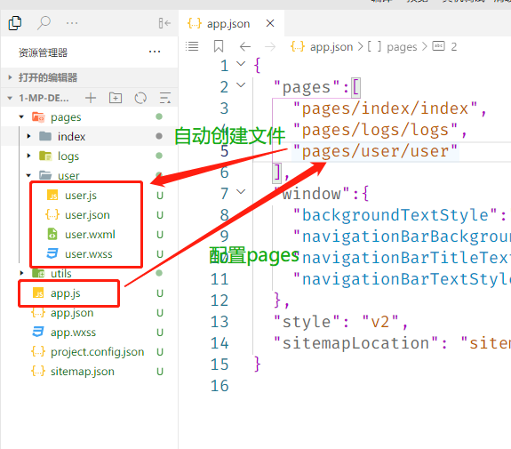

#### 7. 修改项目首页

只需要调整`app.json -> pages`的顺序就可以修改项目首页，小程序会把排名最前的页面作为项目的首页

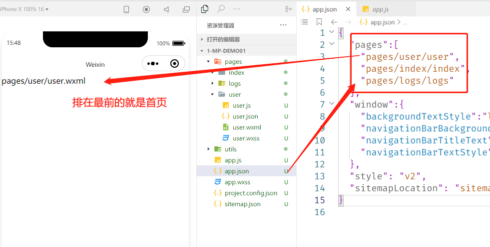

### 3.4 WXML 模板

#### 1. 什么是 WXML

WXML(Weixin Markup Language) 是小程序框架设计的一套标签语言，用来构建小程序页面的结构，其作用类似于网页开发中的 HTML

#### 2. WXML 和 HTML 的区别

* 标签名称不同
  * HTML(div, span, img, a)
  * WXML(view, text, image, navigator)
* 属性节点不同
  * `<a href="#">超链接</a>`
  * `<navigator url="/pages/home/home"></navigator>`
* WXML 提供了类似于 Vue 的模板语法
  * 数据绑定
  * 列表渲染
  * 条件渲染

### 3.5 WXSS 样式

#### 1. 什么是 WXSS

WXSS(Weixin Style Sheets)是一套样式语言，  用于描述 WXML 的组件样式，类似于网页中的 CSS

#### 2. WXSS 和 CSS 的区别

* 新增加`rpx`尺寸单位
  * CSS 中需要手动对像素单位换算，例如`rem`
  * WXSS 在底层支持了新的尺寸单位`rpx`，在不同大小的屏幕上小程序会自动换算
* 提供了全局的样式和局部的样式
  * 项目根目录的`app.wxss`作用于所有的小程序页面
  * 局部页面的`.wxss`只会对当前页面有效

* WXSS 仅支持部分的 CSS 选择器
  * `.class`和`#id`
  * element 元素选择器
  * 并集选择器、后代选择器
  * `::after`和`::before`等伪类选择器

### 3.6 JS 逻辑交互

#### 1. 小程序的`.js`文件

一个项目仅仅提供页面的展示是不够的，在小程序中，我们通过`.js`文件来处理用户的操作，例如：监听用户点击，获取用户位置等

#### 2. 小程序中`.js`文件的分类

小程序中的 JS 文件分为三大类，分别是：

* `app.js`
  * 是整个项目的入口文件，通过调用`App()`来启动项目
* 页面的`.js`文件
  * 每个页面单独的交互
* 普通的`.js`文件
  * 所有的页面都可使用的工具类

# 4. 小程序的宿主环境

### 4.1 宿主环境简介

#### 1. 什么是宿主环境

宿主环境（host environment）指的是程序运行必需的依赖环境。例如：

`Android`和`IOS`就是两个不同的宿主环境。安卓版的微信 App 是不可以在 IOS 的环境下运行的。所以`Andorid`是安卓软件的宿主环境。**脱离了宿主软件的软件是没有任何意义的！**因为软件脱离了宿主软件就无法正常运行

#### 2. 小程序的宿主环境

**手机微信**是小程序的宿主环境，不论是`Andriod`版微信还是`IOS`版微信，都是小程序的宿主环境，都可以正常运行小程序的项目。

小程序借助宿主环境提供的能力，可以完成一些普通页面无法完成的操作：

微信扫码、微信支付、微信登录、地理定位、etc.

#### 3. 小程序宿主环境包含的内容

* 通信模型
* 运行机制
* 组件
* API

### 4.2 通信模型

#### 1. 通信的主体

小程序通信的主体主要有渲染层和逻辑层：

* `WXML`模板和`WXSS`样式工作在渲染层
* `.js`脚本工作在逻辑层

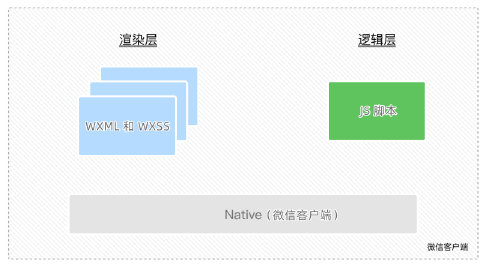

#### 2. 小程序的通信模型

小程序的通信模型分为两个部分：

* 渲染层与逻辑层之间的通信
  * 由微信客户端进行转发
* 逻辑层与第三方服务器之间的通信
  * 由微信客户端进行转发

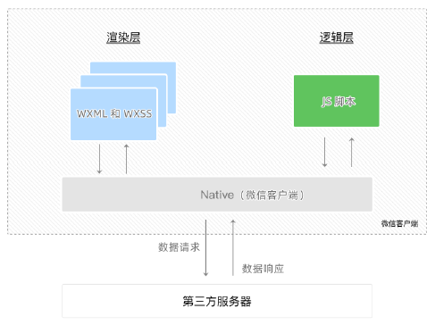

### 4.3 运行机制

#### 1. 小程序启动过程

* 将小程序的代码包下载到本地
* 解析`app.json`全局配置文件
* 执行`app.js`入口文件，调用`App()`创建小程序实例
* 渲染小程序首页
* 小程序启动完成

#### 2. 页面渲染过程

* 加载解析页面的`.json`文件
* 加载解析页面的`.wxml`和`.wxss`文件
* 执行页面的`.js`文件，调用`Page()`创建页面实例
* 页面渲染完成

### 4.4 组件

#### 1. 小程序中组件的分类

小程序中的组件也是由宿主环境提供的，开发者可以基于组件快速搭建漂亮的页面结构。官方把小程序的组件分为 9 大类：

* **视图容器**
* **基础内容**
* **表单组件**
* **导航组件**
* 媒体组件
* map 地图组件
* canvas 画布组件
* 开发能力
* 无障碍访问

#### 2. 常用的视图容器组件

* `view`
  * 普通视图区域
  * 类似于 HTML 中的`div`，是一个块级元素
  * 常用来实现页面的布局效果
* `scroll-view`
  * 可滚动的视图区域
  * 常用来实现滚动的列表效果
* `swiper`和`swiper-item`
  * 轮播图容器组件和轮播图的每一项组件

#### 3. view 组件的基本使用

view就相当于`div`

[查看大图](./resource/8-view.png)

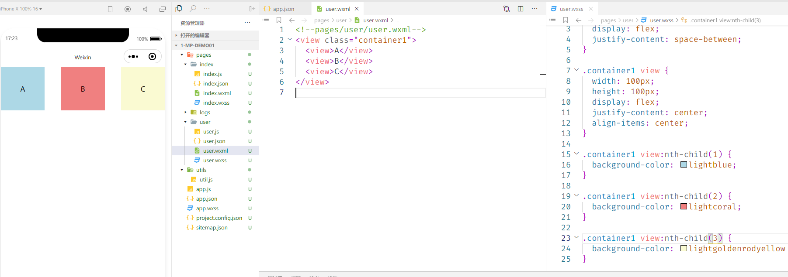

#### 4. scroll-view 的基本使用

允许滚动需要在`scroll-view`上加入属性`scroll-x`或`scroll-y`

[查看大图](./resource/9-scroll-view.png)

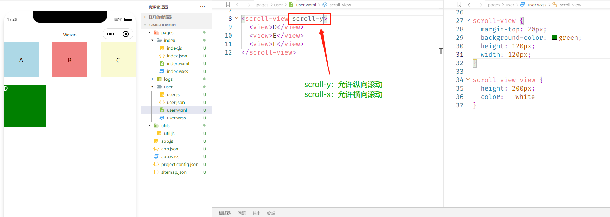

#### 5. swiper 和 swiper-item 的基本使用

在 swiper 中添加`indicator-dots`显示面板指示点

[查看大图](./resource/10-swiper.png)

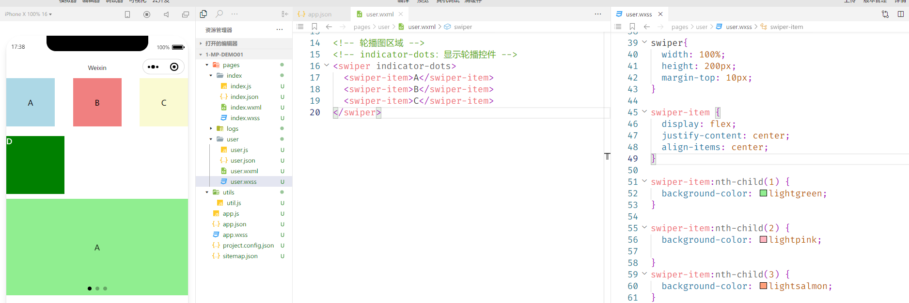

#### 6. swiper 组件的常用属性

| 属性                   | 类型    | 默认值            | 说明                 |
| :--------------------- | :------ | :---------------- | :------------------- |
| indicator-dots         | boolean | false             | 是否显示面板指示点   |
| indicator-color        | color   | rgba(0, 0, 0, .3) | 指示点颜色           |
| indicator-active-color | color   | #000000           | 当前选中的指示点颜色 |
| autoplay               | boolean | false             | 是否自动切换轮播图   |
| interval               | number  | 5000              | 自动切换时间         |
| circular               | boolean | false             | 是否采用衔接滑动     |

#### 7. 常用的基础内容组件

* `text`
  * 文本组件
  * 类似于 HTML 的`span`，是一个行内元素
* `rich-text`
  * 富文本组件
  * 支持把 HTML 渲染为 WXML

#### 8. text 组件的基本使用

通过 text 组件的`user-select`属性，实现长按选中文本内容的效果

注意：`selectable`已被废弃！！！

```html
<text user-select>123456</text>
```

#### 9. rich-text 组件的基本使用

通过 rich-text 组件的`nodes`属性节点，把 HTML 字符串渲染为对应的 UI 结构

```html
<!-- rich-text 可以将 HTML 渲染为对应的 WXML -->
<rich-text
   nodes="<h1 style='margin-top: 20px'>标题</h1>"
></rich-text>
```

#### 10. 其他常用组件

* `button`按钮组件
  * 功能比 HTML 中的 button 按钮丰富
  * `open-type`属性可以调用微信提供的各种功能（客服、转发、获取用户信息...）
* `image`图片组件
  * 默认的图片组件宽约 300px 高约 240px
* `navigator`导航组件
  * 页面导航组件
  * 类似于 HTML 的 a 链接

#### 11. button 按钮组件

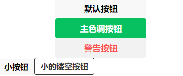


```html
<!-- 通过 type 指定按钮类型 -->
<button>默认按钮</button>
<button type="primary">主色调按钮</button>
<button type="warn">警告按钮</button>
<!-- 通过 size 指定按钮尺寸 -->
<button size="mini">小按钮</button>
<!-- plain 镂空按钮 -->
<button size="mini" plain>小的镂空按钮</button>
```

#### 12. image 图片组件

组件默认由`300px`的宽，`200px`的高

```html
<!-- 空图片 -->
<image></image>
<!-- 使用 src 指定图片 -->
<image src="/images/1.png"></image>
```

#### 13. image 组件的 mode 属性

image 组件的 mode 属性用来指定图片的**裁剪**和**缩放**模式，常用的 mode 属性值如下：

| mode 值     | 说明                                                         |
| ----------- | ------------------------------------------------------------ |
| scaleToFill | （默认值）缩放模式，不保持纵横比缩放图片，使图片的宽高完全拉伸至填满 |
| aspectFit   | 缩放模式，保持纵横比缩放图片，使图片的长边能完全显示出来。也就是说，可以完整地将图片显示出来。 |
| aspectFill  | 缩放模式，保持纵横比缩放图片，只保证图片的短边能完全显示出来。也就是说，图片通常只在水平或垂直方向是完整的，另一个方向将会发生截取。 |
| widthFix    | 缩放模式，宽度不变，高度自动变化，保持原图宽高比不变         |
| heightFix   | 缩放模式，高度不变，宽度自动变化，保持原图宽高比不变         |

### 4.5 API

#### 1. 小程序 API 概述

**小程序中的 API 是由宿主环境提供的**，通过这些丰富的小程序 API，开发者可以方便的调用微信提供的能力，例如：获取用户信息、本地存储、支付功能等。

#### 2. 小程序 API 的 3 大分类

小程序官方把 API 分为了如下 3 大类：

* **事件监听 API**
  * 以`on`开头，用来监听某些事件的触发
  * 举例：`wx.onWindowResize(function callback)`监听窗口尺寸变化的事件
* **同步 API**
  * 以`Sync`结尾的 API 都是同步 API
  * 同步 API 执行的结果，可以通过函数返回值直接获取，如果发生异常直接抛出异常
  * 举例：`wx.setStorageSync('key', 'value')`以同步方式向本地存储中写入内容
* **异步 API**
  * 类似于 jQuery 中的`$.ajax(options)`函数，需要通过 success、fail、complete 接收调用的结果
  * 举例：`wx.request()`发起网络数据请求，通过 success 回调来接收数据

# 5. 协同工作与发布

### 5.1 协同工作

#### 1. 了解权限管理需求

在中大型的公司里，人员的分工十分详细，同一个小程序的项目，一般会有不同岗位、不同角色的员工参与设计与开发。此时出于管理需求，我们迫切对不同岗位、不同角色的员工的权限进行边界的划分，使他们能高效的进行协同工作。

#### 2. 了解项目的成员结构

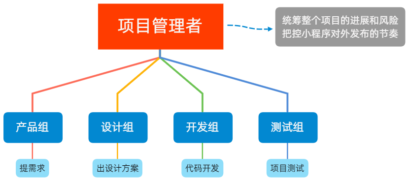

#### 3. 小程序开发流程


### 5.2 成员管理

#### 1. 成员管理的两个方面

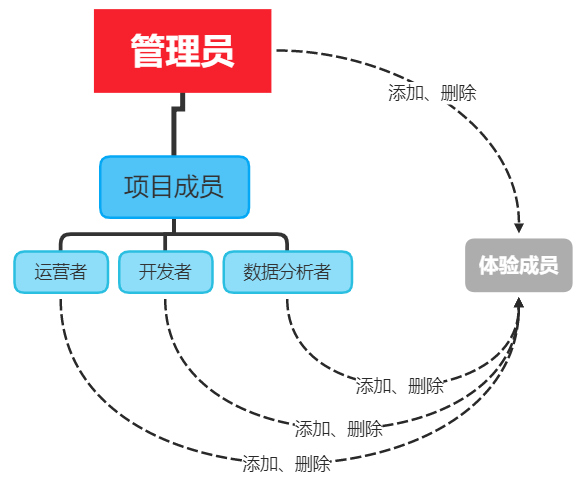

 

小程序成员管理体现在**管理员**对小程序**项目成员**与**体验成员**的管理

* **项目成员：**
  * 参与项目的开发与运营的成员
  * 可登录小程序管理后台
  * 管理员可添加、删除项目成员，并设置项目成员的角色
* **体验成员：**
  * 参与项目内测体验的成员
  * 可以使用体验版小程序，但不是项目成员
  * 管理员和项目成员都可以添加、删除体验成员

#### 2. 不同项目成员对应的权限

|      权限      | 运营者 | 开发者  | 数据分析者 |
| :------------: | :----: | :-----: | :--------: |
|   开发者权限   |        | ***√*** |            |
|   体验者权限   |   √    | ***√*** |     √      |
|      登录      |   √    | ***√*** |     √      |
|    数据分析    |        |         |     √      |
|    微信支付    |   √    |         |            |
|      推广      |   √    |         |            |
|    开发管理    |   √    |         |            |
|    开发设置    |        | ***√*** |            |
|    暂停服务    |   √    |         |            |
| 解除关联公众号 |   √    |         |            |
|   腾讯云管理   |        | ***√*** |            |
|  游戏运营管理  |   √    |         |            |

#### 3. 开发者权限说明

开发者权限：可以使用开发者工具进行功能的开发

体验者权限：可以使用体验版小程序

登录权限：可以登录小程序的管理后台，无需管理员确认

开发设置：设置小程序服务器域名、消息推送等

腾讯云管理：云开发相关设置

#### 4. 添加项目成员与体验成员

https://mp.weixin.qq.com/

登录以上网址，左侧`管理 --> 成员管理`可以添加项目成员与体验成员

### 5.3 小程序的版本

#### 1. 软件开发过程中的不同版本

在开发过程中，根据时间节点的不同，会产出不同的软件版本，例如：

* 开发者编写代码的同时，对功能进行自测（**开发版本**）
* 直到程序达到一个稳定可体验的状态时，开发者将体验版本给产品经理与测试人员进行**测试版本**
* 直到开发完毕，修复 Bug 后，发布**正式版本**对外使用

#### 2. 小程序版本

| 版本阶段   | 说明                                                         |
| ---------- | ------------------------------------------------------------ |
| 开发版本   | 使用开发者工具，可将代码上传到开发版本中。<br />开发版本只保留每人最新的一份上传的代码。<br />点击提交审核，可将代码提交审核。<br />开发版本可删除，不影响线上版本和审核中版本的代码。 |
| 体验版本   | 可以选择某个开发版本作为体验版，并且选取一份体验版。         |
| 审核中版本 | 只能有一份代码处于审核中。有审核结果后可以发布到线上，也可直接重新提交审核，覆盖原审核版本。 |
| 线上版本   | 线上所有用户使用的代码版本，该版本代码在新版本代码发布后被覆盖更新。 |

### 5.4 发布上线

#### 1. 发布上线整体步骤

一个小程序的发布上线，一般要经过`上传代码 --> 提交审核 --> 发布`三个阶段

#### 2. 上传代码

* 点击开发者工具顶部工具栏中的“上传”按钮
* 填写版本号以及项目备注

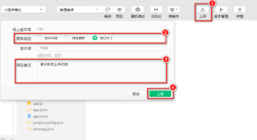

#### 3. 查看上传之后的版本

登录小程序`管理后台 --> 管理 --> 版本管理 --> 开发版本`，即可查看刚才提交上传的版本了：

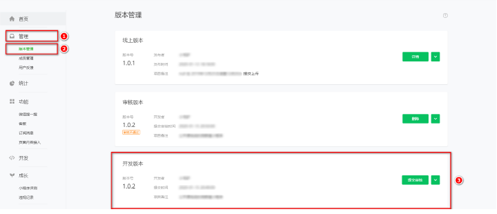

#### 4. 提交审核

* 为什么需要提交审核：为了保证小程序的质量，以及符合相关的规范，小程序的发布是需要经过腾讯官方审核的。
* 提交审核的方式：在开发版本的列表中，点击“**提交审核**”按钮之后，按照页面提示填写相关的信息，就能把小程序提交到腾讯官方进行审核。

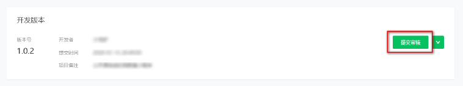

#### 5. 发布

审核通过之后，管理员的微信中会收到小程序通过审核的通知，此时在审核版本的列表中，点击“**发布**”按钮之后，即可把“**审核通过**”的版本发布为“**线上版本**”，供所有小程序用户访问和使用。

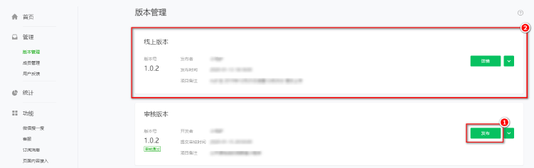

#### 6. 基于小程序码进行推广

相对于普通二维码来说，小程序码的优势如下：

* 在样式上更具辨识度和视觉冲击力
* 能够更加清晰地树立小程序的品牌形象
* 可以帮助开发者更好地推广小程序

获取小程序码的 5 个步骤：

* 登录小程序管理后台
* 设置
* 基本设置
* 基本信息
* 小程序码及线下物料下载

### 5.5 运营数据

#### 1. 查看小程序运营数据的两种方式

在小程序**管理后台**查看：

* 点击侧边栏“统计”
* 点击响应 Tab 栏查看相关数据

使用**小程序数据助手**查看：

* 微信搜索“小程序数据助手”
* 查看已发布的小程序的相关数据


