# 目标：

* 使用 WXML 模板渲染页面结构
* 使用 WXSS 美化页面样式
* 使用 app.json 对小程序全局配置
* 使用 page.json 对页面进行单独配置
* 知道如何发起网络请求

# 1. WXML 模板语法

### 1.1 数据绑定

#### 1. 数据绑定的基本原则

* 在`data`中定义数据
* 在`WXML`中使用数据

#### 2. 在 data 中定义页面的数据

在页面对应的`.js`文件中，把数据定义到 data 对象中即可：

```js
Page({
    data: {
        // 字符串类型的数据
        info: 'init data',
        // 数组类型的数据
        arr: [{ msg: 'hello, ' }, { msg: 'WXML!' }]
    }
})
```

#### 3. Mustache 语法的格式

把data中的数据绑定到页面中渲染，使用 **Mustache 语法**（双大括号）将变量包起来即可。语法格式为：

```html
<view>{{ info }}</view>
```

#### 4. Mustache 语法的应用场景

Mustache 语法的主要应用场景如下：

* 绑定内容
* 绑定属性
* 运算（三元表达式、算术运算）

#### 5. 动态绑定内容

```js
// page.js
data: {
    // 在 data 中定义数据
    info: "hello, WXML!"
},
```

```html
<!-- 在页面使用 {{}} Mustache 语法来绑定内容 -->
<view>{{ info }}</view>
```

#### 6. 动态绑定属性

```js
// page.js
data: {
    // 动态绑定属性
    imgURL: "../../images/1.jpg"
},
```

```html
<!-- 动态绑定属性 -->
<image src="{{ imgURL }}" alt=""></image>
```

#### 7. 三元运算

```html
<!-- 三元表达式 -->
<view>{{ flag ? '是真的' : '是假的' }}</view>
```

#### 8. 算术运算

```html
<!-- 算术运算 -->
<view>{{ num + 100 }}</view>
```

### 1.2 事件绑定

#### 1. 什么是事件

事件是**渲染层到逻辑层的通讯方式**。通过事件可以将用户在渲染层产生的行为，反馈到逻辑层进行业务的处理。

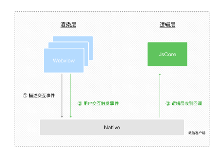

#### 2. 小程序中常用的事件

| 类型   | 绑定方式                    | 事件描述                              |
| ------ | --------------------------- | ------------------------------------- |
| tap    | `bindtap`或`bind:tap`       | 手指点击后立刻离开，类似于`click`事件 |
| input  | `bindinput`或`bind:input`   | 文本框输入事件                        |
| change | `bindchange`或`bind:change` | 状态改变事件                          |

#### 3. 事件对象的属性列表

当事件回调触发的时候，会收到一个事件对象`event`，它的详细属性如下表所示：

| 属性          | 类型         | 说明                                   |
| ------------- | ------------ | -------------------------------------- |
| type          | String       | 事件类型                               |
| timeStamp     | Integer      | 页面打开到触发事件经过的毫秒数         |
| ***target***  | ***Object*** | ***触发事件的组件的一些属性的集合***   |
| currentTarget | Object       | 当前组件的一些属性值集合               |
| ***detail***  | ***Object*** | ***额外的信息***                       |
| touches       | Array        | 触摸事件，当前停留在屏幕上的触摸点信息 |
| changeTouches | Array        | 触摸事件，当前变化的触摸点的信息       |

#### 4. target 和 currentTarget 的区别

target 是**触发该事件的源头组件**，而 currentTarget 则是**当前事件所绑定的组件**。举例如下：

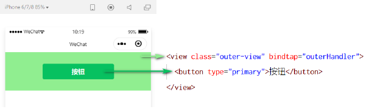

点击内部的按钮时，点击事件以**冒泡**的方式向外扩散，也会触发外层 view 的 tap 事件处理函数。此时，对于外层的 view 来说：

* `e.target`指向的是触发事件的源头组件，因此，e.target 是***内部的按钮组件***
* `e.currentTarget`指向的是当前正在触发事件的那个组件，因此，e.currentTarget 是***当前的 view 组件***

#### 5. bindtap 的语法格式

在小程序中，不存在 HTML 中的 onclick 鼠标点击事件，而是通过 **tap 事件来响应用户的触摸行为**。

通过`bindtap`，可以为组件绑定 tap 触摸事件，语法如下：

```html
<button type="primary" bindtap="handleTap"></button>
```

在页面的`.js`文件中定义处理的方法

```js
Page({
    handleTap() {
        // do something ...
    }
})
```

#### 6. 在事件处理函数中为 data 中的数据赋值

通过调用`this.setData(dataObject)`方法，可以给页面 data 中的数据重新赋值，示例如下：

```js
// page.js 文件
Page({
    data: {
        info: 'hello world!'
    },
    // 修改 info 的值
    changeInfo() {
        this.setData({
            info: 'hello WXML!'
        })
    }
})
```

#### 7. 事件传参

小程序中的事件传参比较特殊，**不能在绑定事件的同时为事件处理函数传递参数**。例如，下面的代码将***不能正常工作***：

```html
<!-- 以下代码不起效果 -->
<button bindtap="handleTap(123)"></button>
```

因为小程序会把 bindtap 的属性值，**统一当作事件名称来处理**，相当于要调用一个名称为`btnHandler(123)`的事件处理函数。

可以为组件提供`data-*`自定义属性传参，其中 * 代表的是参数的名字，示例代码如下：

```html
<!-- 使用 data-* 的方式来传参 -->
<!-- 下面例子中的 num 就是接收到的参数名字 -->
<button bindtap="handleTap" data-num="{{ 123 }}"></button>
```

最终：

* `num`被解析为参数的名称
* `123`被解析为参数的值

在事件处理函数中，通过`event.target.dataset.参数名`即可获取到具体参数的值，示例代码如下：

```js
// 上文中的 num 需要 event.target.dataset.num 来接收
handleTap(event){
    // dataset 是一个对象，里面包含了所有的 data-*
    // 通过 dataset 来获取到指定的参数
    console.log(event.target.dataset.num)
}
```

#### 8. bindinput 的语法格式

在小程序中，通过`input`事件来响应文本框的输入事件，语法格式如下：

通过`bindinput`，可以为文本框绑定输入事件：

```html
<input bindinput="handleInput" type="text" />
```

在页面的`.js`文件中定义事件处理函数：

```js
handleInput(event) {
    // e.detail.value 是变化后，文本框最新的值
    console.log(e.detail.value)
}
```

#### 9. 实现文本框和 data 之间的数据同步

实现步骤：

* 定义数据
* 渲染结构
* 美化样式
* 绑定 input 输入函数

**处理函数：**

```js
handleInput(event) {
    // event.detail.value 是最新的输入框的值
    this.setData({
        inputMsg: event.detail.value
    })
}
```

### 1.3 条件渲染

#### 1. wx:if

在小程序中，使用`wx:if = '{{ condition }}'`来判断是否渲染该模块

```html
性别：
<text wx:if="{{ gender === 0 }}">男</text>
<text wx:elif="{{ gender === 1 }}">女</text>
<text wx:else>保密</text>
```

#### 2. 结合`<block>`使用 wx:if

如果要一次性控制多个组件的展示与隐藏，可以使用一个`<block></block>`标签将多个组件包装起来，并在`<block>`标签上使用 wx:if 控制属性，示例如下：

```html
<block wx:if="{{ userType === 0 }}">
    <view>用户组：管理员</view>
    <view>用户权限：删除用户</view>
</block>
```

注意： `<block>`并不是一个组件，**它只是一个包裹性质的容器，不会在页面中做任何渲染**。

#### 3. hidden

在小程序中，直接使用`hidden="{{ condition }}"`也能控制元素的显示与隐藏：

```html
<view hidden="{{ condition }}">条件为 true 显示，为 false 隐藏</view>
```

#### 4. wx:if 与 hidden 的对比

运行方式不同：

* `wx:if`是动态创建元素和移除元素的方式来控制元素的显示和隐藏
* `hidden`是以切换样式的方式`display: none`来控制元素的显示和隐藏
* 相当于`v-if`和`v-show`的区别，前者条件为false不会渲染在 DOM 结构中，后者一直会渲染在DOM结构中

使用建议：

* 频繁切换显示和隐藏的推荐使用`hidden`
* 控制条件复杂的，建议使用`wx:if`

### 1.4 列表渲染

#### 1. wx:for

通过`wx:for`可以根据指定的数组，循环渲染重复的组件结构，语法示例如下：

```html
<!-- 使用 wx:for 来循环渲染 -->
<view wx:for="{{ list }}">
  索引：{{ index }}; 值：{{ item }}
</view>
```

默认情况下，当前循环项的索引用`index`表示；当前循环项用`item`表示。

#### 2. 手动指定索引和当前项的变量名*

* 使用`wx:for-index`可以指定当前循环项的索引的变量名
* 使用`wx:for-item`可以指定当前项的变量名

```html
<!-- 使用 wx:for-index 来指定索引名， 使用 wx:for-item 来指定值 -->
<view wx:for="{{ list }}" wx:for-index="i" wx:for-item="value">
  索引：{{ i }}; 值：{{ value }}
</view>
```

#### 3. wx:key 的使用

类似于 Vue 列表渲染中的`:key`，小程序在实现列表渲染时，**也建议为渲染出来的列表项指定唯一的 key 值**，从而提高渲染的效率，示例代码如下：

```js
// 数据
data: {
    userList: [
      { id: 1, userName: 'admin' },
      { id: 2, userName: 'alex' },
      { id: 3, userName: 'zs' },
      { id: 4, userName: 'andrew' },
    ]
}
```

```html
<!-- wx:for 时 推荐使用 wx:key 来指定 key 值 -->
<view wx:for="{{ userList }}" wx:key="{{ item.id }}">
  {{ item.userName }}
</view>
```

# 2. WXSS 模板样式

### 2.1 WXSS 简介

#### 1. 什么是 WXSS

WXSS (WeiXin Style Sheets)是一套**样式语言**，用于美化 WXML 的组件样式，类似于网页开发中的 CSS。

#### 2. WXSS 和 CSS 的关系

WXSS 具有 CSS 大部分特性，同时，WXSS 还对 CSS 进行了扩充以及修改，以适应微信小程序的开发。与 CSS 相比，WXSS 扩展的特性有：

* `rpx`尺寸单位
* `@import`样式导入

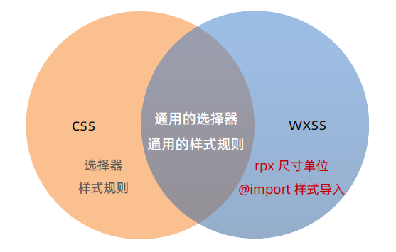

### 2.2 rpx

#### 1. 什么是 rpx 尺寸单位

rpx（responsive pixel）是微信小程序独有的，用来**解决屏适配的尺寸单位**。

#### 2. rpx 的实现原理

rpx 的实现原理非常简单：鉴于不同设备屏幕的大小不同，为了实现屏幕的自动适配，rpx 把所有设备的屏幕，在宽度上等分为`750份`（即：**当前屏幕的总宽度为 750rpx**）。

* 在较小的设备上，1rpx 所代表的宽度较小
* 在较大的设备上，1rpx 所代表的宽度较大

小程序在不同设备上运行的时候，会自动把 rpx 的样式单位换算成对应的像素单位来渲染，从而实现屏幕适配。

#### 3. rpx 与 px 之间的单位换算*

在 iPhone6 上，屏幕宽度为375px，共有 750 个物理像素，等分为 750rpx。则：750rpx = 375px = 750 物理像素：1rpx = 0.5px = 1物理像素，举几个简单的例子：

| 设备          | rpx 换算为 px（屏幕宽度 / 750） | px 换算为 rpx（750 / 屏幕宽度） |
| ------------- | ------------------------------- | ------------------------------- |
| iPhone 5      | 1rpx = 0.24 px                  | 1px = 2.34 rpx                  |
| iPhone 6      | 1rpx = 0.5 px                   | 1px = 2 rpx                     |
| iPhone 6 Plus | 1rpx = 0.552 px                 | 1px = 1.81 rpx                  |

### 2.3 样式导入

#### 1. 什么是样式导入

使用 WXSS 提供的`@import`语法，可以导入外联的样式表。

#### 2. @import 的语法格式

`@import`后跟需要导入的外联样式表的**相对路径**，用`;`表示语句结束。示例如下：

```css
/* common.wxss */
.box {
    box-sizing: border-box;
}
```

```css
/* page.wxss */
@import 'common.wxss'
.list-item {
    border: 1px solid red
}
```

### 2.4 全局样式和局部样式

#### 1. 全局样式

定义在`app.wxss`中的样式为全局样式，**作用于每一个页面**

#### 2. 局部样式

在页面的`.wxss`文件中定义的样式为局部样式，**只作用于当前页面**。

注意：

* 当局部样式与全局样式冲突时，局部样式会覆盖全局样式
* 当**局部样式权重大于或等于全局样式权重**时，才会覆盖全局样式

# 3. 全局配置

### 3.1 全局配置文件及常用的配置项

小程序根目录下的`app.json`文件是小程序的全局配置文件。常用的配置项如下：

* pages
  * 记录当前小程序所在的页面存放路径
* window
  * 全局设置小程序外观
* tabBar
  * 设置小程序底部的 tabBar 效果
* style
  * 是否启动新版样式

#### 1. 小程序窗口的组成部分

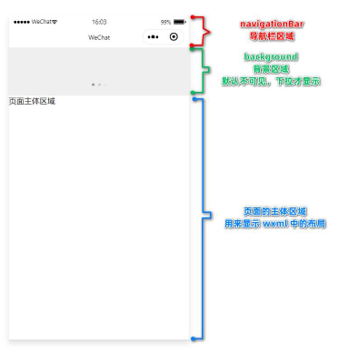

#### 2. 了解 window 节点常用的配置项

| 属性名                       | 类型     | 默认值  | 说明                                         |
| ---------------------------- | -------- | ------- | -------------------------------------------- |
| navigationBarTitleText       | String   | 字符串  | 导航栏标题内容                               |
| navigationBarBackgroundColor | HexColor | #000000 | 导航栏背景颜色                               |
| navigationBarTextStyle       | String   | white   | 导航栏标题颜色，仅支持`white`/`black`        |
| backgroundColor              | HexColor | #ffffff | 窗口的背景色                                 |
| backgroundTextStyle          | String   | dark    | 下拉 loading 的样式，仅支持`dark`/`light`    |
| enablePullDownRefresh        | Boolean  | false   | 是否全局开启下拉刷新                         |
| onReachBottomDistance        | Number   | 50      | 页面上拉触底事件触发时距顶部的距离，单位为px |

#### 3. 设置导航栏的标题

设置步骤：`app.json --> window --> navigationBarTitleText`

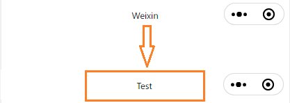

#### 4. 设置导航栏的背景色

设置步骤：`app.json --> window --> navigationBarBackgroundColor`

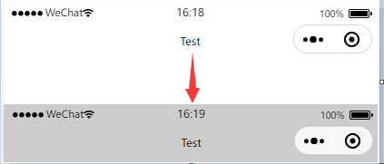

#### 5. 设置导航栏的标题颜色

设置步骤：`app.json --> window --> navigationBarTextStyle`

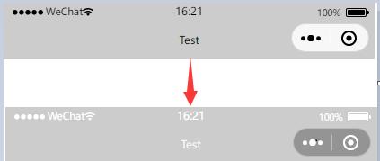

注意：

`navigationBarTextStyle`只有2个值：`black`或`white`

#### 6. 全局开启下拉刷新功能

概念：下拉刷新是移动端的专有名词，指的是通过**手指在屏幕上的下拉滑动操作，从而重新加载页面数据的行为**。

设置步骤：`app.json --> window --> 把 enablePullDownRefresh`的值设置为`true`

注意：在 app.json 中启用下拉刷新功能，**会作用于每个小程序页面**！

#### 7. 设置下拉刷新时窗口的背景色

.当全局开启下拉刷新功能之后，默认的窗口背景为**白色**。如果自定义下拉刷新窗口背景色，

设置步骤为: `app.json --> window --> backgroundColor`，值为 16 进制的 Hex 值

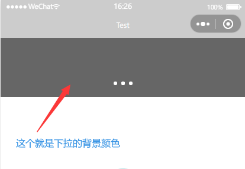


#### 8. 设置下拉刷新时 loading 的样式

当全局开启下拉刷新功能之后，默认窗口的 loading 样式为白色，如果要更改 loading 样式的效果

设置步骤为`app.json -> window -> 为 backgroundTextStyle`

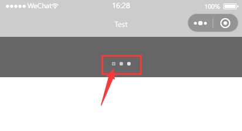

注意：`backgroundTextStyle`只有 2 个值：`dark`或`light`

#### 9. 设置上拉触底的距离

概念：上拉触底是移动端的专有名词，通过手指在屏幕上的上拉滑动操作，从而加载更多数据的行为。

设置步骤： `app.json --> window --> onReachBottomDistance`

注意：默认距离为**50px**，如果没有特殊需求，建议使用默认值即可。

### 3.2 tabBar

#### 1. 什么是 tabBar

tabBar 是移动端应用常见的页面效果，用于实现多页面的快速切换。小程序中通常将其分为：

* 顶部 tabBar
* 底部 tabBar

注意：

* tabBar中只能配置最少 2 个、最多 5 个 tab 页签
* 当渲染顶部 tabBar 时，**不显示 icon**，只显示文本

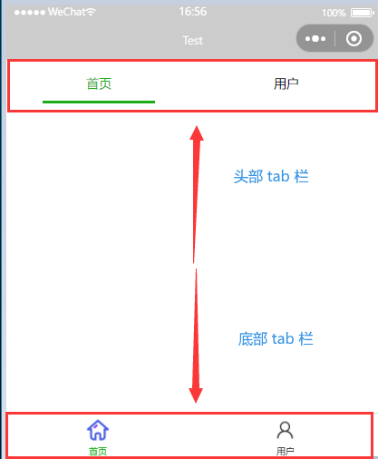

#### 2. tabBar 的 6 个组成部分

* `backgroundColor`：tabBar 的背景色
* `selectedIconPath`：选中的 tabBar 的 icon 图片
* `borderStyle`：tabBar 上边框的颜色
* `iconPath`：未选中的 tabBar 的 icon 图片
* `seletedColor`：选中的 tabBar 的文字颜色
* `color`：未选中的 tabBar 的文字颜色

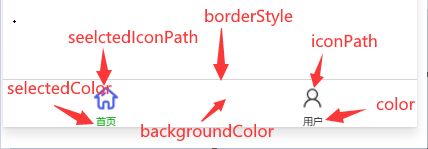

#### 3. tabBar 节点的配置项

| 属性            | 类型     | 必填 | 默认值 | 描述                                       |
| --------------- | -------- | ---- | ------ | ------------------------------------------ |
| position        | String   | 否   | bottom | tabBar 的位置，`top`/`bottom`              |
| borderStyle     | String   | 否   | black  | tabBar 上边框的颜色，仅支持`black`/`white` |
| color           | HexColor | 否   |        | tabBar 上未选中的字体的颜色                |
| selectedColor   | HexColor | 否   |        | tabBar 上选中的字体的颜色                  |
| backgroundColor | HexColor | 否   |        | tabBar 的背景颜色                          |
| list            | Array    | 是   |        | tab 页签的列表，**最少 2 个，最多 5 个**   |

#### 4. 每个 tab 项的配置

| 属性             | 类型   | 必填 | 描述                                             |
| ---------------- | ------ | ---- | ------------------------------------------------ |
| pagePath         | String | 是   | 页面路径，页面必须在`pages`预先定义              |
| text             | String | 是   | tab 上显示的文字                                 |
| iconPath         | String | 否   | 未选中时的图标，当`potision = 'top'`时不显示图标 |
| selectedIconPath | String | 否   | 选中时的图标，当`potision = 'top'`时不显示图标   |

```json
"tabBar": {
    "position": "bottom",
    "list": [{
        "pagePath": "pages/index/index",
        "text": "首页",
        "iconPath": "/images/tab/home.png",
        "selectedIconPath": "/images/tab/home_active.png"
    },{
        "pagePath": "pages/user/user",
        "text": "用户",
        "iconPath": "/images/tab/user.png",
        "selectedIconPath": "/images/tab/user_active.png"
    }]
```

# 4. 页面配置

### 4.1 页面配置文件的作用

小程序中，每个页面都有自己的`.json`文件，用于对当前页面的窗口外观、页面效果进行配置。如果某些小程序的页面想要拥有特殊的窗口样式，这个时候就可以通过`页面 --> .json`文件来实现

注意：当页面配置与全局配置冲突时，根据就近原则，最终的效果以**页面的配置为准**

### 4.2 页面配置中常用的配置项

| 属性                         | 类型     | 默认值  | 描述                                              |
| ---------------------------- | -------- | ------- | ------------------------------------------------- |
| navigationBarBackgroundColor | HexColor | #000000 | 当前页面的导航栏背景色                            |
| navigationBarTextStyle       | String   | white   | 当前页面导航栏标题颜色，仅支持`black`/`white`     |
| navigationBarTitleText       | String   |         | 当前页面导航栏标题文字颜色                        |
| backgroundColor              | HexColor | #ffffff | 当前页面窗口的背景色                              |
| backgroundTextStyle          | String   | dark    | 当前页面下拉 loading 的样式，仅支持`dark`/`light` |
| enablePullDownRefresh        | Boolean  | false   | 当前页面是否可以下拉刷新                          |
| onReachBottomDistance        | Number   | 50      | 页面下拉刷新触底事件距离页面底部的距离，单位为px  |

# 5. 网络数据请求

### 5.1 配置请求地址

#### 1. 小程序中网络数据请求的限制

出于安全性的考虑，小程序官方对于数据接口的请求做出了如下两个限制：

* 只能请求`https`类型的接口
* 必须将**接口的域名**添加到**信任列表**中

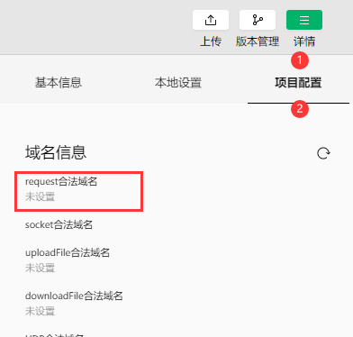

上图中的`request`合法域名中应填写需要请求的后端，如果为空，则项目无法请求任何地址的域名

#### 2. 配置 request 合法域名

配置步骤：

* 登录小程序管理后台
* 开发
* 开发管理
* 服务器域名
* 修改 request 合法域名

注意事项：

* 域名仅支持 https 协议
* 域名不能使用 IP 地址或者 localhost
* 域名必须经过 ICP 备案
* 服务器域名一个月只能修改 5 次

### 5.2 发起请求

#### 1. 发起 GET 请求

调用微信提供的`wx.request()`方法，可以发起 GET 请求

```js
wx.request({
    url: 'https://xxx.com/api',  // 接口的 URL ，必须基于 https
    method: 'GET',  // 请求的方式
    // 请求携带的数据
    data: {
        name: 'aa',
        age: 18
    },
    // 请求成功的回调
    success: (res) => {
        console.log(res)
    }
})
```

#### 2. 发起 POST 请求

调用微信提供的`wx.request()`方法，可以发起 POST 请求

```js
wx.request({
    url: 'https://xxx.com/api',  // 接口的 URL ，必须基于 https
    method: 'POST',  // 请求的方式
    // 请求携带的数据
    data: {
        name: 'aa',
        age: 18
    },
    // 请求成功的回调
    success: (res) => {
        console.log(res)
    }
})
```

GET 和 POST 只是`method`的值更改了

### 5.3 在页面刚加载时请求数据

在很多时候，我们需要在页面刚加载时，自动请求一些初始化的数据，此时需要在页面的`onLoad`钩子函数上调用请求数据的函数

```js
// 生命周期钩子函数 onLoad 监听页面加载
onLoad: function (options) {
    // 在页面刚加载时就调用请求数据的函数
    this.getDataList()
}
// 获取列表数据
getDataList: function () {
	// ......
}
```

### 5.4 跳过 request 域名合法校验

如果后端程序仅仅提供了`http`协议的接口，那么就需要跳过 request 合法校验才可以进行请求数据。我们可以在微信开发者工具中，临时开启【**不校验请求域名、web-view（业务域名）、TLS 版本以及 HTTPS 证书**】选项，跳过校验阶段

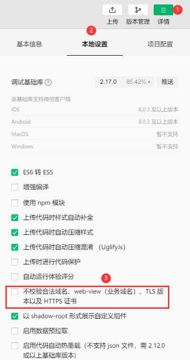

### 5.5 关于跨域与 Ajax 的说明

跨域问题只存在于基于浏览器的 Web 开发中，由于小程序的宿主环境是微信，所以**不存在跨域问题**

Ajax 技术的核心是依赖于浏览器的`XMLHttpRequest`对象，由于小程序的宿主环境微信不存在这个对象，因此小程序不能叫做【发起 Ajax 请求】，叫做【发起网络数据请求】

