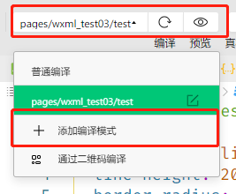
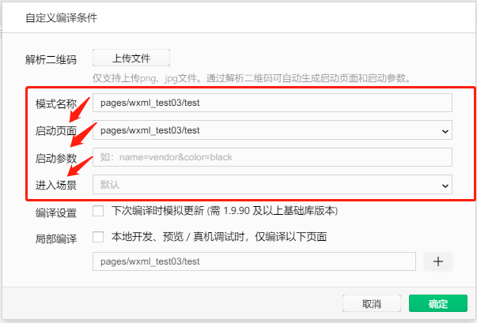

# 目标：

* 知道如何实现页面之间的导航跳转
* 知道如何实现下拉刷新效果
* 知道如何实现上拉加载更多效果
* 知道小程序中常用的生命周期钩子函数

# 1. 页面导航

### 1.1 页面导航简介

#### 1. 什么是页面导航

页面导航指的是**页面之间的相互跳转**，例如，浏览器实现页面导航的方式有两种：

* `<a>`超链接
* `location.href`

#### 2. 小程序实现页面导航的方式

* 声明式导航
  * 在页面中生命一个`<navigator>`导航组件
  * 通过点击`<navigator>`组件来实现页面跳转
* 编程式导航
  * 调用小程序导航 API

### 1.2 声明式导航

#### 1. 导航到 tabBar 页面

tabBar 页面指的是被配置为`tabBar`的页面

在使用`<navigator>`组件跳转到指定的`tabBar`页面时，需要指定`url`属性和`open-type`属性

* `url`表示要跳转的页面的地址，必须以`/`开头
* `open-type`表示为跳转的方式，必须是`swicthTab`

```html
<navigator url="/pages/index/index" open-type="switchTab">
	跳转到 index tabBar
</navigator>
```

#### 2. 导航到非 tabBar 页面

非 tabBar 页面指的是未被配置到`tabBar`的页面

在使用`<navigator>`组件跳转到指定的`tabBar`页面时，需要指定`url`属性和`open-type`属性

* `url`表示要跳转的页面的地址，必须以`/`开头
* `open-type`表示为跳转的方式，必须是`navigate`

```html
<navigator url="/pages/user/user" open-type="navigate">
	跳转到 user
</navigator>
```

#### 3. 后退导航

如果需要后退到上一级页面甚至多级页面，需要指定`open-type`属性和`delta`属性

* `open-type`值必须是`navigateBack`，表示为后退导航
* `delta`的值必须是数字，表示后退的级数

```html
<navigator open-type="navigateBack" delta="3">
	后退3个页面
</navigator>
```

### 1.3 编程式导航

#### 1. 导航到 tabBar

调用`wx.switchTab(Object object)`方法，可以跳转到 tabBar 页面，其中 Object 是参数对象，属性如下：

| 属性     | 类型     | 是否必选 | 说明                                         |
| -------- | -------- | -------- | -------------------------------------------- |
| **url**  | string   | 是       | 需要跳转的 tabBar 的页面路径，路径不能带参数 |
| success  | function | 否       | 接口调用成功的回调函数                       |
| fail     | function | 否       | 接口调用失败的回调函数                       |
| complete | function | 否       | 接口调用结束的回调函数（包括成功、失败）     |

```js
wx.switchTab({
    url: '/pages/index/index',
    // 如果没有特殊需求，写一个 url 即可
    success: function() {
        console.log('跳转成功')
    },
    fail: function() {
        console.log('跳转失败')
    },
    complete: function() {
        console.log('执行跳转')
    }
})
```

#### 2. 导航到非 tabBar 页面

调用`wx.navigateTo(Object object)`方法，可以跳转到 tabBar 页面，其中 Object 是参数对象，属性如下：

| 属性     | 类型     | 是否必选 | 说明                                         |
| -------- | -------- | -------- | -------------------------------------------- |
| **url**  | string   | 是       | 需要跳转的 tabBar 的页面路径，路径不能带参数 |
| success  | function | 否       | 接口调用成功的回调函数                       |
| fail     | function | 否       | 接口调用失败的回调函数                       |
| complete | function | 否       | 接口调用结束的回调函数（包括成功、失败）     |

```js
wx.navigateTo({
    url: '/pages/user/user'
})
```

#### 3. 后退导航

调用`wx.navigateBack(Object object)`方法，可以跳转到 tabBar 页面，其中 Object 是参数对象，属性如下：

| 属性      | 类型     | 是否必选 | 说明                                                         |
| --------- | -------- | -------- | ------------------------------------------------------------ |
| **delta** | number   | 否       | 返回的页面数，**如果 delta 大于现有页面数，则返回到首页**（默认值：1） |
| success   | function | 否       | 接口调用成功的回调函数                                       |
| fail      | function | 否       | 接口调用失败的回调函数                                       |
| complete  | function | 否       | 接口调用结束的回调函数（包括成功、失败）                     |

```js
// 默认值是 1
wx.navigateBack()
```

### 1.4 导航传参

#### 1. 声明式导航传参

navigator 组件中的 url 属性可以指定跳转的页面的路径，同时路径后面也可以携带一些参数：

* 参数与路径之间使用`?`分开
* 参数与参数值直接使用`=`相连
* 不同参数之间使用`&`分割

```html
<navigator url="/pages/info/info?username=zs&age=18">
	跳转到 info 页面
</navigator>
```

#### 2. 编程式导航传参

调用`wx.navigateTo(Object object)`方法时，也可以携带参数

```html
<button bindtap="goToInfo"></button>
```

```js
goToInfo: function () {
    wx.navigateTo({
        url: '/pages/info/info?username=zs&age=18'
    })
}
```

#### 3. 在 onLoad 中接收导航参数

通过声明式导航的编程式导航进行传递的参数，可以通过在`onLoad`钩子函数中获取到

```js
onLoad: function (options) {
    // options 就是导航传递过来的参数对象
    console.log(options)
}
```

# 2. 页面事件

### 2.1 下拉刷新事件

#### 1. 什么是下拉刷新

下拉刷新是移动端的专有名词，指的是通过手指在屏幕上的下拉滑动操作，来重新加载页面的行为

#### 2. 启动下拉刷新

* 全局开启下拉刷新（不推荐）
  * 在`app.json`中的`window`节点中，将`enablePullDownRefresh`设置为`true`
* 局部开启下拉刷新
  * 只为需要的页面单独开启下拉刷新效果
  * 在页面的`.json`中将`enablePullDownRefresh`设置为`true`

#### 3. 配置下拉刷新的样式

通过在页面或全局的`.json`文件中，配置`backgroundColor`和`backgroundTextStyle`来定制不同的下拉刷新样式

* `backgroundColor`：配置下拉刷新的**背景颜色**，仅支持16禁止的颜色值
* `backgroundTextStyle`：配置下拉刷新的`loading 样式`，仅支持`dark/light`

```json
{
    "backgroundColor": "#00000",
    "backgroundTextColor": "light"
}
```

#### 4. 监听下拉刷新事件

通过`onPullDownRefresh`来监听页面的下拉刷新事件

```js
onPullDownRefresh: function() {
    // 下拉刷新，重新获取数据
    this.getDataList()
}
```

#### 5. 停止下拉刷新的效果

下拉刷新的效果不会自动关闭，我们可以在获取数据成功后让下拉刷新停止。调用`wx.stopPullDownRefresh()`来关闭下拉刷新

```js
onPullDownRefresh: function() {
    // 获取数据操作......
    // 获取数据成功，停止下拉刷新
    wx.stopPullDownRefresh()
}
```

### 2.2 上拉触底事件

#### 1. 什么是上拉触底

上拉触底是移动端的专有名词，指的是通过手指在屏幕上的上拉拉滑动操作，来重新加载页面的行为，一般上拉触底实现的就是`分页`效果

#### 2. 监听上拉触底事件

通过`onReachBottom`来监听上拉触底事件

```js
onReachBottom: function() {
    // 上拉触底，加载第二页
    this.getDataList(params)
}
```

#### 3. 配置上拉触底的距离

上拉触底距离，指的就是**触发上拉触底事件后，滚动条距离页面底部的距离**，默认是 50 px，我们可以在全局或页面的`.json`文件中，配置`onReachBottomDistance`来改变上拉触底的距离，默认是 px 作为单位，配置时不需要加入单位

```json
{
    "onReachBottomDistance": 80
}
```

#### 4. 上拉触底案例

##### 定义获取随机色的方法

```js
Page({
  data: {
    colorList: [],
  },

  getColors: function(){
    return Math.floor(Math.random()*255)
  },

  getColorList: function(){
    const arr = []
    for(let i=0;i<10;i++){
      arr[i] = {id: i, color: [this.getColors(), this.getColors(), this.getColors()]}
    }
    return arr;
  },

  getColorListByPage: function(){
    const arr = this.getColorList();
    this.setData({
      colorList: [...this.data.colorList, ...arr]
    })
  },

  /**
   * 生命周期函数--监听页面加载
   */
  onLoad: function (options) {
    this.getColorListByPage();
  },
}
```

##### 美化样式

```html
<view 
      wx:for="{{ colorList }}"
      wx:key="{{item.id}}"
      class="color-item"
      style="background-color: rgba({{item.color}})"
>{{item.color}}</view>
```

```css
.color-item {
  border:1px solid #efefef;
  line-height: 200rpx;
  border-radius: 15rpx;
  margin: 15rpx;
  text-align: center;
  text-shadow: 0rpx 0rpx 5rpx #fff;
  box-shadow: 1rpx 1rpx 6rpx #aaa;
}
```

##### 添加 loading 加载效果

调用`wx.showLoading(Object object)`显示加载框，调用`wx.hideLoading()`隐藏加载框

```js
getColorListByPage: function(){
    wx.showLoading({
        title: '加载中...',
    })
    new Promise((resolve) => {
        setTimeout(()=> {
            const arr = this.getColorList();
            this.setData({
                colorList: [...this.data.colorList, ...arr]
            })
            resolve()
        },300)
    }).finally(() => {
        wx.hideLoading({
            success: (res) => {},
        })
    })
},
```

##### 对上拉触底进行节流

* 在 data 中定义 isloading 节流阀
* 在获取颜色的方法中修改 isloading 节流阀的状态
  * 获取颜色刚开始，将节流阀改为 true
  * 获取颜色结束，将节流阀改为 false
* 在 onReachBottom 中判断节流阀的状态
  * 如果节流阀是 false，才会触发请求颜色

##### 自定义编译模式

如果我们的首页是`index`，但是我们在开发`user`这个Tab，每次更新都要重新点击一次，那么有方法可以更新后直接进入到`user`呢？





将启动页面更改为`pages/user/user`即可，还可以设置启动参数和进入场景

