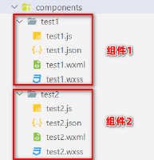

# 目标：

* 知道如何自定义小程序组件
* 知道组件中的 behaviors 的作用
* 知道如何安装与配置 vant-weapp 组件库
* 知道如何使用 MobX 实现全局数据共享
* 知道如何对 API 进行 Promise 化

# 1. 自定义组件

### 1.1 组件的创建与引用

#### 1. 创建组件

* 在根目录下，创建`components`文件夹
* `components`文件夹右键点击`新建 component`
* 每个组件有 4 个文件，分别是`.js`、`.json`、`.wxss`、`.wxml`

推荐将不同组件放在不同的文件夹中：



#### 2. 引用组件

组件的引用方式有两种：

* 局部引用：组件只能在当前引用的页面中使用
* 全局引用：组件可以在每个小程序页面中使用

#### 3. 局部引用组件

在页面的`.json`配置文件中引用组件

```json
{
    "usingComponents": {
        "my-test01": "/components/test1/test"
    }
}
```

```html
<!-- WXML -->
<my-test01></my-test01>
```

#### 4. 全局引用组件

在`app.json`中引用组件，这样所有的小程序页面都可以使用组件

```json
{
    "pages": {},
    "window": {},
    "usingComponents": {
        "my-test02": "/components/test2/test"
    }
}
```

#### 5. 全局与局部的引用场景

根据组件的**使用频率**和**范围**，来选择合适的引用方式：

* 如何某个组件在多个页面中经常用到，建议使用全局引用
* 如果某个组件只在特定的页面中才用到，建议使用局部引用

#### 6. 组件和页面的区别

从表面来看，组件和页面都是由4个文件组成的，但是组件和页面的文件有明显不同：

* 组件的`.json`文件需要声明：`"component": true`
* 组件的`.js`文件调用的是`Component()`函数
* 组件的事件处理函数集中在`methods`节点中

### 1.2 样式

#### 1. 组件样式隔离

默认情况下，自定义组件的样式只能对当前组件有效，不会影响其他组件的 UI 结构

* 组件 A 的样式不会影响组件 B 的样式
* 组件 A 的样式不会影响小程序的样式
* 小程序的样式不会影响组件的样式

#### 2. 组件样式隔离的注意点

* `app.wxss`的全局样式对于组件无效
* 只有`class`选择器有样式隔离效果，id、属性、标签选择器不会有影响

建议：在组件和引用组件的页面中建议***使用 class 选择器***不要使用 ID、属性、标签选择器

#### 3. 修改组件的样式隔离选项

默认情况下，组件样式隔离开启，如果想要外界控制组件的样式，那么可以通过`stylesolation`修改组件的样式隔离选项

```js
// 在 组件.js 中
Component({
    options: {
        // isolated：开启隔离
        styleIsolation: "isolated",
        // apply-shard：外部可以影响组件样式，组件样式不会影响外部样式
        styleIsolation: "apply-shared",
        // shared：组件与外部的样式可以互相影响
        styleIsolation: "shared"
    }
})
```

或在`组件.json`中

```json
{
    "styleIsolation": "isolated",
    "styleIsolation": "apply-shared",
    "styleIsolation": "shared"
}
```

#### 4. styleIsloation 的可选值

| 可选值       | 默认值 | 描述                                                 |
| ------------ | ------ | ---------------------------------------------------- |
| isolated     | 是     | 启动样式隔离                                         |
| apply-shared | 否     | 页面的样式可以影响组件样式，组件样式无法影响页面样式 |
| shared       | 否     | 页面与组件之间的样式互相影响                         |

### 1.3 数据、方法与属性

#### 1. data 数据

在小程序组件中，用于组件模板渲染的**私有数据**，需要定义在 data 节点下：

```js
Component({
    // 组件的初始数据
    data: {
        count: 0
    }
})
```

#### 2. methods 方法

在小程序组件中，事件的处理函数与自定义函数需要定义在 methods 节点中：

```js
Component({
    // 包括事件处理函数与自定义函数
    methods: {
        // 事件处理函数
        addCount() {
            this.setData({
                count: this.data.count + 1
            })
            this._showCount()
        },
        // 自定义函数建议以 _ 开头
        _showCount() {
            wx.showToast({
                title: "count的值为：" + this.data.conut,
                icon: "none"
            })
        }
    }
})
```

#### 3. properties 属性

在小程序组件中，properties 是组件的对外属性，用来接收外界传入组件的值：

```js
// 组件.js
Component({
    properties: {
        // 完整的定义属性方式【带有默认值】
        max: {
            // 属性值的类型
            type: Number,
            // 属性默认值
            value: 10
        },
        // 简略版的定义定义属性方式【不带有默认值】
        max: Number
    },
    // 如何使用？
    this.properties.max
})
```

```html
<!-- 外界引入组件，传入属性 -->
<my-component max="10"></my-component>
```

#### 4. data 与 properties 的区别

在小程序的组件中，properties 属性和 data 数据的用法是相同的，他们都是**可读可写**的，但是：

* data 更倾向于储存组件的私有属性
* properties 更倾向于储存外界传递过来的数据

* data 和 properties 都储存在了同一个对象上

```js
Component({
	methods: {
        showInfo() {
            console.log(this.data === this.properties)  // true
        }
    }
})
```

#### 5. 使用 setData 修改 properties 的值

由于 data 与 properties 没有区别，所以可以使用`this.setData()`来修改 properties 的值：

```html
<!-- 组件.wxml -->
<view> 最大值：{{max}} </view>
```

```js
// 组件.js
Component({
    properties: {
        max: Number
    },
    methods: {
        addMax() {
            this.setData({
                max: this.properties.max + 1
			})
        }
    }
})
```

### 1.4 数据监听器

#### 1. 什么是数据监听器

数据监听器用于监听和响应任何属性和数据字段的变化，从而执行特定的操作。类似于 Vue 中的`watch`侦听器

```js
Component({
    observers: {
        "字段A, 字段B": function (字段A的值, 字段B的值) {
            // doSomthing...
        }
    }
})
```


