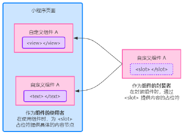
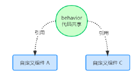

# 目标：

* 知道如何自定义小程序组件
* 知道组件中的 behaviors 的作用
* 知道如何安装与配置 vant-weapp 组件库
* 知道如何使用 MobX 实现全局数据共享
* 知道如何对 API 进行 Promise 化

# 1. 自定义组件

### 1.1 组件的创建与引用

#### 1. 创建组件

* 在根目录下，创建`components`文件夹
* `components`文件夹右键点击`新建 component`
* 每个组件有 4 个文件，分别是`.js`、`.json`、`.wxss`、`.wxml`

推荐将不同组件放在不同的文件夹中：


#### 2. 引用组件

组件的引用方式有两种：

* 局部引用：组件只能在当前引用的页面中使用
* 全局引用：组件可以在每个小程序页面中使用

#### 3. 局部引用组件

在页面的`.json`配置文件中引用组件

```json
{
    "usingComponents": {
        "my-test01": "/components/test1/test"
    }
}
```

```html
<!-- WXML -->
<my-test01></my-test01>
```

#### 4. 全局引用组件

在`app.json`中引用组件，这样所有的小程序页面都可以使用组件

```json
{
    "pages": {},
    "window": {},
    "usingComponents": {
        "my-test02": "/components/test2/test"
    }
}
```

#### 5. 全局与局部的引用场景

根据组件的**使用频率**和**范围**，来选择合适的引用方式：

* 如何某个组件在多个页面中经常用到，建议使用全局引用
* 如果某个组件只在特定的页面中才用到，建议使用局部引用

#### 6. 组件和页面的区别

从表面来看，组件和页面都是由4个文件组成的，但是组件和页面的文件有明显不同：

* 组件的`.json`文件需要声明：`"component": true`
* 组件的`.js`文件调用的是`Component()`函数
* 组件的事件处理函数集中在`methods`节点中

### 1.2 样式

#### 1. 组件样式隔离

默认情况下，自定义组件的样式只能对当前组件有效，不会影响其他组件的 UI 结构

* 组件 A 的样式不会影响组件 B 的样式
* 组件 A 的样式不会影响小程序的样式
* 小程序的样式不会影响组件的样式

#### 2. 组件样式隔离的注意点

* `app.wxss`的全局样式对于组件无效
* 只有`class`选择器有样式隔离效果，id、属性、标签选择器不会有影响

建议：在组件和引用组件的页面中建议***使用 class 选择器***不要使用 ID、属性、标签选择器

#### 3. 修改组件的样式隔离选项

默认情况下，组件样式隔离开启，如果想要外界控制组件的样式，那么可以通过`stylesolation`修改组件的样式隔离选项

```js
// 在 组件.js 中
Component({
    options: {
        // isolated：开启隔离
        styleIsolation: "isolated",
        // apply-shard：外部可以影响组件样式，组件样式不会影响外部样式
        styleIsolation: "apply-shared",
        // shared：组件与外部的样式可以互相影响
        styleIsolation: "shared"
    }
})
```

或在`组件.json`中

```json
{
    "styleIsolation": "isolated",
    "styleIsolation": "apply-shared",
    "styleIsolation": "shared"
}
```

#### 4. styleIsloation 的可选值

| 可选值       | 默认值 | 描述                                                 |
| ------------ | ------ | ---------------------------------------------------- |
| isolated     | 是     | 启动样式隔离                                         |
| apply-shared | 否     | 页面的样式可以影响组件样式，组件样式无法影响页面样式 |
| shared       | 否     | 页面与组件之间的样式互相影响                         |

### 1.3 数据、方法与属性

#### 1. data 数据

在小程序组件中，用于组件模板渲染的**私有数据**，需要定义在 data 节点下：

```js
Component({
    // 组件的初始数据
    data: {
        count: 0
    }
})
```

#### 2. methods 方法

在小程序组件中，事件的处理函数与自定义函数需要定义在 methods 节点中：

```js
Component({
    // 包括事件处理函数与自定义函数
    methods: {
        // 事件处理函数
        addCount() {
            this.setData({
                count: this.data.count + 1
            })
            this._showCount()
        },
        // 自定义函数建议以 _ 开头
        _showCount() {
            wx.showToast({
                title: "count的值为：" + this.data.conut,
                icon: "none"
            })
        }
    }
})
```

#### 3. properties 属性

在小程序组件中，properties 是组件的对外属性，用来接收外界传入组件的值：

```js
// 组件.js
Component({
    properties: {
        // 完整的定义属性方式【带有默认值】
        max: {
            // 属性值的类型
            type: Number,
            // 属性默认值
            value: 10
        },
        // 简略版的定义定义属性方式【不带有默认值】
        max: Number
    },
    // 如何使用？
    this.properties.max
})
```

```html
<!-- 外界引入组件，传入属性 -->
<my-component max="10"></my-component>
```

#### 4. data 与 properties 的区别

在小程序的组件中，properties 属性和 data 数据的用法是相同的，他们都是**可读可写**的，但是：

* data 更倾向于储存组件的私有属性
* properties 更倾向于储存外界传递过来的数据

* data 和 properties 都储存在了同一个对象上

```js
Component({
	methods: {
        showInfo() {
            console.log(this.data === this.properties)  // true
        }
    }
})
```

#### 5. 使用 setData 修改 properties 的值

由于 data 与 properties 没有区别，所以可以使用`this.setData()`来修改 properties 的值：

```html
<!-- 组件.wxml -->
<view> 最大值：{{max}} </view>
```

```js
// 组件.js
Component({
    properties: {
        max: Number
    },
    methods: {
        addMax() {
            this.setData({
                max: this.properties.max + 1
			})
        }
    }
})
```

### 1.4 数据监听器

#### 1. 什么是数据监听器

数据监听器用于监听和响应任何属性和数据字段的变化，从而执行特定的操作。类似于 Vue 中的`watch`侦听器

```js
Component({
    observers: {
        "字段A, 字段B": function (字段A的值, 字段B的值) {
            // doSomthing...
        }
    }
})
```

#### 2. 数据监听器的基本用法

 ```html
 <!-- 组件的 UI 结构 -->
 <view>{{n1}} * {{n2}} = {{sum}}</view>
 <button bindtap="addN1">n1自增</button>
 <button bindtap="addN2">n2自增</button>
 ```

```js
// 组件的 JS 文件
Component({
    data: {
        n1: 0,
        n2: 0,
        sum: 0
    },
    methods: {
        addN1() {
            this.setData({
                n1: this.data.n1 + 1
            })
        },
        addN2() {
            this.setData({
                n2: this.data.n2 + 1
            })
        },
    },
    observers: {
        'n1, n2': function(n1, n2) {
            this.setData({
                // 通过监听器自动计算 sum 的值
                sum: n1 + n2
            })
        }
    }
})
```

#### 3. 监听对象属性的变化

数据监听器支持监听对象中单个或者多个属性的变化，示例语法如下：

```js
Component({
    observers: {
        "对象.属性A, 对象.属性B": function(属性A的新值, 属性B的新值) {
            // 触发此监听器的 3 种情况：
            // 【为属性赋值】使用 setData(属性值 = )
            // 【直接为对象赋值】使用 setData(对象 = 0)
        }
    }
})
```

#### 4. 监听对象中所有属性的变化

如果某个对象需要监听的属性太多，为了方便可以使用通配符`**`来监听对象中所有属性的变化：

```js
Component({
    observers: {
        "obj.**": function(newObj) {
            //newObj就是所有新值的集合
        }
    }
})
```

### 1.5 纯数据字段

#### 1. 什么是纯数据字段

概念：纯数据字段指的是那些**不用于界面渲染**的 data 字段。

应用场景：某些 data 的字段既不会渲染在页面中，也不会传递给其他组件，这个时候这个字段就可以作为纯数据字段

好处：纯数据字段**可以提高页面更新的性能**

#### 2. 使用规则

在`Component`构造器的`options`节点种，指定`pureDataPattern`为一个正则表达式，字段名符合这个正则表达式的字段就将会成为纯数据字段：

```js
Component({
    options: {
        // 指定 _ 开头的字段为纯数据字段
        pureDataPattern: /^_/
    },
    data: {
        // a 不是纯数据字段
        a: '0',
        // _a 是纯数据字段
        _a: '0',
    }
})
```

### 1.6 组件的生命周期

#### 1. 组件全部的生命周期函数

标 <span style="color: red">*</span> 为常用

| 生命周期函数                              | 参数         | 描述说明                                 |
| ----------------------------------------- | ------------ | ---------------------------------------- |
| created<span style="color: red">*</span>  | 无           | 在组件实例**刚刚被创建时**被执行         |
| attached<span style="color: red">*</span> | 无           | 在组件实例**进入页面节点树**时执行       |
| ready                                     | 无           | 在组件在视图层布局完毕后执行             |
| moved                                     | 无           | 在组件实例被移动到节点树另一个位置时执行 |
| detached<span style="color: red">*</span> | 无           | 在组件实例**被移除页面节点时**执行       |
| error                                     | Object Error | 每当组件方法抛出错误时执行               |

#### 2. 组件主要的生命周期函数

在小程序组件中，最主要的生命周期函数为`created`、`attached`、`detached`，他们的特点如下：

* `created`：在组件实例刚被创建好时，会触发此函数
  * 此时还不能调用`setData`
  * 通常在这个阶段，只应该用于给组件的`this`添加一些自定义属性或方法
* `attached`：在组件完全初始化完成后，进入页面节点树后触发
  * 此时，`this.data`初始化完毕
  * 这个生命周期函数很有用，大部分的初始化工作都在这个函数中进行（例如请求初始数据）
* `detached`：在组件离开页面节点树时，会触发此函数
  * 当退出一个页面时，会触发该页面的所有组件的`detached`生命周期函数
  * 在该函数中可以做一些清理性质的工作

#### 3. lifetimes 节点

在小程序组件中，生命周期函数可以直接定义在`Component`构造函数的第一级参数种，可以在`lifetimes`字段内进行声明（**这种是官方推荐方式，优先级最高**）

```js
Component({
    lifetimes: {
        attached: function() {
            // 在组件实例进入页面节点树时执行
        },
        detached: function() {
            // 在组件实例被从页面节点树移除时执行
        },
    },
    // 以下是旧式的定义方式，可以保持对 <2.2.3 版本基础库的兼容
    attached: function() {
        // 在组件实例进入页面节点树时执行
    },
    detached: function() {
        // 在组件实例被从页面节点树移除时执行
    },
    // ...
})
```

### 1.7 组件所在页面的生命周期

#### 1. 什么是组件所在页面的生命周期

有时，自定义组件需要依赖页面的状态变化，此时就需要用到组件所在页面的生命周期

组件所在页面的生命周期函数有如下 3 个：

| 生命周期函数 | 参数        | 描述                     |
| ------------ | ----------- | ------------------------ |
| show         | 无          | 组件所在页面展示         |
| hide         | 无          | 组件所在页面隐藏         |
| resize       | Object Size | 组件所在页面尺寸发生变化 |

#### 2. pageLifetimes 节点

组件所在页面的生命周期函数，需要定义在组件的`pageLifetimes`节点中

```js
Component({
  pageLifetimes: {
    show: function() {
      // 页面被展示
    },
    hide: function() {
      // 页面被隐藏
    },
    resize: function(size) {
      // 页面尺寸变化
    }
  }
})
```

### 1.8 插槽

#### 1. 什么是插槽

在自定义的 WXML 结构中，可以提供一个`<slot>`节点（插槽），用于承载组件使用者提供的 WXML 结构



#### 2. 单个插槽

小程序默认每个组件只能使用一个`<slot>`进行占位，这种情况就是单个插槽

```html
<!-- 组件的封装者 -->
<view>
    <view>这是组件的内部节点</view>
    <!-- 对于不确定的内容，可以使用 slot 进行占位，具体内容需要调用者确定 -->
    <slot></slot>
</view>

<!-- 组件的调用者 -->
<component-tag-name>
	<!-- 这部分会被插入到 slot 插槽位置 -->
    <view>这里是插入到 slot 插槽的内容</view>
</component-tag-name>
```

#### 3. 启用多个插槽

如果需要用到多个`<slot>`可以在组件的`.js`文件中，配置以下内容：

```js
Component({
    options: {
        multipleSlots: true // 启动多个 slot 插槽
    }
})
```

#### 4. 定义和使用多个插槽

以`name`属性来区分不同的插槽：

```html
<!-- 组件的封装者 -->
<view>
    <slot name="s1"></slot>
    <slot name="s2"></slot>
</view>

<!-- 组件的调用者 -->
<component-tag-name>
    <view slot="s1">这里插入到 s1 的 slot</view>
    <view slot="s2">这里插入到 s2 的 slot</view>
</component-tag-name>
```

### 1.9 父子组件之间的通信

#### 1. 通信的 3 种方式

* 属性绑定
  * 用于**父组件向子组件**传递数据，仅能设置 JSON 格式兼容的数据
* 事件绑定
  * 用于**子组件向父组件**传递数据，可以传递任意数据
* 获取组件实例
  * 父组件可以通过`this.selectComponent()`获取到子组件实例
  * 这样就可以访问子组件的任意属性与方法

#### 2. 属性绑定

属性绑定用于实现父向子传递数据，并仅能传递普通类型的数据，无法传递方法：

```js
// 父组件的 data 节点
data: {
    count: 0
}
```

```html
<!-- 父组件的 WXML 结构 -->
<son-component count="{{count}}"></son-component>
```

子组件在`properties`声明并接收属性

```js
// 子组件 js 
Component({
    properties: {
        count: Number
    }
})
```

#### 3. 事件绑定

事件绑定用于实现子向父传递数据，能传递任何类型的数据，使用步骤如下：

```js
// 1. 在父组件的 JS 中定义一个函数，该函数将通过事件绑定的方式传递到子组件
Component({
    methods: {
        test: function() {
            // doSomething...
        }
    }
})
```

```html
<!-- 2. 在父组件的 WXML 中，通过自定义事件的方式将函数传递 -->
<son-component bind:test="test"></son-component>
```

```js
// 3. 在子组件中，获取到自定义事件，并触发事件，将数据传递给父组件
Component({
    methods: {
        example: function() {
            // 通过 triggerEvent 来触发父组件方法
            this.triggerEvent('test', { value: '你好，父组件' })
        }
    }
})
```

```js
// 4. 在父组件的 JS 中获取到值
Component({
    methods: {
        test: function(e) {
            // 通过 e.detail 获取到子组件传递的值
            console.log(e.detail.value)   // 你好，父组件
        }
    }
})
```

#### 4. 获取组件实例

可以在父组件调用`this.selectComponent('id 或 class 选择器')`，获取到子组件实例对象

```html
<!-- 父组件 WXML -->
<son-component class="sonComponent" id="ca"></son-component>
```

```js
// 父组件 JS
getChild: function() {
    // 通过 selectComponent 来获取子组件实例
    const sonComponet = this.selectComponent('.sonComponent 或者 #ca')
    // 可以获取子组件的任意属性和方法
    sonComponent.xx()
}
```

### 1.10 behaviors

#### 1. 什么是 behaviors 

behaviors 是小程序中，用于实现组件代码共享的特性，类似于 Vue 中的`mixins`



#### 2. behaviors 的工作方式

每个 behavior 可以包含一组**属性、数据、生命周期函数和方法**。组件引用它时，它的属性、数据和方法会被合并到组件中。每个组件可以引用多个 behavior，behavior 也可以引用其它 behavior。

#### 3. 创建 behavior

调用`Behavior(Object object)`方法即可创建一个共享的 behavior 实例对象，供所有的组件使用：

```js
// 调用 Behavior() 方法，创建实例对象
// 使用 module.exports 向外暴露 behavior
module.exports = Behavior({
    // 属性节点
    properties: {},
    // 私有属性节点
    data: { user: 'aa' },
    // 事件处理函数或其他自定义方法节点
    methods: {}
    // 其他节点......
})
```

#### 4. 导入并使用 behavior

在组件中，使用`require()`方法导入需要的 behavior，挂载后即可访问 behavior 中的数据或方法，示例代码如下：

```js
// 1. 使用 require() 导入指定 behavior
const behaviorTest = require('../behaviors/test')

Component({
    // 2. 将导入的 behaviors，挂载到 behaviors 数据节点中
    behaviors: [behaviorTest],
    // 组件的其他节点...
})
```

#### 5. behavior 中所有可用的节点

| 定义段     | 类型         | 是否必填 | 描述                  |
| :--------- | :----------- | :------- | :-------------------- |
| properties | Object Map   | 否       | 同组件的属性          |
| data       | Object       | 否       | 同组件的数据          |
| methods    | Object       | 否       | 同自定义组件的方法    |
| behaviors  | String Array | 否       | 引入其它的 `behavior` |
| created    | Function     | 否       | 生命周期函数          |
| attached   | Function     | 否       | 生命周期函数          |
| ready      | Function     | 否       | 生命周期函数          |
| moved      | Function     | 否       | 生命周期函数          |
| detached   | Function     | 否       | 生命周期函数          |

#### 6. 同名字段的覆盖和组合规则*

组件和它引用的 behavior 中可以包含**同名的字段**，此时可以参考如下 3 种同名时的处理规则：

* 同名的数据字段（data）
* 同名的属性（properties）或方法（methods）
* 同名的生命周期函数

关于详细的覆盖和组合规则，可以参考微信小程序官方文档给出的说明：

https://developers.weixin.qq.com/miniprogram/dev/framework/custom-component/behaviors.html

