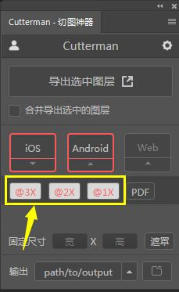
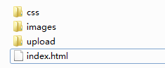

# 1. 移动端基础

### 1.1 浏览器现状

PC端常见浏览器：

360、Chrome、Firefox、Opera、Safari、Edge、IE、QQ、百度、搜狗

移动端常见浏览器：

UC、QQ、Opera、Safari、百度手机浏览器、360手机浏览器、Chrome以及各种杂牌浏览器

国内的UC、QQ等手机浏览器都是根据Webkit修改的内核，国内尚无自主研发的内核。

**总结：**兼容移动端主流浏览器，处理Webkit内核浏览器即可

### 1.2 手机屏幕现状

* 移动端设备屏幕尺寸很多，碎片化很严重
* Android 设备有多种分辨率：720x1280、1080x1920、2K屏、4K屏等等
* iPhone 设备的分辨率主要有：640x1136、750x1334、1242x2208等等
* 作为开发者无需关注分辨率，因为我们常用的单位是像素（px）

### 1.3 常见移动端屏幕尺寸及分辨率

| 移动端设备          | 屏幕尺寸（英寸） | 分辨率（px） | 设备像素比（dpr） |
| ------------------- | ---------------- | ------------ | ----------------- |
| iPhone 4/4S         | 3.5              | 640*960      | 2.0               |
| iPhone 5/5S/5C/SE   | 4.0              | 640*1136     | 2.0               |
| iPhone 6/6S/7/8     | 4.7              | 750*1334     | 2.0               |
| iPhone X/XS         | 5.8              | 1125*2436    | 3.0               |
| iPhone XR           | 6.1              | 828*1792     | 2.0               |
| Samsung Galaxy S8   | 5.0              | 1080*1920    | 4.0               |
| Samsung Galaxy S8+  | 6.2              | 1440*2960    | 4.0               |
| Nexus 9             | 8.9              | 1536*2048    | 2.0               |
| Sony Xperia Z Ultra | 6.4              | 540*960      | 2.0               |

**注意：**前端开发中，不建议大家去纠结dp、dpi、pt、ppi等数据

### 1.4 移动端调试方法

* Chrome DevTools：使用谷歌浏览器自带的模拟手机调试
* 搭建本地Web服务器，手机和服务器一个局域网内，通过手机访问服务器
* 使用外网服务器，直接IP或者域名访问

### 1.5 总结

* 移动端浏览器我们主要针对于Webkit内容进行兼容
* 我们现在开发的移动端主要针对于手机端开发
* 现在移动端碎片化严重，分辨率和屏幕尺寸各不相同
* 使用谷歌浏览器模拟手机界面进行调试

# 2. 视口

视口（viewport）就是浏览器显示页面内容的屏幕区域，视口分为布局视口、视觉视口和理想视口

### 2.1 布局视口 layout viewport

* 一般移动设备的浏览器默认设置了一个布局视口，用于解决早起PC端页面在手机上显示的问题
* IOS,Android基本都将这个视口设置为980px，所以PC上的网页大多能能在手机上显示，只不过元素看起来很小。一般默认可以通过手机缩放网页。

### 2.2 视觉视口 visual viewport

* 字面意思，它是用户正在看到的网站的区域。**注意：是网站的区域**
* 我们可以通过缩放来操作视觉视口，但不会影响布局视口。

### 2.3 理想视口 ideal viewport

* 为了使网站在移动端有最理想的浏览和阅读宽度而设定
* 理想视口，对设备来讲，是最理想的视口尺寸
* 需要手动添加meta视口标签通知浏览器操作
* meta视口标签的主要目的：布局视口的宽度应该与理想视口的宽度一致，简单理解就是设备有多宽，布局视口就有多宽。

### 2.4 总结

* 视口就是浏览器显示页面内容的屏幕区域
* 视口分为布局视口、视觉视口和理想视口
* 移动端布局想要的理想视口就是手机屏幕有多宽，布局视口就有多宽
* 想要理想视口，需要给移动端页面添加meta视口标签

### 2.5 meta视口标签

```css
<meta name="viewport" content="width=device-width, user-scalable=no, initial-scale=1.0, maximum-scale=1.0, minimum-scale=1.0">
```

| 属性          | 说明                                                 |
| ------------- | ---------------------------------------------------- |
| width         | 宽度设置的是viewport宽度，可以设置device-width特殊值 |
| initial-scale | 初始缩放比，大于0的数字                              |
| maximum-scale | 最大缩放比，大于0的数字                              |
| minimum-scale | 最小缩放比，大于0的数字                              |
| user-scalable | 用户是否可以缩放，yes或no（1或0）                    |

 ### 2.6 标准的 viewport 设置

* 视口宽度和设备保持一致
* 视口的默认缩放比例1.0
* 不允许用户自行缩放
* 最大允许缩放比例1.0
* 最小允许缩放比例1.0

# 3. 二倍图

### 3.1 物理像素&物理像素比

* 物理像素点指的是屏幕显示的最小颗粒，是物理真实存在的。
* 我们开发时候的1px不是一定等于1物理像素
* PC端页面，1px等于1物理像素，但是移动端就不同
* 1px能显示的物理像素的个数，成为物理像素比或屏幕像素比
* PC端和早期的手机屏幕/普通手机屏幕：1CSS像素 = 1物理像素 
* Retina（视网膜屏幕）是一种显示技术，可以将更多的物理像素点压缩到一块屏幕中，从而提高分辨率，并提高屏幕显示的细腻程度。

### 3.2 多倍图

* 对于一张50px * 50px的图片，在手机Retina屏中打开，按照刚才的物理像素比会放大倍数，这样会造成图片模糊
* 在标准的viewport设置中，使用倍图来提高图片质量，解决了在高清设备中的模糊问题
* 通常使用二倍图，因为iPhone6/7/8的影响，还存在3倍图4倍图的情况，这个看实际开发需求
* 背景图片注意缩放问题

### 3.3 背景缩放 background-size

background-size 属性规定背景图像的尺寸

```css
background-size: 背景图片的宽度 背景图片的高度
```

* 单位：长度（500px）|百分比（50%）|cover|contain
* `cover`：图片按照比例放大至完全覆盖背景区域，但会出现**图片不完整**的情况
* `contain`：图片按照比例放到最大，图片完整但是**背景不一定完全被覆盖**

### 3.4 多倍切图 cutterman

cutterman是一个切图工具，可以运行在PhotoShop中，快速实现原尺寸、2倍图、3倍图

**打开步骤**：安装cutterman-->进入PS->窗口-->扩展功能-->选择cutterman



上图黄色部分`@3X`等等达标图的倍数，以后看到名字带@的图片就可能代表是倍图

# 4. 移动端开发选择

### 4.1 移动端主流方案

* 单独制作移动端页面**（主流）**
* 响应式页面兼容移动端

### 4.2 单独移动端页面（主流）

通常情况下，网址域名前面加m(mobile)可以打开移动端。通过判断设备，如果是移动端设备打开，则PC端网址跳转到移动端网址。

### 4.3 响应式兼容PC移动端

通过判断屏幕的宽度来改变页面的样式。

**缺点**：制作麻烦，需要花很大精力去调兼容性问题

# 5. 移动端技术解决方案

### 5.1 移动端浏览器

移动端浏览器基本以 webkit 内核为主，因此我们就考虑 webkit 兼容问题

由于 webkit 内核对于 H5C3 支持较好，所以我们可以放心用 H5C3

我们在添加浏览器私有前缀时只需要考虑添加 webkit 即可

### 5.2 CSS初始化 normalize.css

* 保护了有价值的默认值
* 修复了浏览器的bug
* 是模块化的
* 拥有详细的文档

地址：http://necolas.github.io/normalize.css/

### 5.3 CSS3 盒子模型 box-sizing

* 传统模式宽度计算：盒子的宽度=CSS设置的width+border+padding
* CSS3模式款速计算：盒子的宽度=CSS设置的width（包含了border+padding）

也就是说，CSS3中的盒子模型，**padding和border不会撑大盒子了**

```css
/* CSS3盒子模型 */
box-sizing: border-box;
/* 传统盒子模型 */
box-sizing: content-box;
```

传统 or C3盒子模型？

* 移动端可以全部使用C3盒子模型
* PC端如果需要完全兼容，就用传统盒子模型，若不考虑兼容性，可以使用C3盒子模型

### 5.4 特殊样式

```css
/* CSS3盒子模型 */
box-sizing: border-box;
-webkit-box-sizing: border-box;
/* 清除移动端长按链接背景会变色  设置为transparent透明*/
-webkit-tap-highlight-color: transparent;
/* 清除ios端给input的特殊样式 */
-webkit-appearance: none;
/* 禁用长按页面时的弹出菜单 */
img,a{
    -webkit-touch-callout: none;
}
```

# 6. 移动端常见布局

### 6.1 移动端技术选型

移动端布局和PC端有所区别：

##### 6.1.1 单独制作移动端页面（主流）

* 流式布局（百分比布局）
* flex 弹性布局（**强烈推荐**）
* less+rem+媒体查询布局
* 混合布局

##### 6.1.2 响应式页面（其次）

* 媒体查询
* bootstrap

### 6.2 流式布局（百分比布局）

* 流式布局，就是百分比布局，也称非固定像素布局
* 通过盒子的宽度设置为百分比来根据屏幕的宽度进行伸缩，不受限制
* 流式布局是移动web开发中使用的比较常见的布局方式
* `max-width`：最大宽度（`max-height`：最大高度）
* `min-width`：最小宽度（`min-height`：最小高度）

# 7.  案例：京东移动端首页

### 7.1 技术选型

流式布局（百分比布局）

### 7.2 搭建框架



css：存放css文件

images：存放背景图片

upload：存放产品图片

### 7.3 设置视口标签以及引入初始化样式

```css
<meta name="viewport" content="width=device-width, user-scalable=no, initial-scale=1.0, maximum-scale=1.0, minimum-scale=1.0" />

<link rel="stylesheet" href="css/index.css" />
<link rel="stylesheet" href="css/normalize.css" />
```

### 7.4 常见样式

```css
body {
    width: 100%;
    min-width: 320px;
    max-width: 640px;
    margin: 0 auto;
    font-size: 14px;
    font-family: -apple-system, Helvetica, sans-serif;
    color: #666;
    line-height: 1.5;
}
```

### 7.5 二倍精灵图做法

* 将精灵图等比例缩放至原来的一半

* 根据大小测量坐标

* 注意代码中的background-size也要写：精灵图原来的宽的一半

**什么是精灵图？**

将多个图片放到一张大的图片上，这样有效减少服务器的负载 

### 7.6 图片格式

**DPG图片压缩技术**

京东自主研发推出DPG图片压缩技术，经测试该技术，可直接节省用户近50%的浏览流量，极大的提升了用户的网页打开速度。能够兼容jpeg，实现全平台、全部浏览器的兼容支持。经过内部和外部上万张图片的人眼浏览测试后发现，压缩后的图片和webp的清晰度对比没有差距。

**webp格式图片**

谷歌开发的一种旨在加快图片加载速度的图片格式。图片压缩体积大约只有jpeg的2/3，并能节省大量的服务器宽带资源和数据空间。

