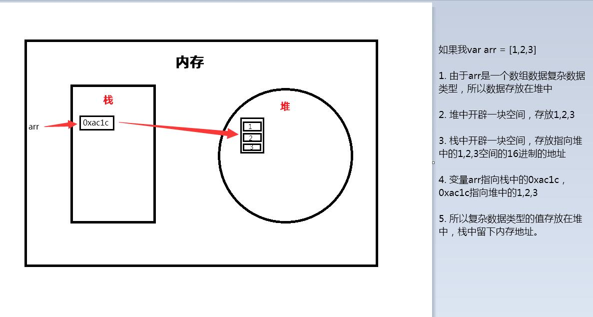

# 目标：

* 能够说出简单数据类型的内存分配
* 能够说出复杂数据类型的内存分配
* 能够说出简单类型如何传参
* 能过说出复杂类型如何传参

# 1. 简单类型和复杂类型

简单类型又叫做基本数据类型或者**值类型**，复杂类型又叫做**引用类型**。

> 值类型：简单数据类型/基本数据类型，在存储时变量中存储的是值本身，因此叫做值类型

string、number、boolean、undefined、null

```javascript
// 简单数据类型null   返回的是一个空对象，object
var timer = null;
console.log(typeof timer);
// 如果有个变量以后用来储存对象，但是没想好储存什么，这个时候可以先给这个变量null值
```

> 引用类型：复杂数据类型，在存储时变量存储的仅仅是地址（引用），因此叫做引用数据类型

通过使用`new`关键字创建的对象（系统对象、自定义对象），如Object、Array、Date等

# 2. 堆和栈

堆和栈分配区别：

> 栈（操作系统）：由操作系统自动分配释放存放函数的参数值、局部变量的值等。其操作方式类似于数据结构中的栈

简单数据类型的**值**存放到栈中

> 堆（程序员）：存放复杂类型（对象），一般由程序员分配释放，若程序员不释放，由垃圾回收机制回收。

**复杂数据类型存放到堆中**

注意：JS中没有堆栈的概念，通过堆栈的方式，可以更容易理解代码的一些执行方式

# 3. 简单类型的内存分配

值类型（简单数据类型）：string、number、boolean、undefined、null

值类型变量的值储存在栈中

> 1. 创建一个变量str值为18：var str = '18'
> 2. 在**栈**中开辟空间存储值'18'
> 3. 变量str指向18这个内存空间

# 4. 复杂类型的内存分配

复杂数据类型（对象）的值存放在堆中



# 5. 简单类型传参

函数的形参也可以看做是一个变量，但我们把一个值类型变量作为参数传给函数的形参时，其实是把变量在栈空间的值复制一份给形参，那么在方法内部对形参做任何更改，都不会影响到方法外部的变量

```javascript
function fn(a) {
    a += 10;
    console.log(a);
}
var num = 1;
fn(num); // 11
console.log(num); // 外部的变量没有发生改变，仍然是1
```

> 1. 执行 var num =1;在栈开辟一块空间，值是1，num指向1
> 2. 执行fn()，将num作为实参传递给fn()，此时形参a的值就是fn
> 3. 注意，这一步是将num的值复制了一份给了a，而不是形参a指向了栈中的1
> 4. 所以形参a加10，但是num没有动，还是1。

# 6. 复杂类型传参

```javascript
function Person(name) {
    this.name = name;
}

function f1(x) {
    console.log(x.name); // 2.这个输出什么？
    x.name = "张学友";
    console.log(x.name); // 3. 这个输出什么？
}

var p = new Person("刘德华");
console.log(p.name); // 1. 这个输出什么？
f1(p);
console.log(p.name); // 4. 这个输出什么？
```


 * p就是一个Person对象，name属性是刘德华，所以1输出刘德华
 * 执行方法，将Person实例p传给形参x，此时x接收到p传递的内存地址，所以它们都指向了同一个空间
 * 2这里name属性是刘德华，所以输出刘德华
 * 此时更改了name属性值，就相当于更改了堆中的属性，所以3这里输出张学友
 * 由于更改了name属性值，所以4这里也输出张学友

> 输出：刘德华、刘德华、张学友、张学友