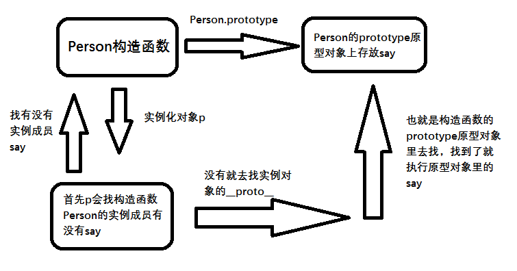
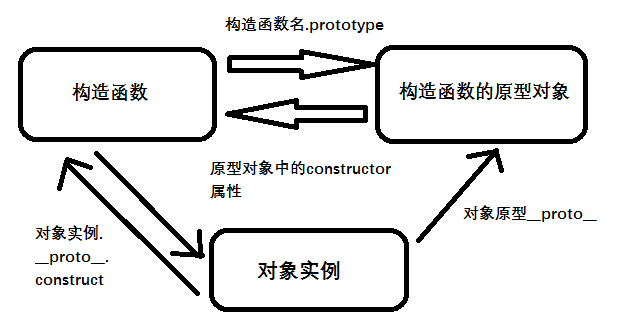
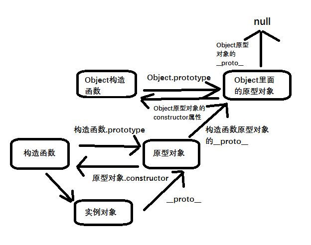
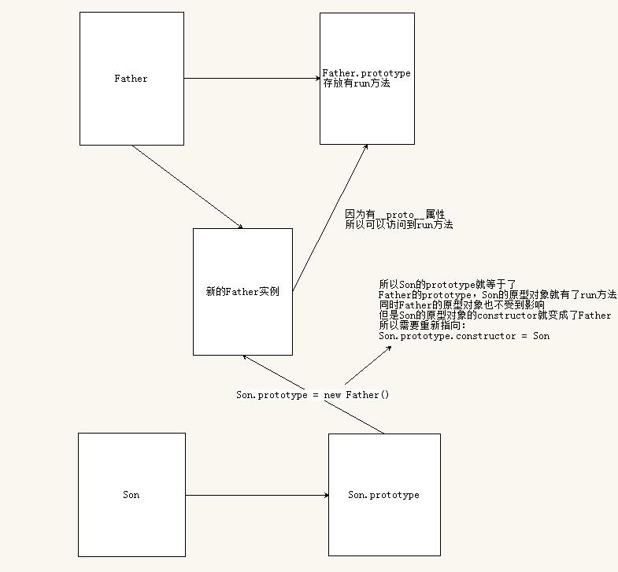
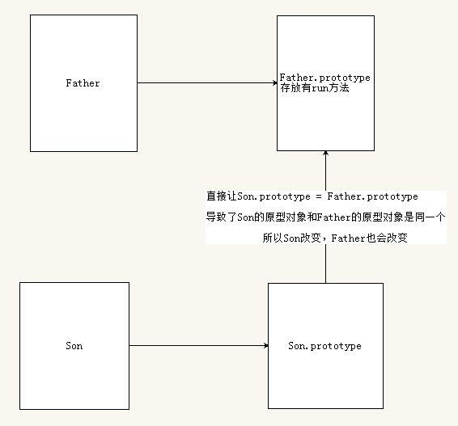

# 目标

* 能够使用构造函数创建对象
* 能够说出原型的作用
* 能够说出访问对象成员的规则
* 能够使用ES5新增的一些方法

# 1. 构造函数和原型

### 1.1 概述

在典型的OOP语言中（如Java），都存在类的概念。类就是对象的模板，对象是类的实例。但在ES6之前，JS并没有引入类的概念。

ES6，全称`ECMAScript 6.0`，2015.06发版。但是目前的浏览器的JS版本都是ES5版本，大多数高版本的浏览器也支持ES6，不过只实现了ES6的部分特性和功能。

创建对象可以通过以下三种方式：

* 对象字面量
* `new Object()`
* 自定义构造函数

### 1.2 构造函数

构造函数是一种特殊的函数，主要用于初始化对象，即为对象成员变量赋初始值，它总与`new`一起使用。我们可以把对象中的一些公共属性和方法抽取出来，然后封装到这个函数中。

在JS中，我们创建构造函数需要注意以下两点：

* 构造函数用于创建某一类对象，`首字母大写`
* 构造函数要和`new`一起使用才有意义

```javascript
// 用构造函数创建对象
function Person(uname, age) {
    this.uname = uname;
    this.age = age;
    this.say = function() {
        console.log("hello!" + this.uname);
    };
}
var p = new Person("alex", 18);
var p2 = new Person("tom", 19);
p.say();
p2.say();
```

##### new在执行时会做四件事情

1. 在内存中创建一个新的空对象
2. 让`this`指向这个新对象
3. 执行构造函数里面的代码，给这个新对象添加属性和方法
4. 返回这个新对象（所以构造函数不需要用`return`）

##### 静态成员和实例成员

JS中的构造函数可以添加一些成员，可以在构造函数本身添加，也可以在构造函数内部的`this`上添加。通过这两种方式添加的成员，就分别称为`静态成员`和`实例成员`。

> 静态成员

在构造函数本身上添加的成员称为`静态成员`，只能由`构造函数本身`来访问

> 实例成员

在构造函数内部创建的对象成员称为`实例成员`，只能由`实例化的对象`来访问

```javascript
function Person(uname, age) {
    this.uname = uname;
    this.age = age;
    this.say = function() {
        console.log("hello");
    };
    sex = "male";
}
// uname age say 是实例成员，只能实例对象来访问
// sex 是静态成员，只能构造函数本身来访问
```

### 1.3 构造函数的问题

构造函数很好用，但是会存在`浪费内存`的问题。

```javascript
function Person(uname, age) {
    this.uname = uname;
    this.age = age;
    this.say = function() {
        console.log("hello!" + this.uname);
    };
}
var p = new Person("alex", 18);
var p2 = new Person("tom", 19);
```

> 上面我们创建了两个实例对象：p和p2
>
> 每次创建一个实例对象，都会在内存中开辟一块空间，uname和age都是简单数据类型，所以直接赋值就行。但是say这是一个函数，是复杂数据类型，所以会再开辟一块内存空间用于储存函数。这里我们就能看到，p开辟了一块储存函数的空间，p2也开辟了。但是这两个储存的函数是同一个函数。如果我们有100个实例对象，就会有100个储存相同函数的内存空间，是不是就造成了内存浪费呢？

### 1.4 构造函数原型 prototype

构造函数通过原型分配的函数是所有对象所`共享`的。

JS规定，`每个构造函数都有一个prototype属性`，指向另一个对象。注意这里的prototype是一个`对象`。这个对象的所有属性和方法，都会被构造函数所拥有。

我们可以把`不变的方法`，直接定义在`prototype上`，这样所有的实例都可以`共享`这些方法，避免造成内存浪费。

> 原型是什么？

一个对象，我们也称为`prototype`是`原型对象`

> 原型的作用是什么？

共享方法

### 1.5 对象原型  ` __proto__`

对象都会有一个属性`__proto__`指向构造函数的`prototype`原型对象，之所以我们对象可以使用构造函数`prototype`原型对象的属性和方法，其实就是因为对象有`__proto__`原型的存在

> `__proto__`对象原型和原型对象`prototype`是等价的



> `__proto__`对象原型，`prototype`原型对象

`__proto__`的意义在于为对象的查找机制提供一个方向，或者说一条路线。但是它是一个`非标准`属性，因此在实际开发中，`不可以`使用。它只是内部指向原型对象`prototype`

### 1.6 constructor 属性

对象原型`__proto__`和构造函数原型对象`prototype`里面都有一个`constrctor`属性，`constrcror`我们称为构造函数，因为它指向构造函数本身。

`constructor`主要用于记录该对象引用于哪个构造函数，它可以让原型对象重新指向原来的构造函数

很多情况下我们需要手动利用constructor属性，指回原来的构造函数

```javascript
Person.prototype = {
    constructor: Person,
    say: function() {
        console.log("hello!" + this.uname);
    },
    walk: function() {
        console.log("I can walk");
    },
};
```

如果我们修改了原来的原型对象，给原型对象赋值了一个新的对象，这个时候需要手动添加一个`constructor属性`指向原来的构造函数

### 1.7 构造函数、实例、原型对象三者之间的关系



### 1.8 原型链



### 1.9 JavaScript的成员查找机制（规则）

1. 当访问一个对象的属性（包括方法）时，首先查找`对象本身`有没有该属性
2. 如果没有就查找该对象的原型（也就是`__proto__`指向的构造函数的原型对象`prototype`）
3. 如果还没有就查找原型对象的原型（`Object的原型对象`）
4. 最后一直找到`Object的原型对象的__proto__`（也就是`null`）
5. `__proto__`对象原型的意义在于为`对象成员查找机制`提供一个方向，或者说一条路线

### 1.10 原型对象中的this指向问题

在`构造函数`中，this指向`创建的对象实例本身`。

在`原型对象`中，this也指向`创建的对象实例`。

### 1.11 扩展内置对象

可以通过原型对象，对原来的内置对象进行扩展自定义的方法，比如给数组增加自定义求偶数和的功能。

```javascript
// 原型对象的应用：扩展内置对象的方法
Array.prototype.getSum = function() {
    var sum = 0;
    for (var i = 0; i < this.length; i++) {
        sum += this[i];
    }
    return sum;
};
var arr = [1, 2, 3];
console.log(arr.getSum());
```

# 2. 继承

ES6之前并没有给我们提供`extends`继承，我们可以通过`构造函数+原型对象`模拟实现继承，被称为组合继承。

### 2.1 call()

作用：调用这个函数，并且修改函数运行时的`this`的指向

```javascript
fun.call(thisArg, arg1, arg2, ...)
```

* thisArg：当前调用函数`this`的指向对象
* arg1, arg2：传递的普通参数

### 2.2 借用父构造函数继承属性

```javascript
// 1. 父构造函数
function Father(uname, age) {
    // this 指向父构造函数的对象实例
    this.uname = uname;
    this.age = age;
}
// 2. 子构造函数
function Son(uname, age) {
    // this指向子构造函数的对象实例
    // 让父构造函数的this改成子构造函数的this
    Father.call(this, uname, age);
}
var son = new Son("alex", 18);
console.log(son);  // 所以这里的son就有了uname和age属性了
```

### 2.3 继承方法

```javascript
function Father(uname, age) {
    this.uname = uname;
    this.age = age;
}
// 添加方法
Father.prototype.run = function() {
    console.log("I can run!!!");
};

function Son(uname, age) {
    Father.call(this, uname, age);
}
// 1. 这样直接赋值会有问题，如果修改了子原型对象，父原型对象也会跟着改变
// Son.prototype = Father.prototype;

// 2. 需要用这种方式
Son.prototype = new Father();
// 但是用这种方式，Son的prototype.construtor指向的是Father，需要重新指向一下
Son.prototype.constructor = Son;
// 子构造函数独有的
Son.prototype.exam = function() {
    console.log("孩子要考试");
};
var son = new Son("alex", 18);
console.log(son); // 此时son里面有自己的exam方法，也有父亲的run方法
```

##### 解释一下：Son.prototype = new Father();



##### 为什么不能直接Son.prototype = Father.prototype



# 3. ES5中的新增方法

### 3.1 ES5 新增方法概述

ES5中给我们新增了一些方法，可以很方便的操作数组或者字符串，这些方法主要包括：

* 数组方法
* 字符串方法
* 对象方法

### 3.2 数组方法

迭代（遍历）方法：`forEach()`、`map()`、`filter`、`some()`、`every()`

##### 1. forEach

> 描述：

`forEach()`方法用于迭代数组

> 语法：

```javascript
array.forEach(function(currentValue, index, arr))
```

* currentValue：数组当前项的值
* index：数组当前项的索引
* arr：数组对象本身

> 代码：

```javascript
var arr = [1, 2, 3];
arr.forEach(function(value, index, array) {
    console.log("每个数组元素的值：" + value);
    console.log("每个数组元素的下标：" + index);
    console.log("数组本身：" + array);
});
```

##### 2. map

> 描述：

`map()`用于遍历数组，可用来转换数组元素和`forEach`用法基本相同

> forEach和map的区别

* `forEach`没有返回值，`map`返回新数组
* `forEach`会改变原数组的值，`map`不会
* `map`的执行速度要比`forEach`要快
* 如果改变元素的值，建议使用`map`，如果单纯遍历元素，建议使用`forEach`
* 这两者都不能使用`break`中断循环

##### 3. filter

> 描述：

`filter()`创建一个新的数组，新数组的元素是通过`筛选数组`得到的。它返回一个`新数组`

> 语法：

```javascript
array.filter(function(currentValue, index, arr))
```

* currentValue：数组当前项的值
* index：数组当前项的索引
* arr：数组对象本身

> 代码：

```javascript
var arr = [1, 22, 3, 55];
var newArr = arr.filter(function(value, index, array) {
    return value >= 20;
});
console.log(newArr);  // [22, 55]
```

##### 4. some

> 描述：

`some()`方法用于检测数组中的元素是否满足指定条件，简单来说就是查找是否有满足条件的数组元素

`some()`返回`布尔值`，如果存在满足条件的元素返回`true`，不存在返回`false`

如果找到第一个满足条件的元素，就终止循环，不在就继续查找

> 语法：

```javascript
array.some(function(currentValue, index, arr))
```

* currentValue：数组当前项的值
* index：数组当前项的索引
* arr：数组对象本身

> 代码：

```javascript
var arr = [10, 30, 22, 5];
var flag = arr.some(function(value) {
    return value <= 5;
});
console.log(flag);
```

##### 5. every

> 描述：

`every`用法基本与`some`相同，不同点在于：

* `some`是只要有`一个`元素满足条件，就返回`true`，并中断循环
* `every`是`全部`的元素满足条件，才会返回`true`。只要一个元素不满足，就中断循环

##### 6. forEach和some的区别

* 在some里面遇到`return true`即中断循环，效率最高
* 而`forEach`就不会中断循环，也无法使用`break`
* 所以如果只想找到一个值，那么`some`是效率最高的选择

