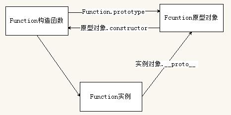

# 目标

* 能够说出函数的多种定义和调用方式
* 能够说出和改变函数内部的`this`指向
* 能够说出严格模式的特点
* 能够把函数作为参数和返回值传递
* 能够说出闭包的作用
* 能够说出递归的两个条件
* 能够说出深拷贝和浅拷贝的区别

# 1. 函数的定义和调用

### 1.1 函数的定义方式

* 函数声明方式`function`关键字（命名函数）

* 函数表达式（`匿名函数`）

* 利用`new Function('参数1', '参数2', ..., '函数体')`创建函数（这个方法很少使用）

  ```javascript
  var fn = new Function('参数1','参数2',...,'函数体') // 参数一定要是字符串类型
  ```

> 注意：所有的函数都是 Function 的实例（对象）



### 1.2 函数的调用方式

* 普通函数
* 对象的方法
* 构造函数
* 绑定事件函数
* 定时器函数
* 立即执行函数

##### 1. 普通函数

```javascript
function fn() {
    console.log("hello");
}
```

> 调用：`fn()`或者`fn.call()`

##### 2. 对象的方法

```javascript
function fn() {
    var obj = {
        hello: function() {
        console.log("hello");
        },
    };
}
```

> 调用：`obj.hello()`

##### 3. 构造函数

```javascript
function Person(age) {
    this.age = age;
}
```

> 调用：`new Person()`

##### 4. 绑定事件函数

```javascript
btn.onclick = function() {
    console.log("hello");
};
```

> 调用：触发事件即可调用

##### 5. 定时器函数

```javascript
setTimeout(function() {
    console.log("hello");
}, 1000);
```

> 调用：定时器触发调用

##### 6. 立即执行函数

```javascript
(function() {
    console.log("hello");
})();
```

> 调用：不需要调用，自己即可执行

# 2. this

### 2.1 函数内部的this指向

这些`this`的指向，是当我们调用函数的时候确定的。调用方式的不同决定了`this`的指向不同。一般指向我们的`调用者`

| 调用方式     | this指向                                  |
| ------------ | ----------------------------------------- |
| 普通函数调用 | window                                    |
| 构造函数调用 | 实例对象 原型对象里面的方法也指向实例对象 |
| 对象方法调用 | 该方法所属的对象                          |
| 事件绑定方法 | 绑定事件对象                              |
| 定时器函数   | window                                    |
| 立即执行函数 | window                                    |

### 2.2 改变函数内部的this指向

JS为我们提供了一些函数来帮助我们处理函数的内部`this`的指向问题，常用的有`call()`、`bind()`和`apply()`

##### 1. call

 `call()`方法`调用`一个对象。简单理解为调用函数的方式，但是它可以改变函数的 this 指向。

```javascript
fun.call(thisArg, arg1, arg2, ...);
```

我们还可使用`call`来实现`继承`

##### 2. bind

`bin()`方法`不会调用`函数，但是能改变函数里面的 this 指向

```javascript
fun.bind(thisArg, arg1, arg2)
```

* thisArg：在fun函数运行时指定的`this`值
* arg1, arg2：传递的其他参数
* 返回由指定的this值和初始化参数改造的`原函数的拷贝`

##### 3. apply

 `apply()`方法`调用`一个对象。简单理解为调用函数的方式，但是它可以改变函数的 this 指向。

```javascript
fun.apply(thisArg, [argsArray]);
```

* thisArg：在fun函数运行时指定的`this`值
* argsArray：传递的值，比如包含在`数组`种
* 返回值就是`函数的返回值`，因为它的调用函数

> apply的主要应用

我们可以用`apply`借助于数学内置对象求最大值

```javascript
var arr = [1, 22, 33, 5, 7, 9];
console.log(Math.max.apply(Math, arr));
```

##### 4. bind的使用场景

如果有的函数我们不需要立即调用，但是又想改变这个函数内部的`this指向`，此时使用`bind`方法最合适

> 例子：

```javascript
var btn = document.querySelector("button");
btn.addEventListener("click", function() {
    this.disabled = true;
    setTimeout(
        function() {
            // 但是由于我们的定时器的this指向的是window，所以需要我们手动更改一下
            this.disabled = false;
        }.bind(this), // 所以我们要手动更改
        3000
    );
});
```

### 2.3 call apply bind 总结

##### 相同点：

都可以改变函数内部的`this`指向

##### 区别点：

1. `call`和`apply`会调用函数，并改变函数的`this`指向
2. `call`和`apply`传递的参数不同，`call`传递参数`aru1`,`aru2`...。但是`apply`必须`数组`格式
3. `bind`不会调用函数，可以改变函数内部的`this`指向（不会改变原函数，会返回一个改变指数的`原函数拷贝`）

##### 主要应用场景：

1. `call`经常做`继承`
2. `apply`经常和`数组`有关系，比如借助于数学对象实现数组最大值和最小值
3. `bind`由于不调用函数，所以有时候我们可以更改`定时器`内部的this

# 3. 严格模式

### 3.1 什么是严格模式

JS除了提供正常模式外，还提供了`严格模式(strict mode)`。ES5的严格模式是采用具有先执行的JavaScript变体的一种方式，即在严格的条件下运行JS代码。

严格模式在`IE10+`版本支持，旧版本浏览器会直接忽略

严格模式对正常的JavaScript语法做了一些更改：

1. 消除了JS语法的一些不合理、不严谨之处，减少了一些怪异行为
2. 消除了代码运行的一些不安全之处，保证代码运行的安全
3. 提高编译器效率，增加运行速度
4. 禁用了在EMCAScript的未来版本中可能会定义的一些语法，为未来版本做好铺垫。比如一些保留字如：`class`、`enum`、`export`、`extends`、`import`、`super`不能做变量名。

### 3.2 开启严格模式

严格模式可以应用到`整个脚本`或者`个别函数`中。因此在使用时，我们可以把严格模式区分为`为脚本打开严格模式`和`为函数打开严格模式`两种情况

##### 1. 为脚本开启严格模式

为整个脚本文件开启严格模式。需要在所有语句前加上特定语句`"use strict";`或者`'use strict';`

但是有的JS文件是严格模式，有的不是严格模式，这样不利于文件合并。所以我们可以在立即执行函数中添加开启严格模式，这样就创建了一个独立的作用域，不会污染别的JS文件

```javascript
(function(){
    "use strict";
    // code here
})();
```

##### 2. 给某个函数开启严格模式

在函数体所有执行语句前添加`"use strict";`或`'use strict';`

```javascript
function fn() {
    // 里面的按照普通模式执行
}

function fn2() {
    "use strict";
    // 下面的代码按照严格模式执行
}
```

### 3.3 严格模式的变化

严格模式对JS的`语法`和`行为`，都做了一些改变

##### 1. 变量规定

①

在正常模式下，如果一个变量没有声明就赋值，默认是全局变量。严格模式禁止这种用法，所以变量`必须先声明`，然后才能使用

②

严禁删除已经声明的变量。例如`delete num;`这个语法是错误的。

##### 2. this 的指向问题

**①**

正常模式下全局作用域中`普通函数`的`this`指向`window`

严格模式下全局作用域中`普通函数`的`this`指向`undefined`（未指定this前）

**②**

正常模式下`构造函数`不加new`也能调用`，当普通函数，`this`指向`window`

严格模式下`构造函数`不加new`不能调用`，加new，`this`指向`实例对象`

③

严格模式下`定时器函数`的`this`仍然指向`window`

##### 3. 函数变化

①

函数里的参数`不允许有重名`情况

②

函数必须声明在顶层，新版本的JS会引入“块级作用域”（ES6中已引入），为了和新版本接轨，不允许在非函数的代码块内声明函数

```javascript
"use strict";
var a = 10;
if(a != 0){
	function fn(){};  // 语法错误 
}

for(var i=0;i<a.length;i++){
	function fn(){};  // 语法错误   
}

function fn1(){
	function fn2(){};  // 合法
}
```

更多严格模式的要求请参考：https://developer.mozilla.org/zh-CN/docs/Web/JavaScript/Reference/Strict_mode

# 4. 高阶函数

高阶函数是对其他函数进行操作的函数，它`接收函数作为参数`或者`将函数作为返回值输出`

函数也是一种数据类型，同样可以作为参数传递个另一个函数使用。最典型的就是作为回调函数。

```javascript
function fn(a, b, callback) {
    console.log(a + b);
    callback && callback();
}
fn(1, 2, function() {
    console.log("我是回调函数");
});
```

# 5. 闭包

### 5.1 变量作用域

变量根据作用域的不同，分为`全局变量`和`局部变量`

* 函数内部可以使用全局变量
* 函数外部不能使用局部变量
* 当函数执行完毕，作用域内的局部变量会销毁

### 5.2 什么是闭包

> 闭包(closure)指有权访问另一个函数作用域中变量的函数

简单来说就是，一个作用域可以访问另一个函数内部的局部变量

```javascript
// 闭包：fun函数访问了fn函数里面的局部变量num
function fn() {
    var num = 10;

    function fun() {
        console.log(num);
    }
    fun();
}
fn(); // Output: 10
```

### 5.3 闭包的作用

```javascript
function outer() {
    var num = 10;

    function inner() {
        console.log(num);
    }
    return inner; // 返回了inner这个函数对象本身
}
var f = outer(); // 因为我们的outer函数返回的是inner这个对象，所以此时变量f其实就是inner函数
console.log(f); // 这里打印的就是inner()这个函数体

f(); // 这里我们就能得到10了
```

由上面的函数，我们得到了更加简单的写法：

```javascript
function outer2() {
    var num = 11;
    return function() {
        console.log(num);
    };
}
outer2()(); // 得到num的值：11
```

> 由此我们得知闭包的主要作用是：`延伸变量的作用范围`

### 5.4 闭包的应用

##### 1. 点击li输出索引号

```javascript
for (var i = 0; i < lis.length; i++) {
    // 用for循环创建了4个立即执行函数
    (function(i) {
        lis[i].onclick = function() {
            console.log(i);
        };
    })(i);
}
```

> 立即执行函数也称为小闭包，因为立即执行函数中的任意函数都可以访问立即执行函数中的局部变量

##### 2. 停留3秒打印所有li的内容

```javascript
lis.forEach(function(li) {
    (function(li) {
        setTimeout(function() {
            console.log(li.innerHTML);
        }, 3000);
    })(li);
});
```

使用了`forEach`、`立即执行函数`、`setTimeout`

##### 3. 计算打车价格

**需求：**打车起步价13（3公里内），之后每多1公里增加5元，用户输入公里数即可计算打车价格。如果有拥堵情况，总价格多收10元拥堵费

```javascript
var car = (function() {
    var start = 13; // 起步价
    var total = 0; // 总价
    // 返回了一个对象
    return {
        price: function(miles) {
            if (miles <= 3) {
                total = start;
            } else {
                total = start + (miles - 3) * 5;
            }
            return total;
        },
        yd: function(flag) {
            return flag ? total + 10 : total;
        },
    };
})();
console.log(car.price(5)); // 23 正确
console.log(car.yd(true)); // 33 正确
```

> 我们在返回的时候返回了一个`对象`

### 5.5 闭包思考题

##### 1. 下面会输出什么？

```javascript
var name = "The Window";
var obj = {
    name: "My Object",
    getNameFunc: function() {
        return function() {
            return this.name;
        };
    },
};
console.log(obj.getNameFunc()());
```

> 输出：`The Window`

**解析：**

上文中的`obj.getNameFunc()()`，看似最终是obj调用了函数，所以会给大家造成一些误解，误认为`this.name`指向的是`obj.name`。
但其实可以拆解为两步：

1. `obj.getNameFunc()`，执行了函数，返回了`function(){ return this.name }`

2. 执行返回的函数，得到`this.name`，但是这里的`this`其实是`window`执行的，所以最终返回`The Window`。

还不清晰？看下面的代码就可以轻松理解：

```javascript
// obj.getNameFunc()() 相当于
var f = obj.getNameFunc();
f(); // window.f();
```

##### 2. 下面会输出什么？

```javascript
var name = "The Window";
var obj = {
    name: "My Object",
    getNameFunc: function() {
        var that = this;
        return function() {
            return that.name;
        };
    },
};
console.log(obj.getNameFunc()());
```

> 输出：`My Object`

**解析：**

不难理解，这一题和上一题基本相同，只不过在`getNameFunc`函数中将`this`赋给了`that`。此时拆解成两步：

1. `obj.getNameFunc()`函数执行，`that`变量就等于`obj`
2. 执行返回的函数，获取`that.name`就相当于是`obj.name`

所以最后输出`My Object`

### 5.6 闭包总结

##### 1. 闭包是什么？

闭包是一个`函数`，一个作用域可以访问另一个函数的局部变量

##### 2. 闭包的作用

延伸变量的作用范围

# 6. 递归

### 6.1 什么是递归？

如果一个函数可以在`内部调用本身`，那么这个函数就是`递归函数`

由于递归很容易出现`栈溢出（stack overflow）`错误，所以必须添加`退出条件return`

### 6.2 递归求数学题

##### 1.  求1-n的阶乘

```javascript
// 利用递归求1-n的阶乘：1 * 2 * 3 * 4 * 5 * ... * n
function fn(n) {
    if (n == 1) {
        return 1;
    }
    return n * fn(n - 1);
}
console.log(fn(3)); // 6
```

**实现过程：**

1. return 3 * `[fn(2)]`

2. return 3 * [2 * `{fn(1)}`]

3. return 3 * `[2 * {1}]`

   4. return 3 * 2

   5. return 6

##### 2. 求斐波那契数列

```javascript
// 用递归求斐波那契数列  1 1 2 3 5 8 13 ...
// 前两个数的和是第三个数
// 我们只需要知道用户输入的前两个数(n-1 n-2)，就能得到第三项
function fibonacci(n) {
    if (n === 1 || n === 2) {
        return 1;
    }
    return fibonacci(n - 1) + fibonacci(n - 2);
}
console.log(fibonacci(18));
```

### 6.3 递归的应用

##### 1. 根据id获取对应的对象

**原数据：**

```javascript
var datas = [{
    id: 1,
    name: "家电",
    goods: [{
        id: 11,
        gname: "冰箱",
    }, {
        id: 12,
        gname: "空调",
    }, ],
}, {
    id: 2,
    name: "服饰",
}, ];
```

**程序代码：**

```javascript
function getInformationFromId(json, id) {
    json.forEach(function(item) {
        // console.log(item); // 两个数组元素
        if (item.id == id) {
            console.log(item);
            // 2. 获取里层的数据
        } else if (item.goods && item.goods.length >= 0) {
            // 里面应该有goods的数据并且长度不为0
            // 递归
            getInformationFromId(item.goods, id);
        }
    });
}
getInformationFromId(datas, 1);
getInformationFromId(datas, 11);
```

**核心逻辑：**

重点是`item.goods && item.goods.length >= 0`这个判断条件，如果检测到goods存在，且长度大于0，就递归调用函数，这样就能将里面的数据遍历出来。

### 6.4 浅拷贝和深拷贝

**浅拷贝：**只是拷贝一层，更深层次对象级别的只拷贝引用。

**深拷贝：**拷贝多层，每一级别的数据都会拷贝

##### 1.浅拷贝

```javascript
var obj = {
    id: 1,
    name: "andy",
    msg: {
        age: 18,
    },
};
var o = {};
for (var key in obj) {
    o[key] = obj[key];
}
```

此时o里面的msg只是拷贝了obj的msg的内存地址，所以`o.msg === obj.msg`，修改任何一个msg都会影响另一个msg。

另外ES6新增了浅拷贝的方法：`Object.assign(target, ...sources)`

```javascript
Object.assign(o, obj);
```

##### 2. 深拷贝

```javascript
var obj = {
    id: 1,
    name: "andy",
    msg: {
        age: 18,
    },
    color: ["pink", "red"],
};
var o = {};
// 封装函数
function deepCopy(target, source) {
    for (var key in source) {
        // 判断属性值是哪种类型
        // 1. 获取属性值
        var item = source[key];
        // 2. 判断这个值是否是数组
        if (item instanceof Array) {
            // 先创建一个空数组
            target[key] = [];
            // 递归，拷贝原对象的数组
            deepCopy(target[key], source[key]);
        } else if (item instanceof Object) {
            // 3. 判断这个值是否是对象
            // 先创建一个空对象
            target[key] = {};
            deepCopy(target[key], source[key]);
        } else {
            // 4. 值是简单数据类型
            target[key] = item;
        }
    }
}
deepCopy(o, obj);
```

深拷贝后，即使修改原对象的值，拷贝的对象的值也不会改变

我们使用`递归函数`将复杂数据类型通过浅拷贝拷贝出来，从而实现深拷贝的效果