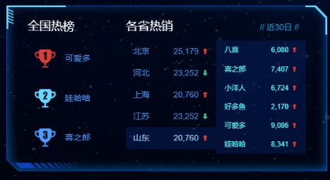

# 1. 数据可视化项目适配方案

### 1.1 项目需求

* <a href="resource/效果图.png">设计稿</a>宽度1920px
* PC端适配：宽度在1024px-1920px之间，元素宽高自适应

### 1.2 适配方案

* `flexible.js`检测浏览器宽度，修改HTML文字大小
* `rem`单位，页面根据**rem**适配大小，配合`cssrem`插件
* `flex`布局

`flexible.js`把屏幕分为24等份，PC设计稿宽度为**1920px**，所以cssrem插件的基准值是**80px**，rem值自动生成

把宽度约束在1024-1920里面有适配

```css
@media screen and (max-width: 1024px){
    html {
        font-size: 42.66px !important;
    }
}
@media screen and (max-width: 1920px){
    html {
        font-size: 80px !important;
    }
}
```

### 1.3 效果预览


# 2. 数据可视化项目开发

### 2.01 项目结构


### 2.02 项目核心

1. 布局
2. 使用ECharts填充图表

### 2.03 项目技术

##### 1. CSS部分

* `base.css`初始化
* `index.css`布局

##### 2. JS部分

* `echarts.min.js`图表
* `jquery.min.js`快速开发
* `flexible.js`rem布局
  * 由于将其设计稿分为24等份
  * 
  * 将**flexible.js源码**中的<span style="color:red">红框部分</span>改为`24`
* `index.js`开发动效

##### 3. font部分

* `iconmoon`

##### 4. 开发所需软件

* `vscode`开发
* `Live Server`插件用于即时查看效果
* `px to rem & rpx(cssrem)`插件用于将px单位转换为rem单位
  * 通过设计稿获取1rem=?px
  * 上述中设计稿1920px，将其分为24等份，每一份为80px
  * 
  * **Cssrem插件设置**->**Root Font Size**修改为80，即代表`1rem = 80px`

### 2.04 基础布局

##### 1. 理论布局


最大的盒子叫做`viewport`，将里面的内容分为3列，每一列叫做`column`

##### 2. HTML结构

```html
<body>
    <!-- 最大的盒子 -->
    <div class="viewport">
        <div class="column"></div>
        <div class="column"></div>
        <div class="column"></div>
    </div>
</body>
```

* 效果图是`1920*1080`
* body设置`背景图片`，行高设置`1.15`
* `viewport`为主体部分，限制最小宽度**1024px**，最大宽度**1920px**。最小高度**720px**
  * viewport**绝对居中**显示
  * **logo.png**作为背景图
  * padding内间距**56px 20px 0**
* `column`为每一列数据，一共三列，占比分别的**3:4:3**
  * 中间容器的margin外间距**32px 20px 0**

##### 3. CSS样式

```css
body {
    background: url(../images/bg.jpg) no-repeat 0 0 / cover;
    /* background-size: cover; */
}

.viewport {
    min-width: 1024px;
    max-width: 1920px;
    margin: 0 auto;
    background: url(../images/logo.png) no-repeat 0 0 / contain;
    min-height: 780px;
    display: flex;
    padding: .7rem .25rem 0;
}

.viewport .column {
    flex: 3;
    margin: .4rem .25rem 0;
}

.viewport .column:nth-child(2) {
    flex: 4;
}
```

* **background**中如果想要将**background-size**也写到里面，需要在前面加上0 0位置，并且size属性前需要加`/`
* 详细请看[CSS3背景图片background属性简写/连写](https://www.w3h5.com/post/370.html)

### 2.05 模块布局

##### 1. 理论布局


##### 2. 边框图片

我们从效果图中可以看到，每一个模块的边框都有图片，所以需要我们学习新的知识**边框图片**`border-image`，详细可看<a href="第三方笔记/数据可视化.md">第三方笔记 08-边框图片 详解</a>

###### 边框图片的使用场景

盒子大小不一，但是边框样式相同，此时就需要用到边框图片来完成

###### 边框图片切图原理（重要）

最主要的就是把4个角切出去（九宫格的由来），中间部分可以铺排、拉伸或者环绕。


上图可以看到，<span style="color: red">4个蓝色</span>就是<span style="color: red">4个角</span>，通过不同的设置可以实现3种不同的效果，铺排、拉伸、环绕。

###### 边框图片使用语法（重要）

| 属性                | 描述                                                         |
| ------------------- | ------------------------------------------------------------ |
| border-image-source | 用在边框的图片的路径                                         |
| border-image-slice  | 图片边框向内偏移（裁剪的尺寸，<span style="color:red">不带单位</span>，<span style="color:red">上右下左</span>的顺序） |
| border-image-width  | 图片边框的宽度（<span style="color:red">带单位</span>，注意是边框图片的宽度不是边框的宽度，如果不写默认是边框的宽度） |
| border-image-repeat | 图片边框是否平铺(<span style="color: blue">repeat</span>)、铺满(<span style="color: blue">round</span>)、拉伸(<span style="color: blue">stretch</span>)，默认拉伸) |


组合写法：

```css
border-image: url(images/border.jpg) 167/20px round;
```

拆分写法：

```css
border-image-source: url(images/border.jpg);
border-image-slice: 167 167 167 167;
border-image-width: 20px;
border-image-repeat: round;
```

##### 3. 公共面板样式开发

> 所有的面板的基础样式是一致的，提前布局好。

切割示例图：


- 面板 .panel 
  - 因为使用了`border-width`，所以内容会被边框挤开，此时需要将内容放入到一个新的盒子.inner中，再将.inner的位置调整为**负的边框的宽度**。
  - 容器 .inner内边距是 上下<span style="color:red">24px</span>  左右 <span style="color:red">36px</span>，记得转化为rem单位

```css
/* 公共面板样式  */
.panel {
    position: relative;
    /* 如果边框图片加载不出来边框就显示为透明 */
    border: 15px solid transparent;
    border-width: .6375rem .475rem .25rem 1.65rem;
    border-image-source: url(../images/border.png);
    border-image-slice: 51 38 20 132;
    margin-bottom: .25rem;
    box-sizing: border-box;
}
.inner {
    position: absolute;
    top: -0.6375rem;
    left: -1.65rem;
    right: -0.475rem;
    bottom: -0.25rem;
    padding: .1rem .45rem;
   
}
.panel h3 {
  font-size: 0.25rem;
  color: #fff;
  font-weight: 400;
}
```

##### 4. 通过类名调用字体图标

1. HTML引入字体CSS文件

   ```html
   <link rel="stylesheet" href="fonts/style.css" />
   ```

2. 直接调用类名就可以

   ```html
   <span class="icon-angellist"></span>
   ```

### 2.06 概览模块

##### 1. 效果


##### 2. 布局概述

* 使用`ul>li`布局4个模块
* 使用`flex`布局，其中`justify-content: space-between;`

##### 3. 样式数据

* 容器overview高度<span style="color:blue">110px</span>
* 上方字体<span style="color:blue">h4 28px #fff 左边距4.8px 下边距3.2px</span>
* 下方字体<span style="color:blue">span 16px #4c9bfd</span>

##### 4. HTML结构

```html
<div class="overview panel">
    <div class="inner">
        <ul>
            <li>
                <h4>2,190</h4>
                <span>
                    <i class="icon-dot" style="color: #006cff"></i>
                    设备总数
                </span>
            </li>
            <li class="item">
                <h4>190</h4>
                <span>
                    <i class="icon-dot" style="color: #6acca3"></i>
                    季度新增
                </span>
            </li>
            <li>
                <h4>3,001</h4>
                <span>
                    <i class="icon-dot" style="color: #6acca3"></i>
                    运营设备
                </span>
            </li>
            <li>
                <h4>108</h4>
                <span>
                    <i class="icon-dot" style="color: #ed3f35"></i>
                    异常设备
                </span>
            </li>
        </ul>
    </div>
</div>
```

##### 5. CSS

```css
/* 概览模块制作 */

.overview {
    height: 1.375rem;
}

.overview ul {
    display: flex;
    justify-content: space-between;
}

.overview h4 {
    font-size: .35rem;
    color: #fff;
    margin: 0 0 .04rem .06rem;
    font-weight: normal;
}

.overview span {
    color: #4c9bfd;
    font-size: .2rem;
}
```

### 2.07 监控模块

##### 1. 效果


##### 2. 布局概述

* tab栏可切换故障设备监控/异常设备监控两种
* `tabs`上方切换点击区域
* `content`数据显示区域
  * `head`上方提示部分
  * `marquee-view`下方显示部分
    * `row`无缝滚动每一行

##### 3. 样式数据

* 容器monitor高度<span style="color:blue">480px</span>
* .inner 容器内间距  24px  0
* .tabs 容器内间距 0 36px
  - a 容器  颜色： #1950c4  内间距：0 27px  字体：18px
  - 第一个a容器  去除左侧内间距   加上右侧2px宽度边框#00f2f1
  - 激活的时候  颜色白色
* .content容器
  - 占满剩余高度  flex:1
  - 默认隐藏
* .head 容器
  - 行高 1.05  背景 rgba(255, 255, 255, 0.1)  内间距  12px 36px  颜色 #68d8fe 字体大小 14px
* row 容器
  - 行高 1.05  内间距  12px 36px  颜色 #68d8ff 字体大小 12px
  - .icon-dot 字体图标   绝对定位  左边0.2rem  透明度0
  - 鼠标经过后：背景 rgba(255, 255, 255, 0.1)  透明度1
* col容器
  - 宽度：1rem   2.5rem    1rem
  - 第二个col   一行不换行  溢出  省略

##### 4. HTML结构

```html
<!--监控-->
<div class="monitor panel">
    <div class="inner">
        <div class="tabs">
            <a href="javascript:;" class="active">故障设备监控</a>
            <a href="javascript:;">异常设备监控</a>
        </div>
        <div class="content">
            <div class="head">
                <span class="col">故障时间</span>
                <span class="col">设备地址</span>
                <span class="col">异常代码</span>
            </div>
            <div class="marquee-view">
                <div class="marquee">
                    <div class="row">
                        <span class="col">20180701</span>
                        <span class="col">11北京市昌平西路金燕龙写字楼</span>
                        <span class="col">1000001</span>
                        <span class="icon-dot"></span>
                    </div>
                    <div class="row">
                        <span class="col">20190601</span>
                        <span class="col">北京市昌平区城西路金燕龙写字楼</span>
                        <span class="col">1000002</span>
                        <span class="icon-dot"></span>
                    </div>
                    <div class="row">
                        <span class="col">20190704</span>
                        <span class="col">北京市昌平区建材城西路金燕龙写字楼</span>
                        <span class="col">1000003</span>
                        <span class="icon-dot"></span>
                    </div>
                    <div class="row">
                        <span class="col">20180701</span>
                        <span class="col">北京市昌平区建路金燕龙写字楼</span>
                        <span class="col">1000004</span>
                        <span class="icon-dot"></span>
                    </div>
                    <div class="row">
                        <span class="col">20190701</span>
                        <span class="col">北京市昌平区建材城西路金燕龙写字楼</span>
                        <span class="col">1000005</span>
                        <span class="icon-dot"></span>
                    </div>
                    <div class="row">
                        <span class="col">20190701</span>
                        <span class="col">北京市昌平区建材城西路金燕龙写字楼</span>
                        <span class="col">1000006</span>
                        <span class="icon-dot"></span>
                    </div>
                    <div class="row">
                        <span class="col">20190701</span>
                        <span class="col">北京市昌平区建西路金燕龙写字楼</span>
                        <span class="col">1000007</span>
                        <span class="icon-dot"></span>
                    </div>
                    <div class="row">
                        <span class="col">20190701</span>
                        <span class="col">北京市昌平区建材城西路金燕龙写字楼</span>
                        <span class="col">1000008</span>
                        <span class="icon-dot"></span>
                    </div>
                    <div class="row">
                        <span class="col">20190701</span>
                        <span class="col">北京市昌平区建材城西路金燕龙写字楼</span>
                        <span class="col">1000009</span>
                        <span class="icon-dot"></span>
                    </div>
                    <div class="row">
                        <span class="col">20190710</span>
                        <span class="col">北京市昌平区建材城西路金燕龙写字楼</span>
                        <span class="col">1000010</span>
                        <span class="icon-dot"></span>
                    </div>
                </div>
            </div>
        </div>
        <div class="content">
            <div class="head">
                <span class="col">异常时间</span>
                <span class="col">设备地址</span>
                <span class="col">异常代码</span>
            </div>
            <div class="marquee-view">
                <div class="marquee">
                    <div class="row">
                        <span class="col">20190701</span>
                        <span class="col">北京市昌平区建材城西路金燕龙写字楼</span>
                        <span class="col">1000001</span>
                        <span class="icon-dot"></span>
                    </div>
                    <div class="row">
                        <span class="col">20190701</span>
                        <span class="col">北京市昌平区建材城西路金燕龙写字楼</span>
                        <span class="col">1000002</span>
                        <span class="icon-dot"></span>
                    </div>
                    <div class="row">
                        <span class="col">20190703</span>
                        <span class="col">北京市昌平区建材城西路金燕龙写字楼</span>
                        <span class="col">1000002</span>
                        <span class="icon-dot"></span>
                    </div>
                    <div class="row">
                        <span class="col">20190704</span>
                        <span class="col">北京市昌平区建材城西路金燕龙写字楼</span>
                        <span class="col">1000002</span>
                        <span class="icon-dot"></span>
                    </div>
                    <div class="row">
                        <span class="col">20190705</span>
                        <span class="col">北京市昌平区建材城西路金燕龙写字楼</span>
                        <span class="col">1000002</span>
                        <span class="icon-dot"></span>
                    </div>
                    <div class="row">
                        <span class="col">20190706</span>
                        <span class="col">北京市昌平区建材城西路金燕龙写字楼</span>
                        <span class="col">1000002</span>
                        <span class="icon-dot"></span>
                    </div>
                    <div class="row">
                        <span class="col">20190707</span>
                        <span class="col">北京市昌平区建材城西路金燕龙写字楼</span>
                        <span class="col">1000002</span>
                        <span class="icon-dot"></span>
                    </div>
                    <div class="row">
                        <span class="col">20190708</span>
                        <span class="col">北京市昌平区建材城西路金燕龙写字楼</span>
                        <span class="col">1000002</span>
                        <span class="icon-dot"></span>
                    </div>
                    <div class="row">
                        <span class="col">20190709</span>
                        <span class="col">北京市昌平区建材城西路金燕龙写字楼</span>
                        <span class="col">1000002</span>
                        <span class="icon-dot"></span>
                    </div>
                    <div class="row">
                        <span class="col">20190710</span>
                        <span class="col">北京市昌平区建材城西路金燕龙写字楼</span>
                        <span class="col">1000002</span>
                        <span class="icon-dot"></span>
                    </div>
                </div>
            </div>
        </div>
    </div>
</div>
```

##### 5. CSS

```css
/* 监控区域 */
.monitor{
  height: 6rem;
}
.monitor .inner{
  padding: .3rem 0;
  display: flex;
  flex-direction: column;
}
.monitor .tabs{
  padding: 0 .45rem;
  margin-bottom: 0.225rem;
  display: flex;
}
.monitor .tabs a{
  color:#1950c4;
  font-size: 0.225rem;
  padding: 0 .3375rem;
}
.monitor .tabs a:first-child{
  padding-left: 0;
  border-right: 0.025rem solid #00f2f1;
}
.monitor .tabs a.active{
  color: #fff;
}
.monitor .content{
  flex: 1;
  position: relative;
  display: none;
}
.monitor .head{
  display: flex;
  justify-content: space-between;
  line-height: 1.05;
  background-color: rgba(255, 255, 255, 0.1);
  padding: 0.15rem 0.45rem;
  color: #68d8fe;
  font-size: 0.175rem;
}
.monitor .marquee-view {
  position: absolute;
  top: 0.5rem;
  bottom: 0;
  width: 100%;
  overflow: hidden;
}
.monitor .row{
  display: flex;
  justify-content: space-between;
  line-height: 1.05;
  font-size: 0.15rem;
  color: #61a8ff;
  padding: 0.15rem 0.45rem;
}
.monitor .row .icon-dot{
  position: absolute;
  left: 0.2rem;
  opacity: 0;
}
.monitor .row:hover {
  background-color: rgba(255, 255, 255, 0.1);
  color: #68d8fe;
}
.monitor .row:hover .icon-dot{
  opacity: 1;
}
.monitor .col:first-child{
  width: 1rem;
}
.monitor .col:nth-child(2){
  width: 2.5rem;
  white-space: nowrap;
  text-overflow: ellipsis;
  overflow: hidden;
}
.monitor .col:nth-child(3){
  width: 1rem;
}
```

##### 6. JS

由于具有tab栏切换和无缝滚动动效，所以需要JS代码动效

**上方切换效果**

```javascript
// 上方故障/异常切换
$(".monitor .tabs").on("click", "a", function() {
    $(this).addClass("active").siblings().removeClass("active");
    $(".monitor .content").eq($(this).index()).show().siblings(".content").hide();
});
```

**下方无缝滚动效果**

* 实现思路
  * 先克隆列表，追加在后面
  * marquee-view 占满剩余高度，溢出隐藏
    * 绝对定位，top 1.6rem  bottom 0
    * 宽度100%，溢出隐藏
  * 使用CSS3的animation实现动画
  * 使用translateY向上位移50%
  * 动画时间15s，匀速播放，循环执行

JS部分

```javascript
$(".marquee-view .marquee").each(function() {
    const rows = $(this).children().clone();
    $(this).append(rows);
});
```

CSS部分

```css
/* 通过CSS3动画滚动marquee */

.marquee-view .marquee {
    animation: move 15s linear infinite;
}

@keyframes move {
    0% {}
    100% {
        transform: translateY(-50%);
    }
}


/* 鼠标经过marquee 就停止动画 */

.marquee-view .marquee:hover {
    animation-play-state: paused;
}
```

### 2.08 分布统计模块

##### 1. 效果


##### 2. 布局概述

* 左侧为`ECharts饼图`
* 右侧为`li列表`

##### 3. 样式数据

* 点位统计模块point高度<span style="color:blue">340px</span>

##### 4. HTML结构

```html
<div class="point panel">
    <div class="inner">
        <h3>点位分布统计</h3>
        <div class="chart">
            <div class="pie"></div>
            <div class="data">
                <div class="item">
                    <h4>320,11</h4>
                    <span>
                        <i class="icon-dot" style="color: #ed3f35"></i>
                        点位总数
                    </span>
                </div>
                <div class="item">
                    <h4>418</h4>
                    <span>
                        <i class="icon-dot" style="color: #eacf19"></i>
                        本月新增
                    </span>
                </div>
            </div>
        </div>
    </div>
</div>
```

##### 5. CSS

```css
/* 点位 */
.point {
  height: 4.25rem;
}
.point .chart {
  display: flex;
  margin-top: 0.3rem;
  justify-content: space-between;
}
.point .pie {
  width: 3.9rem;
  height: 3rem;
  margin-left: -0.125rem;
}
.point .data {
  display: flex;
  flex-direction: column;
  justify-content: space-between;
  width: 2.1rem;
  padding: .45rem .375rem;
  box-sizing: border-box;
  background-image: url(../images/rect.png);
  background-size: cover;
}
.point h4 {
  margin-bottom: 0.15rem;
  font-size: .35rem;
  color: #fff;
}
.point span {
  display: block;
  color: #4c9bfd;
  font-size: .2rem;
}
```

##### 6. 使用ECharts饼形图

* 先在官网找到类似的图表引入到页面中
  * 此饼形图类似图表：https://echarts.apache.org/v4/examples/zh/editor.html?c=pie-roseType
* 根据具体需求修改配置

###### 第一步：参考官方的例子，熟悉里面的配置

```javascript
option = {
    // 提示框组件
    tooltip: {
      // trigger 触发方式。非轴图形使用item的意思是放到数据对应图形上触发提示
      trigger: 'item',
      // 格式化提示内容：
      // a 代表series系列图表名称  
      // b 代表series数据名称 data 里面的name    
      // c 代表series数据值 data 里面的value   
      // d代表  当前数据/总数据的比例
      formatter: "{a} <br/>{b} : {c} ({d}%)"
    },
    // 控制图表
    series: [
      {
        // 图表名称
        name: '点位统计',
        // 图表类型
        type: 'pie',
        // 南丁格尔玫瑰图 有两个圆  内圆半径10%  外圆半径70%
        // 饼形图半径。 可以是像素。也可以是百分比（ 基于DOM容器大小）第一项是内半径，第二项是外半径（通过它可以实现饼形图大小）
        radius: ['10%', '70%'],
        // 图表中心位置 left 50%  top 50%  距离图表DOM容器
        center: ['50%', '50%'],
        // radius 半径模式，另外一种是 area 面积模式
        roseType: 'radius',
        // 数据集 value 数据的值 name 数据的名称
        data: [
            {value:10, name:'rose1'},
            {value:5, name:'rose2'},
            {value:15, name:'rose3'},
            {value:25, name:'rose4'},
            {value:20, name:'rose5'},
            {value:35, name:'rose6'},
            {value:30, name:'rose7'},
            {value:40, name:'rose8'}
        ]
      }
    ]
};
```

###### 第二步，根据具体需求修改配置

* 需求1：设置每一个模块的颜色

  ```javascript
  color: ['#006cff', '#60cda0', '#ed8884', '#ff9f7f', '#0096ff', '#9fe6b8', '#32c5e9', '#1d9dff'],
  ```

* 需求2：修改饼形图大小(series)

  ```javascript
  radius: ['10%', '70%'],
  ```

* 需求3：把饼形图显示模式改为半径模式

  ```javascript
  roseType: "radius",
  ```

* 需求4：数据更改替换(series里的data对象)

  ```javascript
  { value: 20, name: '云南' },
  { value: 26, name: '北京' },
  { value: 24, name: '山东' },
  { value: 25, name: '河北' },
  { value: 20, name: '江苏' },
  { value: 25, name: '浙江' },
  { value: 30, name: '四川' },
  { value: 42, name: '湖北' }
  ```

* 需求5：将字体略改小一些10px，在series里面修改。饼图图形上的文字标签可以控制饼形图的文字格式，label对象设置

  ```javascript
  series: [
      {
          name: "面积模式",
          type: "pie",
          radius: [30, 110],
          center: ["50%", "50%"],
          roseType: "radius",
          // 文本标签控制饼形图文字的相关样式， 注意它是一个对象
          label: {
              fontSize: 10
          },
      }
  ]
  ```

* 需求6：防止缩放时，引导线过长。引导线略短，series里的labelLine对象设置

  * 连接图表 6px
  * 连接文字 8px

  ```javascript
  // 引导线调整
  labelLine: {
      // 连接扇形图线长
      length: 6,
      // 连接文字线长
      length2: 8
  } 
  ```

###### 点位统计图完整JS代码

```javascript
// 点位分布统计模块
(function() {
  // 1. 实例化对象
  var myChart = echarts.init(document.querySelector(".pie"));
  // 2. 指定配置项和数据
  var option = {
    tooltip: {
      trigger: "item",
      formatter: "{a} <br/>{b} : {c} ({d}%)"
    },
    // 注意颜色写的位置
    color: [
      "#006cff",
      "#60cda0",
      "#ed8884",
      "#ff9f7f",
      "#0096ff",
      "#9fe6b8",
      "#32c5e9",
      "#1d9dff"
    ],
    series: [
      {
        name: "点位统计",
        type: "pie",
        // 如果radius是百分比则必须加引号
        radius: ["10%", "70%"],
        center: ["50%", "50%"],
        roseType: "radius",
        data: [
          { value: 20, name: "云南" },
          { value: 26, name: "北京" },
          { value: 24, name: "山东" },
          { value: 25, name: "河北" },
          { value: 20, name: "江苏" },
          { value: 25, name: "浙江" },
          { value: 30, name: "四川" },
          { value: 42, name: "湖北" }
        ],
        // 修饰饼形图文字相关的样式 label对象
        label: {
          fontSize: 10
        },
        // 修饰引导线样式
        labelLine: {
          // 连接到图形的线长度
          length: 6,
          // 连接到文字的线长度
          length2: 8
        }
      }
    ]
  };

  // 3. 配置项和数据给我们的实例化对象
  myChart.setOption(option);
  // 4. 当我们浏览器缩放的时候，图表也等比例缩放
  window.addEventListener("resize", function() {
    // 让我们的图表调用 resize这个方法
    myChart.resize();
  });
})();
```

### 2.09 地图模块

##### 1. 效果图


##### 2. 布局概述

* 上方为标题
* 下方为ECharts图表地图

##### 3. 样式数据

* 地图模块map高度 578px

##### 4. HTML结构

```html
<!-- 地图 -->
<div class="map">
    <h3>
        <span class="icon-cube"></span>
        设备数据统计
    </h3>
    <div class="chart">
        <div class="geo"></div>
    </div>
</div>
```

* class="geo" 此模块用于处理ECharts的Map

##### 5. CSS

```css
/* 地图  */
.map {
  height: 7.225rem;
  margin-bottom: 0.25rem;
  display: flex;
  flex-direction: column;
}
.map h3 {
  line-height: 1;
  padding: 0.2rem 0;
  margin: 0;
  font-size: 0.25rem;
  color: #fff;
  font-weight: 400;
}
.map .icon-cube {
  color: #68d8fe;
}
.map .chart {
  flex: 1;
  background-color: rgba(255, 255, 255, 0.05);
}
.map .geo {
  width: 100%;
  height: 100%;
}
```

注意第二列（column)  有个外边距（上面 64px 左右 20px  下是 0）

```css
.viewport .column:nth-child(2) {
    margin: .8rem .25rem 0;
}
```

##### 6.地图模块需要ECharts

详细看 3.4 内容

### 2.10 用户统计模块

##### 1. 效果


##### 2. 布局概述

* 上方为标题
* 下方左侧为ECharts柱形图
* 下方右侧和分布统计图相同

##### 3. 样式数据

* 用户统计模块users高度340px

##### 4. HTML结构

```html
<!-- 用户 -->
<div class="users panel">
    <div class="inner">
        <h3>全国用户总量统计</h3>
        <div class="chart">
            <div class="bar"></div>
            <div class="data">
                <div class="item">
                    <h4>120,899</h4>
                    <span>
                        <i class="icon-dot" style="color: #ed3f35"></i>
                        用户总量
                    </span>
                </div>
                <div class="item">
                    <h4>248</h4>
                    <span>
                        <i class="icon-dot" style="color: #eacf19"></i>
                        本月新增
                    </span>
                </div>
            </div>
        </div>
    </div>
</div>
```

##### 5. CSS

```css
/* 用户模块 */
.users {
  height: 4.25rem;
  display: flex;
}
.users .chart {
  display: flex;
  margin-top: .3rem;
}
.users .bar {
  width: 7.35rem;
  height: 3rem;
}
.users .data {
  display: flex;
  flex-direction: column;
  justify-content: space-between;
  width: 2.1rem;
  padding: .45rem .375rem;
  box-sizing: border-box;
  background-image: url(../images/rect.png);
  background-size: cover;
}
.users h4 {
  margin-bottom: .15rem;
  font-size: .35rem;
  color: #fff;
}
.users span {
  display: block;
  color: #4c9bfd;
  font-size: 0.2rem;
}
```

##### 6. 使用ECharts柱形图

* 先在官网找到类似的图表引入到页面中
  * 此柱形图类似图表：https://echarts.apache.org/examples/zh/editor.html?c=bar-tick-align
* 根据具体需求修改配置

###### 第一步：先熟悉官方配置

```javascript
option = {
    // 工具提示
    tooltip: {
      // 触发类型  经过轴触发axis  经过轴触发item
      trigger: 'axis',
      // 轴触发提示才有效
      axisPointer: {    
        // 默认为直线，可选为：'line' 线效果 | 'shadow' 阴影效果       
        type: 'shadow'        
      }
    },
    // 图表边界控制
    grid: {
      // 距离 上右下左 的距离
      left: '3%',
      right: '4%',
      bottom: '3%',
      // 是否包含文本
      containLabel: true
    },
    // 控制x轴
    xAxis: [
      {
        // 使用类目，必须有data属性
        type: 'category',
        // 使用 data 中的数据设为刻度文字
        data: ['Mon', 'Tue', 'Wed', 'Thu', 'Fri', 'Sat', 'Sun'],
        // 刻度设置
        axisTick: {
          // true意思：图形在刻度中间
          // false意思：图形在刻度之间
          alignWithLabel: true
        }
      }
    ],
    // 控制y轴
    yAxis: [
      {
        // 使用数据的值设为刻度文字
        type: 'value'
      }
    ],
    // 控制x轴
    series: [
      {
        // 图表数据名称
        name: '用户统计',
        // 图表类型
        type: 'bar',
        // 柱子宽度
        barWidth: '60%',
        // 数据
        data: [10, 52, 200, 334, 390, 330, 220]
      }
    ]
  };
```

###### 第二步：根据具体需求进行修改

* 需求1：对柱子颜色进行修改

```javascript
// 修改线性渐变色方式 1
color: new echarts.graphic.LinearGradient(
     // (x1,y2) 点到点 (x2,y2) 之间进行渐变
     0, 0, 0, 1,
     [
         { offset: 0, color: '#00fffb' }, // 0 起始颜色
         { offset: 1, color: '#0061ce' }  // 1 结束颜色
    ]
 ),
// 修改线性渐变色方式 2
color: {
    type: 'linear',
    x: 0,
    y: 0,
    x2: 0,
    y2: 1,
    colorStops: [{
        offset: 0, color: 'red' // 0% 处的颜色
    }, {
        offset: 1, color: 'blue' // 100% 处的颜色
    }],
    globalCoord: false // 缺省为 false
},
```

* 需求2： 提示框组件放到柱子上触发， 没有阴影等效果

```javascript
//提示框组件
tooltip: {
    trigger: 'item',
   // axisPointer: { // 坐标轴指示器，坐标轴触发有效  这个模块我们此时不需要删掉即可
       // type: 'shadow' // 默认为直线，可选为：'line' | 'shadow'
   // }
},
```

* 需求3： 修改柱形图表大小，   以及相关网格。
  * 饼形图修改图表大小是通过  series 对象里面的 radius 
  * 柱形图修改图标大小是通过  series 对象里面的 grid 对象  left  right 等
  * 显示网格  show: true，网格颜色是  borderColor

```javascript
// 直角坐标系内绘图网格（区域）
grid: {
top: '3%',
right: '3%',
bottom: '3%',
left: '0%',
//  图表位置紧贴画布边缘是否显示刻度以及label文字 防止坐标轴标签溢出跟grid 区域有关系
containLabel: true,
// 是否显示直角坐标系网格
show: true,
//grid 四条边框的颜色
borderColor: 'rgba(0, 240, 255, 0.3)'
},
```

* 需求4： X 轴调整
  * 柱子在刻度之间
  * 剔除刻度不显示
  * 刻度标签文字颜色  #4c9bfd   通过 axisLabel 对象设置
  * 修改x轴线的颜色    axisLine  里面的   lineStyle

```javascript
// 控制y轴
    yAxis: [
      {
        // 使用类目，必须有data属性
        type: 'category',
        // 使用 data 中的数据设为刻度文字
        data: ['Mon', 'Tue', 'Wed', 'Thu', 'Fri', 'Sat', 'Sun'],
        // 刻度设置
        axisTick: {
           // 不显示刻度
           show: false
        },        
        // y坐标轴文字标签样式设置
        axisLabel: {
          color: '#4c9bfd'
       },
       // y坐标轴颜色设置
        axisLine:{
          lineStyle:{
               color:'rgba(0, 240, 255, 0.3)',
              // width:8,  x轴线的粗细
              // opcity: 0,   如果不想显示x轴线 则改为 0
             }
        },
        // y轴 分割线的样式 
         splitLine: {
            lineStyle: {
                color: 'rgba(0, 240, 255, 0.3)'
            }
         }     
    ],
```
- 需求5： Y 轴调整
  - 剔除刻度不显示
  - Y轴文字颜色  #4c9bfd   通过 axisLabel 对象设置
  - Y轴分割线颜色   splitLine 对象里面 lineStyle 对象设置
```javascript
yAxis: [{
    type: 'value',
    // 刻度设置
    axisTick: {
        // 不显示刻度
        show: false
    },
    // y坐标轴文字标签样式设置
    axisLabel: {
        color: '#4c9bfd'
    },
    // y坐标轴颜色设置
    axisLine: {
        lineStyle: {
            color: 'rgba(0, 240, 255, 0.3)',
            // width:8,  x轴线的粗细
            // opcity: 0,   如果不想显示x轴线 则改为 0
        }
    },
    // y轴 分割线的样式 
    splitLine: {
        lineStyle: {
            color: 'rgba(0, 240, 255, 0.3)'
        }
    }
}],
```

* 需求6：调整数据

```javascript
// series
data: [2100,1900,1700,1560,1400,1200,1200,1200,900,750,600,480,240]
```

```js
// xAxis
data: ['上海', '广州', '北京', '深圳', '合肥', '', '......', '', '杭州', '厦门', '济南', '成都', '重庆']
```

* 需求7：省略图形
  * 经过图形才会显示，且省略的柱子不需要提示
  * 图形单独设置颜色
  * 详细看 3.2 知识

```js
// 中间省略的数据  准备三项
var item = {
    name:'',
    value: 1200,
    // 柱子颜色
    itemStyle: {
      color: '#254065'
    },
     // 鼠标经过柱子颜色
    emphasis: {
      itemStyle: {
        color: '#254065'
      }
    },
    // 工具提示隐藏
    tooltip: {
      extraCssText: 'opacity:0'
    },
  }
```

* 当我们浏览页面时，图表也会等比例缩放

```js
// 4. 当我们浏览器缩放的时候，图表也等比例缩放
window.addEventListener("resize", function() {
    // 让我们的图表调用 resize这个方法
    myChart.resize();
});
```

### 2.11 订单模块

##### 1. 效果


##### 2. 布局概述

* 上方tab栏切换功能
* 下方数据
* 基本上和监控模块的一样

##### 3. 布局数据

* 订单模块order高度150px

##### 4. HTML结构

```html
<!-- 订单 -->
<div class="order panel">
    <div class="inner">
        <!-- 筛选 -->
        <div class="filter">
            <a href="javascript:;" class="active">365天</a>
            <a href="javascript:;">90天</a>
            <a href="javascript:;">30天</a>
            <a href="javascript:;">24小时</a>
        </div>
        <!-- 数据 -->
        <div class="data">
            <div class="item">
                <h4>20,301,987</h4>
                <span>
                    <i class="icon-dot" style="color: #ed3f35"></i>
                    订单量
                </span>
            </div>
            <div class="item">
                <h4>99834</h4>
                <span>
                    <i class="icon-dot" style="color: #eacf19"></i>
                    销售额(万元)
                </span>
            </div>
        </div>
    </div>
</div>
```

##### 5. CSS

```css
/* 订单 */
.order {
  height: 1.875rem;
}
.order .filter {
  display: flex;
}
.order .filter a {
  display: block;
  height: 0.225rem;
  line-height: 1;
  padding: 0 0.225rem;
  color: #1950c4;
  font-size: 0.225rem;
  border-right: 0.025rem solid #00f2f1;
}
.order .filter a:first-child {
  padding-left: 0;
}
.order .filter a:last-child {
  border-right: none;
}
.order .filter a.active {
  color: #fff;
  font-size: 0.25rem;
}
.order .data {
  display: flex;
  margin-top: 0.25rem;
}
.order .item {
  width: 50%;
}
.order h4 {
  font-size: 0.35rem;
  color: #fff;
  margin-bottom: 0.125rem;
}
.order span {
  display: block;
  color: #4c9bfd;
  font-size: 0.2rem;
}
```

##### 6. JS

* 动态渲染页面数据
* 点击可切换
* 不点击时定时器切换

```javascript
(function() {
    // 1. 动态渲染数据
    const data = {
        day365: { orders: '20,301,987', amount: '99834' },
        day90: { orders: '301,987', amount: '9834' },
        day30: { orders: '1,987', amount: '3834' },
        day1: { orders: '987', amount: '834' }
    }
    $.each(data, (index, element) => {
        const dataHTML = `<div class="data">
<div class="item">
<h4>${element.orders}</h4>
<span>
<i class="icon-dot" style="color: #ed3f35"></i>
订单量
</span>
</div>
<div class="item">
<h4>${element.amount}</h4>
<span>
<i class="icon-dot" style="color: #eacf19"></i>
销售额(万元)
</span>
</div>
</div>`
        $(".order .inner").append(dataHTML);
    });
    // 2. 隐藏其他，只显示第一个
    $(".order .data").eq(0).show().siblings(".data").hide();
    let auto_index = 0;
    // 3. 点击可以切换
    $(".filter").on("click", "a", function() {
        $(this).addClass("active").siblings().removeClass("active").parent().siblings(".data").eq($(this).index()).show().siblings(".data").hide();
        auto_index = $(this).index();
    });
    // 4. 不点击会自动播放
    let flag = true;

    function autoplay() {
        if (flag) {
            if (auto_index >= $(".order .filter a").length) {;
                                                             auto_index = 0;
                                                            }
            console.log($(".order .filter a").length);
            $(".order .filter a").eq(auto_index).addClass("active").siblings().removeClass("active").parent().siblings(".data").eq(auto_index).show().siblings(".data").hide();
            auto_index++;
        }
    }
    $(".order").on("mouseover", function() {
        flag = false;
    });
    $(".order").on("mouseleave", function() {
        flag = true;
    });
    setInterval(autoplay, 1000);
})();
```

### 2.12 销售额统计模块

##### 1. 效果


##### 2. 布局概述

* 有tab栏切换
* 下方为ECharts线性图表

##### 3. 样式数据

* 销售额统计模块sales高度248px

##### 4. HTML结构

```html
<!-- 销售额 -->
<div class="sales panel">
    <div class="inner">
        <div class="caption">
            <h3>销售额统计</h3>
            <a href="javascript:;" class="active">年</a>
            <a href="javascript:;">季</a>
            <a href="javascript:;">月</a>
            <a href="javascript:;">周</a>
        </div>
        <div class="chart">
            <div class="label">单位:万</div>
            <div class="line"></div>
        </div>
    </div>
</div>
```

##### 5. CSS

```css
/* 销售区域 */
.sales {
  height: 3.1rem;
}
.sales .caption {
  display: flex;
  line-height: 1;
}
.sales h3 {
  height: 0.225rem;
  padding-right: 0.225rem;
  border-right: 0.025rem solid #00f2f1;
}
.sales a {
  padding: 0.05rem;
  font-size: 0.2rem;
  margin: -0.0375rem 0 0 0.2625rem;
  border-radius: 0.0375rem;
  color: #0bace6;
}
.sales a.active {
  background-color: #4c9bfd;
  color: #fff;
}
.sales .inner {
  display: flex;
  flex-direction: column;
}
.sales .chart {
  flex: 1;
  padding-top: 0.1875rem;
  position: relative;
}
.sales .label {
  position: absolute;
  left: 0.525rem;
  top: 0.225rem;
  color: #4996f5;
  font-size: 0.175rem;
}
.sales .line {
  width: 100%;
  height: 100%;
}
```

##### 6. 使用ECharts线形图表

* 先在官网找到类似的图表引入到页面中
  * 此线形图类似图表：https://echarts.apache.org/examples/zh/editor.html?c=line-stack
* 根据具体需求修改配置

###### 第一步：根据官方示例分析

```javascript
var option = {
    tooltip: {
      trigger: "axis"
    },
    legend: {
      data: ["邮件营销", "联盟广告"]
    },
    grid: {
      left: "3%",
      right: "4%",
      bottom: "3%",
      containLabel: true
    },

    xAxis: {
      type: "category",
      boundaryGap: false,
      data: ["周一", "周二"]
    },
    yAxis: {
      type: "value"
    },
    series: [
      {
        name: "邮件营销",
        type: "line",
        stack: "总量",
        data: [120, 132, 101, 134, 90, 230, 210]
      },
      {
        name: "联盟广告",
        type: "line",
        stack: "总量",
        data: [220, 182, 191, 234, 290, 330, 310]
      }
    ]
}
```

###### 第二步：根据具体需求定制

* 需求1： 修改折线图大小，显示边框设置颜色：#012f4a，并且显示刻度标签。

```javascript
// 设置网格样式
grid: { 
  top: '20%',
  left: '3%',
  right: '4%',
  bottom: '3%',
  show: true,// 显示边框
  borderColor: '#012f4a',// 边框颜色
  containLabel: true // 包含刻度文字在内
},
```

* 需求2： 修改图例组件中的文字颜色 #4c9bfd， 距离右侧 right 为 10%

```javascript
legend: {
    textStyle: {
        color: '#4c9bfd' // 图例文字颜色
    },
    right: '10%' // 距离右边10%
},
```

- 需求3： x轴相关配置
  - 刻度去除
  - x轴刻度标签字体颜色：#4c9bfd
  - 剔除坐标轴线颜色（将来使用Y轴分割线)
  - 轴两端是不需要内间距 boundaryGap

~~~JavaScript
xAxis: {
   type: 'category',
   data: ["1月", "2月", "3月", "4月", "5月", "6月", "7月", "8月", "9月", "10月", "11月", "12月"],
   axisTick: {
      show: false // 去除刻度线
   },
   axisLabel: {
     color: '#4c9bfd' // 文本颜色
   },
   axisLine: {
     show: false // 去除轴线
   },
   boundaryGap: false  // 去除轴内间距
},
~~~

- 需求4： y轴的定制
  - 刻度去除
  - 字体颜色：#4c9bfd
  - 分割线颜色：#012f4a

~~~javascript
yAxis: {
  type: 'value',
  axisTick: {
    show: false  // 去除刻度
  },
  axisLabel: {
    color: '#4c9bfd' // 文字颜色
  },
  splitLine: {
    lineStyle: {
    color: '#012f4a' // 分割线颜色
    }
  }
}
~~~

- 需求5： 两条线形图定制
  - 颜色分别：#00f2f1  #ed3f35
  - 把折线修饰为圆滑 series 数据中添加 smooth 为 true

```js
color: ['#00f2f1', '#ed3f35'],
series: [{
  name:'预期销售额',
  data: [820, 932, 901, 934, 1290, 1330, 1320],
  type: 'line',
  // 折线修饰为圆滑
  smooth: true,
  },{
  name:'实际销售额',
  data: [100, 331, 200, 123, 233, 543, 400],
  type: 'line',
  smooth: true,
}]
```

- 需求6：配置数据

```js
// x轴的文字
xAxis: {
  type: 'category',
  data: ['1月', '2月', '3月', '4月', '5月', '6月', '7月', '8月', '9月', '10月', '11月', '12月'],
```

```js
// 图标数据
series: [{
    name:'预期销售额',
    data:  [24, 40, 101, 134, 90, 230, 210, 230, 120, 230, 210, 120],
    type: 'line',
    smooth: true
},{
    name:'实际销售额',
    data: [40, 64, 191, 324, 290, 330, 310, 213, 180, 200, 180, 79],     
    type: 'line',
    smooth: true
}
}]
```

注意：现在给的是年份数据，还需要切换效果。

##### 7. JS

因为有tab切换效果，所以需要JS

1. 准备4组数据用于渲染页面，在ECharts中的`series`的`data`需要这个数据
2. 绑定点击事件
   1. 切换tab
   2. 切换图表的数据
3. 定时器切换

###### 第一步：准备数据

```javascript
const data = {
    year: [
        [24, 40, 101, 134, 90, 230, 210, 230, 120, 230, 210, 120],
        [40, 64, 191, 324, 290, 330, 310, 213, 180, 200, 180, 79]
    ],
    quarter: [
        [23, 75, 12, 97, 21, 67, 98, 21, 43, 64, 76, 38],
        [43, 31, 65, 23, 78, 21, 82, 64, 43, 60, 19, 34]
    ],
    month: [
        [34, 87, 32, 76, 98, 12, 32, 87, 39, 36, 29, 36],
        [56, 43, 98, 21, 56, 87, 43, 12, 43, 54, 12, 98]
    ],
    week: [
        [43, 73, 62, 54, 91, 54, 84, 43, 86, 43, 54, 53],
        [32, 54, 34, 87, 32, 45, 62, 68, 93, 54, 54, 24]
    ]
};
```

###### 第二步：图表option配置

```javascript
const option = {
    tooltip: {
        trigger: 'axis'
    },
    legend: {
        data: ['预期销售额', '实际销售额'],
        textStyle: {
            color: '#4c9bfd' // 图例文字颜色
        },
        right: '10%' // 距离右边10%
    },
    grid: {
        top: '20%',
        left: '3%',
        right: '4%',
        bottom: '3%',
        show: true, // 显示边框
        borderColor: '#012f4a', // 边框颜色
        containLabel: true // 包含刻度文字在内
    },
    xAxis: {
        type: 'category',
        data: ["1月", "2月", "3月", "4月", "5月", "6月", "7月", "8月", "9月", "10月", "11月", "12月"],
        axisTick: {
            show: false // 去除刻度线
        },
        axisLabel: {
            color: '#4c9bfd' // 文本颜色
        },
        axisLine: {
            show: false // 去除轴线
        },
        boundaryGap: false // 去除轴内间距
    },
    yAxis: {
        type: 'value',
        axisTick: {
            show: false // 去除刻度
        },
        axisLabel: {
            color: '#4c9bfd' // 文字颜色
        },
        splitLine: {
            lineStyle: {
                color: '#012f4a' // 分割线颜色
            }
        }
    },
    color: ['#00f2f1', '#ed3f35'],
    // 图标数据
    series: [{
        // 这里面的data要是动态的
        name: '预期销售额',
        data: data.year[0],
        type: 'line',
        smooth: true
    }, {
        name: '实际销售额',
        data: data.year[1],
        type: 'line',
        smooth: true
    }]
};
myChart.setOption(option);
```

###### 第三步：点击切换上方tab和下方图表数据

```javascript
// 2. 点击切换
const data_d = ["year", "quarter", "month", "week"];
let auto_index = 0;
$(".sales .caption").on("click", "a", function() {
    $(this).addClass("active").siblings().removeClass("active");
    // 设置图表里面的数据
    option.series[0].data = data[data_d[$(this).index() - 1]][0];
    option.series[1].data = data[data_d[$(this).index() - 1]][1];
    myChart.setOption(option);
    auto_index = $(this).index();
});
myChart.setOption(option);
```

###### 第四步：定时切换

```javascript
let flag = true;
function autoplay() {
    if (flag) {
        if (auto_index >= $(".sales .caption a").length) {
            auto_index = 0;
        }
        $(".sales .caption a").eq(auto_index).addClass("active").siblings("a").removeClass("active");
        option.series[0].data = data[data_d[auto_index]][0];
        option.series[1].data = data[data_d[auto_index]][1];
        auto_index++;
    }
    myChart.setOption(option);
};
setInterval(autoplay, 1000);
$(".sales").on({
    mouseover: () => {
        flag = false;
    },
    mouseleave: () => {
        flag = true;
    }
});
```

### 2.13 渠道和进度模块

##### 1. 效果


##### 2. 布局概述

* 因为渠道分布和销售进度放在一起，所以它们有一个父亲`wrap`
* 渠道分布下方为ECharts雷达图

##### 3. 样式数据

* 渠道分布&销售进度高度232px

##### 4. HTML结构

```html
<!-- 渠道 进度 -->
<div class="wrap">
    <div class="channel panel">
        <div class="inner">
            <h3>渠道分布</h3>
            <div class="data">
                <div class="radar"></div>
            </div>
        </div>
    </div>
    <div class="quarter panel">
        <div class="inner">
            <h3>一季度销售进度</h3>
            <div class="chart">
                <div class="box">
                    <div class="gauge"></div>
                    <div class="label">75<small> %</small></div>
                </div>
                <div class="data">
                    <div class="item">
                        <h4>1,321</h4>
                        <span>
                            <i class="icon-dot" style="color: #6acca3"></i>
                            销售额(万元)
                        </span>
                    </div>
                    <div class="item">
                        <h4>150%</h4>
                        <span>
                            <i class="icon-dot" style="color: #ed3f35"></i>
                            同比增长
                        </span>
                    </div>
                </div>
            </div>
        </div>
    </div>
</div>
```

##### 5. CSS

```css
/* 渠道区块 */
.wrap {
  display: flex;
}
.channel,
.quarter {
  flex: 1;
  height: 2.9rem;
}
.channel {
  margin-right: 0.25rem;
}
.channel .data {
  overflow: hidden;
}
.channel .data .radar {
  height: 2.1rem;
  width: 100%;
  background-color: pink;
}
.channel h4 {
  color: #fff;
  font-size: 0.4rem;
  margin-bottom: 0.0625rem;
}
.channel small {
  font-size: 50%;
}
.channel span {
  display: block;
  color: #4c9bfd;
  font-size: 0.175rem;
}
/* 季度区块 */
.quarter .inner {
  display: flex;
  flex-direction: column;
  margin: 0 -0.075rem;
}
.quarter .chart {
  flex: 1;
  padding-top: 0.225rem;
}
.quarter .box {
  position: relative;
}
.quarter .label {
  transform: translate(-50%, -30%);
  color: #fff;
  font-size: 0.375rem;
  position: absolute;
  left: 50%;
  top: 50%;
}
.quarter .label small {
  font-size: 50%;
}
.quarter .gauge {
  height: 1.05rem;
}
.quarter .data {
  display: flex;
  justify-content: space-between;
}
.quarter .item {
  width: 50%;
}
.quarter h4 {
  color: #fff;
  font-size: 0.3rem;
  margin-bottom: 0.125rem;
}
.quarter span {
  display: block;
  width: 100%;
  white-space: nowrap;
  text-overflow: ellipsis;
  overflow: hidden;
  color: #4c9bfd;
  font-size: 0.175rem;
}
```

##### 6. 渠道需要的ECharts雷达图

###### 第一步：根据官方示例分析

* 先在官网找到类似的图表引入到页面中
  * 此雷达图类似图表：https://echarts.apache.org/examples/zh/editor.html?c=radar-aqi
* 根据具体需求修改配置

```javascript
(function() {
    const myChart = echarts.init(document.querySelector(".radar"));
    // Schema:
    // date,AQIindex,PM2.5,PM10,CO,NO2,SO2
    const dataBJ = [
        [55, 9, 56, 0.46, 18, 6, 1],

    ];

    const lineStyle = {
        normal: {
            width: 1,
            opacity: 0.5
        }
    };

    const option = {
        backgroundColor: '#161627',
        // visualMap: {
        //     show: true,
        //     min: 0,
        //     max: 20,
        //     dimension: 6,
        //     inRange: {
        //         colorLightness: [0.5, 0.8]
        //     }
        // },
        radar: {
            indicator: [
                { name: 'AQI', max: 300 },
                { name: 'PM2.5', max: 250 },
                { name: 'PM10', max: 300 },
                { name: 'CO', max: 5 },
                { name: 'NO2', max: 200 },
                { name: 'SO2', max: 100 }
            ],
            shape: 'circle',
            splitNumber: 5,
            name: {
                textStyle: {
                    color: 'rgb(238, 197, 102)'
                }
            },
            splitLine: {
                lineStyle: {
                    color: [
                        'rgba(238, 197, 102, 0.1)', 'rgba(238, 197, 102, 0.2)',
                        'rgba(238, 197, 102, 0.4)', 'rgba(238, 197, 102, 0.6)',
                        'rgba(238, 197, 102, 0.8)', 'rgba(238, 197, 102, 1)'
                    ].reverse()
                }
            },
            splitArea: {
                show: false
            },
            axisLine: {
                lineStyle: {
                    color: 'rgba(238, 197, 102, 0.5)'
                }
            }
        },
        series: [{
            name: '北京',
            type: 'radar',
            lineStyle: lineStyle,
            data: dataBJ,
            symbol: 'none',
            itemStyle: {
                color: '#F9713C'
            },
            areaStyle: {
                opacity: 0.1
            }
        }, ]
    };
    myChart.setOption(option)
})();
```

###### 第二步：根据具体需求修改配置

* 需求1：去掉背景颜色，缩放雷达图至65%

```javascript
radar:{
    center: ['50%', '50%'],
    // 外半径占据容器大小
    radius: '65%',
}
```

* 需求2： 指示器轴的分割段数为4条（4个圆圈）

```js
radar:{
    // 指示器轴的分割段数
    splitNumber: 4,
}  
```

* 需求3： 雷达图分割线设为白色半透明 0.5

```js
// 坐标轴在 grid 区域中的分隔线（圆圈）
splitLine: {
     lineStyle: {
     color: 'rgba(255, 255, 255, 0.5)',
     // width: 2,
     // type: 'dashed'
     }
},
```

* 需求4： 雷达图 坐标轴轴线相关设置(竖线) axisLine 

```js
// 坐标轴轴线相关设置(竖线)axisLine
axisLine: {
    show: true,
        lineStyle: {
            color: 'rgba(255, 255, 255, 0.5)'
            // width: 1,
            // type: 'solid'
        }
},
```

* 需求5： 雷达图文字颜色为 #4c9bfd

```javascript
name: {
    // 修饰雷达图文本颜色
     textStyle: {
       color: '#4c9bfd'
     }
},
```

* 需求6： 修饰 区域填充样式   series 对象
  * 区域的背景颜色改为  rgba(238, 197, 102, 0.6)
  * 区域填充的线条颜色为白色

```javascript
series: [{
    // 区域背景颜色
    areaStyle: {
         color: 'rgba(238, 197, 102, 0.6)',
    },
    // 区域线条样式
    lineStyle: {
        normal: {
            color: '#fff',
            // width: 1
        }
    },
}];
```

  * 需求7： 标记的图形(拐点）设置  注意 series 里面设置
      * 用圆点显示， 拐点的大小设置为 5
      * 小圆点设置为白色
      * 在小圆点上显示相关数据，颜色设置为白色，10像素

```js
series: [{
    // symbol 标记的样式(拐点），还可以取值'rect' 方块 ,'arrow' 三角等
    symbol: 'circle', 
    // 拐点的大小  
    symbolSize: 5, 
    // 小圆点（拐点）设置为白色
    itemStyle: {
           color: '#fff'
    },
    // 在圆点上显示相关数据
    label: {
         show: true,
         color: '#fff',
         fontSize: 10
    },    
}],
```

* 需求8： 鼠标经过显示提示框组件

```javascript
tooltip: {
    show: true,
    // 控制提示框组件的显示位置
    position: ['60%', '10%'],
},
```

* 需求9： 更换数据

```javascript
// 雷达图的指示器 内部填充数据
indicator: [
    { name: '机场', max: 100 },
    { name: '商场', max: 100 },
    { name: '火车站', max: 100 },
    { name: '汽车站', max: 100 },
    { name: '地铁', max: 100 }
],
```

```javascript
series: [{
    data: [[90, 19, 56, 11, 34]],
}]
```

##### 7. 进度需要的ECharts饼形图

###### 第一步：根据官方示例分析

* 先在官网找到类似的图表引入到页面中
  * 此饼形图类似图表：https://echarts.apache.org/examples/zh/editor.html?c=pie-doughnut
  * 因为效果是半圆形，所以我们采用空心圆，下半部分使用透明的部分
* 根据具体需求修改配置

```javascript
// 进度模块
(function() {
    const myChart = echarts.init(document.querySelector(".quarter .gauge"));
    const option = {
        series: [{
            name: '',
            type: 'pie',
            radius: ['55%', '70%'],
            labelLine: [{
                normal: {
                    show: false
                }

            }],
            data: [
                { value: 50 },
                { value: 100 },
                { value: 50 },
            ]
        }]
    };
    myChart.setOption(option);
})();
```

###### 第二步：根据具体需求定制

* 需求1：改为半圆（下方改为透明），大一些，文字保持在中心

```js
series: [
    {
        type: 'pie',
        // 放大图形
        radius: ['130%', '150%'],  
        // 移动下位置  套住50%文字
        center: ['48%', '80%'],   
        label: {
            normal: {
                show: false
            }
        },  
        // 起始角度，支持范围[0, 360]
        startAngle: 180,
        data: [
            { value: 100 }, // 不需要名称
            { value: 100,}, // 不需要名称
            { value: 200, itemStyle: { color: 'transparent' } } // 透明隐藏第三块区域
        ]
    }
]
```

* 需求2：鼠标经过无需变大，修改第一段颜色渐变#00c9e0->#005fc1，修改第二段颜色#12274d。写在series里面

```js
// 鼠标经过不变大
hoverOffset: 0,
data: [
    {
        value: 100,
        itemStyle: {
            // 颜色渐变#00c9e0->#005fc1
            color: new echarts.graphic.LinearGradient(
                // (x1,y2) 点到点 (x2,y2) 之间进行渐变
                0,
                0,
                0,
                1, [
                    { offset: 0, color: "#00c9e0" }, // 0 起始颜色
                    { offset: 1, color: "#005fc1" } // 1 结束颜色
                ]
            )
        }
   },
   { value: 100, itemStyle: { color: '#12274d' } },
   { value: 200, itemStyle: { color: 'transparent' } } // 透明隐藏第三块区域
],
```

### 2.14 热榜模块

##### 1. 效果



##### 2. 你将获得

* 实际开发中，后台返回的真是数据如何渲染到页面中
* ES6模板字符串知识

##### 3. 布局概述

* 全国热榜一部分
* 各省热销一部分

##### 4. 实现思路

* 所有的数据通过JS代码动态渲染到页面中（用到模板字符串）

##### 5. HTML结构

```html
<!-- 排行榜 -->
<div class="top panel">
    <div class="inner">
        <div class="all">
            <h3>全国热榜</h3>
            <ul>
                <li>
                    <i class="icon-cup1" style="color: #d93f36;"></i> 可爱多
                </li>
                <li>
                    <i class="icon-cup2" style="color: #68d8fe;"></i> 娃哈啥
                </li>
                <li>
                    <i class="icon-cup3" style="color: #4c9bfd;"></i> 喜之郎
                </li>
            </ul>
        </div>
        <div class="province">
            <h3>各省热销 <i class="date">// 近30日 //</i></h3>
            <div class="data">
                <ul class="sup">
                    <li>
                        <span>北京</span>
                        <span>25,179 <s class="icon-up"></s></span>
                    </li>
                    <li>
                        <span>河北</span>
                        <span>23,252 <s class="icon-down"></s></span>
                    </li>
                    <li>
                        <span>上海</span>
                        <span>20,760 <s class="icon-up"></s></span>
                    </li>
                    <li>
                        <span>江苏</span>
                        <span>23,252 <s class="icon-down"></s></span>
                    </li>
                    <li>
                        <span>山东</span>
                        <span>20,760 <s class="icon-up"></s></span>
                    </li>
                </ul>
                <ul class="sub">
                    <!-- <li><span></span><span> <s class="icon-up"></s></span></li> -->
                </ul>
            </div>
        </div>
    </div>
</div>
```

##### 6. CSS

```CSS
/* 排行榜 */
.top {
  height: 3.5rem;
}
.top .inner {
  display: flex;
}
.top .all {
  display: flex;
  flex-direction: column;
  width: 2.1rem;
  color: #4c9bfd;
  font-size: 0.175rem;
  vertical-align: middle;
}
.top .all ul {
  padding-left: 0.15rem;
  margin-top: 0.15rem;
  flex: 1;
  display: flex;
  flex-direction: column;
  justify-content: space-around;
}
.top .all li {
  overflow: hidden;
}
.top .all [class^="icon-"] {
  font-size: 0.45rem;
  vertical-align: middle;
  margin-right: 0.15rem;
}
.top .province {
  flex: 1;
  display: flex;
  flex-direction: column;
  color: #fff;
}
.top .province i {
  padding: 0 0.15rem;
  margin-top: 0.0625rem;
  float: right;
  font-style: normal;
  font-size: 0.175rem;
  color: #0bace6;
}
.top .province s {
  display: inline-block;
  transform: scale(0.8);
  text-decoration: none;
}
.top .province .icon-up {
  color: #dc3c33;
}
.top .province .icon-down {
  color: #36be90;
}
.top .province .data {
  flex: 1;
  display: flex;
  margin-top: 0.175rem;
}
.top .province ul {
  flex: 1;
  line-height: 1;
  margin-bottom: 0.175rem;
}
.top .province ul li {
  display: flex;
  justify-content: space-between;
}
.top .province ul span {
  display: block;
  overflow: hidden;
  white-space: nowrap;
  text-overflow: ellipsis;
}
.top .province ul.sup {
  font-size: 0.175rem;
}
.top .province ul.sup li {
  color: #4995f4;
  padding: 0.15rem;
}
.top .province ul.sup li.active {
  color: #a3c6f2;
  background-color: rgba(10, 67, 188, 0.2);
}
.top .province ul.sub {
  display: flex;
  flex-direction: column;
  justify-content: space-around;
  font-size: 0.15rem;
  background-color: rgba(10, 67, 188, 0.2);
}
.top .province ul.sub li {
  color: #52ffff;
  padding: 0.125rem 0.175rem;
}
.clock {
  position: absolute;
  top: -0.45rem;
  right: 0.5rem;
  font-size: 0.25rem;
  color: #0bace6;
}
.clock i {
  margin-right: 5px;
  font-size: 0.25rem;
}
@media screen and (max-width: 1600px) {
  .top span {
    transform: scale(0.9);
  }
  .top .province ul.sup li {
    padding: 0.125rem 0.15rem;
  }
  .top .province ul.sub li {
    padding: 0.0625rem 0.15rem;
  }
  .quarter span {
    transform: scale(0.9);
  }
}
```

##### 7.  JS

**实现思路**：

- 准备后台返回的真实数据
- 利用数据渲染各省热销模块 sup 模块  (拼接html格式字符串，进行渲染)
- 当鼠标进入 tab 的时候
  - 激活当前的tab样式，删除其他tab的样式
  - 渲染各省热销 sub 模块  (拼接html格式字符串，进行渲染)
- 默认激活第一个tab的效果
- 开启定时器，按依次切换

###### 1. 获取数据，通过ajax获取后台返回的数据

```javascript
const hotData = [
    {
        city: '北京',  // 城市
        sales: '25, 179',  // 销售额
        flag: true, //  上升还是下降
        brands: [   //  品牌种类数据
            { name: '可爱多', num: '9,086', flag: true },
            { name: '娃哈哈', num: '8,341', flag: true },
            { name: '喜之郎', num: '7,407', flag: false },
            { name: '八喜', num: '6,080', flag: false },
            { name: '小洋人', num: '6,724', flag: false },
            { name: '好多鱼', num: '2,170', flag: true },
        ]
    },
    {
        city: '河北',
        sales: '23,252',
        flag: false,
        brands: [
            { name: '可爱多', num: '3,457', flag: false },
            { name: '娃哈哈', num: '2,124', flag: true },
            { name: '喜之郎', num: '8,907', flag: false },
            { name: '八喜', num: '6,080', flag: true },
            { name: '小洋人', num: '1,724', flag: false },
            { name: '好多鱼', num: '1,170', flag: false },
        ]
    },
    {
        city: '上海',
        sales: '20,760',
        flag: true,
        brands: [
            { name: '可爱多', num: '2,345', flag: true },
            { name: '娃哈哈', num: '7,109', flag: true },
            { name: '喜之郎', num: '3,701', flag: false },
            { name: '八喜', num: '6,080', flag: false },
            { name: '小洋人', num: '2,724', flag: false },
            { name: '好多鱼', num: '2,998', flag: true },
        ]
    },
    {
        city: '江苏',
        sales: '23,252',
        flag: false,
        brands: [
            { name: '可爱多', num: '2,156', flag: false },
            { name: '娃哈哈', num: '2,456', flag: true },
            { name: '喜之郎', num: '9,737', flag: true },
            { name: '八喜', num: '2,080', flag: true },
            { name: '小洋人', num: '8,724', flag: true },
            { name: '好多鱼', num: '1,770', flag: false },
        ]
    },
    {
        city: '山东',
        sales: '20,760',
        flag: true,
        brands: [
            { name: '可爱多', num: '9,567', flag: true },
            { name: '娃哈哈', num: '2,345', flag: false },
            { name: '喜之郎', num: '9,037', flag: false },
            { name: '八喜', num: '1,080', flag: true },
            { name: '小洋人', num: '4,724', flag: false },
            { name: '好多鱼', num: '9,999', flag: true },
        ]
    }
]
```

###### 2. 动态渲染上面的sup模块

```javascript
$.each(hotData, (index, element) => {
    // 动态渲染上方sup模块
    const supHTML = `<li>
<span>${element.city}</span>
<span>${element.sales}<s class="icon-up"></s></span>
</li>`
    $(".top .sup").append(supHTML);
});
```

###### 3. 默认让第一组数据也就是北京渲染

```javascript
// 默认只渲染第一组也就是北京的数据
$(".top .sup li").eq(0).addClass("active");
// 使用函数式编程提高效率和可读性
function loadSubData(subData) {
    $.each(subData, (index, element) => {
        let upOrDown = `<s class="icon-down"></s>`;
        if (element.flag) {
            upOrDown = `<s class="icon-up"></s>`
        }
        const subHTML = `<li><span>${element.name}</span><span> ${upOrDown}</span></li>`;
        $(".top .sub").append(subHTML);
    });
}
loadSubData(hotData[0].brands);
```

###### 4. 点击不同的城市渲染不同的数据

```javascript
function clearSubData() {
    $(".top .sub").html("");
}
let auto_num = 0;
// 点击不同的城市渲染不同的数据
$(".top .sup").on("click", "li", function() {
    $(this).addClass("active").siblings("li").removeClass("active");
    clearSubData();
    loadSubData(hotData[$(this).index()].brands);
    auto_num = $(this).index();
});
```

###### 5. 鼠标移入热榜模块，停止自动播放，反之自动播放

```javascript
// 如果移入这个区域，就停止自动播放，反之自动播放
let flag = true;

function autoplay() {
    if (flag) {
        if (auto_num >= $(".top .sup li").length) {
                    auto_num = 0;
        }
        $(".top .sup li").eq(auto_num).addClass("active").siblings("li").removeClass("active");
        clearSubData();
        loadSubData(hotData[auto_num].brands);
        auto_num++;
    }
}
```

### 2.15 项目总结

总结：实现一个需求，需要去推导，具备推导的能力需要练习，时间问题。

在使用`ECharts`图表的时候，记住三大要素！

* 去[官方示例](https://echarts.apache.org/examples/zh/index.html)找现成的
* 根据现成的数据更改，具体怎么改看[配置文档](https://echarts.apache.org/zh/option.html#title)
* 记得一定要随时查看修改

# 3. 项目补充知识点

### 3.1 立即执行函数用法

JS文件中，具有大量的变量命名，特别是在ECharts中，需要大量的初始化ECharts对象。为了防止变量名冲突（变量污染），我们采用立即执行函数策略

```javascript
(function(){})();
```

我们在每一个模块都写一个立即执行函数。

```javascript
(function(){
    let num = 10;
})();

(function(){
    let num = 10;
})();
```

注意：多个立即执行函数中间必须要有`;`隔开

### 3.2 柱形图单独修改某个柱子的样式

核心原理：`series`对象里面的`data`数组，里面的每一个数据影响着每一个柱形。

重要的是，data数组里面出了可以直接写数字，还可以是对象。

所以我们在`用户统计模块`中的`ECharts柱形图`中有3个省略的模块，可以在外部定制省略模块的样式，在data中传入定制的对象。

```javascript
// 1. 上方定义省略的图片
const item = {
    name: '',
    value: 1200,
    // 柱子颜色
    itemStyle: {
        color: '#254065'
    },
    // 鼠标经过柱子颜色
    emphasis: {
        itemStyle: {
            color: '#254065'
        }
    },
    // 工具提示隐藏
    tooltip: {
        extraCssText: 'opacity:0'
    },
}

const option = {
    tooltip: {
        trigger: 'item'
    },
    color: new echarts.graphic.LinearGradient(
        // (x1,y2) 点到点 (x2,y2) 之间进行渐变
        0, 0, 0, 1, [
            { offset: 0, color: '#00fffb' }, // 0 起始颜色
            { offset: 1, color: '#0061ce' } // 1 结束颜色
        ]
    ),
    // 直角坐标系内绘图网格（区域）
    grid: {
        top: '3%',
        right: '3%',
        bottom: '3%',
        left: '0%',
        //  图表位置紧贴画布边缘是否显示刻度以及label文字 防止坐标轴标签溢出跟grid 区域有关系
        containLabel: true,
        // 是否显示直角坐标系网格
        show: true,
        //grid 四条边框的颜色
        borderColor: 'rgba(0, 240, 255, 0.3)'
    },
    xAxis: [{
        type: 'category',
        data: ['上海', '广州', '北京', '深圳', '合肥', '', '......', '', '杭州', '厦门', '济南', '成都', '重庆'],
        axisTick: {
            alignWithLabel: true
        }
    }],
    yAxis: [{
        // 使用类目，必须有data属性
        type: 'value',
        // 刻度设置
        axisTick: {
            // 不显示刻度
            show: false
        },
        // y坐标轴文字标签样式设置
        axisLabel: {
            color: '#4c9bfd'
        },
        // y坐标轴颜色设置
        axisLine: {
            lineStyle: {
                color: 'rgba(0, 240, 255, 0.3)',
                // width:8,  x轴线的粗细
                // opcity: 0,   如果不想显示x轴线 则改为 0
            }
        },
        // y轴 分割线的样式 
        splitLine: {
            lineStyle: {
                color: 'rgba(0, 240, 255, 0.3)'
            }
        }
    }],
    series: [{
        name: '',
        type: 'bar',
        barWidth: '60%',
        // 2. 下方使用的时候直接引用对象
        data: [2100, 1900, 1700, 1560, 1400, item, item, item, 900, 750, 600, 480, 240]
    }]
};
```

### 3.3 半圆形做法原理

把一个饼形图分为三段，下面一段部分改为透明色即可。


### 3.4 ECharts社区

> [社区](https://www.makeapie.com/explore.html#sort=rank~timeframe=all~author=all)就是一些，活跃的echart使用者，交流和贡献定制好的图表的地方。


* 在这里可以找到一些基于ECharts的高度定制好的图表，相当于基于jquery开发的插件，这里是基于ECharts开发的第三方的图表。

### 3.4 Echarts-map使用（社区）

参考社区的例子：https://www.makeapie.com/editor.html?c=x0-ExSkZDM  (模拟飞机航线)

实现步骤：

- 第一需要下载china.js提供中国地图的js文件
- 第二个因为里面代码比较多，我们新建一个新的js文件 myMap.js 引入
- 使用社区提供的配置即可。

需要修改：

- 去掉图例组件和标题组件
- 去掉背景颜色
- 修改地图省份背景  #142957
- 地图放大通过  zoom   设置为1.2即可

~~~javascript
geo: {
  map: 'china',
  zoom: 1.2,
  label: {
    emphasis: {
      show: false
      }
    },
    roam: false,
    itemStyle: {
      normal: {
        areaColor: '#142957',
        borderColor: '#0692a4'
      },
      emphasis: {
        areaColor: '#0b1c2d'
      }
    }
},
~~~

总结：这例子是扩展案例，大家以后可以多看看社区里面的案例。