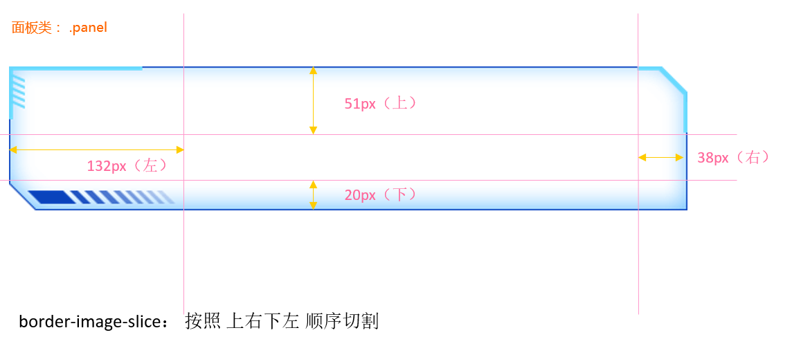

# 1. 数据可视化项目适配方案

### 1.1 项目需求

* <a href="resource/效果图.png">设计稿</a>宽度1920px
* PC端适配：宽度在1024px-1920px之间，元素宽高自适应

### 1.2 适配方案

* `flexible.js`检测浏览器宽度，修改HTML文字大小
* `rem`单位，页面根据**rem**适配大小，配合`cssrem`插件
* `flex`布局

`flexible.js`把屏幕分为24等份，PC设计稿宽度为**1920px**，所以cssrem插件的基准值是**80px**，rem值自动生成

把宽度约束在1024-1920里面有适配

```css
@media screen and (max-width: 1024px){
    html {
        font-size: 42.66px !important;
    }
}
@media screen and (max-width: 1920px){
    html {
        font-size: 80px !important;
    }
}
```

### 1.3 效果预览


# 2. 数据可视化项目开发

### 2.1 项目结构


### 2.2 项目核心

1. 布局
2. 使用ECharts填充图表

### 2.3 项目技术

##### 1. CSS部分

* `base.css`初始化
* `index.css`布局

##### 2. JS部分

* `echarts.min.js`图表
* `jquery.min.js`快速开发
* `flexible.js`rem布局
  * 由于将其设计稿分为24等份
  * 
  * 将**flexible.js源码**中的<span style="color:red">红框部分</span>改为`24`
* `index.js`开发动效

##### 3. font部分

* `iconmoon`

##### 4. 开发所需软件

* `vscode`开发
* `Live Server`插件用于即时查看效果
* `px to rem & rpx(cssrem)`插件用于将px单位转换为rem单位
  * 通过设计稿获取1rem=?px
  * 上述中设计稿1920px，将其分为24等份，每一份为80px
  * 
  * **Cssrem插件设置**->**Root Font Size**修改为80，即代表`1rem = 80px`

### 2.4 项目基础布局

##### 1. 理论布局


最大的盒子叫做`viewport`，将里面的内容分为3列，每一列叫做`column`

##### 2. HTML结构

```html
<body>
    <!-- 最大的盒子 -->
    <div class="viewport">
        <div class="column"></div>
        <div class="column"></div>
        <div class="column"></div>
    </div>
</body>
```

* 效果图是`1920*1080`
* body设置`背景图片`，行高设置`1.15`
* `viewport`为主体部分，限制最小宽度**1024px**，最大宽度**1920px**。最小高度**720px**
  * viewport**绝对居中**显示
  * **logo.png**作为背景图
  * padding内间距**56px 20px 0**
* `column`为每一列数据，一共三列，占比分别的**3:4:3**
  * 中间容器的margin外间距**32px 20px 0**

##### 3. CSS样式

```css
body {
    background: url(../images/bg.jpg) no-repeat 0 0 / cover;
    /* background-size: cover; */
}

.viewport {
    min-width: 1024px;
    max-width: 1920px;
    margin: 0 auto;
    background: url(../images/logo.png) no-repeat 0 0 / contain;
    min-height: 780px;
    display: flex;
    padding: .7rem .25rem 0;
}

.viewport .column {
    flex: 3;
    margin: .4rem .25rem 0;
}

.viewport .column:nth-child(2) {
    flex: 4;
}
```

* **background**中如果想要将**background-size**也写到里面，需要在前面加上0 0位置，并且size属性前需要加`/`
* 详细请看[CSS3背景图片background属性简写/连写](https://www.w3h5.com/post/370.html)

### 2.5 项目模块布局

##### 1. 理论布局


##### 2. 边框图片

我们从效果图中可以看到，每一个模块的边框都有图片，所以需要我们学习新的知识**边框图片**`border-image`，详细可看<a href="第三方笔记/数据可视化.md">第三方笔记 08-边框图片 详解</a>

###### 边框图片的使用场景

盒子大小不一，但是边框样式相同，此时就需要用到边框图片来完成

###### 边框图片切图原理（重要）

最主要的就是把4个角切出去（九宫格的由来），中间部分可以铺排、拉伸或者环绕。


上图可以看到，<span style="color: red">4个蓝色</span>就是<span style="color: red">4个角</span>，通过不同的设置可以实现3种不同的效果，铺排、拉伸、环绕。

###### 边框图片使用语法（重要）

| 属性                | 描述                                                         |
| ------------------- | ------------------------------------------------------------ |
| border-image-source | 用在边框的图片的路径                                         |
| border-image-slice  | 图片边框向内偏移（裁剪的尺寸，<span style="color:red">不带单位</span>，<span style="color:red">上右下左</span>的顺序） |
| border-image-width  | 图片边框的宽度（<span style="color:red">带单位</span>，注意是边框图片的宽度不是边框的宽度，如果不写默认是边框的宽度） |
| border-image-repeat | 图片边框是否平铺(<span style="color: blue">repeat</span>)、铺满(<span style="color: blue">round</span>)、拉伸(<span style="color: blue">stretch</span>)，默认拉伸) |


组合写法：

```css
border-image: url(images/border.jpg) 167/20px round;
```

拆分写法：

```css
border-image-source: url(images/border.jpg);
border-image-slice: 167 167 167 167;
border-image-width: 20px;
border-image-repeat: round;
```

##### 3. 公共面板样式开发

> 所有的面板的基础样式是一致的，提前布局好。

切割示例图：



- 面板 .panel 
  - 因为使用了`border-width`，所以内容会被边框挤开，此时需要将内容放入到一个新的盒子.inner中，再将.inner的位置调整为**负的边框的宽度**。
  - 容器 .inner内边距是 上下<span style="color:red">24px</span>  左右 <span style="color:red">36px</span>，记得转化为rem单位

```css
/* 公共面板样式  */
.panel {
    position: relative;
    /* 如果边框图片加载不出来边框就显示为透明 */
    border: 15px solid transparent;
    border-width: .6375rem .475rem .25rem 1.65rem;
    border-image-source: url(../images/border.png);
    border-image-slice: 51 38 20 132;
    margin-bottom: .25rem;
    box-sizing: border-box;
}
.inner {
    position: absolute;
    top: -0.6375rem;
    left: -1.65rem;
    right: -0.475rem;
    bottom: -0.25rem;
    padding: .1rem .45rem;
   
}
.panel h3 {
  font-size: 0.25rem;
  color: #fff;
  font-weight: 400;
}
```

##### 4. 通过类名调用字体图标

1. HTML引入字体CSS文件

   ```html
   <link rel="stylesheet" href="fonts/style.css" />
   ```

2. 直接调用类名就可以

   ```html
   <span class="icon-angellist"></span>
   ```

### 2.6 项目概览模块

##### 1. 效果


##### 2. 布局概述

* 使用`ul>li`布局4个模块
* 使用`flex`布局，其中`justify-content: space-between;`

##### 3. 样式数据

* 容器overview高度<span style="color:blue">110px</span>
* 上方字体<span style="color:blue">h4 28px #fff 左边距4.8px 下边距3.2px</span>
* 下方字体<span style="color:blue">span 16px #4c9bfd</span>

##### 4. HTML结构

```html
<div class="overview panel">
    <div class="inner">
        <ul>
            <li>
                <h4>2,190</h4>
                <span>
                    <i class="icon-dot" style="color: #006cff"></i>
                    设备总数
                </span>
            </li>
            <li class="item">
                <h4>190</h4>
                <span>
                    <i class="icon-dot" style="color: #6acca3"></i>
                    季度新增
                </span>
            </li>
            <li>
                <h4>3,001</h4>
                <span>
                    <i class="icon-dot" style="color: #6acca3"></i>
                    运营设备
                </span>
            </li>
            <li>
                <h4>108</h4>
                <span>
                    <i class="icon-dot" style="color: #ed3f35"></i>
                    异常设备
                </span>
            </li>
        </ul>
    </div>
</div>
```

##### 5. CSS

```css
/* 概览模块制作 */

.overview {
    height: 1.375rem;
}

.overview ul {
    display: flex;
    justify-content: space-between;
}

.overview h4 {
    font-size: .35rem;
    color: #fff;
    margin: 0 0 .04rem .06rem;
    font-weight: normal;
}

.overview span {
    color: #4c9bfd;
    font-size: .2rem;
}
```

### 2.7 项目监控模块

##### 1. 效果


##### 2. 布局概述

* tab栏可切换故障设备监控/异常设备监控两种
* `tabs`上方切换点击区域
* `content`数据显示区域
  * `head`上方提示部分
  * `marquee-view`下方显示部分
    * `row`无缝滚动每一行

##### 3. 样式数据

* 容器monitor高度<span style="color:blue">480px</span>
* .inner 容器内间距  24px  0
* .tabs 容器内间距 0 36px
  - a 容器  颜色： #1950c4  内间距：0 27px  字体：18px
  - 第一个a容器  去除左侧内间距   加上右侧2px宽度边框#00f2f1
  - 激活的时候  颜色白色
* .content容器
  - 占满剩余高度  flex:1
  - 默认隐藏
* .head 容器
  - 行高 1.05  背景 rgba(255, 255, 255, 0.1)  内间距  12px 36px  颜色 #68d8fe 字体大小 14px
* row 容器
  - 行高 1.05  内间距  12px 36px  颜色 #68d8ff 字体大小 12px
  - .icon-dot 字体图标   绝对定位  左边0.2rem  透明度0
  - 鼠标经过后：背景 rgba(255, 255, 255, 0.1)  透明度1
* col容器
  - 宽度：1rem   2.5rem    1rem
  - 第二个col   一行不换行  溢出  省略

##### 4. HTML结构

```html
<!--监控-->
<div class="monitor panel">
    <div class="inner">
        <div class="tabs">
            <a href="javascript:;" class="active">故障设备监控</a>
            <a href="javascript:;">异常设备监控</a>
        </div>
        <div class="content">
            <div class="head">
                <span class="col">故障时间</span>
                <span class="col">设备地址</span>
                <span class="col">异常代码</span>
            </div>
            <div class="marquee-view">
                <div class="marquee">
                    <div class="row">
                        <span class="col">20180701</span>
                        <span class="col">11北京市昌平西路金燕龙写字楼</span>
                        <span class="col">1000001</span>
                        <span class="icon-dot"></span>
                    </div>
                    <div class="row">
                        <span class="col">20190601</span>
                        <span class="col">北京市昌平区城西路金燕龙写字楼</span>
                        <span class="col">1000002</span>
                        <span class="icon-dot"></span>
                    </div>
                    <div class="row">
                        <span class="col">20190704</span>
                        <span class="col">北京市昌平区建材城西路金燕龙写字楼</span>
                        <span class="col">1000003</span>
                        <span class="icon-dot"></span>
                    </div>
                    <div class="row">
                        <span class="col">20180701</span>
                        <span class="col">北京市昌平区建路金燕龙写字楼</span>
                        <span class="col">1000004</span>
                        <span class="icon-dot"></span>
                    </div>
                    <div class="row">
                        <span class="col">20190701</span>
                        <span class="col">北京市昌平区建材城西路金燕龙写字楼</span>
                        <span class="col">1000005</span>
                        <span class="icon-dot"></span>
                    </div>
                    <div class="row">
                        <span class="col">20190701</span>
                        <span class="col">北京市昌平区建材城西路金燕龙写字楼</span>
                        <span class="col">1000006</span>
                        <span class="icon-dot"></span>
                    </div>
                    <div class="row">
                        <span class="col">20190701</span>
                        <span class="col">北京市昌平区建西路金燕龙写字楼</span>
                        <span class="col">1000007</span>
                        <span class="icon-dot"></span>
                    </div>
                    <div class="row">
                        <span class="col">20190701</span>
                        <span class="col">北京市昌平区建材城西路金燕龙写字楼</span>
                        <span class="col">1000008</span>
                        <span class="icon-dot"></span>
                    </div>
                    <div class="row">
                        <span class="col">20190701</span>
                        <span class="col">北京市昌平区建材城西路金燕龙写字楼</span>
                        <span class="col">1000009</span>
                        <span class="icon-dot"></span>
                    </div>
                    <div class="row">
                        <span class="col">20190710</span>
                        <span class="col">北京市昌平区建材城西路金燕龙写字楼</span>
                        <span class="col">1000010</span>
                        <span class="icon-dot"></span>
                    </div>
                </div>
            </div>
        </div>
        <div class="content">
            <div class="head">
                <span class="col">异常时间</span>
                <span class="col">设备地址</span>
                <span class="col">异常代码</span>
            </div>
            <div class="marquee-view">
                <div class="marquee">
                    <div class="row">
                        <span class="col">20190701</span>
                        <span class="col">北京市昌平区建材城西路金燕龙写字楼</span>
                        <span class="col">1000001</span>
                        <span class="icon-dot"></span>
                    </div>
                    <div class="row">
                        <span class="col">20190701</span>
                        <span class="col">北京市昌平区建材城西路金燕龙写字楼</span>
                        <span class="col">1000002</span>
                        <span class="icon-dot"></span>
                    </div>
                    <div class="row">
                        <span class="col">20190703</span>
                        <span class="col">北京市昌平区建材城西路金燕龙写字楼</span>
                        <span class="col">1000002</span>
                        <span class="icon-dot"></span>
                    </div>
                    <div class="row">
                        <span class="col">20190704</span>
                        <span class="col">北京市昌平区建材城西路金燕龙写字楼</span>
                        <span class="col">1000002</span>
                        <span class="icon-dot"></span>
                    </div>
                    <div class="row">
                        <span class="col">20190705</span>
                        <span class="col">北京市昌平区建材城西路金燕龙写字楼</span>
                        <span class="col">1000002</span>
                        <span class="icon-dot"></span>
                    </div>
                    <div class="row">
                        <span class="col">20190706</span>
                        <span class="col">北京市昌平区建材城西路金燕龙写字楼</span>
                        <span class="col">1000002</span>
                        <span class="icon-dot"></span>
                    </div>
                    <div class="row">
                        <span class="col">20190707</span>
                        <span class="col">北京市昌平区建材城西路金燕龙写字楼</span>
                        <span class="col">1000002</span>
                        <span class="icon-dot"></span>
                    </div>
                    <div class="row">
                        <span class="col">20190708</span>
                        <span class="col">北京市昌平区建材城西路金燕龙写字楼</span>
                        <span class="col">1000002</span>
                        <span class="icon-dot"></span>
                    </div>
                    <div class="row">
                        <span class="col">20190709</span>
                        <span class="col">北京市昌平区建材城西路金燕龙写字楼</span>
                        <span class="col">1000002</span>
                        <span class="icon-dot"></span>
                    </div>
                    <div class="row">
                        <span class="col">20190710</span>
                        <span class="col">北京市昌平区建材城西路金燕龙写字楼</span>
                        <span class="col">1000002</span>
                        <span class="icon-dot"></span>
                    </div>
                </div>
            </div>
        </div>
    </div>
</div>
```

##### 5. CSS

```css
/* 监控区域 */
.monitor{
  height: 6rem;
}
.monitor .inner{
  padding: .3rem 0;
  display: flex;
  flex-direction: column;
}
.monitor .tabs{
  padding: 0 .45rem;
  margin-bottom: 0.225rem;
  display: flex;
}
.monitor .tabs a{
  color:#1950c4;
  font-size: 0.225rem;
  padding: 0 .3375rem;
}
.monitor .tabs a:first-child{
  padding-left: 0;
  border-right: 0.025rem solid #00f2f1;
}
.monitor .tabs a.active{
  color: #fff;
}
.monitor .content{
  flex: 1;
  position: relative;
  display: none;
}
.monitor .head{
  display: flex;
  justify-content: space-between;
  line-height: 1.05;
  background-color: rgba(255, 255, 255, 0.1);
  padding: 0.15rem 0.45rem;
  color: #68d8fe;
  font-size: 0.175rem;
}
.monitor .marquee-view {
  position: absolute;
  top: 0.5rem;
  bottom: 0;
  width: 100%;
  overflow: hidden;
}
.monitor .row{
  display: flex;
  justify-content: space-between;
  line-height: 1.05;
  font-size: 0.15rem;
  color: #61a8ff;
  padding: 0.15rem 0.45rem;
}
.monitor .row .icon-dot{
  position: absolute;
  left: 0.2rem;
  opacity: 0;
}
.monitor .row:hover {
  background-color: rgba(255, 255, 255, 0.1);
  color: #68d8fe;
}
.monitor .row:hover .icon-dot{
  opacity: 1;
}
.monitor .col:first-child{
  width: 1rem;
}
.monitor .col:nth-child(2){
  width: 2.5rem;
  white-space: nowrap;
  text-overflow: ellipsis;
  overflow: hidden;
}
.monitor .col:nth-child(3){
  width: 1rem;
}
```

##### 6. JS

由于具有tab栏切换和无缝滚动动效，所以需要JS代码动效

**上方切换效果**

```javascript
// 上方故障/异常切换
$(".monitor .tabs").on("click", "a", function() {
    $(this).addClass("active").siblings().removeClass("active");
    $(".monitor .content").eq($(this).index()).show().siblings(".content").hide();
});
```

**下方无缝滚动效果**

* 实现思路
  * 先克隆列表，追加在后面
  * marquee-view 占满剩余高度，溢出隐藏
    * 绝对定位，top 1.6rem  bottom 0
    * 宽度100%，溢出隐藏
  * 使用CSS3的animation实现动画
  * 使用translateY向上位移50%
  * 动画时间15s，匀速播放，循环执行

JS部分

```javascript
$(".marquee-view .marquee").each(function() {
    const rows = $(this).children().clone();
    $(this).append(rows);
});
```

CSS部分

```css
/* 通过CSS3动画滚动marquee */

.marquee-view .marquee {
    animation: move 15s linear infinite;
}

@keyframes move {
    0% {}
    100% {
        transform: translateY(-50%);
    }
}


/* 鼠标经过marquee 就停止动画 */

.marquee-view .marquee:hover {
    animation-play-state: paused;
}
```

### 2.8 项目统计模块

##### 1. 效果


##### 2. 布局概述

* 左侧为`ECharts饼图`
* 右侧为`li列表`

##### 3. 样式数据

* 点位统计模块point高度<span style="color:blue">340px</span>

##### 4. HTML结构

```html
<div class="point panel">
    <div class="inner">
        <h3>点位分布统计</h3>
        <div class="chart">
            <div class="pie"></div>
            <div class="data">
                <div class="item">
                    <h4>320,11</h4>
                    <span>
                        <i class="icon-dot" style="color: #ed3f35"></i>
                        点位总数
                    </span>
                </div>
                <div class="item">
                    <h4>418</h4>
                    <span>
                        <i class="icon-dot" style="color: #eacf19"></i>
                        本月新增
                    </span>
                </div>
            </div>
        </div>
    </div>
</div>
```

##### 5. CSS

```css
/* 点位 */
.point {
  height: 4.25rem;
}
.point .chart {
  display: flex;
  margin-top: 0.3rem;
  justify-content: space-between;
}
.point .pie {
  width: 3.9rem;
  height: 3rem;
  margin-left: -0.125rem;
}
.point .data {
  display: flex;
  flex-direction: column;
  justify-content: space-between;
  width: 2.1rem;
  padding: .45rem .375rem;
  box-sizing: border-box;
  background-image: url(../images/rect.png);
  background-size: cover;
}
.point h4 {
  margin-bottom: 0.15rem;
  font-size: .35rem;
  color: #fff;
}
.point span {
  display: block;
  color: #4c9bfd;
  font-size: .2rem;
}
```

##### 6. 使用ECharts饼形图

* 先在官网找到类似的图表引入到页面中
  * 此饼形图类似图表：https://echarts.apache.org/v4/examples/zh/editor.html?c=pie-roseType
* 根据具体需求修改配置

###### 第一步：参考官方的例子，熟悉里面的配置

```javascript
option = {
    // 提示框组件
    tooltip: {
      // trigger 触发方式。非轴图形使用item的意思是放到数据对应图形上触发提示
      trigger: 'item',
      // 格式化提示内容：
      // a 代表series系列图表名称  
      // b 代表series数据名称 data 里面的name    
      // c 代表series数据值 data 里面的value   
      // d代表  当前数据/总数据的比例
      formatter: "{a} <br/>{b} : {c} ({d}%)"
    },
    // 控制图表
    series: [
      {
        // 图表名称
        name: '点位统计',
        // 图表类型
        type: 'pie',
        // 南丁格尔玫瑰图 有两个圆  内圆半径10%  外圆半径70%
        // 饼形图半径。 可以是像素。也可以是百分比（ 基于DOM容器大小）第一项是内半径，第二项是外半径（通过它可以实现饼形图大小）
        radius: ['10%', '70%'],
        // 图表中心位置 left 50%  top 50%  距离图表DOM容器
        center: ['50%', '50%'],
        // radius 半径模式，另外一种是 area 面积模式
        roseType: 'radius',
        // 数据集 value 数据的值 name 数据的名称
        data: [
            {value:10, name:'rose1'},
            {value:5, name:'rose2'},
            {value:15, name:'rose3'},
            {value:25, name:'rose4'},
            {value:20, name:'rose5'},
            {value:35, name:'rose6'},
            {value:30, name:'rose7'},
            {value:40, name:'rose8'}
        ]
      }
    ]
};
```

###### 第二步，根据具体需求修改配置

* 需求1：设置每一个模块的颜色

  ```javascript
  color: ['#006cff', '#60cda0', '#ed8884', '#ff9f7f', '#0096ff', '#9fe6b8', '#32c5e9', '#1d9dff'],
  ```

* 需求2：修改饼形图大小(series)

  ```javascript
  radius: ['10%', '70%'],
  ```

* 需求3：把饼形图显示模式改为半径模式

  ```javascript
  roseType: "radius",
  ```

* 需求4：数据更改替换(series里的data对象)

  ```javascript
  { value: 20, name: '云南' },
  { value: 26, name: '北京' },
  { value: 24, name: '山东' },
  { value: 25, name: '河北' },
  { value: 20, name: '江苏' },
  { value: 25, name: '浙江' },
  { value: 30, name: '四川' },
  { value: 42, name: '湖北' }
  ```

* 需求5：将字体略改小一些10px，在series里面修改。饼图图形上的文字标签可以控制饼形图的文字格式，label对象设置

  ```javascript
  series: [
      {
          name: "面积模式",
          type: "pie",
          radius: [30, 110],
          center: ["50%", "50%"],
          roseType: "radius",
          // 文本标签控制饼形图文字的相关样式， 注意它是一个对象
          label: {
              fontSize: 10
          },
      }
  ]
  ```

* 需求6：防止缩放时，引导线过长。引导线略短，series里的labelLine对象设置

  * 连接图表 6px
  * 连接文字 8px

  ```javascript
  // 引导线调整
  labelLine: {
      // 连接扇形图线长
      length: 6,
      // 连接文字线长
      length2: 8
  } 
  ```

###### 点位统计图完整JS代码

```javascript
// 点位分布统计模块
(function() {
  // 1. 实例化对象
  var myChart = echarts.init(document.querySelector(".pie"));
  // 2. 指定配置项和数据
  var option = {
    tooltip: {
      trigger: "item",
      formatter: "{a} <br/>{b} : {c} ({d}%)"
    },
    // 注意颜色写的位置
    color: [
      "#006cff",
      "#60cda0",
      "#ed8884",
      "#ff9f7f",
      "#0096ff",
      "#9fe6b8",
      "#32c5e9",
      "#1d9dff"
    ],
    series: [
      {
        name: "点位统计",
        type: "pie",
        // 如果radius是百分比则必须加引号
        radius: ["10%", "70%"],
        center: ["50%", "50%"],
        roseType: "radius",
        data: [
          { value: 20, name: "云南" },
          { value: 26, name: "北京" },
          { value: 24, name: "山东" },
          { value: 25, name: "河北" },
          { value: 20, name: "江苏" },
          { value: 25, name: "浙江" },
          { value: 30, name: "四川" },
          { value: 42, name: "湖北" }
        ],
        // 修饰饼形图文字相关的样式 label对象
        label: {
          fontSize: 10
        },
        // 修饰引导线样式
        labelLine: {
          // 连接到图形的线长度
          length: 6,
          // 连接到文字的线长度
          length2: 8
        }
      }
    ]
  };

  // 3. 配置项和数据给我们的实例化对象
  myChart.setOption(option);
  // 4. 当我们浏览器缩放的时候，图表也等比例缩放
  window.addEventListener("resize", function() {
    // 让我们的图表调用 resize这个方法
    myChart.resize();
  });
})();
```

# 3. 项目补充知识点

### 3.1 立即执行函数用法

JS文件中，具有大量的变量命名，特别是在ECharts中，需要大量的初始化ECharts对象。为了防止变量名冲突（变量污染），我们采用立即执行函数策略

```javascript
(function(){})();
```

我们在每一个模块都写一个立即执行函数。

```javascript
(function(){
    let num = 10;
})();

(function(){
    let num = 10;
})();
```

注意：多个立即执行函数中间必须要有`;`隔开

