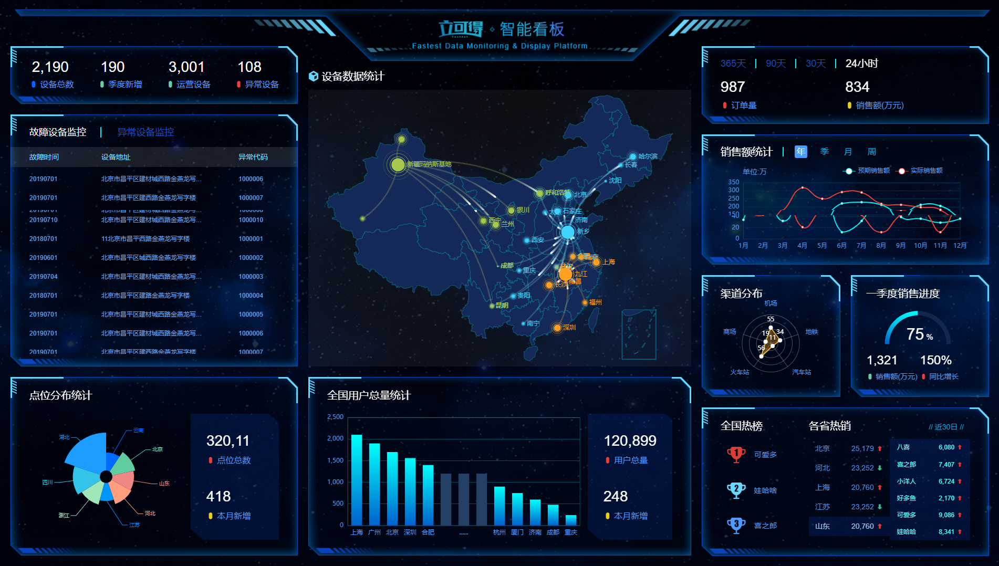

### 01-项目介绍
应对现在数据可视化的趋势，越来越多企业需要在很多场景(营销数据，生产数据，用户数据)下使用，可视化图表来展示体现数据，让数据更加直观，数据特点更加突出。我们引入 '立可得' 数据可视化项目。

该项目除了使用了基础的DIV+CSS布局，还引入了一些C3技术，还引入了各类图表的绘制，以及高级的地图数据可视化案例。主要功能有：饼状图、柱状图、线形图、地图 ...



### 02-使用技术

完成该项目需要具备以下知识：

- div + css 布局
- flex 布局
- css3动画
- css3渐变
- css3边框图片
- 原生js + jquery 使用
- rem适配
- **echarts基础**

粗略代码统计：

- css  580行
- html  450行
- js 400行 (有效)

### 03-Echarts-介绍

> ECharts，一个使用 JavaScript 实现的开源可视化库，可以流畅的运行在 PC 和移动设备上，兼容当前绝大部分浏览器（IE8/9/10/11，Chrome，Firefox，Safari等），底层依赖矢量图形库 [ZRender](https://github.com/ecomfe/zrender)，提供直观，交互丰富，可高度个性化定制的数据可视化图表。

大白话：

- 是一个JS插件
- 性能好可流畅运行PC与移动设备
- 兼容主流浏览器
- 提供很多常用图表，且可**定制**。
  - [折线图](https://echarts.apache.org/zh/option.html#series-line)、[柱状图](https://echarts.apache.org/zh/option.html#series-bar)、[散点图](https://echarts.apache.org/zh/option.html#series-scatter)、[饼图](https://echarts.apache.org/zh/option.html#series-pie)、[K线图](https://echarts.apache.org/zh/option.html#series-candlestick)

### 04-Echarts-体验

官方教程：[五分钟上手ECharts](https://echarts.apache.org/zh/tutorial.html#5 分钟上手 ECharts)

自己步骤：

- 下载echarts  https://github.com/apache/incubator-echarts/tree/4.5.0  
- 引入echarts  `dist/echarts.min.js`
- 准备一个具备大小的DOM容器

```html
<div id="main" style="width: 600px;height:400px;"></div>
```

- ###### 初始化echarts实例对象

```js
var myChart = echarts.init(document.getElementById('main'));
```

- 指定配置项和数据(option)

```js
var option = {
    xAxis: {
        type: 'category',
        data: ['Mon', 'Tue', 'Wed', 'Thu', 'Fri', 'Sat', 'Sun']
    },
    yAxis: {
        type: 'value'
    },
    series: [{
        data: [820, 932, 901, 934, 1290, 1330, 1320],
        type: 'line'
    }]
};
```

- 将配置项设置给echarts实例对象

```js
myChart.setOption(option);
```

### 05-Echarts-基础配置

> 需要了解的主要配置：`series` `xAxis` `yAxis` `grid` `tooltip` `title` `legend` `color` 

- series
  - 系列列表。每个系列通过 `type` 决定自己的图表类型
  - 大白话：图标数据，指定什么类型的图标，可以多个图表重叠。

- xAxis：直角坐标系 grid 中的 x 轴

  -  boundaryGap: 坐标轴两边留白策略 true，这时候刻度只是作为分隔线，标签和数据点都会在两个刻度之间的带(band)中间。

- yAxis：直角坐标系 grid 中的 y 轴

- grid：直角坐标系内绘图网格。 

- title：标题组件

- tooltip：提示框组件

- legend：图例组件

- color：调色盘颜色列表

  数据堆叠，同个类目轴上系列配置相同的`stack`值后 后一个系列的值会在前一个系列的值上相加。

演示代码：

```js
var option = {
    color: ['pink', 'blue', 'green', 'skyblue', 'red'],
    title: {
        text: '我的折线图'
    },
    tooltip: {
        trigger: 'axis'
    },
    legend: {
        data: ['直播营销', '联盟广告', '视频广告', '直接访问']
    },
    grid: {
        left: '3%',
        right: '3%',
        bottom: '3%',
        // 当刻度标签溢出的时候，grid 区域是否包含坐标轴的刻度标签。如果为true，则显示刻度标签
        // 如果left right等设置为 0% 刻度标签就溢出了，此时决定是否显示刻度标签
        containLabel: true
    },
    toolbox: {
        feature: {
            saveAsImage: {}
        }
    },
    xAxis: {
        type: 'category',
        // 坐标轴两边留白策略 true，这时候刻度只是作为分隔线，标签和数据点都会在两个刻度之间的带(band)中间。
        boundaryGap: false,
        data: ['星期一', '星期二', '周三', '周四', '周五', '周六', '周日']
    },
    yAxis: {
        type: 'value'
    },
    series: [
        {
            name: '直播营销',
            // 图表类型是线形图
            type: 'line',
            data: [120, 132, 101, 134, 90, 230, 210]
        },
        {
            name: '联盟广告',
            type: 'line',

            data: [220, 182, 191, 234, 290, 330, 310]
        },
        {
            name: '视频广告',
            type: 'line',

            data: [150, 232, 201, 154, 190, 330, 410]
        },
        {
            name: '直接访问',
            type: 'line',

            data: [320, 332, 301, 334, 390, 330, 320]
        }
    ]
};
```

### 06-REM适配

- 设计稿是1920px  

- PC端适配： 宽度在 1024~1920之间页面元素宽高自适应

  1. flexible.js 把屏幕分为 24 等份

  2. cssrem 插件的基准值是  80px 

     插件-配置按钮---配置扩展设置--Root Font Size 里面 设置。 

     但是别忘记重启vscode软件保证生效

  3. 要把屏幕宽度约束在1024~1920之间有适配，实现代码：

```js
// 实现rem适配
@media screen and (max-width: 1024px) {
     html {
         font-size: 42.66px !important;
     }
 }

 @media screen and (min-width: 1920px) {
     html {
         font-size: 80px !important;
     }
 }
```


### 07-基础布局

html结构：

```html
<body>
  <div class="viewport">
  	<div class="column">
        <!--概览-->                                    
    	<div></div>
        <!--监控-->                                    
    	<div></div> 
        <!--点位-->                                    
    	<div></div>                                           
    </div>
    <div class="column">
        <!--地图-->                                    
    	<div></div>
        <!--用户-->                                    
    	<div></div>                                          
    </div>
    <div class="column">
        <!--订单-->                                    
    	<div></div>
        <!--销售-->                                    
    	<div></div>                                  
    	<div>
      	<!--渠道-->                                    
    		<div></div>
      	<!--季度-->                                    
    		<div></div>
      </div>
			<!--排行-->                                    
    	<div></div>                                     
    </div>                        
  </div>
</body>
```

- 效果图： 1920px *  1078px 
- body 设置背景图 ，行高1.15
- viewport 主体容器，限制最小宽度1024px，与最大宽度1920px，最小高度780px。
  - 需要居中显示
  - 使用logo.png做为背景图，在容器内显示
  - 内间距 88px 20px 0
- column 列容器，分三列，占比 3：4：3
  - 中间容器外间距  32px  20px 0

css样式：

```css
/* 基础布局 */
body{
  font-family: Arial, Helvetica, sans-serif;
  margin: 0;
  padding: 0;
  font-size: 0.5rem;
  line-height: 1.15;
  background: url(../images/bg.jpg) no-repeat 0 0 / cover;
}
h4,h3,ul{
  margin: 0;
  padding: 0;
  font-weight: normal;
}
ul{
  list-style: none;
}
a{
  text-decoration: none;
}
.viewport{
  max-width: 1920px;
  min-width: 1024px;
  margin: 0 auto;
  min-height: 780px;
  padding: 3.667rem 0.833rem 0;
  background: url(../images/logo.png) no-repeat 0 0 / contain;
  display: flex;
}
.column{
  flex: 3;
  position: relative;
}
.column:nth-child(2){
  flex: 4;
  margin: 1.333rem 0.833rem 0;
}
```


### 08-边框图片

> css3中自适应边框图片运用：


组合写法：

```css
border-image: url("images/border.jpg") 167/20px round;
```

拆分写法：

```css
border-image-source: url("images/border.jpg");
border-image-slice: 167 167 167 167;
border-image-width: 20px;
border-image-repeat: round;
```

解释：

- 边框图片资源地址
- 裁剪尺寸（上 右 下 左）单位默认px，可使用百分百。
- 边框图片的宽度，默认边框的宽度。
- 平铺方式：
  - stretch 拉伸（默认）
  - repeat 平铺，从边框的中心向两侧开始平铺，会出现不完整的图片。
  - round 环绕，是完整的使用切割后的图片进行平铺。

DEMO代码：

```html
<!DOCTYPE html>
<html lang="en">
<head>
    <meta charset="UTF-8">
    <title>边框图片</title>
    <style>
        ul{
            margin: 0;
            padding: 0;
            list-style: none;
        }
        li{
            width: 350px;
            height: 160px;
            border: 20px solid #ccc;
            margin-top: 20px;
        }
        li:nth-child(1){
            /*border-image: url("images/border.jpg") 167/20px round;*/
            border-image-source: url("images/border.jpg");
            border-image-slice: 167 167 167 167;
            border-image-width: 20px;
            /*环绕  是完整的使用切割后的图片进行平铺*/                    
            border-image-repeat: round; 
        }
        li:nth-child(2){
            /*平铺 从边框的中心向两侧开始平铺 会出现不完整的图片*/                                         
          border-image: url("images/border.jpg") 167/20px repeat;
        }
        li:nth-child(3){
            /*默认的平铺方式*/
            border-image: url("images/border.jpg") 167/20px stretch;
        }
    </style>
</head>
<body>
<ul>
    <li></li>
    <li></li>
    <li></li>
</ul>
</body>
</html>
```


### 09-公用面板样式

> 所有的面板的基础样式是一致的，提前布局好。

切割示例图：


- 面板 .panel 
  - 容器 .inner   内边距是 上下24px  左右 36px

```css

/* 公共面板样式  */
.panel {
    position: relative;
    border: 15px solid transparent;
    border-width: .6375rem .475rem .25rem 1.65rem;
    border-image-source: url(../images/border.png);
    border-image-slice: 51 38 20 132;
    margin-bottom: .25rem;
}
.inner {
    position: absolute;
    top: -0.6375rem;
    left: -1.65rem;
    right: -0.475rem;
    bottom: -0.25rem;
    padding: .3rem .45rem;
   
}
.panel h3 {
  font-size: 0.25rem;
  color: #fff;
  font-weight: 400;
}
```


### 10-概览区域(overview)-布局

html结构：

```html
      <div class="overview panel">
        <div class="inner">
          <ul>
            <li>
              <h4>2,190</h4>
              <span>
                <i class="icon-dot" style="color: #006cff"></i>
                设备总数
              </span>
            </li>
            <li class="item">
              <h4>190</h4>
              <span>
                <i class="icon-dot" style="color: #6acca3"></i>
                季度新增
              </span>
            </li>
            <li>
              <h4>3,001</h4>
              <span>
                <i class="icon-dot" style="color: #6acca3"></i>
                运营设备
              </span>
            </li>
            <li>
              <h4>108</h4>
              <span>
                <i class="icon-dot" style="color: #ed3f35"></i>
                异常设备
              </span>
            </li>
            </ul>
        </div>
      </div>
```

样式描述：

- 容器高度 110px
- h4字体  28px   #fff   左边距 4.8px   下间隙 8px
- span字体  16px  #4c9bfd

```css
/* 概览区域 */

.overview {
    height: 1.375rem;
}
.overview ul {
    display: flex;
    justify-content: space-between;
}
.overview ul li h4 {
    font-size: .35rem;
    color: #fff;
    margin: 0 0 .1rem .06rem;
}
.overview ul li span {
    font-size: .2rem;
    color: #4c9bfd;
}
```


### 11-监控区域(monitor)-布局

html结构：

```html
      <!--监控-->
      <div class="monitor panel">
        <div class="inner">
          <div class="tabs">
            <a href="javascript:;" class="active">故障设备监控</a>
            <a href="javascript:;" >异常设备监控</a>
          </div>
          <div class="content">
            <div class="head">
              <span class="col">故障时间</span>
              <span class="col">设备地址</span>
              <span class="col">异常代码</span>
            </div>
            <div class="marquee-view">
              <div class="marquee">
                <div class="row">
                  <span class="col">20180701</span>
                  <span class="col">11北京市昌平西路金燕龙写字楼</span>
                  <span class="col">1000001</span>
                  <span class="icon-dot"></span>
                </div>
                <div class="row">
                  <span class="col">20190601</span>
                  <span class="col">北京市昌平区城西路金燕龙写字楼</span>
                  <span class="col">1000002</span>
                  <span class="icon-dot"></span>
                </div>
                <div class="row">
                  <span class="col">20190704</span>
                  <span class="col">北京市昌平区建材城西路金燕龙写字楼</span>
                  <span class="col">1000003</span>
                  <span class="icon-dot"></span>
                </div>
                <div class="row">
                  <span class="col">20180701</span>
                  <span class="col">北京市昌平区建路金燕龙写字楼</span>
                  <span class="col">1000004</span>
                  <span class="icon-dot"></span>
                </div>
                <div class="row">
                  <span class="col">20190701</span>
                  <span class="col">北京市昌平区建材城西路金燕龙写字楼</span>
                  <span class="col">1000005</span>
                  <span class="icon-dot"></span>
                </div>
                <div class="row">
                  <span class="col">20190701</span>
                  <span class="col">北京市昌平区建材城西路金燕龙写字楼</span>
                  <span class="col">1000006</span>
                  <span class="icon-dot"></span>
                </div>
                <div class="row">
                  <span class="col">20190701</span>
                  <span class="col">北京市昌平区建西路金燕龙写字楼</span>
                  <span class="col">1000007</span>
                  <span class="icon-dot"></span>
                </div>
                <div class="row">
                  <span class="col">20190701</span>
                  <span class="col">北京市昌平区建材城西路金燕龙写字楼</span>
                  <span class="col">1000008</span>
                  <span class="icon-dot"></span>
                </div>
                <div class="row">
                  <span class="col">20190701</span>
                  <span class="col">北京市昌平区建材城西路金燕龙写字楼</span>
                  <span class="col">1000009</span>
                  <span class="icon-dot"></span>
                </div>
                <div class="row">
                  <span class="col">20190710</span>
                  <span class="col">北京市昌平区建材城西路金燕龙写字楼</span>
                  <span class="col">1000010</span>
                  <span class="icon-dot"></span>
                </div>
              </div>
            </div>
          </div>
          <div class="content">
            <div class="head">
              <span class="col">异常时间</span>
              <span class="col">设备地址</span>
              <span class="col">异常代码</span>
            </div>
            <div class="marquee-view">
              <div class="marquee">
                <div class="row">
                  <span class="col">20190701</span>
                  <span class="col">北京市昌平区建材城西路金燕龙写字楼</span>
                  <span class="col">1000001</span>
                  <span class="icon-dot"></span>
                </div>
                <div class="row">
                  <span class="col">20190701</span>
                  <span class="col">北京市昌平区建材城西路金燕龙写字楼</span>
                  <span class="col">1000002</span>
                  <span class="icon-dot"></span>
                </div>
                <div class="row">
                  <span class="col">20190703</span>
                  <span class="col">北京市昌平区建材城西路金燕龙写字楼</span>
                  <span class="col">1000002</span>
                  <span class="icon-dot"></span>
                </div>
                <div class="row">
                  <span class="col">20190704</span>
                  <span class="col">北京市昌平区建材城西路金燕龙写字楼</span>
                  <span class="col">1000002</span>
                  <span class="icon-dot"></span>
                </div>
                <div class="row">
                  <span class="col">20190705</span>
                  <span class="col">北京市昌平区建材城西路金燕龙写字楼</span>
                  <span class="col">1000002</span>
                  <span class="icon-dot"></span>
                </div>
                <div class="row">
                  <span class="col">20190706</span>
                  <span class="col">北京市昌平区建材城西路金燕龙写字楼</span>
                  <span class="col">1000002</span>
                  <span class="icon-dot"></span>
                </div>
                <div class="row">
                  <span class="col">20190707</span>
                  <span class="col">北京市昌平区建材城西路金燕龙写字楼</span>
                  <span class="col">1000002</span>
                  <span class="icon-dot"></span>
                </div>
                <div class="row">
                  <span class="col">20190708</span>
                  <span class="col">北京市昌平区建材城西路金燕龙写字楼</span>
                  <span class="col">1000002</span>
                  <span class="icon-dot"></span>
                </div>
                <div class="row">
                  <span class="col">20190709</span>
                  <span class="col">北京市昌平区建材城西路金燕龙写字楼</span>
                  <span class="col">1000002</span>
                  <span class="icon-dot"></span>
                </div>
                <div class="row">
                  <span class="col">20190710</span>
                  <span class="col">北京市昌平区建材城西路金燕龙写字楼</span>
                  <span class="col">1000002</span>
                  <span class="icon-dot"></span>
                </div>
              </div>
            </div>
          </div>
        </div>
      </div>
```

**监控区域 monitor 大盒子的高度是 480px**

结构解释：

- .tabs  标签选项   加上active激活选项  默认激活第一个选项
- .content  切换内容  加上`style="display: block;"`显示内容   默认激活第一个内容

样式描述：

- .inner 容器内间距  24px  0
- .tabs 容器内间距 0 36px
  - a 容器  颜色： #1950c4  内间距：0 27px  字体：18px
  - 第一个a容器  去除左侧内间距   加上右侧2px宽度边框#00f2f1
  - 激活的时候  颜色白色
- .content容器
  - 占满剩余高度  flex:1
  - 默认隐藏
- .head 容器
  - 行高 1.05  背景 rgba(255, 255, 255, 0.1)  内间距  12px 36px  颜色 #68d8fe 字体大小 14px
- row 容器
  - 行高 1.05  内间距  12px 36px  颜色 #68d8ff 字体大小 12px
  - .icon-dot 字体图标   绝对定位  左边0.2rem  透明度0
  - 鼠标经过后：背景 rgba(255, 255, 255, 0.1)  透明度1
- col容器
  - 宽度：1rem   2.5rem    1rem
  - 第二个col   一行不换行  溢出  省略

```css
/* 监控区域 */
.monitor{
  height: 6rem;
}
.monitor .inner{
  padding: .3rem 0;
  display: flex;
  flex-direction: column;
}
.monitor .tabs{
  padding: 0 .45rem;
  margin-bottom: 0.225rem;
  display: flex;
}
.monitor .tabs a{
  color:#1950c4;
  font-size: 0.225rem;
  padding: 0 .3375rem;
}
.monitor .tabs a:first-child{
  padding-left: 0;
  border-right: 0.025rem solid #00f2f1;
}
.monitor .tabs a.active{
  color: #fff;
}
.monitor .content{
  flex: 1;
  position: relative;
  display: none;
}
.monitor .head{
  display: flex;
  justify-content: space-between;
  line-height: 1.05;
  background-color: rgba(255, 255, 255, 0.1);
  padding: 0.15rem 0.45rem;
  color: #68d8fe;
  font-size: 0.175rem;
}
.monitor .marquee-view {
  position: absolute;
  top: 0.5rem;
  bottom: 0;
  width: 100%;
  overflow: hidden;
}
.monitor .row{
  display: flex;
  justify-content: space-between;
  line-height: 1.05;
  font-size: 0.15rem;
  color: #61a8ff;
  padding: 0.15rem 0.45rem;
}
.monitor .row .icon-dot{
  position: absolute;
  left: 0.2rem;
  opacity: 0;
}
.monitor .row:hover {
  background-color: rgba(255, 255, 255, 0.1);
  color: #68d8fe;
}
.monitor .row:hover .icon-dot{
  opacity: 1;
}
.monitor .col:first-child{
  width: 1rem;
}
.monitor .col:nth-child(2){
  width: 2.5rem;
  white-space: nowrap;
  text-overflow: ellipsis;
  overflow: hidden;
}
.monitor .col:nth-child(3){
  width: 1rem;
}
```


### 12-监控区域-效果

切换功能：

- 绑定 标签页点击 事件
- 当前容器加active其他容器移除active
- index对应的内容容器显示其他容器隐藏

```js
  // 切换
 $(".monitor .tabs").on("click", "a", function() {
    $(this).addClass("active").siblings("a").removeClass("active");
    // console.log($(this).index());
    //   选取对应索引号的content
    $(".monitor .content").eq($(this).index()).show().siblings(".content").hide();
  });
```

动画功能：

- 实现思路：
  - 先克隆列表，追加在后面
  - marquee-view 占满剩余高度，溢出隐藏
    - 绝对定位，top 1.6rem bottom 0 
    - 宽度100%，溢出隐藏
  - 使用animation实现动画
  - 使用 translateY 向上位移 50%
  - 动画时间15s，匀速播放，循环执行。

js代码：

```js
  // 动画
  $(".marquee-view .marquee").each(function() {
    // console.log($(this));
    var rows = $(this).children().clone();
    $(this).append(rows);
  });
```

css代码：

```css
/* 通过CSS3动画滚动marquee */
.marquee-view .marquee {
  animation: move 15s linear infinite;
}
@keyframes move {
  0% {
  }
  100% {
    transform: translateY(-50%);
  }
}
/* 3.鼠标经过marquee 就停止动画 */
.marquee-view .marquee:hover {
  animation-play-state: paused;
}
```


### 13-点位区域(point)-布局

html结构：

```html
      <!-- 点位 -->
      <div class="point panel">
        <div class="inner">
          <h3>点位分布统计</h3>
          <div class="chart">
            <div class="pie"></div>
            <div class="data">
              <div class="item">
                <h4>320,11</h4>
                <span>
                  <i class="icon-dot" style="color: #ed3f35"></i>
                  点位总数
                </span>
              </div>
              <div class="item">
                <h4>418</h4>
                <span>
                  <i class="icon-dot" style="color: #eacf19"></i>
                  本月新增
                </span>
              </div>
            </div>
          </div>
        </div>
      </div>
```

css样式：

point 盒子高度为 340px


```css
/* 点位 */
.point {
  height: 4.25rem;
}
.point .chart {
  display: flex;
  margin-top: 0.3rem;
  justify-content: space-between;
}
.point .pie {
  width: 3.9rem;
  height: 3rem;
  margin-left: -0.125rem;
  background-color: pink;
}
.point .data {
  display: flex;
  flex-direction: column;
  justify-content: space-between;
  width: 2.1rem;
  padding: .45rem .375rem;
  box-sizing: border-box;
  background-image: url(../images/rect.png);
  background-size: cover;
}
.point h4 {
  margin-bottom: 0.15rem;
  font-size: .35rem;
  color: #fff;
}
.point span {
  display: block;
  color: #4c9bfd;
  font-size: .2rem;
}
```


### 14-点位区域-饼图

ECharts图表实现步骤：

- 从官方示例中找到类似图表，适当修改，引入到HTML页面中。
- 按照产品需求，来定制图表。

#### 1. HTML引入图表

~~~JavaScript
// 点位分布统计模块
(function() {
  // 1. 实例化对象
  var myChart = echarts.init(document.querySelector(".pie"));
  // 2. 指定配置项和数据
  var option = {
    tooltip: {
      trigger: "item",
      formatter: "{a} <br/>{b} : {c} ({d}%)"
    },

    series: [
      {
        name: "面积模式",
        type: "pie",
        radius: [30, 110],
        center: ["75%", "50%"],
        roseType: "area",
        data: [
          { value: 10, name: "rose1" },
          { value: 5, name: "rose2" },
          { value: 15, name: "rose3" },
          { value: 25, name: "rose4" },
          { value: 20, name: "rose5" },
          { value: 35, name: "rose6" },
          { value: 30, name: "rose7" },
          { value: 40, name: "rose8" }
        ]
      }
    ]
  };

  // 3. 配置项和数据给我们的实例化对象
  myChart.setOption(option);
})();

~~~


#### 2. 定制需求

第一步：参考官方例子，熟悉里面参数具体含义

```js
option = {
    // 提示框组件
    tooltip: {
      // trigger 触发方式。  非轴图形，使用item的意思是放到数据对应图形上触发提示
      trigger: 'item',
      // 格式化提示内容：
      // a 代表series系列图表名称  
      // b 代表series数据名称 data 里面的name    
      // c 代表series数据值 data 里面的value   
      // d代表  当前数据/总数据的比例
      formatter: "{a} <br/>{b} : {c} ({d}%)"
    },
    // 控制图表
    series: [
      {
        // 图表名称
        name: '点位统计',
        // 图表类型
        type: 'pie',
        // 南丁格尔玫瑰图 有两个圆  内圆半径10%  外圆半径70%
        // 饼形图半径。 可以是像素。也可以是百分比（ 基于DOM容器大小）第一项是内半径，第二项是外半径（通过它可以实现饼形图大小）
        radius: ['10%', '70%'],
        // 图表中心位置 left 50%  top 50%  距离图表DOM容器
        center: ['50%', '50%'],
        // radius 半径模式，另外一种是 area 面积模式
        roseType: 'radius',
        // 数据集 value 数据的值 name 数据的名称
        data: [
                {value:10, name:'rose1'},
                {value:5, name:'rose2'},
                {value:15, name:'rose3'},
                {value:25, name:'rose4'},
                {value:20, name:'rose5'},
                {value:35, name:'rose6'},
                {value:30, name:'rose7'},
                {value:40, name:'rose8'}
            ]
        }
    ]
};
```

第二步：按照需求定制

- 需求1：颜色设置


```js
color: ['#006cff', '#60cda0', '#ed8884', '#ff9f7f', '#0096ff', '#9fe6b8', '#32c5e9', '#1d9dff'],
```

- 需求2：修改饼形图大小 ( series对象)

~~~javascript
radius: ['10%', '70%'],
~~~

- 需求3： 把饼形图的显示模式改为 半径模式

~~~javascript
 roseType: "radius",
~~~

- 需求4：数据使用更换（series对象 里面 data对象）

```js
          { value: 20, name: '云南' },
          { value: 26, name: '北京' },
          { value: 24, name: '山东' },
          { value: 25, name: '河北' },
          { value: 20, name: '江苏' },
          { value: 25, name: '浙江' },
          { value: 30, name: '四川' },
          { value: 42, name: '湖北' }
```

- 需求5：字体略小些  10 px ( series对象里面设置 )

  饼图图形上的文本标签可以控制饼形图的文字的一些样式。   label 对象设置

~~~javascript
series: [
      {
        name: "面积模式",
        type: "pie",
        radius: [30, 110],
        center: ["50%", "50%"],
        roseType: "radius",
        // 文本标签控制饼形图文字的相关样式， 注意它是一个对象
        label: {
          fontSize: 10
        },
      }
    ]
  };
~~~

- 需求6：防止缩放的时候，引导线过长。引导线略短些   (series对象里面的  labelLine  对象设置  ) 
  - 连接图表 6 px
  - 连接文字 8 px

```diff

+        // 文字调整
+        label:{
+          fontSize: 10
+        },
+        // 引导线调整
+        labelLine: {
+          // 连接扇形图线长
+          length: 6,
+          // 连接文字线长
+          length2: 8
+        } 
+      }
+    ],

```

- 需求6：浏览器缩放的时候，图表跟着自动适配。

~~~JavaScript
// 监听浏览器缩放，图表对象调用缩放resize函数
window.addEventListener("resize", function() {
    myChart.resize();
  });
~~~

点位统计完整JavaScript代码：

~~~javascript
// 点位分布统计模块
(function() {
  // 1. 实例化对象
  var myChart = echarts.init(document.querySelector(".pie"));
  // 2. 指定配置项和数据
  var option = {
    tooltip: {
      trigger: "item",
      formatter: "{a} <br/>{b} : {c} ({d}%)"
    },
    // 注意颜色写的位置
    color: [
      "#006cff",
      "#60cda0",
      "#ed8884",
      "#ff9f7f",
      "#0096ff",
      "#9fe6b8",
      "#32c5e9",
      "#1d9dff"
    ],
    series: [
      {
        name: "点位统计",
        type: "pie",
        // 如果radius是百分比则必须加引号
        radius: ["10%", "70%"],
        center: ["50%", "50%"],
        roseType: "radius",
        data: [
          { value: 20, name: "云南" },
          { value: 26, name: "北京" },
          { value: 24, name: "山东" },
          { value: 25, name: "河北" },
          { value: 20, name: "江苏" },
          { value: 25, name: "浙江" },
          { value: 30, name: "四川" },
          { value: 42, name: "湖北" }
        ],
        // 修饰饼形图文字相关的样式 label对象
        label: {
          fontSize: 10
        },
        // 修饰引导线样式
        labelLine: {
          // 连接到图形的线长度
          length: 6,
          // 连接到文字的线长度
          length2: 8
        }
      }
    ]
  };

  // 3. 配置项和数据给我们的实例化对象
  myChart.setOption(option);
  // 4. 当我们浏览器缩放的时候，图表也等比例缩放
  window.addEventListener("resize", function() {
    // 让我们的图表调用 resize这个方法
    myChart.resize();
  });
})();
~~~


### 15-地图区域 (map) -预留布局

html结构：

```html
      <!-- 地图 -->
      <div class="map">
        <h3>
          <span class="icon-cube"></span>
          设备数据统计
        </h3>
        <div class="chart">
          <div class="geo"></div>
        </div>
      </div>
```

css样式：

```css
/* 地图  */
.map {
  height: 7.225rem;
  margin-bottom: 0.25rem;
  display: flex;
  flex-direction: column;
}
.map h3 {
  line-height: 1;
  padding: 0.2rem 0;
  margin: 0;
  font-size: 0.25rem;
  color: #fff;
  font-weight: 400;
}
.map .icon-cube {
  color: #68d8fe;
}
.map .chart {
  flex: 1;
  background-color: rgba(255, 255, 255, 0.05);
}
.map .geo {
  width: 100%;
  height: 100%;
}
```

注意第二列（column)  有个外边距（上面 32px 左右 20px  下是 0）

~~~css
.viewport .column:nth-child(2) {
    flex: 4;
    margin: .4rem .25rem 0;
}
~~~


### 16-用户统计 (users) -布局

html结构：

```html
      <!-- 用户 -->
      <div class="users panel">
        <div class="inner">
          <h3>全国用户总量统计</h3>
          <div class="chart">
            <div class="bar"></div>
            <div class="data">
              <div class="item">
                <h4>120,899</h4>
                <span>
                  <i class="icon-dot" style="color: #ed3f35"></i>
                  用户总量
                </span>
              </div>
              <div class="item">
                <h4>248</h4>
                <span>
                  <i class="icon-dot" style="color: #eacf19"></i>
                  本月新增
                </span>
              </div>
            </div>
          </div>
        </div>
      </div>
```

css样式：

```css
/* 用户模块 */
.users {
  height: 4.25rem;
  display: flex;
}
.users .chart {
  display: flex;
  margin-top: .3rem;
}
.users .bar {
  width: 7.35rem;
  height: 3rem;
}
.users .data {
  display: flex;
  flex-direction: column;
  justify-content: space-between;
  width: 2.1rem;
  padding: .45rem .375rem;
  box-sizing: border-box;
  background-image: url(../images/rect.png);
  background-size: cover;
}
.users h4 {
  margin-bottom: .15rem;
  font-size: .35rem;
  color: #fff;
}
.users span {
  display: block;
  color: #4c9bfd;
  font-size: 0.2rem;
}
```


### 17-用户统计 (users) -柱状图

实现步骤：

- 从官方示例中找到最接近项目需求的例子，适当修改, 引入到HTML页面中
- 按照产品需求，来定制图表。

第一步：参考官方示例 + 分析

```js
(function () {
// 1. 实例化对象
var myChart = echarts.init(document.querySelector(".bar"));
// 2. 指定配置和数据
var option = {
    // 工具提示
    tooltip: {
      // 触发类型  经过轴触发axis  经过轴触发item
      trigger: 'axis',
      // 轴触发提示才有效
      axisPointer: {    
        // 默认为直线，可选为：'line' 线效果 | 'shadow' 阴影效果       
        type: 'shadow'        
      }
    },
    // 图表边界控制
    grid: {
      // 距离 上右下左 的距离
      left: '3%',
      right: '4%',
      bottom: '3%',
      // 是否包含文本
      containLabel: true
    },
    // 控制x轴
    xAxis: [
      {
        // 使用类目，必须有data属性
        type: 'category',
        // 使用 data 中的数据设为刻度文字
        data: ['Mon', 'Tue', 'Wed', 'Thu', 'Fri', 'Sat', 'Sun'],
        // 刻度设置
        axisTick: {
          // true意思：图形在刻度中间
          // false意思：图形在刻度之间
          alignWithLabel: true
        }
      }
    ],
    // 控制y轴
    yAxis: [
      {
        // 使用数据的值设为刻度文字
        type: 'value'
      }
    ],
    // 控制x轴
    series: [
      {
        // 图表数据名称
        name: '用户统计',
        // 图表类型
        type: 'bar',
        // 柱子宽度
        barWidth: '60%',
        // 数据
        data: [10, 52, 200, 334, 390, 330, 220]
      }
    ]
  };
    
  // 3. 把配置给实例对象
  myChart.setOption(option);
})();
```

第二步：按照需求修改

- 需求1： 修改柱子的颜色

~~~javascript
// 修改线性渐变色方式 1
color: new echarts.graphic.LinearGradient(
     // (x1,y2) 点到点 (x2,y2) 之间进行渐变
     0, 0, 0, 1,
     [
          { offset: 0, color: '#00fffb' }, // 0 起始颜色
          { offset: 1, color: '#0061ce' }  // 1 结束颜色
    ]
 ),
// 修改线性渐变色方式 2
color: {
    type: 'linear',
    x: 0,
    y: 0,
    x2: 0,
    y2: 1,
    colorStops: [{
        offset: 0, color: 'red' // 0% 处的颜色
    }, {
        offset: 1, color: 'blue' // 100% 处的颜色
    }],
    globalCoord: false // 缺省为 false
},
~~~


- 需求2： 提示框组件放到柱子上触发， 没有阴影等效果

~~~javascript
//提示框组件
tooltip: {
    trigger: 'item',
   // axisPointer: {            // 坐标轴指示器，坐标轴触发有效  这个模块我们此时不需要删掉即可
       // type: 'shadow'        // 默认为直线，可选为：'line' | 'shadow'
   // }
},
~~~

- 需求3： 修改柱形图表大小，   以及相关网格。
  - 饼形图修改图表大小是通过  series 对象里面的 radius 
  - 柱形图修改图标大小是通过  series 对象里面的 grid 对象  left  right 等
  - 显示网格  show: true，网格颜色是  borderColor

~~~javascript
// 直角坐标系内绘图网格（区域）
grid: {
   top: '3%',
   right: '3%',
   bottom: '3%',
   left: '0%',
   //  图表位置紧贴画布边缘是否显示刻度以及label文字 防止坐标轴标签溢出跟grid 区域有关系
   containLabel: true,
   // 是否显示直角坐标系网格
   show: true,
   //grid 四条边框的颜色
   borderColor: 'rgba(0, 240, 255, 0.3)'
},

~~~


- 需求4： X 轴调整
  - 柱子在刻度之间
  - 剔除刻度不显示
  - 刻度标签文字颜色  #4c9bfd   通过 axisLabel 对象设置
  - 修改x轴线的颜色    axisLine  里面的   lineStyle

~~~javascript
    // 控制x轴
    xAxis: [
      {
        // 使用类目，必须有data属性
        type: 'category',
        // 使用 data 中的数据设为刻度文字
        data: ['Mon', 'Tue', 'Wed', 'Thu', 'Fri', 'Sat', 'Sun'],
        // 刻度设置
        axisTick: {
           // true意思：图形和刻度居中中间
           // false意思：图形在刻度之间
           alignWithLabel: false,
           // 不显示刻度
           show: false
        },        
        // x坐标轴文字标签样式设置
        axisLabel: {
          color: '#4c9bfd'
       },
       // x坐标轴颜色设置
       axisLine:{
          lineStyle:{
              color:'rgba(0, 240, 255, 0.3)',
              // width:8,  x轴线的粗细
              // opcity: 0,   如果不想显示x轴线 则改为 0
             }
        }
      }
~~~
- 需求5： Y 轴调整
  - 剔除刻度不显示
  - Y轴文字颜色  #4c9bfd   通过 axisLabel 对象设置
  - Y轴分割线颜色   splitLine 对象里面 lineStyle 对象设置
~~~javascript
yAxis: [{
    // 使用类目，必须有data属性
    type: 'category',
    // 使用 data 中的数据设为刻度文字
    data: ['Mon', 'Tue', 'Wed', 'Thu', 'Fri', 'Sat', 'Sun'],
    // 刻度设置
    axisTick: {
        // 不显示刻度
        show: false
    },
    // y坐标轴文字标签样式设置
    axisLabel: {
        color: '#4c9bfd'
    },
    // y坐标轴颜色设置
    axisLine: {
        lineStyle: {
            color: 'rgba(0, 240, 255, 0.3)',
            // width:8,  x轴线的粗细
            // opcity: 0,   如果不想显示x轴线 则改为 0
        }
    },
    // y轴 分割线的样式 
    splitLine: {
        lineStyle: {
            color: 'rgba(0, 240, 255, 0.3)'
        }
    }
}],
~~~

- 需求6：调整数据，与省略图形定制

```js
// series
data: [2100,1900,1700,1560,1400,1200,1200,1200,900,750,600,480,240]
```

```js
// xAxis
data: ['上海', '广州', '北京', '深圳', '合肥', '', '......', '', '杭州', '厦门', '济南', '成都', '重庆']
```

- 省略图形

  - 经过图形才显示提示，且省略的柱子不需要提示
  - 图形单独设置颜色

  ```js
  // 中间省略的数据  准备三项
  var item = {
      name:'',
      value: 1200,
      // 柱子颜色
      itemStyle: {
        color: '#254065'
      },
       // 鼠标经过柱子颜色
      emphasis: {
        itemStyle: {
          color: '#254065'
        }
      },
      // 工具提示隐藏
      tooltip: {
        extraCssText: 'opacity:0'
      },
    }
  ```

  ```diff
  // series配置data选项在中使用
  data: [2100,1900,1700,1560,1400,item,item,item,900,750,600,480,240],
  ```

~~~javascript
  // 4. 当我们浏览器缩放的时候，图表也等比例缩放
  window.addEventListener("resize", function() {
    // 让我们的图表调用 resize这个方法
    myChart.resize();
  });
~~~


### 18-订单区域（order）-布局

html结构：

```html
      <!-- 订单 -->
      <div class="order panel">
        <div class="inner">
          <!-- 筛选 -->
          <div class="filter">
            <a href="javascript:;"  class="active">365天</a>
            <a href="javascript:;" >90天</a>
            <a href="javascript:;" >30天</a>
            <a href="javascript:;" >24小时</a>
          </div>
          <!-- 数据 -->
          <div class="data">
            <div class="item">
              <h4>20,301,987</h4>
              <span>
                <i class="icon-dot" style="color: #ed3f35;"></i>
                订单量
              </span>
            </div>
            <div class="item">
              <h4>99834</h4>
              <span>
                <i class="icon-dot" style="color: #eacf19;"></i>
                销售额(万元)
              </span>
            </div>
          </div>
        </div>
      </div>
```

css样式：

```css
/* 订单 */
.order {
  height: 1.875rem;
}
.order .filter {
  display: flex;
}
.order .filter a {
  display: block;
  height: 0.225rem;
  line-height: 1;
  padding: 0 0.225rem;
  color: #1950c4;
  font-size: 0.225rem;
  border-right: 0.025rem solid #00f2f1;
}
.order .filter a:first-child {
  padding-left: 0;
}
.order .filter a:last-child {
  border-right: none;
}
.order .filter a.active {
  color: #fff;
}
.order .data {
  display: flex;
  margin-top: 0.25rem;
}
.order .item {
  width: 50%;
}
.order h4 {
  font-size: 0.35rem;
  color: #fff;
  margin-bottom: 0.125rem;
}
.order span {
  display: block;
  color: #4c9bfd;
  font-size: 0.2rem;
}
```


### 18-订单区域（order）-效果 ( 课后作业 )

实现步骤：

- 提前准备数据
- 点击后切tab激活样式
- 点击后切换数据内容
- 开启定时器动态切换数据

```js
// 订单功能
(function(){
  // 1. 准备数据
  var data = {
    day365: { orders: '20,301,987', amount: '99834' },
    day90: { orders: '301,987', amount: '9834' },
    day30: { orders: '1,987', amount: '3834' },
    day1: { orders: '987', amount: '834' }
  }
  // 获取显示 订单数量 容器
  var $h4Orders = $('.order h4:eq(0)')
  // 获取显示 金额数量 容器
  var $h4Amount = $('.order h4:eq(1)')
  $('.order').on('click','.filter a',function(){
    // 2. 点击切换激活样式
    $(this).addClass('active').siblings().removeClass('active')
    // 3. 点击切换数据
    var currdata = data[this.dataset.key]
    $h4Orders.html(currdata.orders)
    $h4Amount.html(currdata.amount)
  })
  // 4. 开启定时器切换数据
  var index = 0
  var $allTab = $('.order .filter a')
  setInterval(function(){
    index ++ 
    if (index >= 4) index = 0
    $allTab.eq(index).click()
  },5000)
})();
```


### 19-销售统计( sales )-布局

html结构：

```html
      <!-- 销售额 -->
      <div class="sales panel">
        <div class="inner">
          <div class="caption">
            <h3>销售额统计</h3>
            <a href="javascript:;" class="active" >年</a>
            <a href="javascript:;" >季</a>
            <a href="javascript:;" >月</a>
            <a href="javascript:;" >周</a>
          </div>
          <div class="chart">
            <div class="label">单位:万</div>
            <div class="line"></div>
          </div>
        </div>
      </div>
```

css样式：

~~~css
/* 销售区域 */
.sales {
  height: 3.1rem;
}
.sales .caption {
  display: flex;
  line-height: 1;
}
.sales h3 {
  height: 0.225rem;
  padding-right: 0.225rem;
  border-right: 0.025rem solid #00f2f1;
}
.sales a {
  padding: 0.05rem;
  font-size: 0.2rem;
  margin: -0.0375rem 0 0 0.2625rem;
  border-radius: 0.0375rem;
  color: #0bace6;
}
.sales a.active {
  background-color: #4c9bfd;
  color: #fff;
}
.sales .inner {
  display: flex;
  flex-direction: column;
}
.sales .chart {
  flex: 1;
  padding-top: 0.1875rem;
  position: relative;
}
.sales .label {
  position: absolute;
  left: 0.525rem;
  top: 0.225rem;
  color: #4996f5;
  font-size: 0.175rem;
}
.sales .line {
  width: 100%;
  height: 100%;
}
~~~


### 19-销售统计( sales )-线形图

实现步骤：

- 寻找官方的类似示例，给予分析, 引入到HTML页面中
- 按照需求来定制它。

**第一步：**寻找官方的类似示例，给予分析。

官方参考示例：<https://echarts.apache.org/examples/zh/editor.html?c=line-stack>

```js
// 销售统计模块
(function() {
  // 1. 实例化对象
  var myChart = echarts.init(document.querySelector(".line"));
  // 2. 指定配置和数据
  var option = {
    tooltip: {
      trigger: "axis"
    },
    legend: {
      data: ["邮件营销", "联盟广告"]
    },
    grid: {
      left: "3%",
      right: "4%",
      bottom: "3%",
      containLabel: true
    },

    xAxis: {
      type: "category",
      boundaryGap: false,
      data: ["周一", "周二"]
    },
    yAxis: {
      type: "value"
    },
    series: [
      {
        name: "邮件营销",
        type: "line",
        stack: "总量",
        data: [120, 132, 101, 134, 90, 230, 210]
      },
      {
        name: "联盟广告",
        type: "line",
        stack: "总量",
        data: [220, 182, 191, 234, 290, 330, 310]
      }
    ]
  };

  // 3. 把配置和数据给实例对象
  myChart.setOption(option);
})();
```

**第二步：**按照需求来定制它。

- 需求1： 修改折线图大小，显示边框设置颜色：#012f4a，并且显示刻度标签。

```js
    // 设置网格样式
    grid: { 
      top: '20%',
      left: '3%',
      right: '4%',
      bottom: '3%',
      show: true,// 显示边框
      borderColor: '#012f4a',// 边框颜色
      containLabel: true // 包含刻度文字在内
    },
```

- 需求2： 修改图例组件中的文字颜色 #4c9bfd， 距离右侧 right 为 10%

~~~javascript
 // 图例组件
    legend: {
      textStyle: {
        color: '#4c9bfd' // 图例文字颜色
      },
      right: '10%' // 距离右边10%
    },
~~~

- 需求3： x轴相关配置
  - 刻度去除
  - x轴刻度标签字体颜色：#4c9bfd
  - 剔除坐标轴线颜色（将来使用Y轴分割线)
  - 轴两端是不需要内间距 boundaryGap

~~~JavaScript
    xAxis: {
      type: 'category',
      data: ["周一", "周二"],
	  axisTick: {
         show: false // 去除刻度线
       },
       axisLabel: {
         color: '#4c9bfd' // 文本颜色
       },
       axisLine: {
         show: false // 去除轴线
       },
       boundaryGap: false  // 去除轴内间距
    },
~~~

- 需求4： y轴的定制
  - 刻度去除
  - 字体颜色：#4c9bfd
  - 分割线颜色：#012f4a

~~~javascript
    yAxis: {
      type: 'value',
      axisTick: {
        show: false  // 去除刻度
      },
      axisLabel: {
        color: '#4c9bfd' // 文字颜色
      },
      splitLine: {
        lineStyle: {
          color: '#012f4a' // 分割线颜色
        }
      }
    },
~~~

- 需求5： 两条线形图定制
  - 颜色分别：#00f2f1  #ed3f35
  - 把折线修饰为圆滑 series 数据中添加 smooth 为 true

```js
    color: ['#00f2f1', '#ed3f35'],
	series: [{
      name:'预期销售额',
      data: [820, 932, 901, 934, 1290, 1330, 1320],
      type: 'line',
      // 折线修饰为圆滑
      smooth: true,
      },{
      name:'实际销售额',
      data: [100, 331, 200, 123, 233, 543, 400],
      type: 'line',
      smooth: true,
    }]
```

- 需求6： 配置数据

```js
// x轴的文字
xAxis: {
  type: 'category',
  data: ['1月', '2月', '3月', '4月', '5月', '6月', '7月', '8月', '9月', '10月', '11月', '12月'],
```

```js
// 图标数据
    series: [{
      name:'预期销售额',
      data:  [24, 40, 101, 134, 90, 230, 210, 230, 120, 230, 210, 120],
      type: 'line',
      smooth: true
    },{
      name:'实际销售额',
      data: [40, 64, 191, 324, 290, 330, 310, 213, 180, 200, 180, 79],     
      type: 'line',
      smooth: true
      }
    }]
```

总结：现在给的是年份数据，还需要切换效果。


### 19-销售统计( sales )-切换效果

实现步骤：

- 1. 准备切换需要依赖的数据 4组
- 2. 绑定点击事件

  - 切换激活  tab  的样式
  - 切换图表依赖的数据（重新渲染图表）
- 3. 开启定时器，进行切换， 鼠标经过sales停止定时器，离开开启定时器

第一步：准备数据，使用数据

```js
  var data = {
    year: [
      [24, 40, 101, 134, 90, 230, 210, 230, 120, 230, 210, 120],
      [40, 64, 191, 324, 290, 330, 310, 213, 180, 200, 180, 79]
    ],
    quarter: [
      [23, 75, 12, 97, 21, 67, 98, 21, 43, 64, 76, 38],
      [43, 31, 65, 23, 78, 21, 82, 64, 43, 60, 19, 34]
    ],
    month: [
      [34, 87, 32, 76, 98, 12, 32, 87, 39, 36, 29, 36],
      [56, 43, 98, 21, 56, 87, 43, 12, 43, 54, 12, 98]
    ],
    week: [
      [43, 73, 62, 54, 91, 54, 84, 43, 86, 43, 54, 53],
      [32, 54, 34, 87, 32, 45, 62, 68, 93, 54, 54, 24]
    ]
  }
```

~~~javascript
    series: [{
      name:'预期销售额',
      data: data.year[0],
      type: 'line',
      smooth: true,
      itemStyle: {
        color: '#00f2f1'
      }
    },{
      name:'实际销售额',
      data: data.year[1],
      type: 'line',
      smooth: true,
      itemStyle: {
        color: '#ed3f35'
      }
    }]
~~~

第二步：点击后切换

```js
  // 切换
  $('.sales').on('click', '.caption a', function(){
    // 样式
    $(this).addClass('active').siblings().removeClass('active')
    // currData 当前对应的数据  
    // this.dataset.type 标签上的data-type属性值，对应data中的属性                  
    var currData = data[this.dataset.type]
    // 修改图表1的数据
    option.series[0].data = currData[0]
    // 修改图表2的数据                  
    option.series[1].data = currData[1]
    // 重新设置数据  让图标重新渲染                  
    myChart.setOption(option)
  })
```

第三步：tab栏自动切换效果

 - 开启定时器每隔3s，自动让a触发点击事件即可
 - 鼠标经过sales，关闭定时器，离开开启定时器

```js
var as = $(".sales .caption a");
  var index = 0;
  var timer = setInterval(function() {
    index++;
    if (index >= 4) index = 0;
    as.eq(index).click();
  }, 1000);
  // 鼠标经过sales，关闭定时器，离开开启定时器
  $(".sales").hover(
    function() {
      clearInterval(timer);
    },
    function() {
      clearInterval(timer);
      timer = setInterval(function() {
        index++;
        if (index >= 4) index = 0;
        as.eq(index).click();
      }, 1000);
    }
  );
```

自动缩放

~~~javascript
 // 当我们浏览器缩放的时候，图表也等比例缩放
  window.addEventListener("resize", function() {
    // 让我们的图表调用 resize这个方法
    myChart.resize();
  });
~~~


### 20-渠道区域&销售进度-布局

html结构：

~~~html
     <!-- 渠道 季度 -->
     <div class="wrap">
          <div class="channel panel">
            <div class="inner">
              <h3>渠道分布</h3>
              <div class="data">
                <div class="radar"></div>
              </div>
            </div>
          </div>
          <div class="quarter panel">
            <div class="inner">
              <h3>一季度销售进度</h3>
              <div class="chart">
                <div class="box">
                  <div class="gauge"></div>
                  <div class="label">75<small> %</small></div>
                </div>
                <div class="data">
                  <div class="item">
                    <h4>1,321</h4>
                    <span>
                      <i class="icon-dot" style="color: #6acca3"></i>
                      销售额(万元)
                    </span>
                  </div>
                  <div class="item">
                    <h4>150%</h4>
                    <span>
                      <i class="icon-dot" style="color: #ed3f35"></i>
                      同比增长
                    </span>
                  </div>
                </div>
              </div>
            </div>
          </div>
        </div>

~~~

css样式：

~~~css
/* 渠道区块 */
.wrap {
  display: flex;
}
.channel,
.quarter {
  flex: 1;
  height: 2.9rem;
}
.channel {
  margin-right: 0.25rem;
}
.channel .data {
  overflow: hidden;
}
.channel .data .radar {
  height: 2.1rem;
  width: 100%;
  background-color: pink;
}
.channel h4 {
  color: #fff;
  font-size: 0.4rem;
  margin-bottom: 0.0625rem;
}
.channel small {
  font-size: 50%;
}
.channel span {
  display: block;
  color: #4c9bfd;
  font-size: 0.175rem;
}
/* 季度区块 */
.quarter .inner {
  display: flex;
  flex-direction: column;
  margin: 0 -0.075rem;
}
.quarter .chart {
  flex: 1;
  padding-top: 0.225rem;
}
.quarter .box {
  position: relative;
}
.quarter .label {
  transform: translate(-50%, -30%);
  color: #fff;
  font-size: 0.375rem;
  position: absolute;
  left: 50%;
  top: 50%;
}
.quarter .label small {
  font-size: 50%;
}
.quarter .gauge {
  height: 1.05rem;
}
.quarter .data {
  display: flex;
  justify-content: space-between;
}
.quarter .item {
  width: 50%;
}
.quarter h4 {
  color: #fff;
  font-size: 0.3rem;
  margin-bottom: 0.125rem;
}
.quarter span {
  display: block;
  width: 100%;
  white-space: nowrap;
  text-overflow: ellipsis;
  overflow: hidden;
  color: #4c9bfd;
  font-size: 0.175rem;
}
~~~

### 21-渠道分布(channel)-雷达图

实现步骤：

- 寻找官方的类似示例，给予分析，并引入到HTML页面中
- 按照需求来定制它

第一步： 参考类似实例： <https://echarts.apache.org/examples/zh/editor.html?c=radar-aqi>

~~~javascript
(function() {
  // 1. 实例化对象
  var myChart = echarts.init(document.querySelector(".radar"));
  // 2.指定配置
  var dataBJ = [[55, 9, 56, 0.46, 18, 6, 1]];
  var lineStyle = {
    normal: {
      width: 1,
      opacity: 0.5
    }
  };
  var option = {
    backgroundColor: "#161627",
    radar: {
      indicator: [
        { name: "AQI", max: 300 },
        { name: "PM2.5", max: 250 },
        { name: "PM10", max: 300 },
        { name: "CO", max: 5 },
        { name: "NO2", max: 200 },
        { name: "SO2", max: 100 }
      ],
      shape: "circle",
      splitNumber: 5,
      name: {
        textStyle: {
          color: "rgb(238, 197, 102)"
        }
      },
      splitLine: {
        lineStyle: {
          color: [
            "rgba(238, 197, 102, 0.1)",
            "rgba(238, 197, 102, 0.2)",
            "rgba(238, 197, 102, 0.4)",
            "rgba(238, 197, 102, 0.6)",
            "rgba(238, 197, 102, 0.8)",
            "rgba(238, 197, 102, 1)"
          ].reverse()
        }
      },
      splitArea: {
        show: false
      },
      axisLine: {
        lineStyle: {
          color: "rgba(238, 197, 102, 0.5)"
        }
      }
    },
    series: [
      {
        name: "北京",
        type: "radar",
        lineStyle: lineStyle,
        data: dataBJ,
        symbol: "none",
        itemStyle: {
          color: "#F9713C"
        },
        areaStyle: {
          opacity: 0.1
        }
      }
    ]
  };
  // 3.把配置和数据给对象
  myChart.setOption(option);
})();
~~~

第二步： 按照需求来定制它

- 需求1： 去掉背景颜色，调整雷达图大小 65%

~~~javascript
radar:{
    center: ['50%', '50%'],
    // 外半径占据容器大小
    radius: '65%',
}  
~~~

需求2： 指示器轴的分割段数为4条（4个圆圈）  

~~~javascript
radar:{
    center: ['50%', '50%'],
    // 外半径占据容器大小
    radius: '65%',
    // 指示器轴的分割段数
    splitNumber: 4,
}  
~~~

需求3： 雷达图分割线设为白色半透明 0.5

~~~javascript
 // 坐标轴在 grid 区域中的分隔线（圆圈）
   splitLine: {
        lineStyle: {
           color: 'rgba(255, 255, 255, 0.5)',
           // width: 2,
           // type: 'dashed'
           }
   },
~~~

需求4： 雷达图 坐标轴轴线相关设置(竖线) axisLine 

~~~javascript
// 坐标轴轴线相关设置(竖线)axisLine
axisLine: {
       show: true,
            lineStyle: {
                color: 'rgba(255, 255, 255, 0.5)'
                // width: 1,
                // type: 'solid'
             }
 },
~~~

需求5： 修饰雷达图文字颜色为 #4c9bfd

~~~javascript
name: {
    // 修饰雷达图文本颜色
     textStyle: {
       color: '#4c9bfd'
     }
},
~~~

需求6： 修饰 区域填充样式   series 对象

-  区域填充的背景颜色设置为：  rgba(238, 197, 102, 0.6)

~~~javascript
 areaStyle: {
     color: 'rgba(238, 197, 102, 0.6)',
},
~~~

- 区域填充的线条颜色为白色

~~~javascript
// 线条样式
  lineStyle: {
         normal: {
              color: '#fff',
              // width: 1
         }
},
~~~

需求7： 标记的图形(拐点）设置  注意 series 里面设置

- 用圆点显示， 拐点的大小设置为 5
- 小圆点设置为白色
- 在小圆点上显示相关数据，颜色设置为白色，10像素

~~~javascript
// symbol 标记的样式(拐点），还可以取值'rect' 方块 ,'arrow' 三角等
symbol: 'circle', 
// 拐点的大小  
symbolSize: 5, 
// 小圆点（拐点）设置为白色
itemStyle: {
       color: '#fff'
},
// 在圆点上显示相关数据
label: {
     show: true,
     color: '#fff',
     fontSize: 10
},    
~~~

需求8： 鼠标经过显示提示框组件

~~~javascript
tooltip: {
    show: true,
    // 控制提示框组件的显示位置
    position: ['60%', '10%'],
},
~~~


需求9： 更换数据

~~~javascript
 // 雷达图的指示器 内部填充数据
  indicator: [
        { name: '机场', max: 100 },
        { name: '商场', max: 100 },
        { name: '火车站', max: 100 },
        { name: '汽车站', max: 100 },
        { name: '地铁', max: 100 }
 ],
~~~

~~~javascript
data: [[90, 19, 56, 11, 34]],
~~~

整个代码

~~~javascript
// 销售渠道模块 雷达图
(function() {
  // 1. 实例化对象
  var myChart = echarts.init(document.querySelector(".radar"));
  // 2.指定配置

  var option = {
    tooltip: {
      show: true,
      // 控制提示框组件的显示位置
      position: ["60%", "10%"]
    },
    radar: {
      indicator: [
        { name: "机场", max: 100 },
        { name: "商场", max: 100 },
        { name: "火车站", max: 100 },
        { name: "汽车站", max: 100 },
        { name: "地铁", max: 100 }
      ],
      // 修改雷达图的大小
      radius: "65%",
      shape: "circle",
      // 分割的圆圈个数
      splitNumber: 4,
      name: {
        // 修饰雷达图文字的颜色
        textStyle: {
          color: "#4c9bfd"
        }
      },
      // 分割的圆圈线条的样式
      splitLine: {
        lineStyle: {
          color: "rgba(255,255,255, 0.5)"
        }
      },
      splitArea: {
        show: false
      },
      // 坐标轴的线修改为白色半透明
      axisLine: {
        lineStyle: {
          color: "rgba(255, 255, 255, 0.5)"
        }
      }
    },
    series: [
      {
        name: "北京",
        type: "radar",
        // 填充区域的线条颜色
        lineStyle: {
          normal: {
            color: "#fff",
            width: 1,
            opacity: 0.5
          }
        },
        data: [[90, 19, 56, 11, 34]],
        // 设置图形标记 （拐点）
        symbol: "circle",
        // 这个是设置小圆点大小
        symbolSize: 5,
        // 设置小圆点颜色
        itemStyle: {
          color: "#fff"
        },
        // 让小圆点显示数据
        label: {
          show: true,
          fontSize: 10
        },
        // 修饰我们区域填充的背景颜色
        areaStyle: {
          color: "rgba(238, 197, 102, 0.6)"
        }
      }
    ]
  };
  // 3.把配置和数据给对象
  myChart.setOption(option);
  // 当我们浏览器缩放的时候，图表也等比例缩放
  window.addEventListener("resize", function() {
    // 让我们的图表调用 resize这个方法
    myChart.resize();
  });
})();

~~~


### 22-销售进度 (quarter) -饼状图

实现步骤：

- 寻找官方的类似示例，给予分析,引入到HTML页面中
- 按照需求来定制它。

**第一步**：参考官方示例：https://echarts.apache.org/examples/zh/editor.html?c=pie-doughnut

~~~javascript
// 销售模块 饼形图 半圆形 设置方式
(function() {
  // 1. 实例化对象
  var myChart = echarts.init(document.querySelector(".gauge"));
  // 2. 指定数据和配置
  var option = {
    series: [
      {
        name: "销售进度",
        type: "pie",
        radius: ["50%", "70%"],
        //是否启用防止标签重叠策略
        // avoidLabelOverlap: false,
        labelLine: {
          normal: {
            show: false
          }
        },
        data: [{ value: 100 }, { value: 100 }, { value: 200 }]
      }
    ]
  };
  // 3. 把数据和配置给实例对象
  myChart.setOption(option);
})();
~~~

**第二步**：进行定制

需求1：改成半圆，图表大一些，让`50%`文字在中心。

~~~javascript
  var option = {
    series: [
      {
        type: 'pie',
        // 放大图形
        radius: ['130%', '150%'],  
        // 移动下位置  套住50%文字
        center: ['48%', '80%'],   
        label: {
          normal: {
            show: false
          }
        },  
        // 起始角度，支持范围[0, 360]
        startAngle: 180,
        data: [
          { value: 100 }, // 不需要名称
          { value: 100,}, // 不需要名称
          { value: 200, itemStyle: { color: 'transparent' } } // 透明隐藏第三块区域
        ]
      }
    ]
  }
~~~

需求2：鼠标经过无需变大，修改第一段颜色渐变#00c9e0->#005fc1，修改第二段颜色#12274d。

~~~javascript
       // 鼠标经过不变大
       hoverOffset: 0,  
        data: [
          {
            value: 100,
            itemStyle: {
              // 颜色渐变#00c9e0->#005fc1
              color: new echarts.graphic.LinearGradient(
                // (x1,y2) 点到点 (x2,y2) 之间进行渐变
                0,
                0,
                0,
                1,
                [
                  { offset: 0, color: "#00c9e0" }, // 0 起始颜色
                  { offset: 1, color: "#005fc1" } // 1 结束颜色
                ]
              )
            }
          },  
        { value: 100, itemStyle: { color: '#12274d' } }, // 颜色#12274d
~~~


### 23-热销排行（top）-布局

html结构：

```html
      <!-- 排行榜 -->
      <div class="top panel">
        <div class="inner">
          <div class="all">
            <h3>全国热榜</h3>
            <ul>
              <li>
                <i class="icon-cup1" style="color: #d93f36;"></i>
                可爱多
              </li>
              <li>
                <i class="icon-cup2" style="color: #68d8fe;"></i>
                娃哈啥
              </li>
              <li>
                <i class="icon-cup3" style="color: #4c9bfd;"></i>
                喜之郎
              </li>
            </ul>
          </div>
          <div class="province">
            <h3>各省热销 <i class="date">// 近30日 //</i></h3>
            <div class="data">
              <ul class="sup">
                <li>
                  <span>北京</span>
                  <span>25,179 <s class="icon-up"></s></span>
                </li>
                <li>
                  <span>河北</span>
                  <span>23,252 <s class="icon-down"></s></span>
                </li>
                <li>
                  <span>上海</span>
                  <span>20,760 <s class="icon-up"></s></span>
                </li>
                <li>
                  <span>江苏</span>
                  <span>23,252 <s class="icon-down"></s></span>
                </li>
                <li>
                  <span>山东</span>
                  <span>20,760 <s class="icon-up"></s></span>
                </li>
              </ul>
              <ul class="sub">
                <!-- <li><span></span><span> <s class="icon-up"></s></span></li> -->
              </ul>
            </div>
          </div>
        </div>
      </div>
```

css样式：

```css
/* 排行榜 */
.top {
  height: 3.5rem;
}
.top .inner {
  display: flex;
}
.top .all {
  display: flex;
  flex-direction: column;
  width: 2.1rem;
  color: #4c9bfd;
  font-size: 0.175rem;
  vertical-align: middle;
}
.top .all ul {
  padding-left: 0.15rem;
  margin-top: 0.15rem;
  flex: 1;
  display: flex;
  flex-direction: column;
  justify-content: space-around;
}
.top .all li {
  overflow: hidden;
}
.top .all [class^="icon-"] {
  font-size: 0.45rem;
  vertical-align: middle;
  margin-right: 0.15rem;
}
.top .province {
  flex: 1;
  display: flex;
  flex-direction: column;
  color: #fff;
}
.top .province i {
  padding: 0 0.15rem;
  margin-top: 0.0625rem;
  float: right;
  font-style: normal;
  font-size: 0.175rem;
  color: #0bace6;
}
.top .province s {
  display: inline-block;
  transform: scale(0.8);
  text-decoration: none;
}
.top .province .icon-up {
  color: #dc3c33;
}
.top .province .icon-down {
  color: #36be90;
}
.top .province .data {
  flex: 1;
  display: flex;
  margin-top: 0.175rem;
}
.top .province ul {
  flex: 1;
  line-height: 1;
  margin-bottom: 0.175rem;
}
.top .province ul li {
  display: flex;
  justify-content: space-between;
}
.top .province ul span {
  display: block;
  overflow: hidden;
  white-space: nowrap;
  text-overflow: ellipsis;
}
.top .province ul.sup {
  font-size: 0.175rem;
}
.top .province ul.sup li {
  color: #4995f4;
  padding: 0.15rem;
}
.top .province ul.sup li.active {
  color: #a3c6f2;
  background-color: rgba(10, 67, 188, 0.2);
}
.top .province ul.sub {
  display: flex;
  flex-direction: column;
  justify-content: space-around;
  font-size: 0.15rem;
  background-color: rgba(10, 67, 188, 0.2);
}
.top .province ul.sub li {
  color: #52ffff;
  padding: 0.125rem 0.175rem;
}
.clock {
  position: absolute;
  top: -0.45rem;
  right: 0.5rem;
  font-size: 0.25rem;
  color: #0bace6;
}
.clock i {
  margin-right: 5px;
  font-size: 0.25rem;
}
@media screen and (max-width: 1600px) {
  .top span {
    transform: scale(0.9);
  }
  .top .province ul.sup li {
    padding: 0.125rem 0.15rem;
  }
  .top .province ul.sub li {
    padding: 0.0625rem 0.15rem;
  }
  .quarter span {
    transform: scale(0.9);
  }
}
```


### 23-热销排行（top）-效果

**实现思路**：

- 准备后台返回的真实数据
- 利用数据渲染各省热销模块 sup 模块  (拼接html格式字符串，进行渲染)
- 当鼠标进入 tab 的时候
  - 激活当前的tab样式，删除其他tab的样式
  - 渲染各省热销 sub 模块  (拼接html格式字符串，进行渲染)
- 默认激活第一个tab的效果
- 开启定时器，按依次切换

**预备知识**：

- 扩展知识：ES6模版字符

```js
// 模版字符
var star = {
        name: "刘德华",
        age: 18
      };
//   以前的写法 拼接的时候引号很容易出问题
console.log("我的名字是" + star.name + "我的年龄是" + star.age);
//   ES6 模板字符写法
console.log(`我的名字是${star.name}我的年龄是${star.age}`);
console.log(`<span>${star.name}</span><span>${star.age}</span>`);
```

**开始实现**：

第一步：得到后台数据（实际开发中，这个数据通过ajax请求获得）

```js
    var hotData = [
      {
        city: '北京',  // 城市
        sales: '25, 179',  // 销售额
        flag: true, //  上升还是下降
        brands: [   //  品牌种类数据
          { name: '可爱多', num: '9,086', flag: true },
          { name: '娃哈哈', num: '8,341', flag: true },
          { name: '喜之郎', num: '7,407', flag: false },
          { name: '八喜', num: '6,080', flag: false },
          { name: '小洋人', num: '6,724', flag: false },
          { name: '好多鱼', num: '2,170', flag: true },
        ]
      },
      {
        city: '河北',
        sales: '23,252',
        flag: false,
        brands: [
          { name: '可爱多', num: '3,457', flag: false },
          { name: '娃哈哈', num: '2,124', flag: true },
          { name: '喜之郎', num: '8,907', flag: false },
          { name: '八喜', num: '6,080', flag: true },
          { name: '小洋人', num: '1,724', flag: false },
          { name: '好多鱼', num: '1,170', flag: false },
        ]
      },
      {
        city: '上海',
        sales: '20,760',
        flag: true,
        brands: [
          { name: '可爱多', num: '2,345', flag: true },
          { name: '娃哈哈', num: '7,109', flag: true },
          { name: '喜之郎', num: '3,701', flag: false },
          { name: '八喜', num: '6,080', flag: false },
          { name: '小洋人', num: '2,724', flag: false },
          { name: '好多鱼', num: '2,998', flag: true },
        ]
      },
      {
        city: '江苏',
        sales: '23,252',
        flag: false,
        brands: [
          { name: '可爱多', num: '2,156', flag: false },
          { name: '娃哈哈', num: '2,456', flag: true },
          { name: '喜之郎', num: '9,737', flag: true },
          { name: '八喜', num: '2,080', flag: true },
          { name: '小洋人', num: '8,724', flag: true },
          { name: '好多鱼', num: '1,770', flag: false },
        ]
      },
       {
        city: '山东',
        sales: '20,760',
        flag: true,
        brands: [
          { name: '可爱多', num: '9,567', flag: true },
          { name: '娃哈哈', num: '2,345', flag: false },
          { name: '喜之郎', num: '9,037', flag: false },
          { name: '八喜', num: '1,080', flag: true },
          { name: '小洋人', num: '4,724', flag: false },
          { name: '好多鱼', num: '9,999', flag: true },
        ]
      }
    ]
```

第二步：根据数据渲染各省热销 sup 模块内容

- 删掉原先自带小li
- 遍历数据 $.each()  
- 拼接字符串把数据渲染到 li 的span 里面
- 追加给 .sup 盒子

~~~javascript
 var supHTML = "";
  $.each(hotData, function(index, item) {
    // console.log(item);
    supHTML += `<li><span>${item.city}</span><span> ${item.sales} <s class=
    ${item.flag ? "icon-up" : "icon-down"}></s></span></li>`;
  });
  $(".sup").html(supHTML);
~~~


第三步：当数据进入 tab 的时候

- 激活当前的tab样式，删除其他tab的样式
- 渲染各省热销 sub 模块 
  - 注意鼠标进入tab， 只遍历 当前索引号对应的 城市对象里面的 brands 
  -  拼接html格式字符串，进行渲染

```js
 
```

第四步：默认激活第一个tab

```js
  // 所有的LI
  var $lis = $('.province .sup li')
  // 第一个默认激活
  $lis.eq(0).mouseenter()
```

第五步：开启定时切换

- 定时器里面 mouseenter 冲突问题的解决方案

  **定时器里面不加mousenter 事件**，而是直接重新渲染数据就可以(执行鼠标经过事件里面的代码)

  最好把渲染的代码封装到函数里面

```js
 var index = 0;
  var timer = setInterval(function() {
    index++;
    if (index >= 5) index = 0;
    // lis.eq(index).mouseenter();
    render(lis.eq(index));
  }, 2000);

  $(".province .sup").hover(
    // 鼠标经过事件
    function() {
      clearInterval(timer);
    },
    // 鼠标离开事件
    function() {
      clearInterval(timer);
      timer = setInterval(function() {
        index++;
        if (index >= 5) index = 0;
        // lis.eq(index).mouseenter();
        render(lis.eq(index));
      }, 2000);
    }
  );
```


### 24-Echarts-社区介绍

> [社区](https://gallery.echartsjs.com/explore.html#sort=rank~timeframe=all~author=all)就是一些，活跃的echart使用者，交流和贡献定制好的图表的地方。


- 在这里可以找到一些基于echart的高度定制好的图表，相当于基于jquery开发的插件，这里是基于echarts开发的第三方的图表。

### 25-Echarts-map使用（扩展）

参考社区的例子：https://gallery.echartsjs.com/editor.html?c=x0-ExSkZDM  (模拟飞机航线)

实现步骤：

- 第一需要下载china.js提供中国地图的js文件
- 第二个因为里面代码比较多，我们新建一个新的js文件 myMap.js 引入
- 使用社区提供的配置即可。

需要修改：

- 去掉图例组件和标题组件
- 去掉背景颜色
- 修改地图省份背景  #142957
- 地图放大通过  zoom   设置为1.2即可

~~~javascript
    geo: {
      map: 'china',
      zoom: 1.2,
      label: {
        emphasis: {
          show: false
        }
      },
      roam: false,
      itemStyle: {
        normal: {
          areaColor: '#142957',
          borderColor: '#0692a4'
        },
        emphasis: {
          areaColor: '#0b1c2d'
        }
      }
    },
~~~

总结：这例子是扩展案例，大家以后可以多看看社区里面的案例。

### 26-总结

总结：实现一个需求，需要去推导，具备推导的能力需要练习，时间问题。


