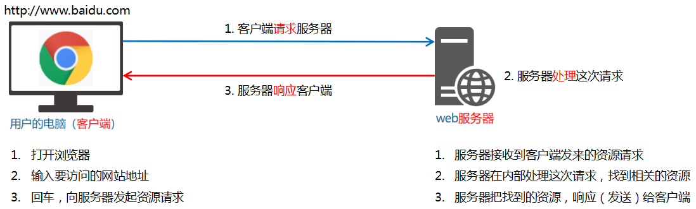
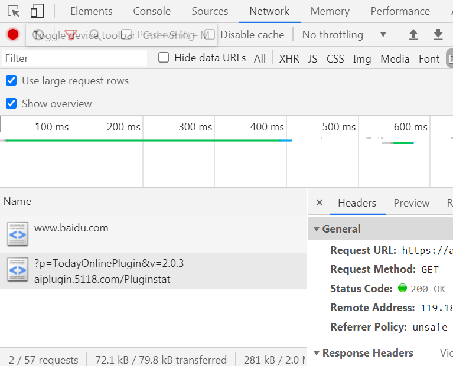
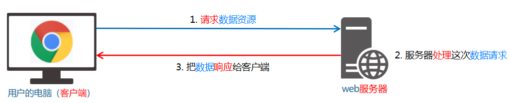

# 目标

* 能够知道和服务器相关的基本概念
* 能够知道客户端和服务器通信的过程
* 能够知道数据也是一种资源
* 能够说出什么是Ajax以及应用场景
* 能够使用jQuery中的Ajax函数请求数据
* 能够知道接口和接口文档的概念

# 1. 客户端与服务器

### 1.1 上网的目的

上网的<span style="color:red">本质</span>：通过互联网的形式来<span style="color:red">获取和消费资源</span>。

### 1.2 服务器

上网过程中，负责<span style="color:red">存放和对外提供资源</span>的电脑，叫做服务器。

### 1.3 客户端

上网过程中，负责<span style="color:red">获取和消费资源</span>的电脑，叫做客户端。

# 2. URL地址

### 2.1 什么是URL

统一资源定位符（Uniform Resource Locator,URL）是互联网上标准资源的地址。互联网上的每个文件都有唯一的URL，浏览器只有通过URL地址，才能正确定位资源的存放位置，从而成功访问到对应的资源。

常见的URL举例：

http://www.baidu.com

http://www.abc.com/article/123.html?query=user#id

### 2.2 URL地址的组成部分

URL地址一般由三部分组成，以http://www.abc.com/article/p/123456.html举例

1. 客户端与服务器之间的<span style="color: red">通信协议</span> http
2. 存有该资源的<span style="color: red">服务器名称</span>www.abc.com
3. 资源在服务器上<span style="color: red">具体的存放位置</span> article/p/123456.html

# 3. 客户端和服务器的通信过程

### 3.1 图解客户端与服务器的通信过程



**注意：**

* 客户端与服务器之间的通信过程，分为 <span style="color:red">请求-处理-响应</span> 三个阶段
* 网页内的每一个资源，都是通过 <span style="color:red">请求-处理-响应</span> 的方式从服务器获取的

### 3.2 使用Chrome开发者工具查看通信过程



1. 打开Chrome浏览器
2. Ctrl+Shift+i打开Chrome开发者工具
3. 切换到Network栏
4. 选中Doc页签
5. 刷新页面，分析过程

# 4. 服务器对外提供了哪些资源

### 4.1 例举网页中常见的资源

* 文字内容
* 图片内容
* 视频内容
* 音频内容
* ......

### 4.2 数据也是资源

网页中的数据，也是服务器对外提供的一种资源。例如股票数据、各行业排行等等。

### 4.3 数据是网页的灵魂

* HTML是网页的<span style="color:blue">骨架</span>
* CSS是网页的<span style="color:blue">颜值</span>
* JavaScript是网页的<span style="color:blue">行为</span>
* 数据则是网页的<span style="color:blue">灵魂</span>

### 4.4 网页中如何请求数据

数据，也是服务器对外提供的一种资源。只要是资源，必然通过 <span style="color:red">请求-处理-响应</span> 的方式进行获取



如果要在网页中请求服务器上的资源，则需要用到`XMLHttpRequest`对象

XMLHttpRequest（简称xhr）是浏览器提供的JS成员。通过它，可以请求服务上的数据资源。

最简单的用法：`const xhrObj = new XMLHttpRequest()`

### 4.5 资源的请求方式

客户端请求服务器时，请求的方式有很多种，最常见的两种请求方式分别为`get`和`post`

* get通常用于获取服务器资源（向服务器要资源）
  * 获取HTML、CSS、JS、图片等资源
* post通常用于向服务器提交数据（向服务器发送资源）
  * 登录时向服务器发送用户名、密码等数据
  * 注册时向服务器发送注册数据
  * 添加用户时向服务器添加用户信息

# 5. 了解Ajax

### 5.1 什么是Ajax

Ajax的全称是 Asynchronous JavaScript And XML （异步的JavaScript和XML）。

通俗的理解：在网页中利用XMLHttpRequest对象和服务器进行数据交互的方式，就是Ajax。

### 5.2 为什么要学Ajax

之前所学习的技术，只能把网页做的更美观、漂亮，或添加一些动画效果。但是Ajax可以让我们轻松实现**网页**和**服务器**之间的**数据交互**。

### 5.3 Ajax的典型应用场景

用户名检测：注册用户名时，通过ajax的形式，动态检测用户名是否被占用

搜索提示：当输入搜索关键字时，通过ajax的形式，动态加载搜索提示列表

数据分页显示：当点击页码值时，通过ajax的形式，根据页码值动态刷新数据

数据的增删改查：数据的添加、删除、修改、查询操作，都需要ajax的形式，来实现数据的交互。

# 6. jQuery中的Ajax

### 6.1 了解jQuery中的Ajax

浏览器中提供的 XMLHttpRequest 用法比较复杂，所以 jQuery 对 XMLHttpRequest 进行了封装，提供了一系列 Ajax 相关的函数，极大地降低了 Ajax 的使用难度。

jQuery 中发起 Ajax 请求最常用的三个方法如下：

* `$.get()`
* `$.post()`
* `$.ajax()`

### 6.2 `$.get()`函数的语法

jQuery 中`$.get()`函数的功能单一，专门用来发起 get 请求，从而将服务器上的资源请求到客户端来进行使用。

语法如下：

```js
$.get(url, [data], [callback])
```

| 参数名   | 参数类型 | 是否必选 | 说明                   |
| -------- | -------- | -------- | ---------------------- |
| url      | string   | 是       | 要请求的资源地址       |
| data     | object   | 否       | 请求资源需要携带的参数 |
| callback | function | 否       | 请求成功时的回调函数   |

