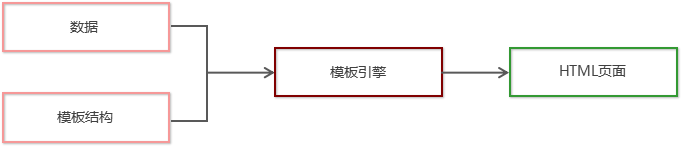
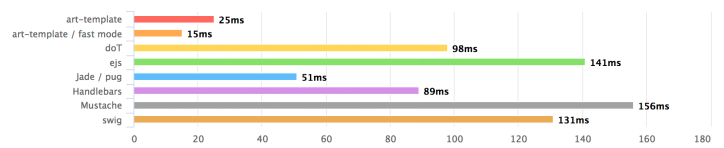

# 目标

* 能够说出form表单的常见属性
* 能够知道如何阻止表单的默认提交行为
* 能够知道如何使用jQuery快速获取表单数据
* 能够知道如何安装和使用模板引擎
* 能够知道模板引擎的实现原理

# 1. form表单的基本使用

### 1.1 表单的作用

表单在网页中主要负责**数据采集功能**。HTML中的`<form>`标签，就是用于采集用户输入的信息，并通过`<form>`标签的提交操作，把采集到的信息提交到服务器端进行处理。

### 1.2 表单的组成部分

```html
<form>
    <input type="text" />
    <input type="password" />
    <input type="checkbox" checked="checked" />
    <button type="submit">提交</button>
</form>
```

表单由三个基本部分组成：

* 表单标签
* 表单域（文本框、密码框、单选按钮......）
* 表单按钮

### 1.3 `<form>`标签的属性

`<form>`标签用来采集数据，`<form>`标签的属性则是用来规定***如何把采集到的数据发送到服务器***。

| 属性    | 值                                                           | 描述                              |
| ------- | ------------------------------------------------------------ | --------------------------------- |
| action  | URL地址                                                      | 规定提交表单时，向何处发送数据    |
| method  | get或post                                                    | 规定以何种方式把表单数据提交到URL |
| enctype | `applcation/x-www-form-urlencoded`或`multipart/form-data`或`text/plain` | 规定在发送表单数据前如何对其解码  |
| target  | `_blank`、`_self`、`_parent`、`_top`、`framename`            | 规定在何处打开action的URL         |

##### 1. action

* action 属性用来规定当提交表单时，向何处发送表单数据。
* action 属性的值应该是后端提供的一个 URL 地址，这个 URL 地址专门负责接收表单提交过来的数据。
* 当`<form>`表单在未指定 action 属性值的情况下，action 的默认值为当前页面的 URL 地址。

**注意：当提交表单后，页面会立即跳转到 action 属性指定的 URL 地址**

##### 2. target

* target 属性用来规定在何处打开 action URL。
* 它的可选值有5个，默认情况下，target 的值是 `_self`，表示在相同的框架中打开 action URL。

| **值**      | **描述**                       |
| ----------- | ------------------------------ |
| **_blank**  | 在新窗口中打开。               |
| **_self**   | 默认。在相同的框架中打开。     |
| _parent     | 在父框架集中打开。（很少用）   |
| _top        | 在整个窗口中打开。（很少用）   |
| *framename* | 在指定的框架中打开。（很少用） |

##### 3. method

method 属性用来规定以何种方式把表单数据提交到 action URL。

它的可选值有两个，分别是`get`和`post`。

默认情况下，method 的值为 get，表示通过URL地址的形式，把表单数据提交到 action URL。

**注意：**

* get方式适合用来提交***少量的***、***简单的***数据。
* post方式适合用来提交**大量的**、**复杂的**、或***包含文件上传***的数据。
* 在实际开发中，`<form>`表单的 **post 提交方式用的最多**，很少用 get。例如登录、注册、添加数据等表单操作，都需要使用 post 方式来提交表单。

##### 4. enctype

enctype 属性用来规定在**发送表单数据之前如何对数据进行编码**。

它的可选值有三个，默认情况下，enctype 的值为`application/x-www-form-urlencoded`，*表示在发送前编码所有的字符*。

| **值**                            | **描述**                                                     |
| --------------------------------- | ------------------------------------------------------------ |
| application/x-www-form-urlencoded | 在发送前编码所有字符（默认）                                 |
| multipart/form-data               | 不对字符编码。在使用包含文件上传控件的表单时，必须使用该值。 |
| text/plain                        | 空格转换为 “+” 加号，但不对特殊字符编码。（很少用）          |

**注意：**

* 在涉及到文件上传的操作时，必须将 enctype 的值设置为`multipart/form-data`
* 如果表单的提交不涉及到文件上传操作，则直接将 enctype 的值设置为`application/x-www-form-urlencoded`即可！

### 1.4 表单的同步提交

##### 1. 什么是表单的同步提交

通过点击 submit 按钮，触发表单提交的操作，从而使页面跳转到 action URL 的行为，叫做表单的同步提交。

##### 2. 表单同步提交的缺点

* `<form>`表单同步提交后，整个页面发生跳转。**跳转到action的URL地址**，用户体验很差。
* `<form>`表单同步提交后，**页面之前的状态和数据会丢失**。

##### 3. 如何解决表单同步提交的缺点

表单只负责采集数据，**Ajax负责将数据提交到服务器**

# 2. 通过Ajax提交表单数据

### 2.1 监听表单提交事件

在jQuery中，可以使用如下两种方式，监听到表单的提交事件：

```js
$("#form").submit(function(){
    console.log("监听到了提交事件");
});
$("#form").on("submit", function(){
    console.log("监听到了提交事件");
});
```

### 2.2 阻止表单默认提交行为 

当监听到表单的提交事件以后，可以调用事件对象的`event.preventDefault()`函数，来阻止表单的提交和页面的跳转，示例代码如下：

```js
$('#form1').submit(function(e) {
   // 阻止表单的提交和页面的跳转
   e.preventDefault()
})

$('#form1').on('submit', function(e) {
   // 阻止表单的提交和页面的跳转
   e.preventDefault()
})
```

### 2.3 快速获取表单中的数据

##### 1. `serialize()`函数

为了简化表单中数据的获取操作，jQuery 提供了`serialize()`函数，其语法格式如下：

```js
$(selector).serialize();
```

**好处：可以一次性获取表单中所有的数据**

##### 2. `serialize()`示例

```html
<form id="form1">
    <input type="text" name="username" />
    <input type="password" name="password" />
    <button type="submit">提交</button>
</form>
```

```js
$('#form1').serialize()
// 调用的结果：
// username=用户名的值&password=密码的值
```

注意：在使用`serialize()`函数快速获取表单数据时，***必须为每个表单元素添加name属性***！

# 3. 模板引擎

##### 1. 什么是模板引擎

模板引擎，顾名思义，它可以根据程序员指定的模板结构和数据，自动生成一个完整的HTML页面。



##### 2. 模板引擎的好处

* 减少了字符串的拼接操作
* 使代码结构更清晰
* 使代码更易于阅读与维护

# 4. art-template模板引擎

### 4.1 art-template简介

art-template 是一个简约、超快的模板引擎。

中文官网首页为 http://aui.github.io/art-template/zh-cn/index.html



上图可以看出，art-template速度极高

### 4.2 art-template

在浏览器中访问 http://aui.github.io/art-template/zh-cn/docs/installation.html 页面，找到下载链接后，鼠标右键，选择“链接另存为”，将 art-template 下载到本地，然后，通过`<script>`标签加载到网页上进行使用。

### 4.3 使用步骤

1. 导入art-template（使用`<script>`引入相关JS文件）
2. 定义数据
3. 定义模板
4. 调用`template`函数
5. 渲染HTML页面

#### 4.4 标准语法

##### 1. 什么是标准语法

art-template 提供了`{{ }}`这种语法格式，在`{{ }}`内可以进行**变量输出**，或**循环数组**等操作，这种`{{ }}`语法在 art-template 中被称为标准语法。

##### 2. 标准语法 - 输出

```js
{{value}}
{{obj.key}}
{{obj['key']}}
{{a ? b : c}}
{{a || b}}
{{a + b}}
```

在`{{ }}`语法中，可以进行**变量的输出**、**对象属性的输出**、**三元表达式输出**、**逻辑或输出**、**加减乘除**等表达式输出。

##### 3. 标准语法 - 原文输出

```js
{{ @ value }}
```

如果要输出的 value 值中，**包含了 HTML 标签结构**，则需要使用原文输出语法，才能保证 HTML 标签被正常渲染。 

##### 4. 标准语法 - 条件输出

如果要实现条件输出，则可以在 {{ }} 中使用 if … else if … /if 的方式，进行按需输出。

```js
{{ if value }} 内容 {{/if}}
```

```js
{{ if v1 }} 条件1内容 {{else if v2}} 条件2内容 {{/if}}
```

##### 5. 标准语法 - 循环输出

如果要实现循环输出，则可以在 {{ }} 内，通过 each 语法循环数组，当前循环的索引使用 `$index`进行访问，当前的循环项使用`$value`进行访问。

```js
{{each arr}}
    {{$index}} {{$value}}
{{/each}}
```

