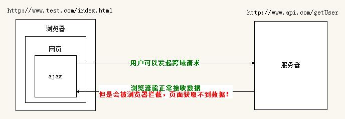
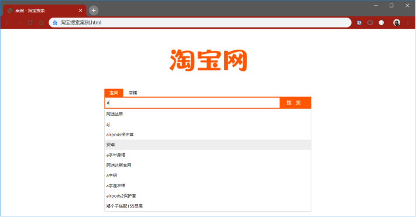

# 目标

* 知道什么是同源策略和跨域
* 知道什么是JSONP
* 能够说出JSONP的实现原理
* 能够知道防抖和节流的概念

# 1. 了解同源策略和跨域

### 1.1 同源策略

##### 1. 什么是同源

如果两个页面的**协议**，**域名**和**端口**都相同，则两个页面具有相同的源。
例如，下表给出了相对于 http://www.a.com/index.html 页面的同源检测：

| **URL**                         | **是否同源** | **原因**                               |
| ------------------------------- | ------------ | -------------------------------------- |
| http://www.a.com/other.html     | 是           | 同源（协议、域名、端口相同）           |
| https://www.a.com/about.html    | 否           | 协议不同（http 与 https）              |
| http://blog.a.com/movie.html    | 否           | 域名不同（www.a.com 与 blog.a.com）    |
| http://www.a.com:7001/home.html | 否           | 端口不同（默认的 80 端口与 7001 端口） |
| http://www.a.com:80/main.html   | 是           | 同源（协议、域名、端口相同）           |

##### 2. 什么是同源策略

同源策略（英文全称 Same origin policy）是**浏览器**提供的一个**安全功能**。

MDN 官方给定的概念：同源策略限制了从同一个源加载的文档或脚本如何与来自另一个源的资源进行交互。这是一个用于隔离潜在恶意文件的重要安全机制。

通俗的理解：浏览器规定，A 网站的 JavaScript，不允许和非同源的网站 C 之间，进行资源的交互，例如：

* 无法读取非同源网页的`Cookie`、`LocalStorage` 和`IndexedDB`
* 无法接触非同源网页的`DOM`
* 无法向非同源地址发送`Ajax`请求

### 1.2 跨域

###### 1. 什么是跨域

同源指的是两个 URL 的协议、域名、端口一致，反之，则是跨域。

出现跨域的根本原因：**浏览器的同源策略不允许非同源的 URL 之间进行资源的交互**。

网页：http://www.test.com/index.html

接口：http://www.api.com/userlist

##### 2. 浏览器对跨域请求的拦截



**注意**：浏览器允许发起跨域请求，但是，跨域请求回来的数据，会被浏览器拦截，无法被页面获取到！

##### 3. 如何实现跨域数据请求

现如今，实现跨域数据请求，最主要的两种解决方案，分别是`JSONP`和`CORS`。

JSONP：出现的早，**兼容性好（兼容低版本IE）**。是前端程序员为了解决跨域问题，被迫想出来的一种**临时解决方案**。缺点是***只支持 GET 请求，不支持 POST 请求***。

CORS：出现的较晚，它是 W3C 标准，属于跨域 Ajax 请求的根本解决方案。***支持 GET 和 POST 请求***。缺点是**不兼容某些低版本的浏览器**。

# 2. JSONP

### 2.1 什么是JSONP

JSONP (JSON with Padding) 是 JSON 的一种“使用模式”，可用于解决主流浏览器的**跨域数据访问**的问题。

### 2.2 JSONP的实现原理

由于浏览器**同源策略**的限制，网页中无法通过 Ajax 请求**非同源的接口数据**。但是 `<script>`标签不受浏览器同源策略的影响，可以通过 src 属性，请求非同源的 js 脚本。

> 因此，JSONP 的**实现原理**，就是通过`<script>`标签的 src 属性，请求跨域的数据接口，并通过函数调用的形式，接收跨域接口响应回来的数据。

### 2.3 自己实现一个简单的JSONP

定义一个 success 回调函数：

```html
<script>
    function success(data) {
        console.log('获取到了data数据：')
        console.log(data)
    }
</script>
```

通过`<script>`标签，请求接口数据：

```html
<script src="接口地址?callback=success&name=zs&age=20"></script>
```

### 2.4 JSONP的缺点

由于 JSONP 是通过`<script>`标签的 src 属性，来实现跨域数据获取的，所以，JSONP **只支持 GET 数据请求，不支持 POST 请求**。

注意：***JSONP 和 Ajax 之间没有任何关系***，不能把 JSONP 请求数据的方式叫做 Ajax，因为 JSONP **没有用到 XMLHttpRequest 这个对象**。

### 2.5 jQuery中的JSONP

jQuery 提供的 $.ajax() 函数，除了可以发起真正的 Ajax 数据请求之外，还能够发起 JSONP 数据请求，例如：

```js
$.ajax({
    url: 'JSONP接口地址',
    // 如果要使用 $.ajax() 发起 JSONP 请求，必须指定 datatype 为 jsonp
    dataType: 'jsonp',
    // 自定义的回调函数名称，默认值为jQueryxxx是jQuery随机生成的
    jsonpCallback: 'abc',
    success: function(res) {
        console.log(res)
    }
});
```

### 2.7 jQuery中JSONP的实现过程

jQuery 中的 JSONP，也是通过`<script>`标签的 src 属性实现跨域数据访问的，只不过，jQuery 采用的是动态创建和移除`<script>`标签的方式，来发起 JSONP 数据请求。

* 在发起 JSONP 请求的时候，动态向`<header>`中 append 一个`<script>`标签
* 在 JSONP 请求成功以后，动态从`<header>`中移除刚才 append 进去的`<script>`标签

# 3. 淘宝搜索案例

### 3.1 实现的效果



### 3.2 接口地址

https://suggest.taobao.com/sug?q=