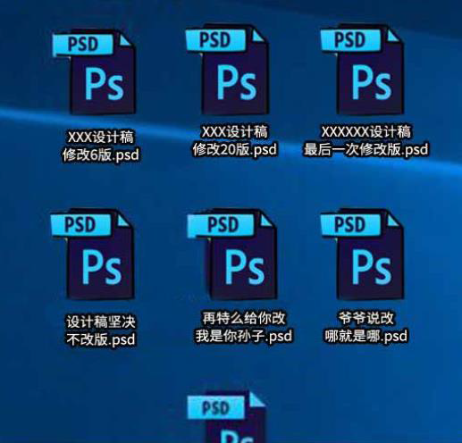
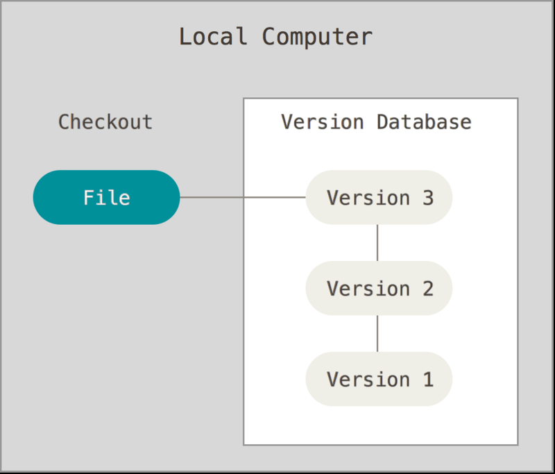
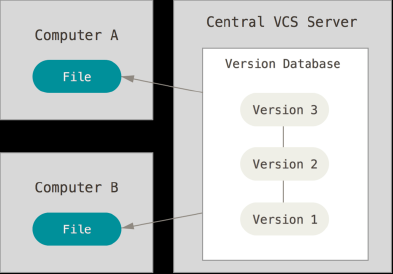
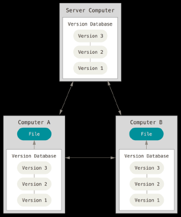
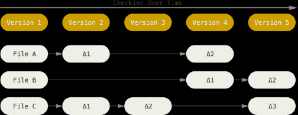
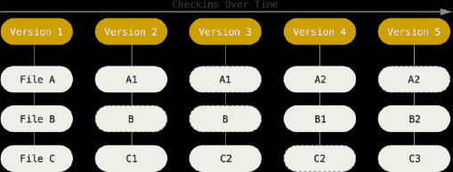
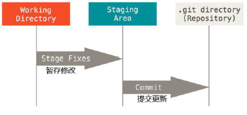

# 1. 版本控制

### 1.1 文件的版本

使用以上的方法来控制文件的不同版本，有哪些不合理的地方？

* 操作麻烦：每创建一个新版本，都需要 复制-->粘贴-->重命名
* 命名不规范：无法通过文件名来知道哪些文件做了哪些更改
* 容易丢失：如果硬盘出现损坏或文件被误删除，很难再找到
* 协作困难：需要手动合并每个人对于项目的更改，合并时极容易出错

### 1.2 版本控制软件

版本控制软件是一个用来**记录文件变化** ，以便将来查阅特定版本修订情况的系统，因此有时也叫做“**版本控制系统**”。

通俗理解：把**手工管理**文件版本的方式，改为由**软件管理**文件的版本；这个负责管理文件版本的软件，叫做“版本控制软件”。

### 1.3 使用版本控制的好处

* 操作简便：只需识记**几组简单的终端命令**，即可快速上手常见的版本控制软件
* 易于对比：基于版本控制软件提供的功能，能够方便地比较文件的变化细节，从 而查找出导致问题的原因
* 易于回溯：可以将选定的文件回溯到之前的状态，甚至将整个项目都回退到过去某 个时间点的状态
* 不易丢失：在版本控制软件中，被用户误删除的文件，可以轻松的恢复回来
* 协作方便：基于版本控制软件提供的**分支**功能，可以轻松实现多人协作开发时的代 码合并操作

### 1.4 版本控制系统的分类

* 本地版本控制系统：**单机运行**，是维护文件版本的操作工具化
* 集中化版本控制系统：联网运行，支持多人协作开发。**但是性能差，用户体验不好**
* 分布式版本控制系统：联网运行，支持多人协作开发，性能优秀，用户体验好

##### 1. 本地版本控制系统

**特点**：

使用软件来记录文件的不同版本，提高了工作效率，降低了手动维护版本的出错率

**缺点：**

* 单机运行，不支持多人协作开发
* 版本数据库故障后，所有历史更新记录会丢失

##### 2. 集中化的版本控制系统

**特点**：

基于**服务器**、**客户端**的运行模式

* 服务器保存文件的所有更新记录
* 客户端只保留最新的文件版本

**优点**：

联网运行，支持多人协作开发

**缺点**：

* 不支持离线提交版本更新
* 中心服务器崩溃后，所有人无法正常工作
* 版本数据库故障后，所有历史更新记录会丢失

##### 3. 分布式版本控制系统

**特点**：

基于**服务器**、**客户端**的运行模式

* 服务器保存文件的所有更新版本
* ***客户端是服务器的完整备份***，并不是只保留文件的最新版本

**优点**：

* 联网运行，支持多人协作开发
* 客户端断网后支持离线本地提交版本更新
* 服务器故障或损坏后，可使用任何一个客户端的备份进行恢复

典型代表：**Git**

# 2. Git 基础概念

### 2.1 什么是 Git

Git 是一个**开源的分布式版本控制系统**，是目前世界上**最先进**、**最流行**的版本控制系统。可以快速高效地处理从很小到非常大的项目版本管理。

特点：项目越大越复杂，协同开发者越多，越能体现出 Git 的**高性能**和**高可用性**！

### 2.2 Git 的特性

Git 之所以快速和高效，主要依赖于它的如下两个特性：

* 直接记录快照，而非差异比较
* 近乎所有操作都是本地执行

##### 1. SVN 的差异比较

传统的版本控制系统（例如 SVN）是**基于差异**的版本控制，它们存储的是**一组基本文件**和**每个文件随时间逐步累积的差异**。

好处：节省磁盘空间

缺点：**耗时，效率低**，在每次切换版本的时候，都需要在基本文件的基础上，应用每个差异，从而生成目标版本对应的文件。

##### 2. Git 的记录快照

**Git 快照**是在原有文件版本的基础上重新生成一份新的文件，**类似于备份**。为了效率，如果文件没有修改，Git 不再重新存储该文件，而是只保留一个链接指向之前存储的文件。

缺点：占用磁盘空间较大

优点：**版本切换时非常快，**因为每个版本都是完整的文件快照，切换版本时直接恢复目标版本的快照即可。

特点：**空间换时间**

##### 3. 近乎所有操作都是本地执行

在 Git 中的绝大多数操作都只需要**访问本地文件和资源**，一般不需要来自网络上其它计算机的信息。

特性：

* 断网后依旧可以在本地对项目进行版本管理
* 联网后，把本地修改的记录同步到云端服务器即可

### 2.3 Git 中的三个区域

使用 Git 管理的项目，拥有三个区域，分别是**工作区**、**暂存区**、**Git 仓库**。

工作区：处理工作的区域

暂存区：已完成的工作的**临时存放区域**，**等待被提交**。

Git仓库：最终存放的区域

### 2.4 Git 中的三种状态

* 已修改(modified)：表示修改了文件，但还没有把修改的结果放到暂存区
* 已暂存(staged)：表示对已修改文件的当前版本做了标记，使之包含在下次提交的列表中
* 已提交(committed)：表示文件已经储存到了本地的Git仓库中

**注意**：

* 工作区的文件被修改了，但还没有放到暂存区，就是**已修改**状态。
* 如果文件已修改并放入暂存区，就属于**已暂存**状态。
* 如果 Git 仓库中**保存着特定版本**的文件，就属于**已提交**状态。

### 2.5 基本的 Git 工作流程

基本的 Git 工作流程如下：

1. 在工作区中修改文件
2. 将你想要下次提交的更改进行暂存
3. 提交更新，找到暂存区的文件，将快照永久性储存在Git仓库