# 目标

* 能够掌握 Git 基本指令的使用
* 能够使用 Github 创建和维护远程仓库
* 能够掌握 Git 分支的基本使用

# 1. 安装和配置Git

### 1.1 在 Windows 中下载并安装 Git

在开始使用 Git 管理项目的版本之前，需要将它安装到计算机上。可以使用浏览器访问如下的网址，根据自己的操作系统，选择下载对应的 Git 安装包：https://git-scm.com/downloads

### 1.2 配置用户信息

安装完 Git 之后，要做的第一件事就是设置自己的**用户名**和**邮件地址**。因为通过 Git 对项目进行版本管理的时候，Git 需要使用这些基本信息，来记录是谁对项目进行了操作：

```bash
git config --global user.name "alex"
git config --global user.email "alex@xxx.com"
```

**注意**：如果使用`--global`选项，那么该命令只需要运行1次，即可永久生效。

### 1.3 Git 的全局配置文件

通过`git config --global user.name`和`git config --global user.email`配置的用户名和邮箱地址，会被写入到`C:/Users/用户名文件夹/.gitconfig`文件中。这个文件是 Git 的**全局配置文件**，**配置一次即可永久生效**。

### 1.4 检查配置信息

除了使用记事本查看全局的配置信息之外，还可以运行如下的终端命令，快速的查看 Git 的全局配置信息：

```bash
# 查看所有的全局配置项
git config --list --global
# 查看指定的全局配置项
git config user.name
git config user.email
```

### 1.5 获取帮助信息

可以使用`git help <verb>`命令，无需联网即可在浏览器中打开帮助手册，例如：

```bash
# 打开 git config 命令的帮助手册
git help config
```

如果不想查看完整的手册，那么可以用`-h`选项获得更简明的“help”输出：

```bash
# 想获取 git config 命令的快速参考
git config -h
```

# 2. Git 的基本操作

### 2.1 获取 Git 仓库的两种方式

* 将尚未进行版本控制的**本地目录转换为 Git 仓库**
* 从其它服务器**克隆**一个已存在的 Git 仓库
* 以上两种方式都能够在自己的电脑上得到一个可用的Git仓库

### 2.2 在现有目录中初始化仓库

如果自己有一个尚未进行版本控制的项目目录，想要用 Git 来控制它，需要执行以下步骤：

* 使用**命令行**进入需要操作的项目目录
* 输入`git init`初始化仓库
* 此时将创建一个**隐藏的**`.git`文件夹，***这个目录就是当前项目的 Git 仓库***。里面包含了一些**必要的初始文件**，这些文件是 Git 仓库的**必要组成部分**。

### 2.3 工作区中文件的 4 种状态

工作区中的每一个文件可能有 4 种状态，这四种状态共分为**两大类**，如图所示：

###### 未被 Git 管理

* 未跟踪(Untracked)：不被 Git 所管理的文件

###### 已被 Git 管理

* 未修改(Unmodified)：工作区中文件的内容和 Git 仓库中文件的内容**保持一致**
* 已修改(Modifield)：工作区中文件的内容和 Git 仓库中文件的内容**不一致**
* 已暂存(Staged)：工作区中被修改的文件已被放到暂存区，准备将修改后的文件保存到 Git 仓库中

Git操作的终极结果：让工作区中的文件都处于“**未修改**”的状态

### 2.4 检查文件的状态

可以使用`git status`命令查看文件处于什么状态，例如：

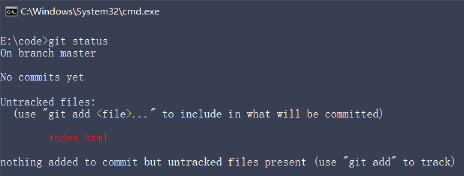

在状态报告中可以看到新建的index.html 文件出现在**Untracked files（未跟踪的文件）**下面。

未跟踪的文件意味着**Git 在之前的快照（提交）中没有这些文件**；Git 不会自动将之纳入跟踪范围，除非明确地告诉它“我需要使用 Git 跟踪管理该文件”。

### 2.5 以精简的方式显示文件状态

使用`git status`输出的状态报告很详细，但有些繁琐。如果希望以精简的方式显示文件的状态，可以使用如下两条完全等价的命令，其中`-s`是`--short`的简写形式：

```bash
# 以精简的方式显示文件状态
git status -s
git status --short
```

未跟踪文件前面有红色的 <span style="color:red">??</span> 标记，例如：

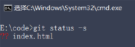

### 2.6 跟踪新文件

使用命令`git add`开始跟踪一个文件。 所以要跟踪 index.html 文件，运行如下的命令即可：

```bash
git add index.html
```

此时再运行`git status`命令，会看到 index.html 文件在**Changes to be committed**这行的下面，说明已被跟踪，并处于**暂存状态**：

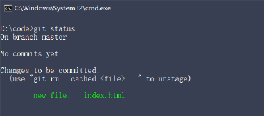

使用精简查看是这个效果，新添加到暂存区的文件前面有绿色的 <span style="color: green">A</span> 标记

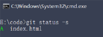

### 2.7 提交更新

现在暂存区中有一个 index.html 文件**等待被提交**到 Git 仓库中进行保存。可以执行`git commit`命令进行提交,其中`-m`选项后面是**本次的提交消息**，用来对提交的内容做进一步的描述：

```bash
git commit -m "新建了index.html文件"
```

提交成功之后，会显示如下的信息：

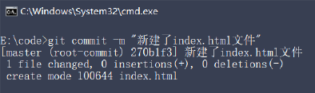

提交成功之后，再次检查文件的状态，得到提示如下：

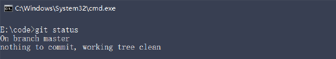

证明工作区中所有的文件都处于“**未修改**”的状态，**没有任何文件需要被提交**。

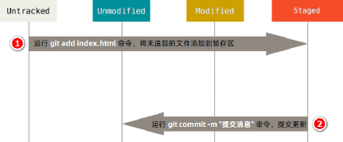

### 2.8 对已提交的文件进行修改

目前，index.html 文件**已经被 Git 跟踪**，并且工作区和 Git 仓库中的 index.html 文件内容**保持一致**。当我们修改了工作区中 index.html 的内容之后，再次运行`git status`和`git status -s`命令，会看到如下的内容：

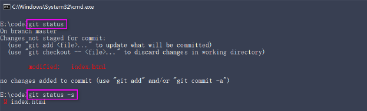

文件 index.html 出现在 **Changes not staged for commit** 这行下面，说明**已跟踪文件的内容发生了变化，但还没有放到暂存区**。

注意：修改过的、没有放入暂存区的文件前面有红色的 <span style="color: red">M</span> 标记。

### 2.9 暂存已修改的文件

目前，工作区中的 index.html 文件已被修改，如果要暂存这次修改，需要再次运行`git add`命令，这个命令是个多功能的命令，主要有如下 3 个功效：

* 可以用它开始**跟踪新文件**
* 把**已跟踪的**、**且已修改的**文件放到**暂存区**
* 把有冲突的文件标记为**已解决**状态

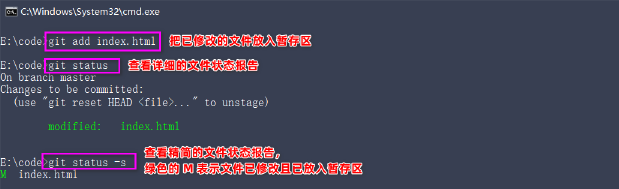

### 2.10 提交已暂存的文件

再次运行`git commit -m "提交消息"`命令，即可将暂存区中记录的 index.html 的快照，提交到 Git 仓库中进行保存：

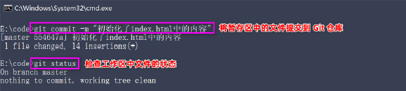

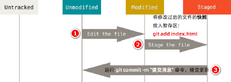

### 2.11 撤销对文件的修改

撤销对文件的修改指的是：把对工作区中对应文件的修改，**还原**成 Git 仓库中所保存的版本。操作的结果：所有的修改会丢失，且无法恢复！***危险性比较高，请慎重操作***！

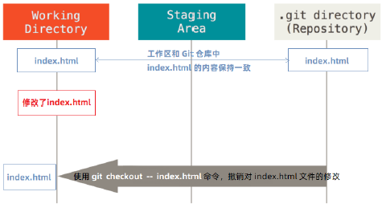

**撤销操作的本质**：用 Git 仓库中保存的文件，**覆盖**工作区中指定的文件。

### 2.12 向暂存区中一次性添加多个文件

如果需要被暂存的文件个数比较多，可以使用如下的命令，一次性将**所有的新增和修改过的文件**加入暂存区：

```bash
git add .
```

今后在项目开发中，会经常使用这个命令，将新增和修改过后的文件加入暂存区。

### 2.13 取消暂存的文件

如果需要从暂存区中移除对应的文件，可以使用如下的命令：

```bash
git reset HEAD 要移除的文件名
```

### 2.14 跳过使用暂存区域

Git 标准的工作流程是**工作区** → **暂存区** → **Git 仓库**，但有时候这么做略显繁琐，此时可以**跳过暂存区**，直接将工作区中的修改提交到 Git 仓库，这时候 Git 工作的流程简化为了**工作区** → **Git 仓库**。

Git 提供了一个跳过使用暂存区域的方式， 只要在提交的时候，给`git commit`加上`-a`选项，Git 就会自动把所有已经跟踪过的文件暂存起来一并提交，从而跳过 git add 步骤：

```bash
git commit -a -m "描述信息"
```

### 2.15 移除文件

从 Git 仓库中移除文件的方式有两种：

* 从 Git仓库 和 工作区 中**同时移除**对应的文件
* 只从 Git仓库 中移除指定文件，但保留工作区中对应的文件

```bash
# 从 Git 仓库和工作区中同时移除 index.js 文件
git rm -f index.js
# 只从 Git 仓库中移除 index.css，但保留工作区中的index.css
git rm --cached index.css
```

### 2.16 忽略文件

一般我们总会有些文件无需纳入 Git 的管理，也不希望它们总出现在未跟踪文件列表。在这种情况下，我们可以创建一个名为`.gitignore`的配置文件，列出要忽略的文件的匹配模式。

文件 .gitignore 的格式规范如下：

* 以`#`开头的是注释
* 以`/`结尾的是目录
* 以`/`开头防止递归
* 以`!`开头表示取反
* 可以使用`glob模式`进行文件和文件夹的匹配（glob指简化的正则）

### 2.17 glob 模式

所谓的 **glob 模式**是指简化了的正则表达式：

* `*`匹配**零个或多个任意字符**
* `[abc]`匹配任何一个列在方括号中的字符（此案例是匹配1个a或者1个b或者1个c）
* `?`只匹配一个任意字符
* 在方括号中使用`短划线`分割两个字符，表示从这两个字符的范围中间匹配（比如[0-9]表示匹配所有0到9的数字）
* `**`两个星号表示**匹配任意中间目录**（比如a/**/z可以匹配a/z、a/b/z、a/c/f/h/z）

### 2.18 .gitignore 文件的例子

```bash
# 忽略所有的 .a 文件
*.a

# 跟踪所有的 lib.a 即使你之前忽略了所有 .a
!lib.a

# 只忽略当前目录下的 TODO 文件，而不忽略 subDir/TODO
/TODO

# 忽略任何目录下名叫 build 的文件夹
build/

# 忽略 doc/notes.txt 但不忽略dov/server/arch.txt
doc/*.txt

# 忽略 doc/ 目录下的所有子目录的pdf文件
doc/**/*.pdf
```

### 2.19 查看提交历史

如果希望回顾项目的提交历史，可以使用`git log`这个简单且有效的命令。

```bash
# 按照时间先后顺序列出所以的历史，最近的排在最上面
git log

# 只显示最新的2条提交历史，数字可以自定义
git log -2

# 在一行中展示最近的2条提交历史的信息
git log -2 --pretty=online

# 在一行中展示最近两条提交历史的信息，并自定义输出格式
# %h 提交的简写哈希值 %an 作者名字 %ar 作者修订日期，多久之前提交的 %s 提交说明
git log -2 --pretty=format:"%h | %an | %ar |%s"
```

### 2.20 回退到指定的版本

```bash
# 在一行上显示所有的提交历史
git log --pretty=online

# 使用 git reset --hard 命令，根据指定的ID回退版本
git reset --hard <CommitID>

# 在旧版本使用 git reflog --pretty=online，查看操作历史
git reflog --pretty=online

# 再次根据最新提交的ID，跳转到最新的版本
git reset --hard <CommitID>
```

### 21. 小结

* 初始化 Git 仓库的命令
  * `git init`
* 查看文件状态的命令
  * `git status`
  * `git status -s`
* 将文件添加到暂存区的命令
  * `git add 文件名`
  * `git add .`（添加所有）
* 将暂存区的文件提交到 Git 仓库的命令
  * `git commit -m "提交信息"`
* 查看提交历史的命令
  * `git log`
  * `git log -2 --pretty=format:"%h | %an | %ar |%s" `
* 移除文件的命令
  * `git rm -f 文件名`（git仓库和本地同时移除）
  * `git rm --cached 文件名`（只移除git仓库，保留本地文件）
* 回退版本的命令
  * `git reset --hard <CommitID>`

