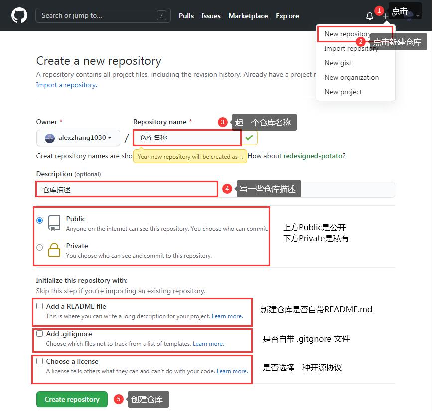
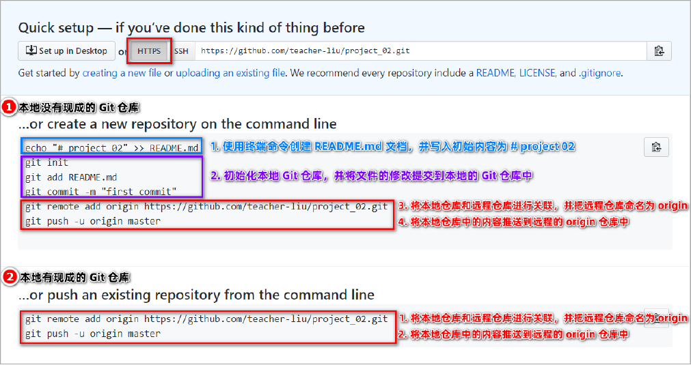
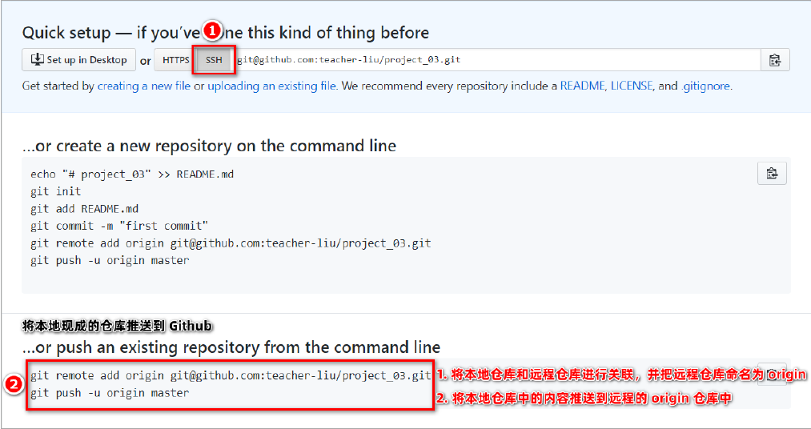

# 1. 了解开源的概念

### 1.1 什么是开源

##### 闭源：

* 软件的代码是封闭的
* 只有作者能看到源代码
* 只有作者能对代码进行修改

##### 开源：

* 开源即开放源代码(Open source code)
* 代码是公开的
* 任何人都可以查看、修改和使用开源代码

##### 通俗的理解：

* 开源指不仅提供程序，还提供程序的源代码
* 闭源只提供程序，不提供源代码

### 1.2 什么是开源许可协议

开源并不意味着完全没有限制，为了限制**使用者的使用范围**和**保护作者的权利**，每个开源项目都应该遵守**开源许可协议**（ Open Source License ）。

### 1.3 常见的 5 种开源许可协议

* BSD(Berkeley Software Distribution)
* Apache Licence 2.0
* **GPL**(GNU General Public Licence)
  * 具有传染性的一种开源协议，不允许修改后和衍生的代码作为闭源的商业软件进行销售
  * 使用 GPL 的最著名的软件项目是：Linux
* LGPL(GNU Lesser Genearal Public Licence)
* MIT(Massachusetts Institute of Technology, MIT)
  * 是目前限制最少的协议，唯一的条件：在修改后的代码或者发行包中，必须包含原作者的许可信息。
  * 使用 MIT 的软件项目有：jQuery、Node.js
* 关于更多开源许可协议的介绍，请参考博客：https://www.runoob.com/w3cnote/open-source-license.html

### 1.4 为什么要拥抱开源

开源的核心思想是“**我为人人，人人为我**”，人们越来越喜欢开源大致是出于以下 3 个原因：

* 开源给使用者更多的控制权
* 开源让学习变得更加容易
* 开源才有真正的安全

开源是软件开发领域的大趋势，**拥抱开源就像站在了巨人的肩膀上**，不用自己重复造轮子，让开发越来越容易。

### 1.5 开源项目托管平台

专门用于**免费存放开源项目源代码的网站**，叫做**开源项目托管平台**。目前世界上比较出名的开源项目托管平台主要有以下 3 个：

* Github（全球使用用户最多，最大的开源社区平台）
* Gitlab（对代码私有性支持较好，因此企业用户比较多）
* Gitee（又叫**码云**，是国产的开源项目代码托管平台，国内访问速度快，纯中文页面，使用友好）

**注意**：以上 3 个开源项目托管平台，只能托管以 Git 管理的项目源代码，因此，它们的名字都以 Git 开头。

### 1.6 什么是 Github

Github 是全球最大的**开源项目托管平台**。因为只支持 Git 作为唯一的版本控制工具，故名 GitHub。在 Github 中，你可以：

* 关注自己喜欢的开源项目，为其点赞点star
* 为自己喜欢的开源项目做贡献(Pull Request)
* 和开源项目的作者讨论Bug和提需求(Issues)
* 把喜欢的项目复制一份作为自己的项目进行修改(Fork)
* 创建属于自己的开源项目
* etc.....

So, **Github ≠ Git**

# 2. Github注册账号

### 2.1 注册 Github 账号的流程

* 访问 Github 的官网 https://github.com/
* 点击“Sign Up”跳转到注册页面
* 填写可用的用户名、邮箱、密码
* 通过验证
* 点击“Create account”创建用户
* 登录邮箱，激活账户
* 登录账户

# 3. Github远程仓库的使用

### 1.1 新建空白远程仓库



### 1.2 远程仓库的两种访问方式

Github 上的远程仓库，有两种访问方式，分别是 **HTTPS** 和 **SSH**。它们的区别是：

* HTTPS：零配置，但是每次访问仓库时，需要重复输入Github的账户和密码才能访问成功
* SSH：需要额外的配置，但是配置成功后每次访问仓库，不需要输入账户和密码

在实际开发中，我们更推荐使用**SSH**作为远程访问仓库的方式

### 1.3 基于 HTTPS 将本地仓库上传到 Github

<a href="../../resource/githubhttps连接.png">查看大图</a>



### 1.4 SSH key

SSH key 的**作用**：实现本地仓库和 Github 之间免登录的加密数据传输。 

SSH key 的**好处**：免登录身份认证、数据加密传输。

SSH key 由**两部分**组成，分别是：

* id_rsa（私钥文件，存放于客户端的电脑中）
* id_rsa.pub（公钥文件，需要配置到Github中）

### 1.5 生成 SSH key

* 进入命令行

* 运行以下命令(将youremail改成你的邮箱)：

  ```bash
  ssh-keygen -t rsa -b 4096 -C "your_email@example.com"
  ```

* 连续敲击3次回车，你就能在`C:\Users\用户名\.ssh`中生成`id_rsa`和`id_rsa.pub`文件

### 1.6 配置 SSH key

* 打开`id_rsa.pub`文件，复制里面的内容
* 登录Github，点击**头像 --> Settings --> SSH and GPG Keys --> New SSH key**
* 将`id_rsa.pub`文件里的内容，**粘贴到Key对应的文本框中**
* 在Title文本框键入自定义名称，表明该Key从何而来。

### 1.7 检测 Github 的 SSH key 是否配置成功

打开命令行，输入如下的命令并回车执行：

```bash
ssh -T git@github.com
```

上述命令执行成功后，可以看到以下提示信息：

```
The authenticity of host 'github.com ( IP ADDRESS)' can't be established.RSA key fingerprint is SHA256:xxxxxxxxxxxxxxxxxxxxxxxxxxxxxxxx.Are you sure you want to continue connecting (yes/no)
```

输入yes，看到以下信息即表示配置完成

```
Hi username! You've successfully authenticated, but GitHub does not provide shell access.
```

### 1.8 基于 SSH 将本地仓库上传到 Github

<a href="../../resource/githubssh连接.png">查看大图</a>



### 1.10 将远程仓库克隆到本地

```bash
git clone 远程仓库的地址
```

