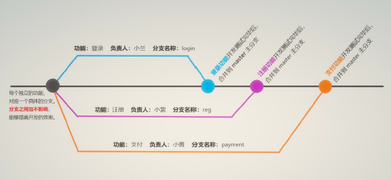
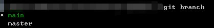

# 1. 本地分支操作

### 1.1 分支的概念

分支就是科幻电影里面的**平行宇宙**，当你正在电脑前努力学习Git的时候，另一个你正在另一个平行宇宙里努力学习SVN。

如果两个平行宇宙互不干扰，那对现在的你也没啥影响。

不过，在某个时间点，两个平行宇宙合并了，结果，你既学会了Git又学会了SVN！


### 1.2 分支在实际开发中的作用

在进行多人协作开发的时候，为了防止互相干扰，提高协同开发的体验，建议每个开发者都基于分支进行项目功能的开发，例如：



### 1.3 main 主分支

在初始化本地 Git 仓库的时候，Git 默认已经帮我们创建了一个名字叫做 main 的分支。通常我们把这个main分支叫做主分支。（2020年10月1日之前，主分支叫master）

在实际工作中，master 主分支的作用是：**用来保存和记录整个项目已完成的功能代码**。

因此，不允许程序员直接在 master 分支上修改代码，因为这样做的风险太高，容易导致整个项目崩溃。

### 1.4 功能分支

由于程序员不能直接在 master 分支上进行功能的开发，所以就有了**功能分支**的概念。

功能分支指的是专门**用来开发新功能的分支**，它是临时从 master 主分支上分叉出来的，当新功能开发且测试完毕后，最终需要合并到 master 主分支上。

* 小明写登录功能分支(login)
* 小红写注册功能分支(signIn)
* 小兰写删除功能分支(delete)
* ......

### 1.5 查看分支列表

使用如下的命令，可以查看当前 Git  仓库中所有的分支列表：

```bash
git branch
```

运行结果如下：



从上图中可以看到：有`main`和`master`两个分支，当前处于main分支上

### 1.6 创建新分支

使用如下的命令，可以**基于当前分支，创建一个新的分支**，此时，新分支中的代码和当前分支**完全一样**。

```bash
git branch 分支名称
```

### 1.7 切换分支

使用如下的命令，可以**切换到指定的分支**上进行开发：

```bash
git checkout login # 在login分支上开发
```

### 1.8 分支的快速创建和切换

使用如下的命令，可以**创建指定名称的新分支**，并**立即切换到新分支**上：

```bash
# -b 表示创建一个新分支
# checkout 表示切换到刚才的新分支上
git checkout -b 分支名称
```

该命令是以下命令的简写：

* `git branch 分支名称`
* `git checkout 分支名称`

### 1.9 合并分支

功能分支的代码开发测试完毕之后，可以使用如下的命令，将完成后的代码合并到 main 主分支上：

```bash
# 1. 切换到 main 主分支
git checkout main
# 2. 在主分支上运行 git merge 命令，用于合并分支
git merge login # 将login内容合并到main主分支上
```

合并分支时的注意点：

***假设要把 C 分支的代码合并到 A 分支，则必须先切换到 A 分支上，再运行 git merge 命令，来合并 C 分支！***

### 1.10 删除分支

当把功能分支的代码合并到 main 主分支上以后，就可以使用如下的命令，删除对应的功能分支：

```bash
git branch -d 分支名称
```

### 1.11 遇到冲突时的分支合并

如果在两个不同的分支中，**对同一个文件进行了不同的修改**，Git 就没法干净的合并它们。 此时，我们需要打开这些包含冲突的文件然后手动解决冲突。

```bash
# 假设：在login分支合并到main分支的时候，出现了冲突
git checkout main
git merge login

# 打开包含冲突的文件，手动解决冲突，再执行以下命令
git add .
git commit -m "解决了分支冲突的问题"
```

# 2. 远程分支操作

### 1.1 将本地分支推送到远程仓库

如果是**第一次**将本地分支推送到远程仓库，需要运行如下的命令：

```bash
# -u 表示把本地分支和远程分支进行关联，只需要配置1次-u即可
git push -u 远程仓库的别名:本地分支名称

# 实际案例：
git push -u origin loginUser:login

# 如果希望远程分支和本地分支名称保持一致，可以简化命令
git push -u origin loginUser
```

注意：第一次推送分支需要带 **-u 参数**，此后可以直接使用`git push`推送代码到远程分支。

### 2.2 查看远程仓库中所有的分支列表

```bash
git remote show 远程仓库名称
```

### 2.3 跟踪分支

跟踪分支指的是：**从远程仓库中，把远程分支下载到本地仓库中**。需要运行的命令如下：

```bash
# 从远程仓库中，把对应的远程分支下载到本地仓库
# 保持远程分支和本地分支名称相同
git checkout 远程分支名称
# 示例
git checkout login

# 从远程仓库中，把对应的远程分支下载到本地仓库
# 重命名本地分支
git checkout -b 本地分支名称 远程仓库名称/远程分支名称
# 示例
git checkout -b login origin/loginUser
```

### 2.4 拉取远程分支的最新的代码

```bash
# 从远程仓库，拉取当前分支最新的代码，保持当前分支和远程分支代码一致
git pull
```

### 2.5 删除远程分支

```bash
# 删除远程仓库中，指定名称的远程分支
git push 远程仓库名称 --delete 远程分支名称
# 示例
git push origin --delete loginUser
```

