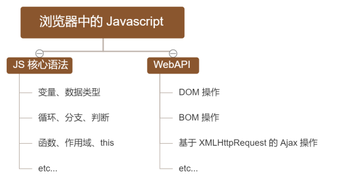
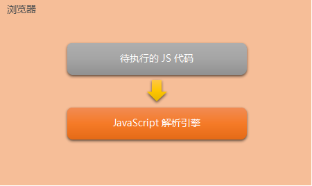
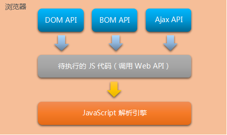
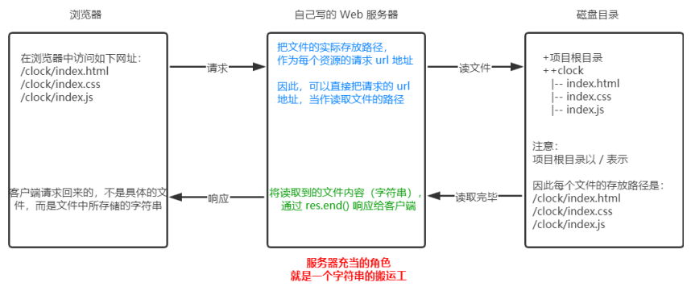

# 目标：

* 能够知道什么是 Node.js
* 能够知道 Node.js 可以做什么
* 能够说出 Node.js 中的 JavaScript 的组成部分
* 能够使用 fs 模块读写操作文件
* 能够使用 path 模块处理路径
* 能够使用 http 模块写一个基本的 web 服务器

#  1. 初识 Node.js

### 1.1 回顾与思考

#### 1. 已经掌握的技术

* HTML
* CSS
* JavaScript

#### 2. 浏览器中的 JavaScript 的组成部分



#### 3. 为什么 JavaScript 可以在浏览器中被执行



不同的浏览器使用不同的 JavaScript 解析引擎：

* Chrome：V8（性能最好）
* Firefox：OdinMonkey（奥丁猴）
* Safari：JSCore
* IE：Chakra（查克拉）
* etc...

#### 4. 为什么 JavaScript 可以操作 DOM 和 BOM



每个浏览器都**内置**了 DOM、BOM 这样的 API 函数，因此，浏览器中的 JavaScript 才可以调用它们。

#### 5. 浏览器中的 JavaScript 运行环境

运行环境是指代码正常运行所需的**必要环境**


* V8引擎负责解析和执行JS代码
* 内置 API 是由**运行环境**提供的特殊接口，**只能在所属的运行环境中被调用**，也就是说脱离了运行环境，就无法访问这些内置的 API 了。

#### 6. JS是否可以做后端

常见的Web后端开发语言有：

* Java
* PHP
* Python

JS也提供了能开发后端的包：

* **Node.js**

### 1.2 Node.js 简介

#### 1. 什么是 Node.js

Node.js® 是一个基于 Chrome V8 引擎的 **JavaScript 运行环境**。

官网：https://nodejs.org/zh-cn/

在浏览器中解析JS，说明做的是前端开发

在Node中解析JS，说明做的是后端开发

#### 2. Node.js 中的 JavaScript 运行环境


* 浏览器是 JS 的前端运行环境
* Node.js 是 JS 的后端运行环境
* Node.js 无法访问 DOM、BOM 等浏览器内置 API

#### 3. Node.js 可以做什么

Node.js 作为一个 JavaScript 的运行环境，仅仅提供了基础的功能和 API。然而，基于 Node.js 提供的这些基础能，很多强大的工具和框架如雨后春笋，层出不穷，所以学会了 Node.js ，可以让前端程序员胜任更多的工作和岗位：

* 基于 Express 框架(http://www.expressjs.com.cn/)，快速构建 Web 应用
* 基于 Electron 框架(https://electronjs.org/)，快速构建跨平台的桌面应用
* 基于 restify 框架(http://restify.com/)，快速构建 API 接口项目
* 读写、操作数据库，创建命令行辅助前端开发，etc...

总之，Node.js 是**大前端时代**的大宝剑，有了 Node.js 的加持，前端程序员的**行业竞争力会**越来越强

#### 4. Node.js 的学习路径

* JavaScript 基础语法
* Node.js 内置 API 模块（fs、path、http等）
* 第三方模块（express、mysql等）

### 1.3 Node.js 环境的安装

如果希望通过 Node.js 来运行 Javascript 代码，则必须在计算机上安装 Node.js 环境才行。

安装包可以从 Node.js 的官网首页直接下载，进入到 Node.js 的官网首页（https://nodejs.org/zh-cn/），点击绿色的按钮，下载所需的版本后，双击直接安装即可，一般我们推荐直接下载**长期支持版**。

#### 1. 区分长期支持版本和当前发布版本的不同

* 对于**追求稳定**的**企业级项目**来说，建议下载长期支持版
* 对于**热衷于尝鲜**的个人用户来说，建议下载当前发布版，但是当前发布版为最新版本，可能出现安全性的漏洞，所以***极其不推荐在生产环境中使用当前发布版***。

#### 2. 查看已安装的 Node.js 的版本号

打开终端，在终端输入命令`node –v`后，按下回车键，即可查看已安装的 Node.js 的版本号。

### 1.4 在 Node.js 环境中执行 JavaScript 代码

进入终端输入命令`node xxx.js`即可解析JS代码

# 2. fs 文件系统模块

### 2.1 什么是 fs 文件系统模块

**fs 模块**是 Node.js 官方提供的、用来操作文件的模块。它提供了一系列的方法和属性，用来满足用户对文件的操作需求。

* `fs.readFile()`：**读取**指定文件的内容
* `fs.writeFile()`：**写入**指定文件的内容

如果要在 JavaScript 代码中，使用 fs 模块来操作文件，则需要使用如下的方式先**导入**它：

```js
const fs = require('fs');
```

### 2.2 读取指定文件中的内容

#### 1. `fs.readFile()`的语法格式

```js
fs.readFile(path[, options], callback);
```

* `path`：必选参数，字符串，表示文件的路径
* `options`：可选参数，表示以什么编码格式读取文件
* `callback`：必选参数，文件读取完成后，通过回调函数获取读取的结果

#### 2. `fs.readFile()`的示例代码

以 utf8 的编码格式，读取指定文件的内容，并打印 err 和 dataStr 的值：

```js
const fs = require('fs');
fs.readFile('files/1.txt', 'utf-8', (err, dataStr) => {
    console.log(err);
    console.lof('------');
    console.log(dataStr);
});
```

#### 3. 判断文件是否读取成功

可以判断 err 对象是否为 null，从而得到文件读取的结果：

```js
const fs = require('fs');
fs.readFile('files/1.txt', 'utf-8', (err, msg) => {
    // 如果失败信息对象有内容，那么就是读取失败
    if (err) {
        return console.log("文件读取失败：" + err);
    }
    console.log("文件读取成功：" + msg);
});
```

### 2.3 向指定文件写入内容

#### 1. `fs.writeFile()`的语法格式

```js
fs.writeFile(file, data[, options], callback);
```

* `file`：必选参数，需要指定一个**文件路径的字符串**，表示文件的存放路径
* `data`：必须按参数，表示写入的内容
* `options`：可选参数，以什么编码写入文件内容，默认utf8，**如果没有特殊需求不用写**
* `callback`：必选参数，写入后的回调函数
* 如果需要写入的文件不存在，则会**自动创建**
* 会**覆盖**源文件的内容，慎重操作

#### 2. `fs.writeFile()`的示例代码

向指定文件写入内容

```js
const fs = require('fs');
fs.writeFile('files/2.txt', 'hello,Node.js!', 'utf8', err => {
    console.log(err);
};
```

#### 3. 判断文件是否写入成功

可以判断 err 对象是否为 null，从而知晓文件写入的结果：

```js
const fs = require('fs');
fs.writeFile('files/2.txt', 'hello, Node.js!', err => {
    if (err) {
        return console.log("文件写入失败，原因如下：" + err);
    }
    console.log("文件写入成功！");
});
```

### 2.4 完整路径

如果使用`./`或者`../`这种来处理文件的位置关系，相对路径很有可能会出现找不到的问题，所以我们需要将**相对路径转为绝对路径**，`__dirname`是 Node.js 的内置属性，获取到当前文件的绝对路径。

# 3. path 路径模块

### 3.1 什么是 path 路径模块

**path 模块**是 Node.js 官方提供的、用来**处理路径**的模块。它提供了一系列的方法和属性，用来满足用户对路径的处理需求。

* `path.join()`：将多个路径片段拼接成一个完整的路径字符串
* `path.basename()`：从路径字符串中，将文件名解析出来

如果要在 JavaScript 代码中，使用 path 模块来处理路径，则需要使用如下的方式先**导入**它：

```js
const path = require('path');
```

### 3.2 路径拼接

#### 1. `path.join()`的语法格式

```js
path.join([...paths]);
```

* `...paths`：路径片段的序列，String字符串型
* 返回值：String字符串
* 今后凡是涉及到路径拼接的操作，都要使用`path.join()`方法进行处理，不要直接使用`+`，可能会出现一些问题

#### 2. `path.join()`代码示例

```js
const path = require('path');

const pathStr = path.join('a/', 'b/c/d', '../', './f');
console.log(pathStr); // 'a\b\c\f'

const pathStr2 = path.join(__dirname, './files/1.txt');
console.log(pathStr2);
```

`../`会抵消路径，`./`不会

### 3.3 获取路径中的文件名

#### 1. `path.basename()`的语法格式

使用 path.basename() 方法，可以获取路径中的最后一部分，经常通过这个方法获取路径中的文件名，语法格式如下：

```js
path.basename(path[, ext])
```

* `path`：必选参数，路径字符串
* `ext`：可选参数，文件扩展名
* 返回值：字符串，获取路径的最后一部分

#### 2. `path.basename()`的代码示例

```js
const path = require('path');
const fpath = 'a/b/c/d/f/index.html';

const filename = path.basename(fpath);
console.log(filename); // index.html
// 加入扩展名参数会把扩展名去掉
const filename2 = path.basename(fpath, ".html");
console.log(filename2); // index
```

### 3.4 获取路径中的文件扩展名

#### 1. `path.extname()`的语法格式

```js
path.extname(path);
```

* `path`：路径字符串
* 返回值：扩展名字符串

#### 2. `path.extname()`的代码示例

```js
const path = require('path');
const fpath = 'a/b/c/d/index.js';

const ext = path.extname(fpath);
console.log(ext); // .js
```

### 3.5 时钟案例

#### 1. 需求

* `code`->`9-时钟案例`->`index.html`
* 将这个页面拆分为`index.html`、`index.css`和`index.js`
* 将文件放入`clock`文件夹内

#### 2. 原理

* 创建两个正则表达式，匹配`<style>`和`<script>`
* 使用`fs`模块，读取`index.html`
* 定义`resolveCSS`方法，写入`index.css`文件
* 定义`resolveJS`方法，写入`index.js`文件
* 定义`resolveHTML`方法，写入`index.html`文件

#### 3. 代码

[resolve.js](../../code/2-Node.js/09-时钟案例/resolve.js)

# 4. http 模块

### 4.1 什么是 http 模块

回顾：什么是**客户端**、什么是**服务器**？

在网络节点中，负责消费资源的电脑，叫做客户端；负责**对外提供网络资源**的电脑，叫做服务器。

http 模块是 Node.js 官方提供的、用来**创建 web 服务器**的模块。通过 http 模块提供的`http.createServer() `方法，就能方便的把一台普通的电脑，变成一台 Web 服务器，从而对外提供 Web 资源服务。

如果要希望使用 http 模块创建 Web 服务器，则需要先**导入**它：

```js
const http = require('http');
```

### 4.2 理解 http 模块的作用

服务器和普通电脑的区别在于，服务器上安装了 web 服务器软件，例如：`IIS`、`Apache`等。通过安装这些服务器软件，就能把一台普通的电脑变成一台 web 服务器。

在 Node.js 中，我们**不需要使用** IIS、Apache 等这些**第三方 web 服务器软件**。因为我们可以基于 Node.js 提供的 http 模块，通过几行简单的代码，就能轻松的手写一个服务器软件，从而对外提供 web 服务。

### 4.3 服务器相关的概念

#### 1. IP 地址

**IP 地址**就是互联网上每台计算机的唯一地址，因此 IP 地址具有唯一性。如果把“个人电脑”比作“一台电话”，那么“IP地址”就相当于“电话号码”，只有在知道对方 IP 地址的前提下，才能与对应的电脑之间进行数据通信。

IP 地址的格式：通常用“**点分十进制**”表示成（a.b.c.d）的形式，其中，a,b,c,d 都是 **0~255** 之间的十进制整数。例如：用点分十进表示的 IP地址（`192.168.1.1`）

**注意**：

* 互联网中每台 Web 服务器，都有自己的 IP 地址，例如：大家可以在 Windows 的终端中运行`ping www.baidu.com`命令，即可查看到百度服务器的 IP 地址。
* 在开发期间，自己的电脑既是一台服务器，也是一个客户端，为了方便测试，可以在自己的浏览器中输入`127.0.0.1`这个 IP 地址，就能把自己的电脑当做一台服务器进行访问了。

#### 2. 域名和域名服务器

尽管 IP 地址能够唯一地标记网络上的计算机，但IP地址是一长串数字，不直观，而且**不便于记忆**，于是人们又发明了另一套字符型的地址方案，即所谓的**域名**（Domain Name）地址。

IP地址和域名是一一对应的关系，这份对应关系存放在一种叫做**域名服务器**(DNS，Domain Name Server)的电脑中。使用者只需通过好记的域名访问对应的服务器即可，对应的转换工作由域名服务器实现。因此，***域名服务器就是提供 IP 地址和域名之间的转换服务的服务器***。

**注意**：

* 单纯使用 IP 地址，互联网中的电脑也能够正常工作。但是有了域名的加持，能让互联网的世界变得更加方便。
* 在开发测试期间， 127.0.0.1对应的域名是`localhost`，它们都代表我们自己的这台电脑，在使用效果上没有任何区别。

#### 3. 端口号

计算机中的端口号，就好像是现实生活中的门牌号一样。通过门牌号，外卖小哥可以在整栋大楼众多的房间中，准确把外卖送到你的手中。

同样的道理，在一台电脑中，可以运行成百上千个 web 服务。每个 web 服务都对应一个唯一的端口号。客户端发送过来的网络请求，通过端口号，可以被准确地交给**对应的 web 服务**进行处理。


**注意**：

* 每个端口号不能同时被多个 web 服务占用
* 在实际应用中，URL 中的 **80 端口可以被省略**

### 4.4 创建最基本的 web 服务器

#### 1. 创建 web 服务器的基本步骤

* 导入 http 模块
* 创建 web 服务器实例
* 为服务器绑定`request`事件，**监听客户端请求**
* 启动服务器

##### 步骤1 - 导入 http 模块

```js
const http = require('http');
```

##### 步骤2 - 创建 web 服务器实例

```js
const server = http.createServer();
```

##### 步骤3 - 为服务器实例绑定 request 事件

```js
// 使用.on() 绑定事件
server.on('request', (req, resp) => {
    // 只要有请求，就触发request，触发回调函数
    console.log("Someone visit the server")
});
```

##### 步骤4 - 启动服务器

```js
// 调用 server.listen(端口号, 回调函数)方法启动服务器
server.listen(80, () => {
    console.log("http server is running at 127.0.0.1");
});
```

#### 2. req 请求对象

只要服务器接收到了客户端的请求，就会调用通过`server.on()`为服务器绑定的 request 事件处理函数。

如果想在事件处理函数中，访问与**客户端相关的数据或属性**，可以使用如下的方式：

```js
server.on('request', req => {
    // req是请求对象，包含了与客户端有关的数据和属性
    // req.url 客户端请求的url地址
    // req.method 客户端请求的方式
    const str = `Your request url is ${req.url}, request method is ${req.method}.`;
    console.log(str);
})
```

* `req.url`：客户端请求的 url 地址
* `req.method`：客户端的请求类型

#### 3. res 响应对象

在服务器的 request 事件处理函数中，如果想访问与**服务器相关的数据或属性**，可以使用如下的方式：

```js
server.on('request', (req, res) => {
    // res是请求对象，包含了与服务器有关的数据和属性
    const str = `Your request url is ${req.url}, request method is ${req.method}.`;
    // res.end() 向客户端发送指定信息
    res.end(str);
})
```

* `res.end()`：向客户端发送指定信息

#### 5. 解决中文乱码问题

当调用`res.end()`方法，向客户端发送中文内容的时候，会出现乱码问题，此时，需要手动设置内容的编码格式：

```js
server.on('request', (req, res) => {
    // 发送的数据有中文
    const str = `您的请求地址是：${req.url}，您的请求类型是：${req.method}。`;
    // 为了防止中文乱码，需要设置响应头
    res.setHeader('Content-Type', 'text/html; charset=utf-8');
    res.end(str);
})
```

### 4.5 根据不同的 url 响应不同的 html 内容

#### 1. 核心实现步骤

* 获取**请求的 url 地址**
* 设置**默认的响应内容**是 404 Not Found
* 判断用户请求的是否为`/`或者`index.html`
* 判断用户请求的是否为`/about.html`
* 设置`Content-Type 响应头`防止中文乱码
* 使用`res.send()`把响应内容发送给客户端

#### 2. 代码

```js
const http = require('http');

const server = http.createServer();
server.on('request', (req, resp) => {
    // 1. 获取用户请求的 url 地址
    const url = req.url;
    // 2. 设置默认的响应内容为 404 Not Found
    let respText = '<h1>404 Not Found</h1>';
    // 3. 判断是否访问的是/或者/index.html
    if (url == "/" || url == "/index.html") {
        respText = '<h1>这里是首页</h1>';
        // 4. 判断是否访问的是/about.html
    } else if (url == "/about.html") {
        respText = '<h1>这里是关于页</h1>';
    }
    // 5. 设置响应头，防止中文乱码
    resp.setHeader('Content-Type', 'text/html; charset=utf-8');
    // 6. 把响应发送
    resp.end(respText);
});

server.listen(80, () => {
    console.log("server is running at 127.0.0.1");
});
```

### 4.6 时钟 web 服务器案例

#### 1. 核心思路

把文件的**实际存放路径**，作为**每个资源的请求 url 地址**。



#### 2. 实现步骤

* 导入需要的模块
* 创建基本的 web 服务器
* 将资源的 url 请求映射为文件的存放路径
* 读取文件内容并响应给客户端
* 优化资源的请求路径

#### 3. 实现代码

```js
// 1. 导入需要的模块
const http = require('http');
const path = require('path');
const fs = require('fs');

// 2. 创建基本的 web 服务器
const server = http.createServer();
server.on('request', (req, resp) => {
    // 3. 将资源的 url 请求地址映射为资源的存放路径
    //    所有的请求都定向到了/clock这个文件夹里3
    // 5. 优化资源的请求路径
    if (req.url == "/") {
        // 如果访问的是/,就不知道访问哪个文件了，强制性指定为index.html
        req.url = "/index.html";
    }
    const fpath = path.join(__dirname, "./clock", req.url);
    // 4. 读取内容并响应给客户端
    fs.readFile(fpath, 'utf-8', (err, str) => {
        if (err) {
            return resp.end("404 Not Found.");
        }
        resp.end(str);
    });
});
server.listen(80, () => {
    console.log("server is running at 127.0.0.1");
});
```

