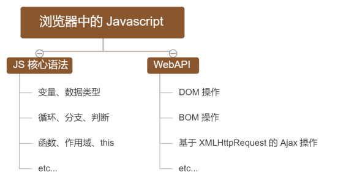
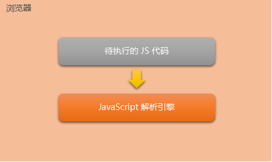
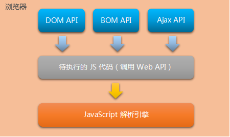
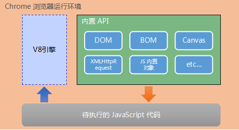
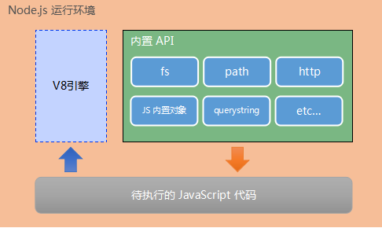

# 目标：

* 能够知道什么是 Node.js
* 能够知道 Node.js 可以做什么
* 能够说出 Node.js 中的 JavaScript 的组成部分
* 能够使用 fs 模块读写操作文件
* 能够使用 path 模块处理路径
* 能够使用 http 模块写一个基本的 web 服务器

#  1. 初识 Node.js

### 1.1 回顾与思考

#### 1. 已经掌握的技术

* HTML
* CSS
* JavaScript

#### 2. 浏览器中的 JavaScript 的组成部分



#### 3. 为什么 JavaScript 可以在浏览器中被执行



不同的浏览器使用不同的 JavaScript 解析引擎：

* Chrome：V8（性能最好）
* Firefox：OdinMonkey（奥丁猴）
* Safari：JSCore
* IE：Chakra（查克拉）
* etc...

#### 4. 为什么 JavaScript 可以操作 DOM 和 BOM



每个浏览器都**内置**了 DOM、BOM 这样的 API 函数，因此，浏览器中的 JavaScript 才可以调用它们。

#### 5. 浏览器中的 JavaScript 运行环境

运行环境是指代码正常运行所需的**必要环境**



* V8引擎负责解析和执行JS代码
* 内置 API 是由**运行环境**提供的特殊接口，**只能在所属的运行环境中被调用**，也就是说脱离了运行环境，就无法访问这些内置的 API 了。

#### 6. JS是否可以做后端

常见的Web后端开发语言有：

* Java
* PHP
* Python

JS也提供了能开发后端的包：

* **Node.js**

### 1.2 Node.js 简介

#### 1. 什么是 Node.js

Node.js® 是一个基于 Chrome V8 引擎的 **JavaScript 运行环境**。

官网：https://nodejs.org/zh-cn/

在浏览器中解析JS，说明做的是前端开发

在Node中解析JS，说明做的是后端开发

#### 2. Node.js 中的 JavaScript 运行环境



* 浏览器是 JS 的前端运行环境
* Node.js 是 JS 的后端运行环境
* Node.js 无法访问 DOM、BOM 等浏览器内置 API

#### 3. Node.js 可以做什么

Node.js 作为一个 JavaScript 的运行环境，仅仅提供了基础的功能和 API。然而，基于 Node.js 提供的这些基础能，很多强大的工具和框架如雨后春笋，层出不穷，所以学会了 Node.js ，可以让前端程序员胜任更多的工作和岗位：

* 基于 Express 框架(http://www.expressjs.com.cn/)，快速构建 Web 应用
* 基于 Electron 框架(https://electronjs.org/)，快速构建跨平台的桌面应用
* 基于 restify 框架(http://restify.com/)，快速构建 API 接口项目
* 读写、操作数据库，创建命令行辅助前端开发，etc...

总之，Node.js 是**大前端时代**的大宝剑，有了 Node.js 的加持，前端程序员的**行业竞争力会**越来越强

#### 4. Node.js 的学习路径

* JavaScript 基础语法
* Node.js 内置 API 模块（fs、path、http等）
* 第三方模块（express、mysql等）

### 1.3 Node.js 环境的安装

如果希望通过 Node.js 来运行 Javascript 代码，则必须在计算机上安装 Node.js 环境才行。

安装包可以从 Node.js 的官网首页直接下载，进入到 Node.js 的官网首页（https://nodejs.org/zh-cn/），点击绿色的按钮，下载所需的版本后，双击直接安装即可，一般我们推荐直接下载**长期支持版**。

#### 1. 区分长期支持版本和当前发布版本的不同

* 对于**追求稳定**的**企业级项目**来说，建议下载长期支持版
* 对于**热衷于尝鲜**的个人用户来说，建议下载当前发布版，但是当前发布版为最新版本，可能出现安全性的漏洞，所以***极其不推荐在生产环境中使用当前发布版***。

#### 2. 查看已安装的 Node.js 的版本号

打开终端，在终端输入命令`node –v`后，按下回车键，即可查看已安装的 Node.js 的版本号。

### 1.4 在 Node.js 环境中执行 JavaScript 代码

进入终端输入命令`node xxx.js`即可解析JS代码

# 2. fs 文件系统模块

### 2.1 什么是 fs 文件系统模块

**fs 模块**是 Node.js 官方提供的、用来操作文件的模块。它提供了一系列的方法和属性，用来满足用户对文件的操作需求。

* `fs.readFile()`：**读取**指定文件的内容
* `fs.writeFile()`：**写入**指定文件的内容

如果要在 JavaScript 代码中，使用 fs 模块来操作文件，则需要使用如下的方式先**导入**它：

```js
const fs = require('fs');
```

### 2.2 读取指定文件中的内容

#### 1. `fs.readFile()`的语法格式

```js
fs.readFile(path[, options], callback);
```

* `path`：必选参数，字符串，表示文件的路径
* `options`：可选参数，表示以什么编码格式读取文件
* `callback`：必选参数，文件读取完成后，通过回调函数获取读取的结果

#### 2. `fs.readFile()`的示例代码

以 utf8 的编码格式，读取指定文件的内容，并打印 err 和 dataStr 的值：

```js
const fs = require('fs');
fs.readFile('files/1.txt', 'utf-8', (err, dataStr) => {
    console.log(err);
    console.lof('------');
    console.log(dataStr);
});
```

#### 3. 判断文件是否读取成功

可以判断 err 对象是否为 null，从而得到文件读取的结果：

```js
const fs = require('fs');
fs.readFile('files/1.txt', 'utf-8', (err, msg) => {
    // 如果失败信息对象有内容，那么就是读取失败
    if (err) {
        return console.log("文件读取失败：" + err);
    }
    console.log("文件读取成功：" + msg);
});
```

### 2.3 向指定文件写入内容

#### 1. `fs.writeFile()`的语法格式

```js
fs.writeFile(file, data[, options], callback);
```

* `file`：必选参数，需要指定一个**文件路径的字符串**，表示文件的存放路径
* `data`：必须按参数，表示写入的内容
* `options`：可选参数，以什么编码写入文件内容，默认utf8，**如果没有特殊需求不用写**
* `callback`：必选参数，写入后的回调函数
* 如果需要写入的文件不存在，则会**自动创建**
* 会**覆盖**源文件的内容，慎重操作

#### 2. `fs.writeFile()`的示例代码

向指定文件写入内容

```js
const fs = require('fs');
fs.writeFile('files/2.txt', 'hello,Node.js!', 'utf8', err => {
    console.log(err);
};
```

#### 3. 判断文件是否写入成功

可以判断 err 对象是否为 null，从而知晓文件写入的结果：

```js
const fs = require('fs');
fs.writeFile('files/2.txt', 'hello, Node.js!', err => {
    if (err) {
        return console.log("文件写入失败，原因如下：" + err);
    }
    console.log("文件写入成功！");
});
```

### 2.4 完整路径

如果使用`./`或者`../`这种来处理文件的位置关系，相对路径很有可能会出现找不到的问题，所以我们需要将**相对路径转为绝对路径**，`__dirname`是 Node.js 的内置属性，获取到当前文件的绝对路径。

# 3. path 路径模块

### 3.1 什么是 path 路径模块

**path 模块**是 Node.js 官方提供的、用来**处理路径**的模块。它提供了一系列的方法和属性，用来满足用户对路径的处理需求。

* `path.join()`：将多个路径片段拼接成一个完整的路径字符串
* `path.basename()`：从路径字符串中，将文件名解析出来

如果要在 JavaScript 代码中，使用 path 模块来处理路径，则需要使用如下的方式先**导入**它：

```js
const path = require('path');
```

### 3.2 路径拼接

#### 1. `path.join()`的语法格式

```js
path.join([...paths]);
```

* `...paths`：路径片段的序列，String字符串型
* 返回值：String字符串
* 今后凡是涉及到路径拼接的操作，都要使用`path.join()`方法进行处理，不要直接使用`+`，可能会出现一些问题

#### 2. `path.join()`代码示例

```js
const path = require('path');

const pathStr = path.join('a/', 'b/c/d', '../', './f');
console.log(pathStr); // 'a\b\c\f'

const pathStr2 = path.join(__dirname, './files/1.txt');
console.log(pathStr2);
```

`../`会抵消路径，`./`不会

