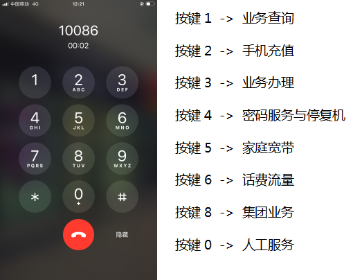
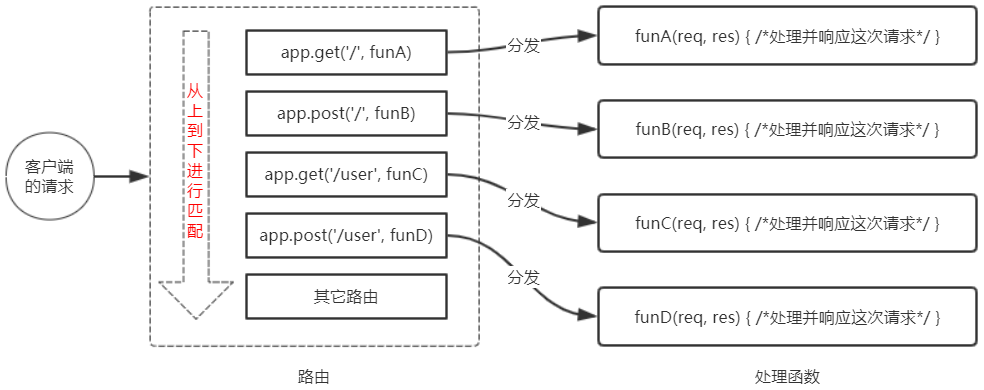
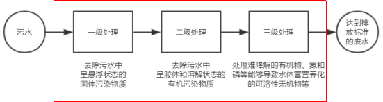
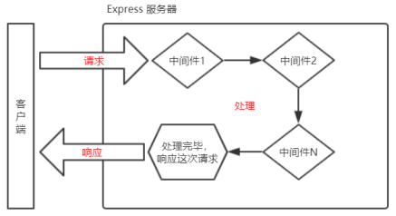
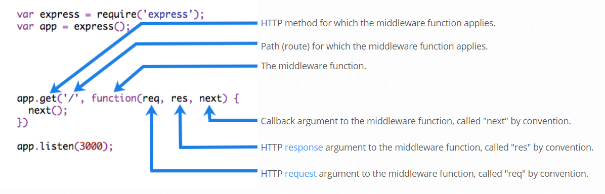
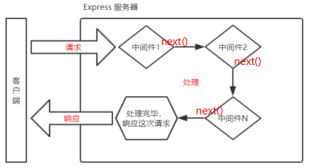

# 目标：

* 能够使用 express.static() 快速托管静态资源
* 能够使用 express 路由精简项目结构
* 能够使用常见的 express 中间件
* 能够使用 express 创建 API 接口
* 能够在 express 中启用 cors 跨域资源共享

# 1. 初识 Express

### 1.1 Express 简介

#### 1. 什么是 Express

官方给出的概念：Express 是基于 Node.js 平台，**快速**、**开放**、**极简**的 Web 开发框架。

通俗的理解：Express 的作用和 Node.js 内置的 http 模块类似，**是专门用来创建 Web 服务器的**。

Express 的本质：就是一个 npm 上的第三方包，提供了快速创建 Web 服务器的便捷方法。

中文官网：http://www.expressjs.com.cn/

#### 2. 进一步理解 Express

> 不使用 Express 能否创建 Web 服务器？
直接使用 Node.js 内置 http 模块就可以

> 有了 http 内置模块为什么还需要 Express？

http 内置模块用起来很复杂，Express内部封装了http模块，但是大大提高了开发的效率

> http 内置模块和 Express 有什么关系？

类似于浏览器中的 Web API 和 jQuery 的关系。后者是基于前者进一步封装来的。

#### 3. Express 能做什么

对于前端程序员来说，最常见的**两种**服务器，分别是：

* Web 网站服务器：专门对外提供 Web 网页资源的服务器。
* API 接口服务器：专门对外提供 API 接口的服务器。

使用 Express，我们**可以方便、快速的创建 Web 服务器或 API 服务器**。

### 1.2 Express 的基本使用

#### 1. 安装

在项目所处的目录中，运行如下的终端命令，即可将 express 安装到项目中使用：

```bash
npm i express@4.17.1
```

#### 2. 创建基本的 Web 服务器

```js
// 1. 导入 express
const express = require('express');
// 2. 创建 web 服务器
const app = express();

// 3. 调用 app.listen(端口号,启动成功的回调函数)即可启动服务器
app.listen(80, () => {
    console.log('express server is running at http://127.0.0.1');
});
```

#### 3. 监听 GET 请求

通过`app.get()`方法，可以监听客户端的 GET 请求，具体的语法格式如下：

```js
// 参数1：客户端请求的 URL 地址
// 参数2：请求对应的处理函数
//		req: 请求对象（包含了与请求有关的属性和方法）
//		res: 响应对象（包含了与响应有关的属性和方法）
app.get('请求URL', (req, res) => {
    // 回调函数
});
```

#### 4. 监听 POST 请求

通过`app.post()`方法，可以监听客户端的 POST 请求，具体的语法格式如下：

```js
// 参数1：客户端请求的 URL 地址
// 参数2：请求对应的处理函数
//		req: 请求对象（包含了与请求有关的属性和方法）
//		res: 响应对象（包含了与响应有关的属性和方法）
app.post('请求URL', (req, res) => {
    // 回调函数
});
```

#### 5. 把内容响应给客户端

通过`res.send()`方法，可以把处理好的内容，发送给客户端：

```js
app.get('/user', (req, res) => {
    // 向客户端发送 JSON 对象
    res.send({name:"zs", age=18});
});

app.post('/user', (req, res) => {
    // 向客户端发送文本内容
    res.send('请求成功');
});
```

#### 6. 获取 URL 中携带的查询参数

通过`req.query`对象，可以访问到客户端通过**查询字符串**的形式，发送到服务器的参数：

```js
app.get('/', (req, resp) => {
    // req.query 默认是一个空对象
    // 客户端使用 ?name=zs&age=20 这种请求
    // 可以使用 req.query 访问
    // req.name   req.age
    console.log(req.query)
});
```

#### 7. 获取 URL 中的动态参数

通过`req.params`对象，可以访问到 URL 中，通过 `:  `匹配到的动态参数：

```js
// URL 地址中，可以通过 :参数名 的形式，匹配动态参数值
app.get('/user/:id', (req, resp) => {
    // req.params默认是一个空对象
    // 里面存放参数
    resp.send(req.params);
});
```

`:id`不是固定的写法，但是`:`是固定的，例如`:name`、`:ids`等。但是这个名字就是匹配后params的键

可以有多个动态参数，例如`/user/:id/:name/:age`

### 1.3 托管静态资源

#### 1. express.static()

express 提供了一个非常好用的函数，叫做`express.static()`，通过它，我们可以非常方便地创建一个静态资源服务器，例如，通过如下代码就可以将`public`目录下的图片、CSS 文件、JavaScript 文件对外开放访问了：

```js
app.use(express.static('public'));
```

**注意**：Express 在**指定的静态目录中查找文件**，并对外提供资源的访问路径。因此，存放静态文件的目录名不会出现在 URL 中。

`http://127.0.0.1/public/images/1.png`以上写法**是不对的**，不需要加`public`

#### 2. 托管多个静态资源目录

如果要托管多个静态资源目录，请多次调用`express.static()`函数：

```js
app.use(express.static('public'));
app.use(express.static('files'));
```

访问静态资源文件时，`express.static()`函数会根据**目录的添加顺序查找所需的文件**。

也就是说，如果有**同名文件**，那么会优先**按照代码的顺序去查找**。

#### 3. 挂载路径前缀

如果希望在托管的**静态资源访问路径之前**，**挂载路径前缀**，则可以使用如下的方式：

```js
app.use('/public', express.static('public'));
```

现在可以加上`public`来访问里面的文件了。也可以指定为别的路径前缀名。

### 1.4 nodemon

#### 1. 为什么要使用 nodemon

在编写调试 Node.js 项目的时候，如果修改了项目的代码，则需要频繁的手动 close 掉，然后再重新启动，非常繁琐。

现在，我们可以使用 nodemon（https://www.npmjs.com/package/nodemon） 这个工具，它能够**监听项目文件的变动**，当代码被修改后，nodemon 会**自动帮我们重启项目**，极大方便了开发和调试。

#### 2. 安装 nodemon

在终端中，运行如下命令，即可将 nodemon 安装为全局可用的工具：

```bash
npm i -g nodemon
```

#### 3. 使用 nodemon

当基于 Node.js 编写了一个网站应用的时候，传统的方式，是运行`node app.js`命令，来启动项目。这样做的坏处是：代码被修改之后，需要手动重启项目。

现在，我们可以将 node 命令替换为 nodemon 命令，使用`nodemon app.js`来启动项目。这样做的好处是：代码被修改之后，会被 nodemon 监听到，从而实现**自动重启项目**的效果。

```bash
node app.js
# 将上方命令修改为 nodemon 命令，自动重启项目
nodemon app.js
```

# 2. Express 路由

### 2.1 路由的概念

#### 1. 什么是路由

广义上来讲，路由就是**映射关系**。

#### 2. 现实生活中的路由



在这里，路由是**按键**与**服务**之间的映射关系

#### 3. Express 中的路由

在 Express 中，路由指的是**客户端的请求**与**服务器处理函数**之间的映射关系。

Express 中的路由分 3 部分组成，分别是**请求的类型**、**请求的 URL 地址**、**处理函数**，格式如下：

```js
app.METHOD(PATH, HANDLER);
```

#### 4. Express 中的路由的例子

```js
// 匹配 GET 请求，且请求 URL 为 /
app.get('/', (req, resp) => {
    res.send('Hello World!');
});

// 匹配 POST 请求，且请求 URL 为/
app.post('/', (req, resp) => {
    res.send('Got a POST request');
});
```

#### 5. 路由的匹配过程

每当一个请求到达服务器之后，**需要先经过路由的匹配**，只有匹配成功之后，才会调用对应的处理函数。

在匹配时，会按照路由的**顺序**进行匹配，如果**请求类型**和**请求的 URL** 同时匹配成功，则 Express 会将这次请求，转交给对应的 function 函数进行处理。



* 按照定义的**先后顺序**进行匹配
* **请求类型**和**请求的URL**同时匹配成功，才会调用对应的处理函数

### 2.2 路由的使用

#### 1. 最简单的用法

在 Express 中使用路由最简单的方式，就是把**路由挂载到 app 上**，示例代码如下：

```js
const express = require('express');
// 创建 Web 服务器，命名为 app
const app = express();

// 挂载路由
app.get('/', (req, resp) => { resp.send('Hello World!'); });
app.post('/', (req, resp) => { resp.send('POST Request'); });

// 启动 Web 服务器
app.listen();
```

#### 2. 模块化路由

为了**方便对路由进行模块化的管理**，Express **不建议将路由直接挂载到 app 上**，而是**推荐将路由抽离为单独的模块**。

* 创建路由模块对应的 .js 文件
* 调用`express.Router()`创建对象
* 向路由对象上挂在具体的路由
* 使用`module.exports`暴露路由对象
* 使用`app.use()`注册路由模块

#### 3. 创建路由模块

```js
const express = require('express');        // 1. 载入express模块
const router = express.Router();           // 2. 创建路由对象

router.get('/user/list', (req, resp) => {  // 3. 挂载 GET 请求
    resp.send('Get User List');
});
router.post('/user/add', (req, resp) => {  // 4. 挂载 POST 请求
    res.send('Add new User.');
});

module.exports = {                         // 5. 向外导出路由对象
    router
}
```

#### 4. 注册路由模块

```js
// 1. 载入自定义路由模块
const userRouter = require('./router/user.js');

// 2. 使用 app.use() 注册路由模块
app.use(userRouter);
```

#### 5. 为路由模块添加前缀

类似于托管静态资源时，为静态资源统一挂载访问前缀一样，路由模块添加前缀的方式也非常简单：

```js
// 1. 载入自定义路由模块
const userRouter = require('./router/user.js');

// 2. 使用 app.use() 注册路由模块 并添加前缀
app.use('/api', userRouter);
```

# 3. Express 中间件

### 3.1 中间件的概念

#### 1. 什么是中间件

中间件（Middleware ），特指**业务流程**的**中间处理环节**。

#### 2. 现实生活中的例子

在处理污水的时候，一般都要经过**三个处理环节**，从而保证处理过后的废水，达到排放标准。



处理污水的这三个中间处理环节，就可以叫做**中间件**。

#### 3. Express 中间件调用流程

当一个请求到达 Express 的服务器之后，可以连续调用多个中间件，从而对这次请求进行**预处理**。



#### 4. Express 中间件的格式

Express 的中间件，本质上就是一个 **function 处理函数**，Express 中间件的格式如下：



注意：中间件函数的形参列表中，**必须包含 next 参数**。而路由处理函数中只包含 req 和 res。

#### 5. next 函数的作用

next 函数是实现**多个中间件连续调用的关键**，它表示把流转关系**转交**给下一个**中间件或路由**。



### 3.2 Express 中间件的初体验

#### 1. 定义中间件函数

可以通过如下的方式，定义一个最简单的中间件函数：

```js
// 常量 mw 所指向的，就是一个中间件函数
const mw = (req, res, next) => {
    conosle.log("这是一个最简单的中间件函数");
    // 注意：当前的中间件业务流程处理完毕之后，需要调用next()函数
    // 表示将流转关系转交给下一个中间件或路由
    next();
}
```

#### 2. 全局生效的中间件

客户端发起的**任何请求**，到达服务器之后，**都会触发的中间件**，叫做全局生效的中间件。

通过调用`app.use(中间件函数)`，即可定义一个**全局生效的中间件**，示例代码如下：

```js
// 常量 mw 所指向的，就是一个中间件函数
const mw = (req, res, next) => {
    conosle.log("这是一个最简单的中间件函数");
    next();
};

// 全局生效的中间件
app.use(mw);
```

#### 3. 定义全局中间件的简化形式

```js
// 全局生效的中间件
app.use((req, res, next) => {
    console.log('这是一个最简单的中间件函数');
    next();
});
```

#### 4. 中间件的作用

多个中间件之间，**共享同一份 req 和 res**。基于这样的特性，我们可以在上游的中间件中，统一为 req 或 res 对象添加自定义的属性或方法，供下游的中间件或路由进行使用。

#### 5. 定义多个全局中间件

可以使用`app.use()`**连续定义多个**全局中间件。客户端请求到达服务器之后，会按照中间件定义的先后顺序依次进行调用，示例代码如下：

```js
// 第1个路由
app.use((req, res, next) => {
    console.log('调用了第1个路由');
    next();
});

// 第2个路由
app.use((req, res, next) => {
    console.log('调用了第2个路由');
    next();
});

// 请求此路由，会依次执行以上2个路由
app.get('/', (req, res) => {
    res.send('Home page.');
})
```

#### 6. 局部生效的中间件

**不使用 app.use() 定义的中间件**，叫做局部生效的中间件，示例代码如下：

```js
// 定义中间件 mw1
const mw1 = (req, res, next) => {
    console.log('中间件函数');
    next();
}

// nw1，这个中间件只能在当前路由生效，这种用法叫做局部生效中间件
app.get('/', mw1, (req, res) => {
    res.send('Home page.');
})

// mw并不会影响以下路由
app.get('/user', (req, res) => {
    res.send('User page.');
});
```

#### 7. 定义多个局部中间件

可以在路由中，通过如下两种**等价**的方式，使用**多个局部中间件**：

```js
// 以下2种写法是等价的
app.get('/', mw1, mw2, (req, res) => {});
app.get('/', [mw1, mw2], (req, res) => {});
```

#### 8. 了解中间件的5个使用注意事项

* 一定要在**路由之前**注册中间件
* 客户端的请求可以**连续调用多个**中间件
* 中间件函数中执行了业务代码，一定要记得`next()`
* 为了防止逻辑混乱，调用`next()`后不要写任何代码了
* 连续调用多个中间件时，中间件之间**共享req和res对象**

### 3.3 中间件的分类

为了方便大家理解和记忆中间件的使用，Express 官方把**常见的中间件用法**，分成了 5 大类，分别是：

* **应用级别**的中间件
* **路由级别**的中间件
* **错误级别**的中间件
* **Express内置**的中间件
* **第三方**的中间件

#### 1. 应用级别的中间件

通过`app.use()`或`app.get()`或`app.post()`，**绑定到 app 实例上的中间件**，叫做应用级别的中间件，代码示例如下

```js
// 应用级别的中间件（全局中间件）
app.use((req, res, next) => {
    next();
});

// 应用级别的中间件（局部中间件）
app.get('/', mw1, (req, res) => {
    res.send('Home page.');
})
```

#### 2. 路由级别的中间件

绑定到`express.Router()`实例上的中间件，叫做路由级别的中间件。它的用法和应用级别中间件没有任何区别。只不过，**应用级别中间件是绑定到 app 实例上，路由级别中间件绑定到 router 实例上**，代码示例如下：

```js
const app = express();
const router = express.Router();

// 路由级别的中间件
router.use((req, res, next) => {
    next();
});

app.use('/', router);
```

#### 3. 错误级别的中间件

错误级别中间件的作用：专门用来**捕获整个项目中发生的异常错误**，从而防止项目异常崩溃的问题。

格式：错误级别中间件的 function 处理函数中，必须有 4 个形参，形参顺序从前到后，分别是 (**err**, req, res, next)。

```js
// 1. 路由
app.get('/', (req, res) => {
    // 1.1 抛出异常
    throw new Error('服务器内部发生错误！');
});
// 2. 错误中间件
app.use((err, req, res, next) => {
    // 在服务端打印错误信息
    console.log('发生了错误' + err.message);
    // 在客户端打印错误信息
    res.send('Error' + err.message);
});
```

**注意**：错误级别的中间件，**必须注册在所有路由之后**！

#### 4. Express内置的中间件

自 Express 4.16.0 版本开始，Express 内置了 **3 个常用的中间件**，极大的提高了 Express 项目的开发效率和体验：

* `express.static`：托管静态资源的中间件
* `express.json`：解析 JSON 格式的请求体数据（**仅 4.16.0+ 版本可使用**）
* `express.urlencoded`：解析 URL-encoded 格式的请求体数据（**仅 4.16.0+ 版本可使用**）

```js
// 配置解析 application/json 格式数据的中间件
app.use(express.json());
// 配置解析 applcation/x-www-form-urlencoded 的中间件
app.use(express.urlencoded());
```

#### 5. 第三方的中间件

非 Express 官方内置的，而是由第三方开发出来的中间件，叫做第三方中间件。在项目中，大家可以按需下载并配置第三方中间件，从而提高项目的开发效率。

例如：在 express@4.16.0 之前的版本中，经常使用`body-parser`这个第三方中间件，来解析请求体数据。使用步骤如下：

* 运行`npm install body-parser`安装中间件
* 使用`require`加载中间件
* 调用`app.use()`注册并使用中间件

**注意**：Express 内置的`express.urlencoded`中间件，就是基于`body-parser`这个第三方中间件进一步封装出来的。新版本直接使用内置中间件就可以了。

#### 3.4 自定义中间件

##### 1. 需求描述与实现步骤

手动写一个中间件，来解析 POST 提交到服务器的表单数据

* 定义中间件
* 监听 req 的 data 事件
* 监听 req 的 end 事件
* 使用 querystring 模块解析请求体数据
* 将解析的数据对象挂载到 req.body
* 将自定义中间件封装

##### 2. 定义中间件

使用`app.use()`来定义全局生效的中间件，代码如下：

```javascript
app.use((req, res, next) => {
    // 中间件业务逻辑
})
```

##### 3. 监听 req 的 data 事件

在中间件中，需要监听 req 对象的 data 事件，**来获取客户端发送到服务器的数据**。

如果数据量比较大，无法一次性发送完毕，则**客户端会把数据切割后，分批发送到服务器**。所以 data 事件**可能会触发多次**，每一次触发 data 事件时，获取到数据只是完整数据的一部分，需要**手动对接收到的数据进行拼接**。

```js
// 定义变量，用来储存客户端发送的数据
let str = '';
// 监听 req 的 data 事件（客户端发送的请求体数据）
req.on('data', (chunk) => {
    // 拼接请求体数据，隐式转换为字符串
    str += chunk;
});
```

##### 4. 监听 req 的 end 事件

当请求体数据接收完毕之后，会**自动触发 req 的 end 事件**。

因此，我们可以在 req 的 end 事件中，**拿到并处理完整的请求体数据**。示例代码如下：

```js
// 监听 req 的 end 事件（请求体传输完毕会自动触发）
req.on('end', () => {
    // 打印完整的请求体数据
    console.log(str);
})
```

##### 5. 使用 querystring 模块解析请求体数据

Node.js 内置了一个`querystring`模块，**专门用来处理查询字符串**。通过这个模块提供的`parse()`函数，可以轻松把查询字符串，解析成对象的格式。示例代码如下：

```js
// 导入Node.js内置模块querystring
const qs = require('querystring');

// 调用 qs.parse() 方法，把查询字符串解析为对象
const body = qs.parse(str);
```

##### 6. 将解析出来的数据对象挂载为 req.body

上游的中间件和下游的中间件及路由之间，**共享同一份 req 和 res**。因此，我们可以将解析出来的数据，挂载为 req 的自定义属性，命名为`req.body`，供下游使用。示例代码如下：

```js
req.on('end', () => {
    const body = qs.parse(str);
    req.body = body;
    next();
})
```

##### 7. 将自定义中间件封装为模块

为了优化代码的结构，我们可以把自定义的中间件函数，**封装为独立的模块**。